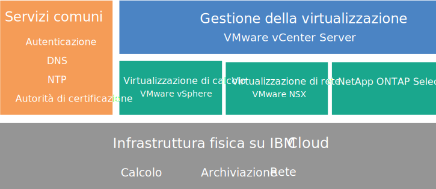
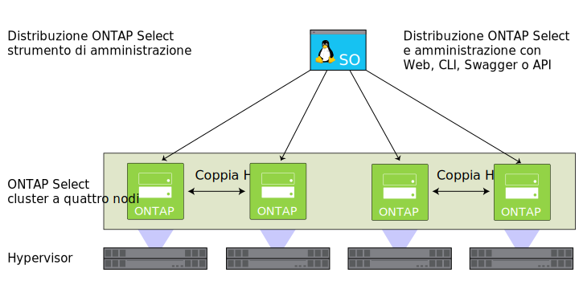

---

copyright:

  years:  2016, 2019

lastupdated: "2019-06-26"

keywords: NetApp ONTAP, NetApp, tech specs NetApp ONTAP

subcollection: vmware-solutions

---

{:external: target="_blank" .external}
{:tip: .tip}
{:note: .note}
{:important: .important}

# Panoramica di NetApp ONTAP Select
{: #np_netappoverview}

Esamina l'architettura e i componenti della distribuzione NetApp ONTAP Select on {{site.data.keyword.cloud}}.

## Architettura di NetApp ONTAP Select
{: #np_netappoverview-archi}

L'offerta NetApp ONTAP Select on {{site.data.keyword.cloud_notm}} integra la distribuzione di vCenter Server fornendo servizi di virtualizzazione dell'archiviazione.

Il seguente grafico illustra l'architettura generale della distribuzione di NetApp ONTAP Select on vCenter Server.

### Infrastruttura fisica
{: #np_netappoverview-physical-infras}

Questo livello fornisce l'infrastruttura fisica (risorse di calcolo, rete e archiviazione) che deve essere utilizzata dall'infrastruttura virtuale.

### Infrastruttura di virtualizzazione (calcolo, rete e NetApp ONTAP Select)
{: #np_netappoverview-virtual-infras}

Questo livello virtualizza l'infrastruttura fisica attraverso i seguenti prodotti VMware e il prodotto NetApp ONTAP Select:
* VMware vSphere virtualizza le risorse di calcolo fisico
* VMware NSX è la piattaforma di virtualizzazione di rete che fornisce componenti di rete logica e reti virtuali.
* NetApp ONTAP Select on {{site.data.keyword.cloud_notm}} distribuisce un cluster ONTAP Select, che è composto da quattro VM per i quattro host.

Il seguente grafico illustra i componenti della distribuzione di NetApp ONTAP Select.

### Gestione della virtualizzazione
{: #np_netappoverview-virtualization-mgmt}

Il livello di gestione della virtualizzazione è costituito dai seguenti componenti:

* vCenter Server Appliance (vCSA) con Platform Services Controller (PSC) integrato
* NSX Manager
* Due gateway dei servizi edge (ESG) NSX
* Tre controller NSX
* VSI (Virtual Server Instance) IBM CloudDriver

NetApp ONTAP Select viene eseguito in un cluster VMware e virtualizza l'archiviazione locale sugli host. NetApp ONTAP Select è distribuito nel modello dedicato, dove non è previsto che altri carichi di lavoro condividano il cluster con esso. Di conseguenza, la configurazione hardware dell'offerta NetApp ONTAP Select on {{site.data.keyword.cloud_notm}} viene ridimensionata solo in base ai requisiti di NetApp ONTAP Select.

## Specifiche tecniche per le istanze NetApp ONTAP Select
{: #np_netappoverview-specs}

Nella tua istanza NetApp ONTAP Select sono inclusi i seguenti componenti.

La disponibilità e il prezzo delle configurazioni standardizzate possono variare in base al {{site.data.keyword.CloudDataCent_notm}} selezionato per la distribuzione.
{:note}

### Archiviazione
{: #np_netappoverview-storage}

* Scegli tra **Alte prestazioni (Medium)**, **Alte prestazioni (Large)** e **Alta capacità**
* RAID 5 con hot spare
* SO ESXi con due unità SATA da 1 TB – RAID 1
* Archivio dati di gestione – 500 GB per le VM di gestione

### Configurazioni preimpostate
{: #np_netappoverview-preset-config}

Sono forniti quattro {{site.data.keyword.baremetal_short}} {{site.data.keyword.cloud_notm}} con le seguenti opzioni di configurazione:
* **Alte prestazioni (Medium)** – Licenza Premium / Dual Intel Xeon E5-2650 v4 (24 core totali, 2,2 GHz) / 128 GB di RAM / Capacità di 22 unità SSD da 1,9 TB per nodo / Capacità effettiva di un cluster a 4 nodi – 59 TB
* **Alte prestazioni (Large)** – Licenza Premium / Dual Intel Xeon E5-2650 v4 (24 core totali, 2,2 GHz) / 128 GB di RAM / Capacità di 22 unità SSD da 3,8 TB per nodo / Capacità effettiva di un cluster a 4 nodi – 118 TB
* **Alta capacità** – Licenza Standard / Dual Intel Xeon E5-2650 v4 (24 core totali, 2,2 GHz) / 64 GB di RAM / Capacità di trentaquattro unità SATA da 4 TB per nodo / Capacità effettiva di un cluster a 4 nodi – 190 TB

Le unità SSD (Solid-State Disk) da 3,8 TB sono supportate quando vengono rese generalmente disponibili in un data center.
{:note}

### Hardware
{: #np_netappoverview-hardware}

* Tre opzioni di RAM e disco: **Alte prestazioni (medio)**, **Alte prestazioni (elevato)** e **Alta capacità**
* SO ESXi con due unità SATA da 1 TB
* Un controller disco RAID
* VMware Server Virtualization 6.5

### Rete
{: #np_netappoverview-network}

* Doppi uplink di rete privata e pubblica da 10 Gbps
* Tre VLAN (Virtual LAN): una VLAN pubblica e due VLAN private
* Un gateway dei servizi edge VMware NSX sicuro

### VSI (Virtual Server Instance)
{: #np_netappoverview-vsi}

Due VSI (Virtual Server Instance):
* Una VSI per i servizi Microsoft AD (Active Directory) e Domain Name System (DNS).
* Una VSI per IBM CloudBuilder, che viene arrestata al termine della distribuzione dell'istanza.

### Licenze e tariffe
{: #np_netappoverview-license-and-fee}

*  Quattro licenze Premium o Standard Edition per NetApp ONTAP Select (fornite dall'utente)
*  VMware vSphere 6.5 Enterprise Plus edition
*  VMware vCenter Server 6.5
*  VMware NSX Service Providers Edition (Base, Advanced o Enterprise) 6.4
*  Tariffa per supporto e servizi (una licenza per nodo)

Devi gestire i componenti {{site.data.keyword.vmwaresolutions_short}} creati nel tuo account {{site.data.keyword.cloud_notm}} solo attraverso la console {{site.data.keyword.vmwaresolutions_short}}, non il {{site.data.keyword.slportal}} o qualsiasi altro mezzo all'esterno della console. Se modifichi questi componenti al di fuori della console {{site.data.keyword.vmwaresolutions_short}}, le modifiche non saranno sincronizzate con la console.
{:important}

**ATTENZIONE:** la gestione di un qualsiasi componente {{site.data.keyword.vmwaresolutions_short}} (installato nel tuo account {{site.data.keyword.cloud_notm}} nel momento in cui hai ordinato l'istanza) dall'esterno della console {{site.data.keyword.vmwaresolutions_short}} può rendere instabile il tuo ambiente. Queste attività di gestione includono:
*  Aggiunta, modifica, restituzione, rimozione o spegnimento dei componenti
*  Espansione o contrazione della capacità dell'istanza mediante l'aggiunta o la rimozione di server ESXi
*  Riavvio dei servizi

   Le eccezioni a queste attività includono la gestione delle condivisioni file di archiviazione condivisa dal {{site.data.keyword.slportal}}. Tali attività includono: l'ordine, l'eliminazione (che potrebbe influire sugli archivi di dati, se montati), l'autorizzazione e il montaggio di condivisioni file di archiviazione condivisa.

## Considerazioni su firewall
{: #np_netappoverview-firewall-considerations}

Se utilizzi i firewall, devi configurare le regole per tutte le comunicazioni dalla VSI (Virtual Server Instance) {{site.data.keyword.IBM}} CloudDriver e dalle VM (virtual machine) di SDDC Manager. Queste regole devono consentire a tutti i protocolli di comunicare sugli indirizzi IP `10.0.0.0/8` e `161.26.0.0/16`. Esempi di questi firewall sono i DFW (Distributed Firewall) NSX o i firewall Vyatta.

## Link correlati
{: #np_netappoverview-related}

* [Pianificazione per le istanze NetApp ONTAP Select](/docs/services/vmwaresolutions/netapp?topic=vmware-solutions-np_planning#requirements-and-planning-for-netapp-ontap-select-instances)
* [Ordine di istanze NetApp ONTAP Select](/docs/services/vmwaresolutions/netapp?topic=vmware-solutions-np_orderinginstances)
* [Panoramica di vCenter Server](/docs/services/vmwaresolutions/vcenter?topic=vmware-solutions-vc_vcenterserveroverview)
* [Centro di documentazione di NetApp ONTAP](http://docs.netapp.com/ontap-9/index.jsp?topic=%2Fcom.netapp.doc.exp-clus-peer%2Fhome.html){: external}
