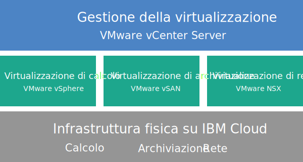

---

copyright:

  years:  2016, 2019

lastupdated: "2019-03-12"

---

{:tip: .tip}
{:note: .note}
{:important: .important}

# Panoramica di Cloud Foundation
{: #sd_cloudfoundationoverview}

La distribuzione di base di VMware Cloud Foundation on {{site.data.keyword.cloud}} consiste in quattro {{site.data.keyword.cloud_notm}} {{site.data.keyword.baremetal_short}} con lo stack VMware Cloud Foundation preinstallato e configurato per fornire una piattaforma SDDC (software-defined data center) unificata. Cloud Foundation integra nativamente VMware vSphere, VMware NSX, VMware Virtual SAN e la sua architettura si basa su progetti convalidati da VMware.

## Architettura di Cloud Foundation
{: #sd_cloudfoundationoverview-archi}

Il seguente grafico illustra l'architettura generale e i componenti della distribuzione di Cloud Foundation.

Figura 1. Architettura di Cloud Foundation

### Infrastruttura fisica
{: #sd_cloudfoundationoverview-physical-infras}

Questo livello fornisce l'infrastruttura fisica (risorse di calcolo, archiviazione e rete) che deve essere utilizzata dall'infrastruttura virtuale.

### Infrastruttura di virtualizzazione (calcolo, archiviazione e rete)
{: #sd_cloudfoundationoverview-virtualization-infras}

Questo livello virtualizza l'infrastruttura fisica attraverso diversi prodotti VMware:
* VMware vSphere virtualizza le risorse di calcolo fisiche.
* VMware Virtual SAN (vSAN) fornisce l'archiviazione condivisa definita dal software in base all'archiviazione nei server fisici.
* VMware NSX è la piattaforma di virtualizzazione di rete che fornisce componenti di rete logica e reti virtuali.

### Gestione della virtualizzazione
{: #sd_cloudfoundationoverview-virtualization-mgmt}

Questo livello è costituito da vCenter Server, che rappresenta il livello di gestione per l'ambiente virtualizzato. Gli stessi strumenti e script familiari compatibili con l'API vSphere possono essere utilizzati per gestire l'ambiente VMware ospitato da IBM.

Nella console {{site.data.keyword.vmwaresolutions_short}}, puoi espandere e contrarre la capacità delle tue istanze utilizzando la funzionalità di aggiunta e rimozione di server ESXi. Inoltre, sono disponibili anche funzioni di gestione del ciclo di vita come l'applicazione di aggiornamenti e l'aggiornamento dei componenti VMware nell'ambiente ospitato.

Per ulteriori informazioni sull'architettura, vedi [Panoramica della soluzione](/docs/services/vmwaresolutions/archiref/solution?topic=vmware-solutions-solution_overview).

## Specifiche tecniche per le istanze Cloud Foundation
{: #sd_cloudfoundationoverview-specs}

Nella tua istanza Cloud Foundation sono inclusi i seguenti componenti.

Gli addebiti sostenuti per hardware, rete, VM (Virtual Machine) e archiviazione potrebbero variare in base al {{site.data.keyword.CloudDataCent_notm}} selezionato per la distribuzione.
{:note}

### Bare Metal Server
{: #sd_cloudfoundationoverview-bare-metal}

La tua istanza può avere {{site.data.keyword.cloud_notm}} {{site.data.keyword.baremetal_short}} con una delle seguenti configurazioni:
*  **Skylake**: server di generazione 2-CPU Intel Skylake (Intel Xeon 4100/5100/6100 series) con i tuoi modello CPU e dimensione RAM selezionati.   
*  **Broadwell**: server di generazione 2-CPU Intel Broadwell (Intel Xeon E5-2600/E7-4800 series) con il modello di CPU e la dimensione della RAM da te selezionati.

Se intendi utilizzare l'archiviazione vSAN, la configurazione richiede quattro {{site.data.keyword.baremetal_short}}.
{:note}

### Rete
{: #sd_cloudfoundationoverview-networking}

La tua istanza contiene i seguenti componenti di rete:
* Doppi uplink di rete privata e pubblica da 10 Gbps
* Tre VLAN (Virtual LAN): una VLAN pubblica e due VLAN private
* Gateway dei servizi edge (ESG) VMware NSX sicuro dei servizi di gestione per il traffico di gestione HTTPS in uscita, distribuito da IBM come parte della tipologia di rete di gestione. Questo ESG viene utilizzato dalle VM (Virtual Machine) di gestione IBM per comunicare con specifici componenti di gestione IBM esterni correlati all'automazione. Per ulteriori informazioni, vedi [L'edge NSX dei servizi di gestione rappresenta un rischio per la sicurezza?](/docs/services/vmwaresolutions/vmonic?topic=vmware-solutions-faq#does-the-management-services-nsx-edge-pose-a-security-risk-)

  Non puoi accedere a questo ESG e non puoi usarlo. Se lo modifichi, potresti non essere in grado di gestire l'istanza Cloud Foundation dalla console {{site.data.keyword.vmwaresolutions_short}}. Inoltre, l'utilizzo di un firewall o la disabilitazione delle comunicazioni ESG ai componenti di gestione IBM esterni comporterà l'inutilizzabilità di {{site.data.keyword.vmwaresolutions_short}}.
  {:important}

* La funzione EVC (Enhanced vMotion Compatibility) viene abilitata automaticamente se disponi di un cluster esistente con i server ESXi supportati dalla versione corrente di VMware vSphere. EVC fornisce la compatibilità vMotion per tutti i server ESXi in un cluster garantendo che tutti i server ESXi del cluster espongano lo stesso insieme di funzioni CPU alle VM (Virtual Machine). Utilizzando EVC, le VM (Virtual Machine) possono migrare tra qualsiasi server ESXi nel cluster, anche se le reali CPU sui server ESXi potrebbero essere diverse.

### VSI (Virtual Server Instance)
{: #sd_cloudfoundationoverview-vsi}

La tua istanza ha le seguenti VSI (Virtual Server Instance):
* Una VSI per i servizi Microsoft AD (Active Directory) e Domain Name System (DNS). La VSI è richiesta per il supporto della configurazione multisito. La specifica di questa VSI è: Windows 2012 R2 (8 GB di RAM / 2 core CPU / disco da 100 GB / Doppi uplink privati da 1 Gbps).
* Una VSI per IBM CloudBuilder, che viene arrestata al termine della distribuzione dell'istanza.
* (Se viene ordinato Veeam on {{site.data.keyword.cloud_notm}}) Viene ordinata una VSI per il servizio di backup Veeam.

### Archiviazione
{: #sd_cloudfoundationoverview-storage}

La propria istanza può avere la seguente archiviazione, a seconda della configurazione di {{site.data.keyword.baremetal_short}} selezionata:
* Due dischi di avvio SATA da 1 TB
* Due dischi di cache SSD (Solid-State Disk) da 960 GB
* Un controller disco RAID
* Solo per la configurazione **Skylake** e **Broadwell**, puoi impostare il numero di unità disco e il tipo e la capacità del disco in base ai tuoi requisiti. Inoltre, hai l'opzione Alta disponibilità con Intel Optane, che fornisce due alloggiamenti per dischi di capacità supplementari per un totale di 10 dischi di capacità. L'opzione Alte prestazioni con Intel Optane dipende dal modello di CPU.

### Licenze (fornite da IBM o BYOL) e tariffe
{: #sd_cloudfoundationoverview-license-and-fee}

* Quattro VMware vSphere Enterprise Plus 6.5u1
* Quattro VMware vCenter Server 6.5
* Quattro VMware NSX Enterprise 6.3
* Quattro VMware vSAN Advanced o Enterprise 6.6
* Quattro licenze SDDC Manager (solo fornite da IBM)
* Quattro tariffe per supporto e servizi

## Specifiche tecniche per i nodi di espansione Cloud Foundation
{: #sd_cloudfoundationoverview-expansion-node-specs}

Ogni nodo di espansione Cloud Foundation distribuisce e comporta addebiti per i seguenti componenti nel tuo account {{site.data.keyword.cloud_notm}}.

### Hardware per i nodi di espansione
{: #sd_cloudfoundationoverview-expansion-node-hardware}

Un Bare Metal Server {{site.data.keyword.cloud_notm}} con la configurazione presentata in [Specifiche tecniche per le istanze Cloud Foundation](/docs/services/vmwaresolutions/sddc?topic=vmware-solutions-sd_cloudfoundationoverview#technical-specifications-for-cloud-foundation-instances).

### Licenze e tariffe per i nodi di espansione
{: #sd_cloudfoundationoverview-expansion-node-license-and-fee}

* Un VMware vSphere Enterprise Plus 6.5u1
* Un VMware vCenter Server 6.5
* Un VMware NSX Enterprise 6.3
* Un VMware vSAN Advanced o Enterprise 6.6
* Una licenza SDDC Manager
* Una tariffa per supporto e servizi

Devi gestire i componenti {{site.data.keyword.vmwaresolutions_short}} creati nel tuo account {{site.data.keyword.cloud_notm}} solo attraverso la console {{site.data.keyword.vmwaresolutions_short}}, non il 	{{site.data.keyword.slportal}} o qualsiasi altro mezzo all'esterno della console. Se modifichi questi componenti al di fuori della console {{site.data.keyword.vmwaresolutions_short}}, le modifiche non saranno sincronizzate con la console.
{:important}

**ATTENZIONE:** la gestione di un qualsiasi componente {{site.data.keyword.vmwaresolutions_short}}, installato nel tuo account {{site.data.keyword.cloud_notm}} nel momento in cui hai ordinato l'istanza, dall'esterno della console {{site.data.keyword.vmwaresolutions_short}} può rendere instabile il tuo ambiente. Queste attività di gestione includono:
*  Aggiunta, modifica, restituzione o rimozione dei componenti
*  Espansione o contrazione della capacità dell'istanza mediante l'aggiunta o la rimozione di server ESXi
*  Spegnimento dei componenti
*  Riavvio dei servizi

   Le eccezioni a queste attività includono la gestione delle condivisioni file di archiviazione condivisa dal {{site.data.keyword.slportal}}. Tali attività includono: l'ordine, l'eliminazione (che potrebbe influire sugli archivi di dati, se montati), l'autorizzazione e il montaggio di condivisioni file di archiviazione condivisa.

## Link correlati
{: #sd_cloudfoundationoverview-related}

* [Distinta base del software Cloud Foundation](/docs/services/vmwaresolutions/sddc?topic=vmware-solutions-sd_bom)
* [Centro di documentazione di VMware vSphere](https://pubs.vmware.com/vsphere-60/index.jsp){:new_window}
* [Centro di documentazione di VMware NSX 6](https://pubs.vmware.com/NSX-6/index.jsp){:new_window}
* [EVC and CPU Compatibility FAQ](https://kb.vmware.com/s/article/1005764)
