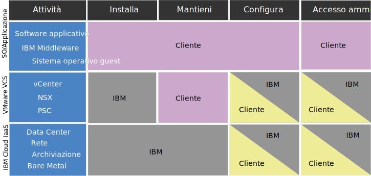

---

copyright:

  years:  2016, 2019

lastupdated: "2019-06-28"

keywords: vCenter Server compliance, compliance info, vCenter Server policy

subcollection: vmware-solutions

---

{:external: target="_blank" .external}
{:tip: .tip}
{:note: .note}
{:important: .important}

# Informazioni sulla conformità per le istanze vCenter Server
{: #vc_compl_info}

Rivedi le seguenti informazioni per i dettagli sulla conformità per le istanze VMware vCenter Server.

L'offerta VMware vCenter Server on {{site.data.keyword.cloud_notm}} with NSX-T non è supportata per i clienti HIPAA.
{:important}

## Responsabilità del cliente rispetto a IBM per vCenter Server on IBM Cloud
{: #vc_compl_info-responsibility}

Il seguente diagramma fornisce i dettagli sulle responsabilità del cliente (tu) e di IBM per le attività di conformità.

## Limitazioni all'integrità dei dati
{: #vc_compl_info-health-data-restrictions}

I termini in questa sezione vengono applicati a tutto il portfolio {{site.data.keyword.vmwaresolutions_full}}.

### HIPAA
{: #vc_compl_info-hipaa}

Nonostante le informazioni contenute nella scheda di dati per questo Servizio cloud relativamente all'HIPAA (Health Information Portability and Accountability Act) del 1996 e all'uso consentito delle informazioni e dei dati sanitari come tipi di dati personali e/o categorie speciali di dati personali (collettivamente "Dati sanitari) con questo Servizio cloud, l'uso di Dati sanitari con questo Servizio cloud è soggetto alle seguenti limitazioni e condizioni

{{site.data.keyword.vmwaresolutions_short}}

Solo le offerte sopra elencate possono essere fornite per implementare i controlli delle regole in materia di riservatezza e sicurezza dell'HPIAA per l'uso con Dati sanitari se il Cliente notifica preventivamente a IBM che userà i Dati sanitari con il Servizio cloud e IBM conferma per iscritto che il Servizio cloud verrà fornito per l'utilizzo di Dati sanitari. Di conseguenza, il Servizio cloud non può essere usato per la trasmissione, l'archiviazione o altro utilizzo di Dati sanitari tutelati dall'HIPAA tranne nel caso in cui (i) il Cliente fornisca a IBM tali notifiche; (ii) IBM e il Cliente abbiano concluso un accordo BAA (Business Associate Agreement); e (iii) IBM fornisca al cliente un'esplicita conferma scritta che il Servizio cloud possa essere utilizzato con i Dati sanitari. In nessun caso il Servizio cloud sarà utilizzato per elaborare informazioni sanitarie personali come un centro di raccolta e smistamento di informazioni relative all'assistenza sanitaria ai termini dell'HIPAA.

Nel caso di un errore di sistema, un provider di servizi di terze parti può richiedere le risorse di debug dal cliente (log, dump di memoria core e così via). È unica responsabilità del cliente di raccogliere e trasmettere queste risorse al provider di terze parti. Il team di supporto IBM può fornire assistenza fornendo link alla documentazione o indicazioni tramite sessioni di condivisione dello schermo. Tuttavia, il cliente è responsabile della pulizia dei dati di qualsiasi PHI e di assicurarsi che siano adeguatamente codificati prima della trasmissione. È anche responsabilità del cliente valutare se richiedono l'esecuzione di un BAA con il provider di terze parti prima di inviare i dati.

## Informazioni personali e dati regolamentati
{: #vc_compl_info-personal-info-and-regulated-data}

Questo servizio cloud non è progettato per requisiti specifici di sicurezza per i contenuti regolamentati, come le informazioni personali o sensibili. Il cliente è responsabile di determinare se questo servizio cloud soddisfa i bisogni dei clienti per quanto riguarda il tipo di contenuti del cliente utilizzati in connessione al servizio cloud.

## Configurazioni delle politiche
{: #vc_compl_info-default-policy-config}

La password vCenter generata per le istanze primarie vCenter Server ha ora una lunghezza di 15 caratteri. In precedenza, la password generata era il valore predefinito di vCenter di otto caratteri

La seguente tabella mostra in dettaglio le configurazioni delle politiche vCenter per una nuova istanza primaria.

| Politica | V3.1 o versioni successive | V3.0 o versioni precedenti |
|:------------- |:------------------------------ |:------------- |
| Politica delle password vCenter | Lunghezza minima di 15 caratteri | Lunghezza minima di 8 caratteri (valore predefinito di vCenter) |
| Politica di blocco vCenter | Massimo di tre tentativi di accesso non riusciti | Massimo di cinque tentativi di accesso non riusciti (valore predefinito di vCenter) |
| Politica di blocco vCenter | 900 secondi tra i tentativi di accesso non riusciti | 180 secondi tra i tentativi di accesso non riusciti (valore predefinito di vCenter) |
{: caption="Tabella 1. Configurazioni delle politiche vCenter" caption-side="top"}

La password NSX Manager generata per le istanze primarie vCenter Server ha ora una lunghezza di 15 caratteri. In precedenza, la password generata aveva una lunghezza di otto caratteri.

## Politica per l'accesso alle istanze client
{: #vc_compl_info-policy-for-access-client-inst}

Gli ambienti vCenter Server, che vengono forniti come {{site.data.keyword.vmwaresolutions_short}}, forniscono un livello della piattaforma di gestione VMware per i nostri clienti per gestire le funzionalità di virtualizzazione. Durante tutto il ciclo di vita dei prodotti e dei servizi IBM Cloud for VMware, può essere richiesto il supporto di IBM per contribuire a garantire i risultati. Nella maggior parte dei casi, l'intervento del supporto IBM è il risultato di una richiesta client (cioè un ticket di supporto). Tuttavia, in rare occasioni, il supporto IBM può aiutare in modo proattivo e senza un ticket di supporto scritto dal client per evitare problemi futuri. Questo accesso avviene tramite la rete di supporto interno di IBM Cloud ed è documentato tramite un ticket di supporto aperto dal supporto IBM e monitorato continuamente da IBM Cloud SOC. In nessun momento il supporto IBM modifica la configurazione dell'istanza senza il previo consenso del cliente. L'accesso è ai componenti di gestione VMware e/o ai componenti di gestione di IBM Cloud e mai alle macchine o alle applicazioni virtuali del cliente.

## Supporto proattivo
{: #vc_compl_info-proactive-support}

### Supporto proattivo per il provisioning iniziale
{: #vc_compl_info-proactive-support-for-initial-provision}

* Durante l'ordine e il provisioning iniziali di un'istanza o di un servizio, il supporto IBM può accedere alle istanze e alle informazioni del client senza notifica preventiva per assicurarsi che gli ordini siano correttamente adempiuti.
* Il supporto IBM monitora attivamente le operazioni del ciclo di vita dell'istanza come l'aggiunta di nuovi host, oltre ai processi di ordine, provisioning e installazione.
* Per risolvere i problemi individuati o che potrebbero presentarsi in futuro, il supporto IBM può assumere un certo numero di azioni tra cui ma non limitate a: rivedere i dettagli dell'ordine del cliente, riavviare i lavori di automazione, eseguire operazioni di ricaricamento del sistema operativo o aprire i ticket di IBM Cloud utilizzando il nome utente e la chiave API di IBM Cloud forniti dal cliente.

### Supporto proattivo per operazioni in stato stabile
{: #vc_compl_info-proactive-support-for-steady-state-operations}

* In rare occasioni, il supporto IBM potrebbe richiedere l'accesso alle istanze client durante le operazioni in stato stabile per risolvere proattivamente un problema di istanza o per verificare la funzione dei servizi o componenti forniti.
* Questo accesso avviene tramite la rete di supporto interno di IBM Cloud. In nessun momento il supporto IBM modifica la configurazione dell'istanza senza il previo consenso del cliente.
* L'accesso è ai componenti di gestione VMware e/o ai componenti di gestione di IBM Cloud e mai alle macchine o alle applicazioni virtuali del cliente.

### Ticket di supporto
{: #vc_compl_info-support-tickets}

* Gli ambienti vCenter Server non sono attivamente monitorati da IBM e il supporto IBM non entrerà nel livello di gestione VMware in normali operazioni senza un ticket di supporto scritto dal cliente.
* Quando un cliente apre un ticket di supporto per un'istanza, un servizio o un problema di provisioning, il ticket viene velocemente assegnato al team di supporto IBM appropriato, che sarà il responsabile principale per la risoluzione del problema.
* A causa del livello di specializzazione richiesto per mantenere una competenza tecnica superiore a livello di team, a volte è necessario coinvolgere più di un team di supporto nella risoluzione di un particolare problema software. Questo è gestito facilmente, poiché i nostri team di supporto sono tutti collegati in rete e lavorano come una squadra per risolvere i problemi o le questioni che vengono individuati.
* Per analizzare il problema, IBM potrebbe avere bisogno di accedere alle informazioni sul tuo sistema relative all'errore o potrebbe essere necessario ricreare l'errore per ottenere ulteriori informazioni.
* Un certificato di supporto generato dal cliente serve come riconoscimento che il supporto IBM può accedere al livello di gestione VMware per le indagini, il debug e l'intervento. Se sono necessari l'interruzione della manutenzione o delle modifiche all'ambiente, il supporto IBM richiederà una ulteriore conferma documentata dal cliente tramite ticket come parte del nostro processo di gestione delle modifiche.
* Per ulteriori informazioni sui ticket di supporto, consulta [IBM Support Guide](https://www-01.ibm.com/support/docview.wss?uid=ibm10733923){:external} e [Come contattare il supporto IBM](/docs/services/vmwaresolutions/vmonic?topic=vmware-solutions-trbl_support).

## Responsabilità del cliente
{: #vc_compl_info-client-responsibilities}

* Mentre noi raccomandiamo ai clienti di effettuare delle procedure per rendere più sicuri i loro ambienti, va notato che alcune pratiche possono avere effetti negativi sull'efficacia di IBM Cloud for VMware.
* I clienti sono responsabili per i firewall che creano e le conseguenti limitazioni imposte alle comunicazioni tra i componenti di IBM Cloud for VMware. Questi firewall possono anche ostacolare la capacità del supporto IBM di accedere alle istanze del cliente e di risolvere i problemi.
* I clienti sono pienamente responsabili della crittografia dei dati nel loro sistema.
* Al momento della distribuzione iniziale, l'automazione dell'offerta e l'account del cliente sono separati. Al client viene consentito ed è incoraggiato a modificare tutte le password fornite da IBM nel portale.
* L'accesso vCenter e le credenziali vengono create durante le distribuzioni iniziali e fornite al cliente. Come parte dei requisiti della nostra offerta, il supporto IBM deve mantenere l'accesso completo al livello di gestione per fornire la gestione del ciclo di vita nonché il supporto ai nostri clienti.
* Se le credenziali come le password vengono modificate in qualsiasi momento, il supporto IBM potrebbe non essere più in grado di aiutare il cliente a recuperare le credenziali perse o dimenticate o anche a risolvere i problemi degli ambienti del cliente.
* Per ulteriori informazioni sull'importanza di questo problema e sulle relative preoccupazioni, consulta [Considerazioni sulla modifica delle password per i componenti NSX](/docs/services/vmwaresolutions/vcenter?topic=vmware-solutions-vc_networkingonvcenterserver#vc_networkingonvcenterserver-change-nsx-component-password-considerations) e [Considerazioni sulla modifica delle risorse vCenter Server](/docs/services/vmwaresolutions/vcenter?topic=vmware-solutions-vcenter_chg_impact).

### Comunicazione e risoluzione dei problemi
{: #vc_compl_info-communication-troubleshooting}

* L'IBM non garantisce che i nostri prodotti siano privi di difetti, comunque ci impegniamo per risolverli in modo che tutto funzioni come progettato. I clienti giocano un ruolo importante in questo sforzo.
* Mentre il supporto IBM è disponibile per fornire assistenza in tutto il ciclo di vita del prodotto, il supporto può essere limitato dalle informazioni e dall'accesso fornite dal cliente.
* Il cliente è responsabile di fornire una documentazione dettagliata al momento di un errore e di rispondere tempestivamente al supporto IBM quando è necessario un ulteriore chiarimento.
* I clienti sono anche responsabili di seguire le linee guida esposte in questo documento per concedere il consenso al supporto proattivo.
* Declinando il consenso o non rispettando le linee guida fornite, il cliente si assume la responsabilità di un eventuale ritardo nella risoluzione del problema causata da ritardi di comunicazione tra il cliente e il team di supporto.
* Il cliente dovrebbe essere preparato ad eseguire ulteriori operazioni di risoluzione dei problemi tecniche che altrimenti dovrebbero essere eseguite dal supporto IBM. IBM fornirà l'assistenza e la documentazione appropriata dove necessario.

### Misure di sicurezza
{: #vc_compl_info-security-measures}

* Gestione del servizio cloud: il cliente è responsabile della gestione dell'amministrazione, delle operazioni, della manutenzione e della sicurezza delle applicazioni, incluso il middleware sottostante.
* Integrità e disponibilità dei servizi: IBM inoltrerà al cliente tutte le notifiche di intrusione nella rete rilevate per questo servizio cloud. La responsabilità del cliente è quella di valutare l'impatto di ciascuna notifica. Il cliente verrà informato di malfunzionamenti hardware. Il monitoraggio e la risposta ai malfunzionamenti del sistema operativo o del software sono responsabilità del cliente, coinvolgere il supporto IBM come richiesto.
* Registrazione delle attività: il cliente è responsabile della registrazione delle attività di SO/Sistema e Database/Applicazioni, se necessario.
* Crittografia: il cliente è responsabile della configurazione e della gestione di tutte le crittografie (sia per i dati inattivi che in transito), come necessario.
* Continuità delle operazioni di business e ripristino d'emergenza: il cliente è responsabile della configurazione e della gestione di tutti i processi di continuità delle operazioni di business e di ripristino di emergenza, secondo necessità.

### Servizi di terze parti
{: #vc_compl_info-third-party-services}

* Il software o il codice di terze parti viene incluso o integrato nel bundle con alcune delle nostre offerte IBM. Questo codice è incluso per tua comodità ma non è considerato parte del programma IBM.
* Questi programmi non IBM sono autorizzati direttamente dai loro provider. Il cliente accetta di utilizzare i programmi non IBM in base ai termini e alle condizioni del provider. Questi sono forniti nell'accordo di licenza IBM che accompagna l'offerta IBM al momento dell'acquisto.
* IBM esegue test per garantire che i prodotti di terze parti funzionino con i programmi IBM e funzionino in modo appropriato.
* Il supporto software IBM diagnosticherà i problemi relativi ai problemi del cliente utilizzando la conoscenza di come funzionano le nostre offerte IBM con il software di terze parti. Una volta concluso che il programma IBM funziona correttamente, ma il problema esiste ancora, IBM deve far fare riferimento al cliente al fornitore di terze parti per ulteriori diagnosi.
* Ulteriori informazioni sulle responsabilità del cliente riguardo il codice o il software di terze parti possono essere trovate in [IBM Support Guide](https://www-01.ibm.com/support/docview.wss?uid=ibm10733923){:external}.

## Consenso all'accesso agli ambienti client
{: #vc_compl_info-consent-to-access-client-environment}

* Il supporto IBM necessita dell'accesso alle istanze del cliente per garantire i loro corretti provisioning e manutenzione. I clienti sono responsabili del controllo e del provisioning dell'accesso richiesto.
* Un ticket di supporto scritto dal cliente funge da riconoscimento e consenso al supporto IBM che accede a un'istanza del cliente per affrontare le preoccupazioni descritte in detto ticket di supporto.
* I clienti sono responsabili di seguire le linee guida esposte in questo documento per concedere il consenso al supporto proattivo. Declinando il consenso o non rispettando le linee guida fornite, il cliente si assume la responsabilità di eventuali ritardi nella determinazione e soluzione del problema causata dai ritardi di comunicazione tra il cliente e il team di supporto e dalla possibile ulteriore risoluzione del problema tecnico.

## Provisioning iniziale
{: #vc_compl_info-initial-provision}

* Al momento del provisioning e dell'ordine iniziali, al cliente sarà presentato questo documento.
* Inoltrando l'ordine, il cliente acconsente a questi termini e quindi concede il consenso al supporto IBM di accedere alle loro istanze in qualsiasi momento senza notifica preventiva per risolvere rapidamente i problemi relativi all'ambiente o per prevenire futuri malfunzionamenti.
* Questo consenso si applica a tutte le istanze correntemente ordinate durante tutto il loro ciclo di vita. Le istanze e i componenti dell'istanza di cui viene eseguito il provisioning in futuro potrebbero richiedere ulteriore consenso.

## Operazioni in stato stabile
{: #vc_compl_info-steady-state-operations}

Se il cliente non ha concesso il consenso a un supporto proattivo per un'istanza nell'ordine e nel provisioning iniziale, deve includere il consenso esplicito in tutti i ticket di servizio futuri, se lo desidera. Le dichiarazioni di consenso devono seguire le linee guida stabilite o saranno considerate nulle.

## Link correlati
{: #vc_compl_info-related}

* [Panoramica di vCenter Server](/docs/services/vmwaresolutions/vcenter?topic=vmware-solutions-vc_vcenterserveroverview)
* [Come contattare il supporto IBM](/docs/services/vmwaresolutions/vmonic?topic=vmware-solutions-trbl_support)
