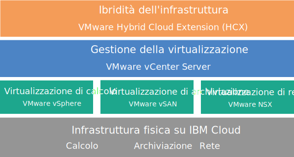

---

copyright:

  years:  2016, 2018

lastupdated: "2018-10-29"

---

{:tip: .tip}
{:note: .note}
{:important: .important}

# Panoramica di vCenter Server with Hybridity Bundle

VMware vCenter Server on {{site.data.keyword.cloud}} with Hybridity Bundle è un'istanza disponibile nelle release della V2.3 e successive. A partire dalla V2.6, l'istanza vCenter Server with Hybridity Bundle è disponibile per i Business Partner.

vCenter Server with Hybridity Bundle è un cloud privato ospitato che fornisce lo stack VMware vSphere come servizio. L'ambiente VMware è costruito su quattro {{site.data.keyword.cloud_notm}} {{site.data.keyword.baremetal_short}}, include VMware vSAN come archiviazione dedicata, fornisce la distribuzione e configurazione automatica di un firewall edge logico di facile gestione con tecnologia VMware NSX e comprende il servizio VMware HCX on {{site.data.keyword.cloud_notm}}.

In molti casi, l'intero ambiente può essere fornito in meno di un giorno e l'infrastruttura bare metal può ridimensionare rapidamente ed elasticamente la capacità di calcolo a seconda delle necessità.

Per aumentare la capacità di archiviazione basata su vSAN di un cluster vSAN, puoi aggiungere altri server ESXi dopo la distribuzione.

Puoi aggiornare l'edizione Advanced di VMware NSX all'edizione Enterprise e puoi acquistare ulteriori componenti VMware, come ad esempio VMware vRealize Operations.

Puoi aggiungere i servizi gestiti IBM se vuoi scaricare le operazioni quotidiane e la manutenzione dei livelli di virtualizzazione, sistemi operativi guest o applicazioni. Il team {{site.data.keyword.cloud_notm}} Professional Services è anche disponibile per aiutarti ad accelerare il tuo viaggio verso il cloud con servizi di migrazione, implementazione, pianificazione e incorporazione.

## Architettura di vCenter Server with Hybridity Bundle

Il seguente grafico illustra l'architettura di alto livello e i componenti di una distribuzione vCenter Server with Hybridity Bundle a tre nodi.

Figura 1. Architettura di alto livello di vCenter Server with Hybridity Bundle

### Infrastruttura fisica

Questo livello fornisce l'infrastruttura fisica (risorse di calcolo, archiviazione e rete) che deve essere utilizzata dall'infrastruttura virtuale.

### Infrastruttura di virtualizzazione (calcolo, archiviazione e rete)

Questo livello virtualizza l'infrastruttura fisica attraverso diversi prodotti VMware:
* VMware vSphere virtualizza le risorse di calcolo fisiche.
* VMware Virtual SAN (vSAN) fornisce l'archiviazione condivisa definita dal software, in base all'archiviazione nei server fisici.
* VMware NSX è la piattaforma di virtualizzazione di rete che fornisce componenti di rete logica e reti virtuali.

### Gestione della virtualizzazione

Questo livello comprende il dispositivo vCenter Server Appliance (vCSA), NSX Manager, due ESG NSX, tre controller NSX, il dispositivo virtuale PSC (Platform Services Controller) e la VSI (Virtual Server Instance) IBM CloudDriver. La VSI CloudDriver viene distribuita su richiesta in base alle esigenze per determinate operazioni, ad esempio l'aggiunta di host all'ambiente.

L'offerta di base viene distribuita con un dispositivo vCenter Server dimensionato per supportare un ambiente con un massimo di 400 host e 4000 VM. Gli stessi strumenti e script compatibili con l'API vSphere possono essere utilizzati per gestire l'ambiente VMware ospitato da IBM.

In totale, l'offerta di base richiede 38 vCPU e 67 GB di vRAM che sono riservati per il livello di gestione della virtualizzazione. La capacità host rimanente per le tue macchine virtuali dipende da diversi fattori, come la percentuale di sottoscrizione eccedente, il dimensionamento della VM e i requisiti delle prestazioni del carico di lavoro.

Per ulteriori requisiti delle risorse di gestione durante la distribuzione del servizio HCX on {{site.data.keyword.cloud_notm}}, consulta [Panoramica di VMware HCX on {{site.data.keyword.cloud_notm}}](../services/hcx_considerations.html).

### Ibridità dell'infrastruttura

Questo livello fornisce un'astrazione di risorse tra i siti in loco e i siti {{site.data.keyword.cloud_notm}} in modo da poter spostare i carichi di lavoro avanti e indietro in modo sicuro e semplice senza la necessità di modificare le caratteristiche delle VM, come i loro indirizzi IP.

Sulla base di VMware Hybrid Cloud Extension (HCX), puoi creare interconnessioni indipendenti tra i siti in loco e i siti {{site.data.keyword.cloud_notm}} per abilitare la migrazione in blocco delle VM o la migrazione live delle VM senza tempi di inattività.

## Specifiche tecniche per le istanze vCenter Server with Hybridity Bundle

Nella tua istanza vCenter Server with Hybridity Bundle sono inclusi i seguenti componenti:

La disponibilità e il prezzo delle configurazioni hardware standardizzate possono variare in base al {{site.data.keyword.CloudDataCent_notm}} selezionato per la distribuzione.
{:note}

### Bare Metal Server

Quattro **Skylake** o **Broadwell** {{site.data.keyword.baremetal_short}} vengono forniti con il tuo ordine dell'istanza vCenter Server with Hybridity Bundle. Sono disponibili i seguenti modelli CPU:
  * 2-CPU Intel Skylake (Intel Xeon 4100/5100/6100 series)
  * 2-CPU Intel Broadwell (Intel Xeon E5-2600 v4 series)

### Rete

Vengono ordinati i seguenti componenti di rete:
*  Doppi uplink di rete privata e pubblica da 10 Gbps
*  Tre VLAN (Virtual LAN): una VLAN pubblica e due VLAN private
*  Una VXLAN (Virtual eXtensible LAN) con DLR (Distributed Logical Router) per la potenziale comunicazione est-ovest tra carichi di lavoro locali connessi alle reti di livello 2 (L2). La VXLAN viene distribuita come topologia di instradamento di esempio, che puoi modificare, compilare o rimuovere. Puoi anche aggiungere zone di sicurezza collegando ulteriori VXLAN a nuove interfacce logiche sul DLR.
*  Due gateway dei servizi edge VMware NSX:
  * Un gateway dei servizi edge (ESG) VMware NSX sicuro dei servizi di gestione per il traffico di gestione HTTPS in uscita, distribuito da IBM come parte della tipologia di rete di gestione. Questo ESG viene utilizzato dalle VM di gestione IBM per comunicare con specifici componenti di gestione IBM esterni correlati all'automazione. Per ulteriori informazioni, vedi [Configurazione della rete per utilizzare l'ESG gestito dal cliente](../vcenter/vc_esg_config.html#configuring-your-network-to-use-the-customer-managed-nsx-esg-with-your-vms).

    Non puoi accedere a questo ESG e non puoi usarlo. Se lo modifichi, potresti non essere in grado di gestire l'istanza vCenter Server with Hybridity Bundle dalla console {{site.data.keyword.vmwaresolutions_short}}. Inoltre, tieni presente che l'utilizzo di un firewall o la disabilitazione delle comunicazioni ESG ai componenti di gestione IBM esterni causerà l'inutilizzabilità di {{site.data.keyword.vmwaresolutions_short}}.
    {:important}
  * Un gateway dei servizi edge VMware NSX sicuro gestito dal cliente per il traffico del carico di lavoro HTTPS in uscita e in entrata, distribuito da IBM come template che puoi modificare per fornire l'accesso VPN o l'accesso pubblico. Per ulteriori informazioni, vedi [L'edge NSX gestito dal cliente rappresenta un rischio per la sicurezza?](../vmonic/faq.html#does-the-customer-managed-nsx-edge-pose-a-security-risk-)

Per ulteriori informazioni sui componenti di rete ordinati quando si distribuisce il servizio HCX on {{site.data.keyword.cloud_notm}}, vedi [Panoramica di HCX on {{site.data.keyword.cloud_notm}}](../services/hcx_considerations.html).

### VSI (Virtual Server Instance)

Vengono ordinate le seguenti VSI (Virtual Server Instance):
* Una VSI per IBM CloudBuilder, che viene arrestata al termine della distribuzione dell'istanza.
* Puoi scegliere di distribuire una singola VSI di Microsoft Windows Server per Microsoft Active Directory (AD) o due VM Microsoft Windows ad alta disponibilità nel cluster di gestione per migliorare la sicurezza e la solidità.

### Archiviazione vSAN

L'archiviazione vSAN offre configurazioni personalizzate, con varie opzioni per tipo e quantità di dischi:
* Quantità dischi: 2, 4, 6 o 8.
* Disco di archiviazione: SED SSD da 960 GB, SED SSD da 1,9 TB o SED SSD da 3,8 TB.

  Inoltre, vengono ordinati due dischi di cache di 960 GB per ciascun host.
* Opzione Alte prestazioni con Intel Optane, che fornisce due alloggiamenti per dischi di capacità supplementari per un totale di 10 dischi di capacità. Questa opzione dipende dal modello di CPU.

### Licenze fornite da IBM e tariffe

Con il tuo ordine dell'istanza vCenter Server with Hybridity Bundle sono incluse le seguenti licenze.

* VMware vSphere Enterprise Plus 6.5u1
* VMware vCenter Server 6.5
* VMware NSX Service Providers Edition (Advanced o Enterprise) 6.4
* VMware vSAN (Advanced o Enterprise) 6.6

Possono essere applicate ulteriori tariffe per supporto e servizi.

## Specifiche tecniche per i nodi di espansione vCenter Server with Hybridity Bundle

Ogni nodo di espansione vCenter Server with Hybridity Bundle verrà distribuito e addebitato per i seguenti componenti nel tuo account {{site.data.keyword.cloud_notm}}.

### Hardware per i nodi di espansione

Un Bare Metal Server con la configurazione presentata in [Specifiche tecniche per le istanze vCenter Server with Hybridity Bundle](../vcenter/vc_hybrid_overview.html#technical-specifications-for-vcenter-server-with-hybridity-bundle-instances).

### Licenze e tariffe per i nodi di espansione

* Un VMware vSphere Enterprise Plus 6.5u1
* Un VMware NSX Service Providers Edition (Advanced o Enterprise) 6.4
* Una tariffa per supporto e servizi
* VMware vSAN (Advanced o Enterprise) 6.6

Devi gestire i componenti {{site.data.keyword.vmwaresolutions_short}} creati nel tuo account {{site.data.keyword.cloud_notm}} solo attraverso la console {{site.data.keyword.vmwaresolutions_short}}, non il {{site.data.keyword.slportal}} o qualsiasi altro mezzo all'esterno della console. Se modifichi questi componenti al di fuori della console {{site.data.keyword.vmwaresolutions_short}}, le modifiche non saranno sincronizzate con la console.
{:important}

**ATTENZIONE:** la gestione di un qualsiasi componente {{site.data.keyword.vmwaresolutions_short}}, installato nel tuo account {{site.data.keyword.cloud_notm}} nel momento in cui hai ordinato l'istanza, dall'esterno della console {{site.data.keyword.vmwaresolutions_short}} può rendere instabile il tuo ambiente. Queste attività di gestione includono:
*  Aggiunta, modifica, restituzione o rimozione dei componenti
*  Espansione o contrazione della capacità dell'istanza mediante l'aggiunta o la rimozione di server ESXi
*  Spegnimento dei componenti
*  Riavvio dei servizi

   Le eccezioni a queste attività includono la gestione delle condivisioni file di archiviazione condivisa dal {{site.data.keyword.slportal}}. Tali attività includono: l'ordine, l'eliminazione (che potrebbe influire sugli archivi di dati, se montati), l'autorizzazione e il montaggio di condivisioni file di archiviazione condivisa.

### Link correlati

* [Distinta base del software vCenter Server](vc_bom.html)
* [Requisiti e pianificazione per le istanze vCenter Server with Hybridity Bundle](vc_hybrid_planning.html)
* [Ordine di istanze vCenter Server with Hybridity Bundle](vc_hybrid_orderinginstance.html)
* [Panoramica di HCX on {{site.data.keyword.cloud_notm}}](../services/hcx_considerations.html)
* [Come contattare il supporto IBM](../vmonic/trbl_support.html)
