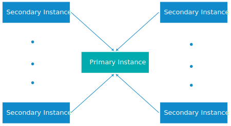

---

copyright:

  years:  2016, 2018

lastupdated: "2018-05-18"

---

# Configurazione multisito per le istanze vCenter Server on IBM Cloud

{{site.data.keyword.vmwaresolutions_full}} consente alle istanze di essere distribuite in ubicazioni diverse e di renderle operative in breve tempo.

**Note**:
* La configurazione multisito per le istanze vCenter Server è supportata solo per le istanze della V2.0 e successive.
* Non puoi creare collegamenti tra le istanze VMware Cloud Foundation e VMware vCenter Server in una configurazione multisito.

## Componenti della distribuzione multisito

Una distribuzione multisito è costituita dai seguenti componenti.

* **Istanza primaria**: l'istanza VMware vCenter Server primaria ha la seguente configurazione:
  *  Dominio root Microsoft Active Directory (AD) e DNS (Domain Name System)
  *  Dominio secondario vCenter Server
  *  Dominio SSO (Single Sign-On)
  *  Nome del sito SSO
* **Istanza o istanze secondarie**: una o più istanze vCenter Server secondarie, collegate all'istanza primaria, con la seguente configurazione:
   *  Nome del sito SSO
   *  Dominio secondario DNS collegato al dominio root sull'istanza primaria
   *  Replica DNS e AD configurata tra le macchine virtuali AD sulle istanze primarie e secondarie.
   *  PSC (Platform Services Controller) distribuito e configurato per la replica con il PSC sull'istanza primaria.
   *  I VMware vCenter sulle istanze secondarie sono configurati con la modalità di collegamento migliorata per vCenter sull'istanza primaria.

## Distribuzione multisito di vCenter Server

La funzione di configurazione multisito utilizza una topologia "hub and spoke" con un sito primario e un massimo di sette siti secondari. È supportato un singolo livello di siti, ovvero non puoi configurare siti successivi collegati ad altri siti secondari. Puoi avere un totale di 128 server ESXi in una configurazione multisito tra tutte le istanze.

**Nota**: se la tua configurazione richiede una distribuzione multisito con più di 128 server ESXi, contatta il supporto IBM per assistenza. Per ulteriori informazioni, vedi [Come contattare il supporto IBM](../vmonic/trbl_support.html).

Il seguente grafico illustra la vista generale della distribuzione multisito di vCenter Server.

Figura 1. Distribuzione multisito di vCenter Server

Il modello contiene i seguenti livelli:

* **Istanza primaria**: in una configurazione multisito, per distribuire la prima istanza, definisci tale istanza come primaria durante il processo di ordine dell'istanza.
* **Istanze secondarie**: in una configurazione multisito, definisci le istanze collegate all'istanza primaria come istanze secondarie durante il processo di ordine.

Puoi assegnare solo un'istanza secondaria a un'istanza primaria alla volta. Non puoi assegnare più istanze secondarie a un'istanza primaria contemporaneamente. Per farlo, devi ripetere il processo di ordine e selezionare l'istanza primaria definita in precedenza come istanza primaria per l'istanza secondaria. Devi ripetere il processo per tutte le istanze secondarie che vuoi creare.

Puoi avere un massimo di 8 istanze (1 primaria e 7 secondarie) che vengono distribuite in una configurazione multisito.

**Nota**: l'eliminazione delle istanze vCenter Server che fanno parte di una configurazione multisito richiede una pianificazione speciale. Per ulteriori informazioni, vedi [Eliminazione di istanze vCenter Server in una configurazione multisito](vc_deletinginstance_multi.html).

## Link correlati

* [Assign Primary Role to NSX Manager](https://pubs.vmware.com/NSX-62/topic/com.vmware.nsx-cross-vcenter-install.doc/GUID-44E8AE16-BA3F-4DD9-B582-FC1E137E6CFC.html){:new_window}
* [Configuring Secondary NSX Managers](https://pubs.vmware.com/NSX-62/topic/com.vmware.nsx-cross-vcenter-install.doc/GUID-9E48BC57-15E3-49C7-8BC5-F94ED8918BBE.html){:new_window}
* [AD trusts supported with vCenter Single Sign-On](https://kb.vmware.com/kb/2064250){:new_window}
* [Securely connect your private VMware workloads in the IBM Cloud](https://www.ibm.com/developerworks/library/se-securely-connect-private-vmware-workloads-ibm-cloud/index.html){:new_window}
