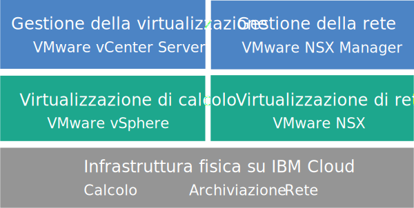

---

copyright:

  years:  2016, 2019

lastupdated: "2019-07-26"

keywords: vCenter Server NSX-T, NSX-T, tech specs vCenter Server NSX-T

subcollection: vmware-solutions

---

{:tip: .tip}
{:note: .note}
{:important: .important}

# Panoramica di vCenter Server with NSX-T
{: #vc_nsx-t_overview}

VMware vCenter Server on {{site.data.keyword.cloud}} with NSX-T è un cloud privato ospitato che fornisce lo stack VMware vSphere come servizio. L'ambiente VMware è sviluppato su un minimo di tre {{site.data.keyword.baremetal_short}} {{site.data.keyword.cloud_notm}}, offre opzioni di archiviazione collegata alla rete condivisa e archiviazione definita dal software dedicata e include la distribuzione e configurazione automatizzata di un firewall edge logico di facile gestione con tecnologia VMware NSX-T.

In molti casi, l'intero ambiente può essere fornito in meno di un giorno e l'infrastruttura bare metal può ridimensionare rapidamente ed elasticamente la capacità di calcolo a seconda delle necessità.

Dopo la distribuzione, puoi aumentare l'archiviazione condivisa ordinando altre condivisioni file NFS (Network File System) dal {{site.data.keyword.slportal}} e collegandole manualmente a tutti i server ESXi in un cluster.

VMware vSAN è anche disponibile come opzione di archiviazione dedicata. Per aumentare la capacità di archiviazione basata su vSAN di un cluster vSAN, puoi aggiungere altri server ESXi dopo la distribuzione.

Le istanze vCenter Server with NSX-T sono solo per l'esecuzione di test sandbox o una prova di utilizzo PoC (proof of concept). Non eseguire i carichi di lavoro di produzione su questo ambiente. Le funzioni di gestione, quali l'ordinazione di servizi aggiuntivi e l'applicazione di aggiornamenti, non sono supportate.
{:important}

## Architettura di vCenter Server with NSX-T
{: #vc_nsx-t_overview-archi}

Il seguente grafico illustra l'architettura di alto livello e i componenti di una distribuzione vCenter Server with NSX-T a tre nodi.

### Infrastruttura fisica
{: #vc_nsx-t_overview-physical-infras}

Questo livello fornisce l'infrastruttura fisica (risorse di calcolo, archiviazione e rete) che deve essere utilizzata dall'infrastruttura virtuale.

### Infrastruttura di virtualizzazione (calcolo e rete)
{: #vc_nsx-t_overview-virtualization-infras}

Questo livello virtualizza l'infrastruttura fisica attraverso diversi prodotti VMware:
* VMware vSphere virtualizza le risorse di calcolo fisiche.
* VMware NSX-T è la piattaforma di virtualizzazione di rete che fornisce componenti di rete logica e reti virtuali.

### Gestione della virtualizzazione
{: #vc_nsx-t_overview-virtualization-mgmt}

Questo livello è costituito da vCSA (vCenter Server Appliance) con PSC (Platform Services Controller) integrato, tre nodi NSX, tre ESG (Edge Services Gateway) NSX e la VSI (virtual server instance) IBM CloudDriver. La VSI CloudDriver viene distribuita su richiesta in base alle esigenze per determinate operazioni, ad esempio l'aggiunta di host all'ambiente.

L'offerta di base viene distribuita con un dispositivo vCenter Server dimensionato per supportare un ambiente con un massimo di 400 host e 4000 VM. Gli stessi strumenti e script compatibili con l'API vSphere possono essere utilizzati per gestire l'ambiente VMware ospitato da IBM.

In totale, l'offerta di base richiede 38 vCPU e 128 GB di vRAM che sono riservati per il livello di gestione della virtualizzazione. La capacità host rimanente per le tue VM dipende da diversi fattori, come la percentuale di sottoscrizione eccedente, il dimensionamento della VM e i requisiti delle prestazioni del carico di lavoro.

Per ulteriori informazioni sull'architettura, vedi [Riferimento all'architettura di {{site.data.keyword.vmwaresolutions_short}}](/docs/services/vmwaresolutions/archiref/solution?topic=vmware-solutions-solution_overview).

## Specifiche tecniche per le istanze vCenter Server with NSX-T
{: #vc_nsx-t_overview-specs}

Nella tua istanza vCenter Server with NSX-T sono inclusi i seguenti componenti.

La disponibilità e il prezzo delle configurazioni hardware standardizzate possono variare in base al {{site.data.keyword.CloudDataCent_notm}} selezionato per la distribuzione.
{:note}

### Bare Metal Server
{: #vc_nsx-t_overview-bare-metal}

Puoi ordinare tre o più {{site.data.keyword.baremetal_short}} con una delle seguenti configurazioni:
* **Skylake**: server di generazione 2-CPU Intel Skylake (Intel Xeon 4100/5100/6100 series) con il modello di CPU e la dimensione della RAM da te selezionati.  
*  **Cascade**: server di generazione 2-CPU Intel Cascade (Intel Xeon 4200/5200/6200 series) con il modello di CPU e la dimensione della RAM da te selezionati.
* **Broadwell**: server di generazione 4-CPU Intel Broadwell (Intel Xeon E7-4800 series) con il modello di CPU e la dimensione della RAM da te selezionati.

Se intendi utilizzare l'archiviazione vSAN, la configurazione richiede almeno quattro {{site.data.keyword.baremetal_short}}.
{:note}

### Rete
{: #vc_nsx-t_overview-networking}

Vengono ordinati i seguenti componenti di rete:
*  Doppi uplink di rete privata e pubblica da 10 Gbps
*  Tre VLAN (Virtual LAN): una VLAN pubblica e due VLAN private
* Una rete di sovrapposizione con un router T1 e T0 per la potenziale comunicazione est-ovest tra carichi di lavoro locali connessi alle reti di livello 2 (L2). Viene distribuita come topologia di instradamento di esempio, che puoi modificare, usare come base di sviluppo o rimuovere.
*  Tre ESG (Edge Services Gateway) VMware NSX-T:
  * Un ESG VMware NSX di servizi di gestione sicuri per il traffico di gestione HTTPS in uscita, distribuiti da IBM come parte della topologia di rete di gestione. Questo ESG viene utilizzato dalle VM di gestione IBM per comunicare con specifici componenti di gestione IBM esterni correlati all'automazione. Per ulteriori informazioni, vedi [Configurazione della rete per utilizzare l'ESG NSX gestito dal cliente con le tue VM](/docs/services/vmwaresolutions/vcenter?topic=vmware-solutions-vc_esg_config).
  * Due ESG VMware NSX gestiti dal cliente sicuri per il traffico di carico di lavoro HTTPS in uscita e in entrata. Questo gateway è distribuito da IBM come template che puoi modificare per fornire l'accesso VPN o l'accesso pubblico. Per ulteriori informazioni, vedi [L'edge NSX gestito dal cliente rappresenta un rischio per la sicurezza?](/docs/services/vmwaresolutions?topic=vmware-solutions-faq#faq-customer-nsx)

  Questo ESG è denominato **mgmt-nsx-edge0**. Non puoi accedere all'ESG e non puoi utilizzarlo. Se lo modifichi, potresti non essere in grado di gestire l'istanza vCenter Server dalla console {{site.data.keyword.vmwaresolutions_short}}. Inoltre, l'utilizzo di un firewall o la disabilitazione delle comunicazioni ESG ai componenti di gestione IBM esterni potrebbe comportare l'inutilizzabilità di {{site.data.keyword.vmwaresolutions_short}}.
  {:important}

### VSI (Virtual Server Instance)
{: #vc_nsx-t_overview-vsi}

Vengono ordinate le seguenti VSI (Virtual Server Instance):
* Una VSI per IBM CloudBuilder, che viene arrestata al termine della distribuzione dell'istanza.
* Puoi scegliere di distribuire una singola VSI di Microsoft Windows Server per Microsoft Active Directory (AD) o due VM Microsoft Windows ad alta disponibilità nel cluster di gestione per migliorare la sicurezza e la solidità.

### Archiviazione
{: #vc_nsx-t_overview-storage}

Durante la distribuzione iniziale, puoi scegliere tra le opzioni di archiviazione vSAN e NFS.

Dopo la distribuzione, puoi aggiungere delle condivisioni di archiviazione NFS a un cluster NFS o vSAN esistente. Per ulteriori informazioni, vedi la sezione *Aggiunta dell'archiviazione NFS alle istanze vCenter Server* in [Espansione e contrazione della capacità per le istanze vCenter Server](/docs/services/vmwaresolutions/vcenter?topic=vmware-solutions-vc_addingremovingservers).
{:note}

#### Archiviazione vSAN
{: #vc_nsx-t_overview-vsan-storage}

L'opzione vSAN offre configurazioni personalizzate, con varie opzioni per tipo, dimensione e quantità di dischi:
* Quantità dischi: 2, 4, 6 o 8
* Disco di archiviazione: SED SSD da 960 GB, SED SSD da 1,9 TB o SED SSD da 3,8 TB.

  Inoltre, vengono ordinati anche due dischi di cache di 960 GB per ciascun host.

  Le unità SSD (Solid State Disk) da 3,8 TB saranno supportate una volta rese generalmente disponibili in un data center.
  {:note}
* Opzione Alte prestazioni con Intel Optane, che fornisce due alloggiamenti per dischi di capacità supplementari per un totale di 12 dischi di capacità. Questa opzione dipende dal modello di CPU.

#### Archiviazione NFS
{: #vc_nsx-t_overview-nfs-storage}

L'opzione NFS offre l'archiviazione a livello di file condivisa personalizzata per carichi di lavoro con varie opzioni per dimensioni e prestazioni:
* Dimensione: da 20 GB a 24 TB
* Prestazioni: 0,25, 2, 4 o 10 IOPS/GB
* Configurazione individuale delle condivisioni file

  Il livello di prestazioni di 10 IOPS/GB è limitato a una capacità massima di 4 TB per condivisione file.
  {:note}

Se scegli l'opzione NFS, viene ordinata una condivisione file da 2 TB e 4 IOPS/GB per i componenti di gestione.

### Licenze (fornite da IBM o BYOL) e tariffe
{: #vc_nsx-t_overview-license-and-fee}

* VMware vSphere Enterprise Plus 6.7u2
* VMware vCenter Server 6.5
* VMware NSX Service Providers Edition (Base, Advanced o Enterprise) 6.4 (solo fornito da IBM)
* (Per i cluster vSAN) VMware vSAN Advanced o Enterprise 6.6
* Tariffa per supporto e servizi (una licenza per nodo)

## Specifiche tecniche per i nodi di espansione vCenter Server with NSX-T
{: #vc_nsx-t_overview-expansion-node-specs}

Ogni nodo di espansione vCenter Server with NSX-T distribuisce e comporta l'applicazione di addebiti per i seguenti componenti nel tuo account {{site.data.keyword.cloud_notm}}.

### Hardware per i nodi di espansione
{: #vc_nsx-t_overview-expansion-node-hardware}

Un Bare Metal Server con la configurazione presentata in [Specifiche tecniche per le istanze vCenter Server with NSX-T](/docs/services/vmwaresolutions?topic=vmware-solutions-vc_nsx-t_overview#vc_nsx-t_overview-specs).

### Licenze e tariffe per i nodi di espansione
{: #vc_nsx-t_overview-expansion-node-license-and-fee}

* Un VMware vSphere Enterprise Plus 6.7u2
* Un VMware NSX Service Providers Edition (Base, Advanced o Enterprise) 6.4
* Una tariffa per supporto e servizi
* (Per i cluster vSAN) VMware vSAN Advanced o Enterprise 6.6

Devi gestire i componenti {{site.data.keyword.vmwaresolutions_short}} creati nel tuo account {{site.data.keyword.cloud_notm}} solo attraverso la console {{site.data.keyword.vmwaresolutions_short}}, non il {{site.data.keyword.slportal}} o qualsiasi altro mezzo all'esterno della console. Se modifichi questi componenti al di fuori della console {{site.data.keyword.vmwaresolutions_short}}, le modifiche non saranno sincronizzate con la console.
La gestione di un qualsiasi componente {{site.data.keyword.vmwaresolutions_short}}, installato nel tuo account {{site.data.keyword.cloud_notm}} nel momento in cui hai ordinato l'istanza, dall'esterno della console {{site.data.keyword.vmwaresolutions_short}} può rendere instabile il tuo ambiente. Queste attività di gestione includono:
*  Aggiunta, modifica, restituzione o rimozione dei componenti
*  Espansione o contrazione della capacità dell'istanza mediante l'aggiunta o la rimozione di server ESXi
*  Spegnimento dei componenti
*  Riavvio dei servizi
   Le eccezioni a queste attività includono la gestione delle condivisioni file di archiviazione condivisa dal {{site.data.keyword.slportal}}. Tali attività includono: l'ordine, l'eliminazione (che potrebbe influire sugli archivi di dati, se montati), l'autorizzazione e il montaggio di condivisioni file di archiviazione condivisa.
   {:important}

## Link correlati
{: #vc_nsx-t_overview-related}

* [Distinta base del software vCenter Server](/docs/services/vmwaresolutions/vcenter?topic=vmware-solutions-vc_bom)
* [Pianificazione per le istanze vCenter Server](/docs/services/vmwaresolutions/vcenter?topic=vmware-solutions-vc_planning)
* [Ordine di istanze vCenter Server with NSX-T](/docs/services/vmwaresolutions/vcenter?topic=vmware-solutions-vc_nsx-t_orderinginstance)
* [Attached storage for vCenter Server](/docs/services/vmwaresolutions/services?topic=vmware-solutions-storage-benefits#storage-benefits)
* [Espansione della capacità di condivisione file](/docs/infrastructure/FileStorage?topic=FileStorage-expandCapacity#expandCapacity)
