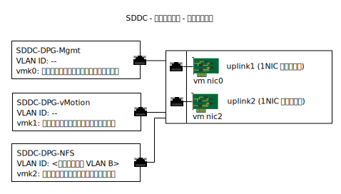

---

copyright:

  years:  2016, 2019

lastupdated: "2019-05-06"

subcollection: vmware-solutions

---

{:tip: .tip}
{:note: .note}
{:important: .important}

# 接続ストレージのインフラストラクチャー管理
{: #storage-infra-mgmt}

インフラストラクチャー管理では、vSphere ESXi インフラストラクチャーを管理する VMware コンポーネントについて触れます。

これらのコンポーネントについて詳しくは、[仮想インフラストラクチャー設計](/docs/services/vmwaresolutions/archiref/solution?topic=vmware-solutions-design_virtualinfrastructure)の図 2『NSX Manager ネットワークの概要』を参照してください。

## 仮想ネットワーキングの設計
{: #storage-infra-mgmt-visual-net-design}

この設計で使用されるネットワークの仮想化では、プライベート・ネットワークに関連付けられた既存の vSphere 分散スイッチ (vDS) が使用されます。 これは、[{{site.data.keyword.vmwaresolutions_full}} のアーキテクチャー](/docs/services/vmwaresolutions/archiref/solution?topic=vmware-solutions-solution_overview)に規定されています。

## vSphere 分散スイッチ
{: #storage-infra-mgmt-vsphere-ds}

別の VLAN が vCenter Server ソリューション内に作成され、NFS マウント・ポイントを既存のクラスター内の ESXi ホストに接続するのに使用されます。 vCenter Server ソリューションには、プライベート・ネットワークが関連付けられた vSphere 分散スイッチがあるので、別のポート・グループが作成され、追加された VLAN の番号のタグが付けられます。この追加 VLAN はネイティブではないからです。

この新しいポート・グループのデフォルトの設定値を次の表に示します。

これらのデフォルトの設定値は変更しないでください。
{:important}

表 1. NFS ポート・グループの要約

| ポート・グループ名 | SDDC-DPG-NFS |
|:--------------- |:------------ |
| ポート・バインディング | 静的 |
| VLAN タイプ | プライベート VLAN B |
| ロード・バランシング | 起点仮想ポートに基づく転送 |
| アクティブ・アップリンク | Uplink1 と uplink2 |

NFS ストレージ・トラフィック用の vDS ポート・グループが作成されるほか、VMkernel ポートが、デプロイメント中に各 vSphere ESXi ホスト上に作成され、SDDC-DPG-NFS ポート・グループに割り当てられます。 VMkernel ポートには、接続ストレージの VLAN (プライベート VLAN B) に関連付けられたプライベート・ポータブル・サブネットの IP アドレスも割り当てられ、ポートの MTU は、ジャンボ・フレームをサポートするために 9000 に設定されます。

### vSphere ホストの静的ルーティング
{: #storage-infra-mgmt-vsphere-routing}

新しいポート・グループが vDS に構成され、そのポート・グループに VMkernel ポートが割り当てられますが、このソリューションではデプロイメント内の各 vSphere ESXi ホスト上に静的ルートが作成されるので、すべての NFS トラフィックが NFS 用の VLAN とサブネットを横断できます。 静的ルートは `/etc/rc.local.d/local.sh` 内に作成されるので、ホストを再起動しても保持されます。

## 関連リンク
{: #storage-infra-mgmt-related}

* [ソリューションの概要](/docs/services/vmwaresolutions/archiref/solution?topic=vmware-solutions-solution_overview)
