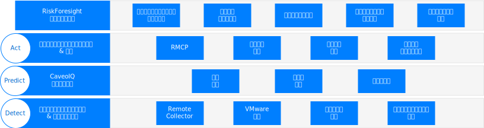

---

copyright:

  years:  2016, 2019

lastupdated: "2019-05-06"

subcollection: vmware-solutions

---

# Caveonix RiskForesight のアーキテクチャーの概要
{: #caveonix-arch}

Caveonix RiskForesight アーキテクチャーを以下の図に示します。

Caveonix RiskForesight アーキテクチャーには、以下の 4 つの層があります。
-	Detect - Detect モジュールは、VMware スタックと多くパブリック・クラウドに完全に統合されています。 プラグインを使用することにより、RiskForesight は vCenter と NSX Manager を資産リポジトリーとして使用して、仮想マシン (VM)、ネットワーク、ネットワーク・フローに関する詳細を収集します。 Remote Collector は、ワークロード、オペレーティング・システム、アプリケーションをスキャンして、コンプライアンスと脆弱性を総合的に理解できるようにします。
-	Predict - Predict モジュールは、分析を使用してリスクの高い資産を識別し、リスク軽減モデルを使用する緩和ステップによってリスク状況を改善します。
-	Act - Act モジュールは、優先順位設定と自動保護アクションに基づく緩和ステップを実装して、サイバー脅威によるリスクからワークロードをプロアクティブに保護します。
    - RMCP – Risk Management Control Plane (RMCP) は、プライベート・クラウド、パブリック・クラウド、および管理対象クラウドのデータ・センター内を総合的にモニターすることによって、ワークロードを継続的かつプロアクティブに保護します。
    - ポリシー・マネージャー - 組織ごとに使用できる 3 つのタイプの機械学習ジョブ (Caveo Logs、Caveo Network、Caveo Scan) が現在用意されています。 データで見つかった異常に基づいて、ユーザーは、ユーザー定義の条件に基づくアクションを実行するためのポリシーを構成できます。さらに、ジョブ・タイプを選択し、異常スコアのブール条件を構成し、条件が真になったときに実行するアクションを定義できます。 例えば次のようにします。
        - ジョブ:「Caveo Logs」は、異常スコアが 90 を上回った時に、資産に検疫のためのマークを付け、Slack チャネルに通知を送信します。
        - ジョブ:「Caveo Network」は、異常スコアが 95 を上回った時に、資産を検疫して、E メール通知と UI 通知を送信します。
- ダッシュボード - ダッシュボードは、役割ベースのアクセスによって、IT 部門などのサービス・プロバイダーに、IT 資産をテナントや事業単位に割り振る機能を提供します。 その後、事業単位はそれらの IT 資産をアプリケーションに割り当てます。 これらのアプリケーションはビジネス・サービスと IT サービスを結び付けます。さらにこれらのアプリケーションはビジネス影響評価の対象となり、NIST、NESA、PCI、ISO、HIPAA などのコンプライアンス制度に従う必要があります。 その後、これらのアプリケーションは、脆弱性、NSX フロー、ソフトウェア、ログ・データなどのいくつかのスキャンの対象となり、実行中のアプリケーションや、そのアプリケーションに関連したサイバー・リスクとコンプライアンス・リスクに対する可視性が構築されます。 これらのダッシュボードを詳しく調べることにより、コンプライアンスとセキュリティーを担当するユーザーは、優先順位付けされた緩和アクションのリストを確認し、Predict モジュールと Act モジュールでの自動化可能な適用アクションを有効にすることができます。 RiskForesight には、ハイブリッド・クラウド内の資産を識別するための統合ダッシュボードと、サイバー・リスク、コンプライアンス構成リスク、主要トレンド、セキュリティー操作メトリックに対するヒート・マップ分析が用意されています。 これによりユーザーは、リスクの性質と場所を素早く判別して、直観的で強力な可視化ツールを使用したどのような操作を行うかを決めることができます。 これらのダッシュボードでは、以下の機能が提供されます。
  - Detect、Predict、Act の各ダッシュボード・ビューによる、ハイブリッド・クラウド全体でのサイバー・リスクとコンプライアンス・リスクの優先順位が分かるビュー。
  - ユーザーがデータに対して視覚的な対話作業を行って、リスクが発生している資産をリスクの優先順位に基づいて素早く識別する機能。
  - 識別されたリスクに関する洞察を深めるための、使いやすいグラフ、メトリック、フィルター。
  - 場所、組織、アプリケーション、アセット全体でのアプリケーション・データ・フロー、脆弱性、または構成の問題に関する理解を深めるための対話式ドリルダウン。
  - ユーザーは、インフラストラクチャー、プラットフォーム、アプリケーション、データを含む操作可能なスタックについて全体的に理解できる。
  - ハイブリッド・クラウドのネットワーク、仮想マシン、またはアプリケーションのセグメンテーションを視覚化して、ポリシーを適用する機能。

## ゾーン
{: #caveonix-arch-zones}

Caveonix RiskForesight には、ゾーンの概念があります。

-	管理ゾーンまたはサービス・プロバイダー・ゾーン - 管理ゾーンまたはサービス・プロバイダー・ゾーンには、以下のコンポーネントが含まれます。
    - RiskForesight アプリケーション - これは複数のコンポーネントで構成されます。『アプリケーション・コンポーネント』セクションで詳しく説明します。
    - Central Collector – クラウド・プロバイダーとテナント・ゾーンから情報を収集します。
- クラウド・プロバイダー - このゾーンには、アプリケーションがホストされる以下のインフラストラクチャーが用意されています。
    - プライベート – VMware on {{site.data.keyword.cloud}}、およびオンプレミスの VMware インフラストラクチャー・プラットフォーム。 これらのプラットフォームは、vCenter、NSX Manager、VMware Cloud Director (vCD)、または vRealize Automation (vRA) によって RiskForesight に統合されます。
    - パブリック – 現在サポートされているパブリック・クラウド・プロバイダーは AWS だけです。 {{site.data.keyword.cloud_notm}} は、間もなく使用可能になります。
    - コンテナー - 現在は AWS Elastic Kubernetes Service (EKS) だけがサポートされています。 {{site.data.keyword.cloud_notm}} Private と {{site.data.keyword.cloud_notm}} Kubernetes Services (IKS) は、間もなく使用可能になります。
-	テナント・ゾーンまたは顧客環境ゾーン – これらのゾーンは、テナント、顧客、または事業単位を分離するために使用されます。 これらのゾーン内にはワークロードが存在するので、Remote Collector が必要になります。 最小のデプロイメントでは 1 つの Remote Collector が必要ですが、一般的なデプロイメントでは、テナント/顧客/事業単位ごとに 1 つの Remote Collector が必要になります。

## 関連リンク
{: #caveonix-arch-related}

*   [VMware vCenter Server on {{site.data.keyword.cloud_notm}} with Hybridity Bundle](/docs/services/vmwaresolutions/archiref/vcs?topic=vmware-solutions-vcs-hybridity-intro)
*   [Caveonix の詳細設計](/docs/services/vmwaresolutions/archiref/caveonix?topic=vmware-solutions-caveonix-detailed)
