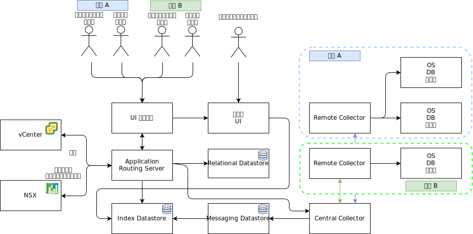

---

copyright:

  years:  2016, 2019

lastupdated: "2019-02-14"

---

# 詳細設計
{: #caveonix-detailed}

以下の図と説明は、RiskForesight アプリケーション・コンポーネントに関する情報を提供します。

図 1. アプリケーション・コンポーネント

-	グラフィカル・ユーザー・インターフェース - RiskForesight アプリケーションにアクセスするために使用できる Web インターフェース。
-	Central Collector - プラグインから送られてくるさまざまなタイプのデータ・ペイロードを収集して、メッセージング・ストアで使用できるようにします。RiskForesight は、以下のタイプのペイロードをサポートします。
    - スキャン
    - ログ
    - Netflow
    - ソフトウェア
    - ワークロード・メタデータ
- Central Router - VMware オーケストレーション層とのすべての統合タッチポイントを管理します。すべての RiskForesight プラグインは、RiskForesight エコシステムとの通信を許可してもらうために、Central Router と通信する必要があります。
-	API Server - GUI とバックエンド・データ・ストアを接続する REST エンドポイント・ミドルウェアです。さらに、ユーザー・アクセス要求を検証して RBAC を管理します。
-	vCenter Data Collector - このプラグインは、仮想マシン (VM) の詳細を vCenter から取り出します。この汎用プラグインは VMware API を使用して vCenter に接続し、ワークロードに関連した情報を取り出します。情報が使用可能になると、このプラグインはペイロードをパッケージして、Central Collector に送信します。
-	vCD Data Collector - このプラグインは、VM の詳細を VMware vCloud Director から取り出します。この汎用プラグインは VMware API を使用して VMware vCloud Director に接続し、ワークロードに関連した情報を取り出します。情報が使用可能になると、このプラグインはペイロードをパッケージして、Central Collector に送信します。
-	vCD Network Data Collector - このプラグインは、Netflow の詳細を VMware vCD から取り出します。この汎用プラグインは VMware API を使用して VMware NSX に接続し、ネットワーク、FW、セキュリティー・ルール、およびセキュリティー・グループを取り出します。情報が使用可能になると、このプラグインはペイロードをパッケージして、Central Collector に送信します。
-	Network Data Collector - このプラグインは、Netflow の詳細を VMware vCenter から取り出します。この汎用プラグインは VMware API を使用して VMware NSX に接続し、ネットワーク、ファイアウォール、セキュリティー・ルール、およびセキュリティー・グループの情報を取り出します。情報が使用可能になると、このプラグインはペイロードをパッケージして、Central Collector に送信します。
-	Remote Collector - テナント環境、またはテナント VM へのネットワーク・アクセスが可能な他の場所に常駐します。すべてのコンプライアンス・リスクとサイバー・リスクのスキャンを処理します。
-	Relational Datastore - 以下のタイプのメタデータを保守します。
    - クラウド・サービス・プロバイダー
    - テナント
    - 資産
    - スキャン結果
    - ソフトウェア
    - 日次または週次の集約データ・セット
-	Messaging Datastore - RiskForesight は永続メッセージ・キューを使用してデータ損失をゼロにし、コンポーネントへのバック・プレッシャーの負荷を軽減します。着信データ・ペイロードは最初に永続的なものとなり、その後、将来の処理のために永続性が解除されます。
-	Index Datastore - マルチテナント機能をサポートするために、着信生データにテナントごとに索引を作成して保管し、さらに分析できるようにします。
-	プラグイン – Application Routing Server 内に常駐します。すべての VM とそのテナント情報を同期させるために、セットアップ機能と VMware コンポーネントとの統合機能が含まれています。

以下の表は、各コンポーネントに必要なポートとプロトコルを示しています。

表 1. ポートとプロトコル

|コンポーネント	|プロトコル / ポート|
|---|---|
|UI|443|
|API|443、1337|
|RiskForesight|8082、8083、8084|
|Central Collector (クラスター)|8080|
|Remote Collector|8081|
|Relational Datastore 1 次または 2 次|5432|
|Messaging Datastore クラスター|9092|
|Index Datastore マスター・ノード|9200、9300、5601、443|

以下の図は、プライベート VLAN A に関連付けられた Caveonix ポータブル・プライベート・サブネットのネットワーク・トポロジーを示しています。この「オールインワン」型から発展させて、途中に必要であれば部分分散モデルを介して、最終的には完全分散デプロイメント・モデルに手動でスケールアウトできるように、お客様の責任でこのサブネットの IP アドレス・スペースを管理してください。

図 2. ネットワーク図

以下の表では、IP サブネット、VLAN の割り当てについて説明します。

表 2. VLAN とサブネット

|VLAN 	|サブネット・タイプ |説明|
|---|---|---|
|パブリック 	|プライマリー 	|パブリック・ネットワーク・アクセス用に物理ホストに割り当てられます。 初期デプロイメント時は使用されません。|
|パブリック	|ポータブル 	|customer-nsx-esg のアップリンクおよび NAT 用に割り当てられます。|
|パブリック	|ポータブル 	|mgmt-nsx-esg のアップリンク NAT 用に割り当てられます。|
|パブリック	|ポータブル 	|hcx-mgmt-esg のアップリンク NAT 用に割り当てられます (Hybridity バンドルを選択した場合)。|
|プライベート A 	|プライマリー 	|{{site.data.keyword.cloud}} によって割り当てられた物理ホストに割り当てられます。 管理インターフェースで vSphere 管理トラフィック用に使用されます。|
|プライベート A 	|ポータブル 	|管理コンポーネントとして機能する VM に割り当てられます。|
|プライベート A 	|ポータブル 	|NSX VTEP に割り当てられます。|
|プライベート A 	|ポータブル 	|内部使用のために HCX に割り当てられます (Hybridity バンドルを選択した場合)。|
|プライベート A 	|ポータブル 	|customer-nsx-esg のアップリンク用に割り当てられます。|
|プライベート A 	|ポータブル 	|HCX に割り当てられます (Hybridity バンドルを選択した場合)。|
|プライベート A 	|ポータブル 	|Zerto VRA に割り当てられます (Zerto オプションを選択した場合)。|
|プライベート A 	|ポータブル 	|Caveonix RiskForesight に割り当てられます (Caveonix オプションを選択した場合)。|
|プライベート B	|プライマリー	|初期デプロイメント時は使用されません。|
|プライベート B 	|ポータブル 	|vSAN 用に割り当てられます (使用する場合)。|
|プライベート B 	|ポータブル 	|NAS 用に割り当てられます (使用する場合)。|
|プライベート B 	|ポータブル 	|vMotion 用に割り当てられます。|

## 関連リンク
{: #caveonix-detailed-related}

* [VMware vCenter Server on {{site.data.keyword.cloud_notm}} with Hybridity Bundle](/docs/services/vmwaresolutions/archiref/vcs/vcs-hybridity-intro.html)
