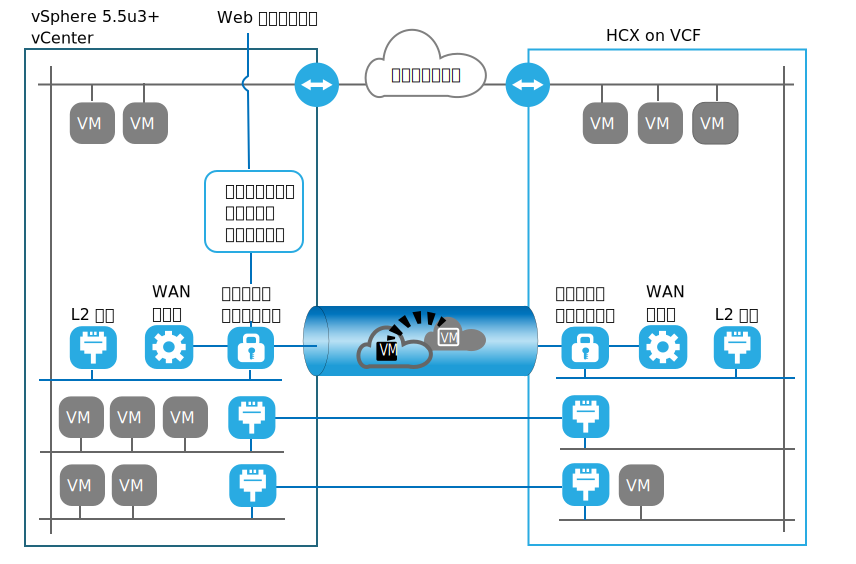

---

copyright:

  years:  2016, 2019

lastupdated: "2019-05-06"

subcollection: vmware-solutions

---
# VMware HCX on IBM Cloud の紹介
{: #hcx-archi-intro}

VMware HCX on IBM Cloud サービスを使用すると、IBM Cloud for VMware ソリューション・インスタンスとオンプレミスの VMware 仮想データ・センターの間にシームレスな接続を構築できます。

VMware ソリューション向け IBM Cloud には、IBM Cloud に VMware vCenter Server (VCS) を完全自動で迅速にデプロイできるオファリングが含まれています。 これらのオファリングによってオンプレミスのインフラストラクチャーを補完し、オンプレミスで使用しているのと同じツール、スキル、およびプロセスを使用して、既存のワークロードや将来のワークロードを変換せずに IBM Cloud で実行できるようにします。 詳しくは、[Virtualization for extending virtualized private cloud](https://www.ibm.com/cloud/garage/architectures/virtualizationArchitecture) を参照してください。

VMware HCX on IBM Cloud サービスは、シームレスなネットワーク拡張の構築とワークロードの双方向マイグレーションを可能にして、VCS のインスタンスをオンプレミスの既存の仮想化データ・センターに融合するという新しい段階のハイブリッドを実現しています。

IBM Cloud VMware のターゲット・サイトに仮想マシンとしてデプロイされる VMware HCX on IBM Cloud コンポーネントが、ピアであるオンプレミスのソース・サイトにインストールされる VMware HCX on IBM Cloud コンポーネントとの接続の確立を可能にします。

この接続により、オンプレミスと IBM Cloud の間に疎結合された相互接続が作成され、以下のような機能を利用できるようになります。
* 単純な相互接続 – 公衆インターネット、プライベート VPN、Direct Link などの物理接続を介して、論理ネットワーク接続を簡単に確立できます。
* レイヤー 2 拡張 – オンプレミスのネットワークがクラウドまで拡張されます。 これらのネットワークには、オンプレミスのサブネットや IP アドレッシングが含まれます。
* 暗号化 – 2 者間のネットワーク・トラフィックが安全に暗号化されます。
* 最適化されたネットワーク – ネットワーク・トラフィックをできる限り速く転送するために、最適な接続を選択し、接続上に大量の情報を効率的に流します。
* データ重複排除 – インテリジェント・ルーティングにより、約 50% ものネットワーク・トラフィックの削減を実現できます。インテリジェント・ルーティング - ワークロードを転送するときに、近接ルーティングによってネットワーク・パス (つまり、ゲートウェイ) を変更できるので、ネットワーク・トラフィックが発信元のサイトに「ヘアピン通信」で戻ることなく、ターゲット・サイトのゲートウェイを使用するようになります。
* ゼロ・ダウン時間マイグレーション – vMotion を使用して、実行中のシステムをクラウドとの間で双方向に移動できます。
* マイグレーションのスケジュール – 任意の数の仮想マシンを宛先サイトにレプリケーションしておき、指定した時刻にそのサイトでアクティブ化することで、元のサイトで実行されているシステムを置換できます。
* セキュリティー・ポリシーのマイグレーション – NSX をオンプレミスで使用している場合は、セキュリティー・ポリシーまたはファイアウォールがワークロードと一緒に移行されます。

## 関連リンク
{: #hcx-archi-intro-related}

* [Virtualization for extending virtualized private cloud](https://www.ibm.com/cloud/garage/architectures/virtualizationArchitecture)
