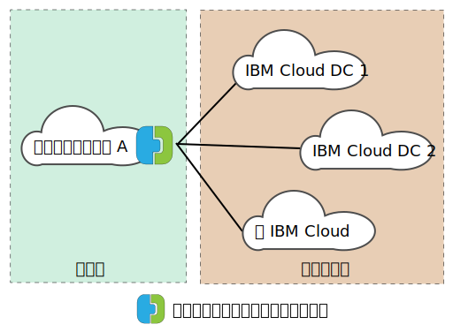
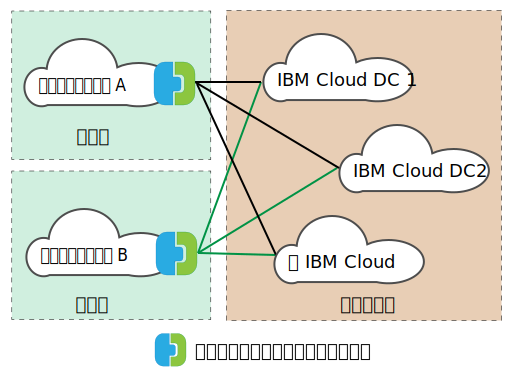

---

copyright:

  years:  2016, 2019

lastupdated: "2019-04-02"

subcollection: vmware-solutions

---
# VMware HCX on IBM Cloud の概要
{: #hcx-archi-overview}

VMware HCX on IBM Cloud は、オンプレミスの vSphere® vCenter™ ネットワークを IBM Cloud for VMware Solutions デプロイメントにシームレスに統合します。 ハイブリッド・ネットワーキングによってオンプレミスの vSphere vCenter ネットワークが IBM Cloud まで拡張されるので、双方向の仮想マシン (VM) モビリティーがサポートされます。

HCX は、ソースと宛先で暗号化/復号のプロセスを取ることで、セキュリティーを一貫して確保し、仮想マシンのマイグレーションやネットワークの拡張などのハイブリッド・ワークフローの受け入れを許可します。

このオファリングは、拡張ネットワークのパフォーマンスを高めるために、最適化されたソフトウェア定義の WAN を構築し、LAN の速度に迫るパフォーマンスを実現します。 HCX はまた、双方向ワークロードおよび VMware NSX® セキュリティー・ポリシーの IBM Cloud ネットワーク・サービスへのマイグレーションを可能にします。 HCX は vSphere vCenter と統合され、vSphere Web Client から管理されます。

## レイヤー 2 のネットワーク拡張
{: #hcx-archi-overview-layer-2-net}

HCX を使用すると、オンプレミスの既存の vSphere 資産のネットワークを、オンプレミスの vCenter から、VMware vCenter Server を実行する IBM Cloud データ・センターまで安全に拡張できます。 この機能は、次のアイテムによって実現されています。
* HCX では、レイヤー 2 コンセントレーター (L2C) というアプライアンスが提供されます。
* 拡張されたネットワークは、VMware vCenter Server にデプロイされた IBM Cloud NSX エッジ・アプライアンスに接続されます。
* オンプレミスの vCenter のスケーラビリティーとスループットの向上のために、標準のレイヤー 2 コンセントレーターを複数台デプロイできます。
* 拡張されたレイヤー 2 を使用してクラウド・ゲートウェイ経由で仮想マシンをマイグレーションすることで、仮想マシンの IP アドレスと MAC アドレスを保持できます。

## 仮想マシンのマイグレーション
{: #hcx-archi-overview-vm-mig}

HCX には、仮想マシンを移行する方法が 3 つあります。最小ダウン時間マイグレーション、vSphere vMotion マイグレーション、およびコールド・マイグレーションです。

### 最小ダウン時間マイグレーション
{: #hcx-archi-overview-low-downtime-mig}

最小ダウン時間マイグレーションは、vSphere Replication を使用するマイグレーションです。vSphere Replication は、VMware ESX®/ESXi® ハイパーバイザーに実装されている分散テクノロジーです。 オンプレミスの HCX デプロイメントで、稼働中の仮想マシンのレプリカを IBM Cloud に作成し、切り替えを実行して、ソース仮想マシンを電源オフに、マイグレーションした仮想マシンを電源オンにします。

このマイグレーション・パスは、必ずクラウド・ゲートウェイを経由します。 転送には、インターネット、レイヤー 2 拡張ネットワーク、または専用接続回線を使用できます。

仮想マシンのマイグレーションは、双方向に何度でも実行できます。

### vMotion マイグレーション
{: #hcx-archi-overview-vmotion-mig}

IBM Cloud まで拡張されたネットワークで vMotion マイグレーションを使用することで、稼働中の VM を転送できます。 vMotion マイグレーションは、ゼロ・ダウン時間マイグレーションまたはクラウド間 vMotion とも呼ばれます。

### コールド・マイグレーション
{: #hcx-archi-overview-cold-mig}

コールド・マイグレーションでは、レイヤー 2 コンセントレーターで構築された拡張ネットワークを介して、電源オフの状態の VM を IBM Cloud に転送できます。

### 共通のマイグレーション機能
{: #hcx-archi-overview-cold-mig-features}

3 タイプのすべてのマイグレーションで、マイグレーションのスループットと速度を向上させるソフトウェア定義 WAN の最適化機能などの機能を使用できます。 また、指定した時刻にマイグレーションするようにスケジュールを設定することや、ホスト名、仮想マシン、またはその両方を維持することも可能です。

## ネットワーキング機能
{: #hcx-archi-overview-net-features}

クラウド・ゲートウェイおよびレイヤー 2 コンセントレーターには、以下のネットワーキング機能が組み込まれています。

### インテリジェント・フロー・ルーティング
{: #hcx-archi-overview-intel-flow-routing}

この機能は、インターネット・パスに基づいて最適な接続を自動的に選択し、可能な限り速くワークロードを転送するために接続全体を使用して効率的に大量のデータを流します。 バックアップやレプリケーションなどの大量のフローのために CPU 競合が発生した場合は、少量のフローを比較的にビジーでない CPU にルーティングして、双方向トラフィックのパフォーマンスを高めます。

### 近接ルーティング
{: #hcx-archi-overview-prox-routing}

近接ルーティングは、拡張されたルーティング・ネットワークに接続された仮想マシン間の転送が、オンプレミスとクラウドで対称的に行われるようにします。 この機能を使用するためには、オンプレミスとクラウドの間に動的ルーティングを構成する高度なネットワーク・サービスが必要です。

ユーザーがネットワークをクラウドまで拡張すると、レイヤー 2 接続が IBM Cloud のネットワークまで拡張されます。 しかし、ルート最適化がない場合、レイヤー 3 通信要求は、ルーティングを受けるためにオンプレミスのネットワーク起点に戻されます。 このように往復することを、_トロンボーン現象_ または_ヘアピン現象_ と呼びます。

ソースと宛先の仮想マシンが両方ともクラウドに存在する場合でも、ネットワーク起点とクラウドの間をパケットが往復するので、トロンボーン現象は非効率的です。

非効率であるだけでなく、接続の両側を認識しなければならないステートフル・ファイアウォールなどのインライン装置が転送パスに含まれていると、通信できない可能性があります。 クラウドを出る送信パスが拡張レイヤー 2 ネットワークと組織のルーティング・ネットワークのどちらも経由できる場合は、ルート最適化がないと仮想マシンの通信は失敗します。 オンプレミスのネットワークは、拡張されたネットワークに「近道」があることを認識しません。 この問題は、非対称ルーティングと呼ばれます。 この問題の解決策は、オンプレミス・ネットワークが IBM Cloud のルートを学習できるように近接ルーティングを有効にすることです。

クラウド・ゲートウェイは、クラウド内の仮想マシンのインベントリーを保守します。 また、次のような VM の状態を認識します。
* vMotion で IBM Cloud に転送された (ゼロ・ダウン時間マイグレーション)。
* ホスト・ベースのレプリケーションを使用してクラウドにマイグレーションされた (最小ダウン時間マイグレーション)
* (拡張ネットワークを使用して) クラウドに作成された。

### セキュリティー
{: #hcx-archi-overview-sec}

クラウド・ゲートウェイは、Suite B 準拠の AES-GCM および IKEv2、AES-NI オフロード、フロー・ベース・アドミッション制御を備えています。 また、HCX は、ソースと宛先で暗号化/復号のプロセスを取ることで、セキュリティーを一貫して確保し、仮想マシンのマイグレーションやネットワークの拡張などのハイブリッド・ワークフローの受け入れを許可します。 オンプレミスの仮想マシンに割り当てられていた定義済みのセキュリティー・ポリシーを、仮想マシンと一緒にマイグレーションできます。

ポリシーのマイグレーションは、以下の条件を満たす場合にのみ可能です。
* オンプレミスのデータ・センターで NSX 6.2.2 以降が実行されている。
* vSphere では、セキュリティー・ポリシーは、さまざまなルールを定義できる単一の NSX セクションである。
* ポリシーに参加する IP アドレスまたは MAC アドレスのセットの名前を指定できる。 MAC セットまたは IP セットの名前は 218 文字以内でなければなりません。
* サポートされるルールでは、ソースまたは宛先としてレイヤー 3 の IP アドレスまたは IP セット、またはレイヤー 2 の MAC アドレスまたは MAC セットを指定している。

## HCX のコンポーネント
{: #hcx-archi-overview-comp-hcx}

VMware HCX on IBM Cloud サービスでは、4 つの仮想アプライアンスがデプロイされます。これらは、オンプレミス・データ・センターと IBM Cloud の両方のターゲットにインストールされ、構成されます。 ここでは、この 4 つの必要な仮想アプライアンスのそれぞれについて説明します。 実装設計によっては、オプションのエッジ・デバイスが必要になる場合があります。

### HCX Manager
{: #hcx-archi-overview-hcx-man}

HCX Manager 仮想アプライアンスは、オンプレミスの vCenter に対する拡張機能です。 仮想マシンとしてデプロイされ、ファイル構造には他のハイブリッド・サービス仮想アプライアンスが含まれています。 HCX Manager が、オンプレミスと IBM Cloud の両方で、クラウド・ゲートウェイ、レイヤー 2 コンセントレーター、および WAN 最適化のための仮想アプライアンスのデプロイメントと構成をすべて管理します。

### ハイブリッド・クラウド・ゲートウェイ
{: #hcx-archi-overview-hcg}

ハイブリッド・クラウド・ゲートウェイ (CGW) は、オンプレミスの vSphere 資産と IBM Cloud の間にセキュアなチャネルを維持します。 HCX は、IBM Cloud へのサイト間接続を開始する際に強い暗号化を使用します。

vSphere と IBM Cloud の間のセキュアなチャネルによって、「ミドル・マイル」というネットワーキングのセキュリティー上の問題を防止します。 双方向マイグレーションを行うために、クラウド・ゲートウェイには vSphere Replication テクノロジーも組み込まれています。

### WAN 最適化
{: #hcx-archi-overview-wan-opt}

WAN 最適化アプライアンスは、WAN の調整を行って遅延の影響を軽減するコンポーネントです。 また、これにはパケット・ロスのシナリオを回避するための Forward Error Correction と、冗長トラフィック・パターンの重複排除も組み込まれています。 これらによって、帯域幅の使用量が減るので、使用可能なネットワーク容量を最大限に利用して、IBM Cloud との間のデータ転送を高速化できます。

仮想マシンのマイグレーションでオンプレミス vSphere と IBM Cloud の間に類い希なるモビリティーを実現できるのは、クラウド・ゲートウェイと WAN 最適化アプライアンスの両方によるものであることを忘れないでください。 また、データ・パスがクラウド・ゲートウェイを経由する場合は、レイヤー 2 拡張にも WAN 最適化の効果があります。

### レイヤー 2 コンセントレーター
{: #hcx-archi-overview-layer-2-conc}

レイヤー 2 コンセントレーター (L2C) アプライアンスは、オンプレミス vSphere データ・センターから IBM Cloud へのレイヤー 2 ネットワークの拡張を可能にします。 レイヤー 2 コンセントレーターには、以下の 2 つのインターフェースがあります。
* 内部トランク・インターフェース - IBM Cloud 側の拡張ネットワークとの対応付けを行う変換ブリッジ・マッピングを使用して、オンプレミスで拡張ネットワークの仮想マシン・トラフィックを処理します。
* アップリンク・インターフェース - HCX はこのインターフェースを使用して、カプセル化したオーバーレイ・トラフィックを IBM Cloud との間で送信します。 アプリケーション・データは、このインターフェースを介して伝送されます。

## デプロイメント・アーキテクチャー - 公衆インターネットを使用した IBM Cloud への接続
{: #hcx-archi-overview-connect-pub-internet}

このセクションでは、IBM Cloud およびクライアントのオンプレミスの HCX コンポーネントのレイアウトについて説明します。 この設計のアーキテクチャーでは、ソース環境と IBM Cloud の間にハブ・アンド・スポーク方式のモデルを規定しています。 つまり、次の図に示すように、ソース資産が、さまざまな IBM Cloud 環境への接続を持つハブとして機能します。

図 1. ソースが 1 つの HCX

ソースは IBM Cloud 環境に置くこともできます。次の図に示すように、この設計では、スポークは常にクラウドのデプロイメントです。

図 2. ソースが複数の HCX

### 使用法の概要
{: #hcx-archi-overview-usage-ovw}

vSphere Web Client から次のタスクを実行します。
* HCX 仮想アプライアンスをデプロイし、ソフトウェア定義 WAN のコンポーネントを構成する。
* オンプレミス vCenter の VLAN および VXLAN ネットワークをクラウド (IBM Cloud) まで拡張する。
* クラウドとの間でワークロードをマイグレーションする。

### 基本設計の依存関係
{: #hcx-archi-overview-base-design}

コンポーネントについてさらに詳しく説明する前に、この設計の中で必要になる基本的なデプロイメントを理解しておく必要があります。
* ソース環境には、vCenter Server で管理される vSphere 実装環境が含まれている必要があります。 ハイブリッド・クラウド・サービスには、サポートされる 5.5U3 の vCenter または vCenter 6.0U2 以上 (ESXi 5.5 以上を使用) が必要です。
* NSX を使用する場合は、バージョン 6.2.2 以上。 ポリシーのマイグレーションには NSX が必要です。
* クラウド間 vMotion を行う場合は、オンプレミスと同じアフィニティーの制限がクラウド間でも適用されます。
* ソース環境をクラウド環境に接続するための手段が必要です。 公衆インターネット・アクセスや IBM Cloud Direct Link によるプライベート接続などを利用できます。 公衆インターネット以外の他のクラウド・ベンダーへの接続については説明しません。
* マイグレーションまたは拡張するソース環境の VM とネットワークは、仮想分散スイッチまたは Cisco Nexus 1000v 仮想分散スイッチのポート・グループ上になければなりません。
* IBM Cloud には、VMware vCenter Server のインスタンスが少なくとも 1 つ含まれている必要があります。
* 仮想アプライアンスに使用できるリソースが十分にあること。
* ローカルとリモートの両方に存在する仮想アプライアンスや他の仮想マシンと通信できるようにネットワークを設定しておく必要があります。
* ポートのアクセス要件 (付録 A) に、ハイブリッド・クラウド・サービス仮想アプライアンスを正常にインストールするために開く必要があるポートをリストしています。
* vCenter Server システムの管理者の役割を割り当てられた vSphere サービス・アカウント。
* ハイブリッド・クラウド・サービスおよび関連サービス・アプライアンスをインストールするための十分なディスク・スペース。
* インストール中にプロビジョンされるオンプレミス VM 用の十分な IP アドレス。
* SSO サーバーがリモートにある場合は、外部ルックアップ・サービスを実行する vCenter、外部 SSO サーバー、または Platform Services Controller (PSC) の URL を確認する必要があります。 HCX サービスを vCenter に登録するときに、この URL を指定する必要があります。

## 関連リンク
{: #hcx-archi-overview-related}

* [VMware HCX on IBM Cloud の紹介](/docs/services/vmwaresolutions/archiref/hcx-archi?topic=vmware-solutions-hcx-archi-intro)
