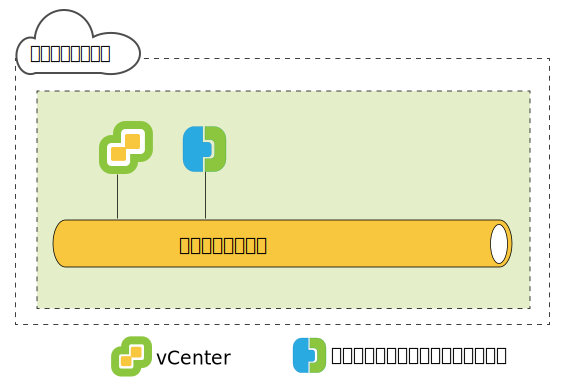
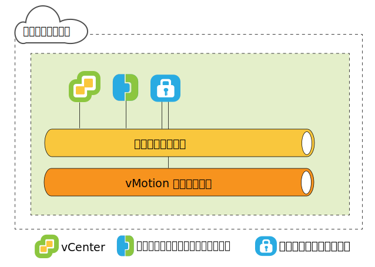
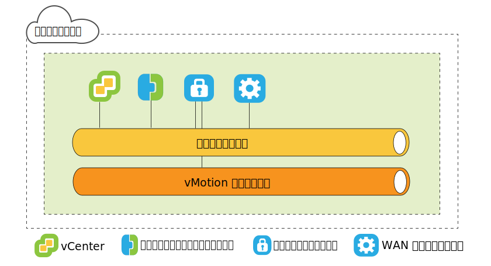
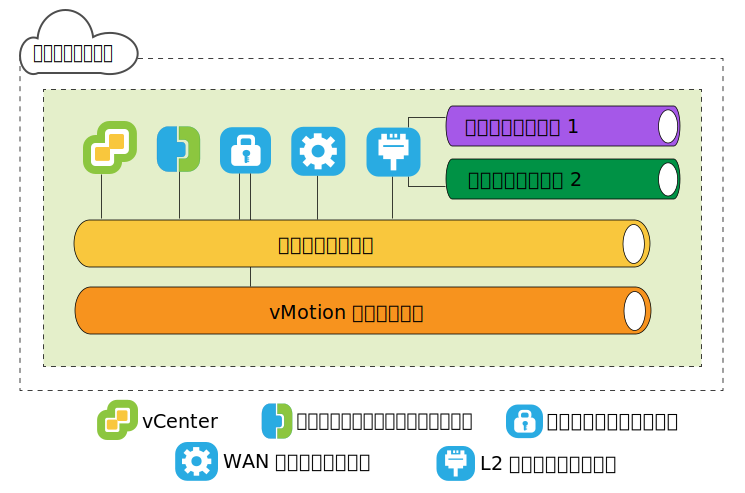
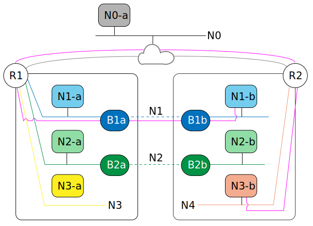

---

copyright:

  years:  2016, 2019

lastupdated: "2019-05-06"

subcollection: vmware-solutions

---

{:tip: .tip}
{:note: .note}
{:important: .important}

# VMware HCX on IBM Cloud のソース側アーキテクチャー
{: #hcx-archi-source}

このセクションでは、ソース環境にデプロイされる各 HCX コンポーネントのアーキテクチャーについて説明します。

## HCX の概要
{: #hcx-archi-source-intro-hcx}

HCX テクノロジーは、vSphere vCenter ネットワークを IBM Cloud VCS プラットフォームにシームレスに統合します。 ハイブリッド・ネットワーキングにより、オンプレミスの vSphere vCenter ネットワークを IBM Cloud に拡張し、双方向の仮想マシン (VM) モビリティーをサポートします。

この概要説明では、実行可能なタスクと、マイグレーションおよびネットワーク拡張をサポートおよび強化する機能についてまとめます。

* HCX は、ソースと宛先で暗号化/復号のプロセスを取ることで、セキュリティーを一貫して確保し、仮想マシンのマイグレーションやネットワークの拡張などのハイブリッド・ワークフローの受け入れを許可します。
* HCX は、拡張ネットワークのパフォーマンスを高めるために、最適化されたソフトウェア定義の WAN を構築し、LAN の速度に迫るパフォーマンスを実現します。
* HCX はまた、双方向ワークロードおよび VMware NSX セキュリティー・ポリシーの IBM Cloud ネットワーク・サービスへのマイグレーションを可能にします。
* HCX は vSphere vCenter と統合され、vSphere Web Client から管理されます。

## レイヤー 2 のネットワーク拡張
{: #hcx-archi-source-layer-2-ext}

* vCenter のネットワークを IBM Cloud まで安全に拡張します。
* HCX では、高スループットのレイヤー 2 コンセントレーター (HT L2C) が提供されます。
* 拡張されたネットワークは、IBM Cloud の NSX Edge アプライアンスに接続されます。
* スケーラビリティーとスループットの向上のために、標準のレイヤー 2 コンセントレーターを複数台デプロイできます。
* 拡張されたレイヤー 2 を使用してクラウド・ゲートウェイ経由で仮想マシンをマイグレーションすることで、仮想マシンの IP アドレスと MAC アドレスを保持できます。

## 仮想マシンのマイグレーション方式
{: #hcx-archi-source-vm-mig-methods}

### 最小ダウン時間マイグレーション
{: #hcx-archi-source-low-downtime-mig}

最小ダウン時間マイグレーションは、vSphere Replication を使用するマイグレーションです。vSphere Replication は、VMware ESX/ESXi ハイパーバイザーに実装されている分散テクノロジーです。 HCX は、稼働中の仮想マシンのレプリカを作成し、そのレプリカを IBM Cloud に移行し、切り替えを実行して、ソース仮想マシンを電源オフに、マイグレーションした仮想マシンを電源オンにします。
* このマイグレーション・パスは、必ずクラウド・ゲートウェイを経由します。 転送には、インターネット、レイヤー 2 拡張ネットワーク、または専用接続回線を使用できます。
* 仮想マシンのマイグレーションは、双方向に何度でも実行できます。

### vMotion マイグレーション
{: #hcx-archi-source-vmotion-mig}

vMotion マイグレーションでは、IBM Cloud まで拡張されたネットワークで vMotion を使用することで、稼働中の仮想マシンを転送できます。 vMotion マイグレーションは、ゼロ・ダウン時間マイグレーションまたはクラウド間 vMotion とも呼ばれます。

### コールド・マイグレーション
{: #hcx-archi-source-cold-mig}

拡張されたネットワークを介して、電源オフの状態の仮想マシンを IBM Cloud に転送します。

### 共通の機能
{: #hcx-archi-source-common-feat}

* オプションのソフトウェア定義 WAN の最適化機能をインストールすると、マイグレーションのスループットおよび速度が向上します。
* 指定した時刻にマイグレーションするようにスケジュールを設定できます。
* マイグレーション後も、仮想マシンのホスト名、仮想マシン名、あるいはその両方を保持できます。

## ネットワーキング機能
{: #hcx-archi-source-net-feat}

クラウド・ゲートウェイおよびレイヤー 2 コンセントレーターには、以下のネットワーキング機能が組み込まれています。

* インテリジェント・フロー・ルーティング - インターネット・パスに基づいて最適な接続を自動的に選択し、可能な限り速くワークロードを転送するために接続全体を使用して効率的に大量のデータを流します。 バックアップやレプリケーションなどの大量のフローのために CPU 競合が発生した場合は、少量のフローを比較的にビジーでない CPU にルーティングして、双方向トラフィックのパフォーマンスを高めます。
* 近接ルーティング - 拡張されたルーティング・ネットワークに接続された仮想マシン間の転送が、オンプレミスとクラウドで対称的に行われるようにします。
* セキュリティー - クラウド・ゲートウェイは、Suite B 準拠の AES-GCM および IKEv2、AES-NI オフロード、フロー・ベース・アドミッション制御を備えています。 HCX は、ソースと宛先で暗号化/復号のプロセスを取ることで、セキュリティーを一貫して確保し、仮想マシンのマイグレーションやネットワークの拡張などのハイブリッド・ワークフローの受け入れを許可します。
  オンプレミスの vCenter で定義して仮想マシンに割り当てていたセキュリティー・ポリシーを、仮想マシンと一緒にマイグレーションできます。

## HCX について
{: #hcx-archi-source-understand-hcx}

HCX では、オンプレミスの vCenter と IBM Cloud の間に多対多の関係を設定できます。 リンク・モードの vCenter Server がサポートされます。 このトピックでは、インストーラーがどのようにしてオンプレミスのデータ・センターと IBM Cloud の両方と対話するかについて大まかに説明します。

インストール中には、HCX Manager 仮想アプライアンスがインポートされ、オンプレミス vCenter のプラグインとして構成されます。 その後は、このプラグインを使用して、ソフトウェア定義 WAN サービスのデプロイメントを構成します。 自動で行われる構成により、各ハイブリッド・サービス・アプライアンスがオンプレミス vCenter 内に仮想マシンとしてプロビジョンされ、対応する仮想マシンが IBM Cloud にデプロイされます。

デプロイメントを成功させるには、以下が必要です。
* 仮想アプライアンスに使用できるリソースが十分にあること。
* ローカルとリモートの両方に存在する仮想アプライアンスや他の VM と通信できるようにネットワークを設定しておくこと。

## デプロイメントの概要
{: #hcx-archi-source-deployment-ovw}

最初にインストールする HCX Manager 仮想マシンによって、それ以外のサービス仮想マシン・アプライアンスのオンプレミスおよびクラウドへのインストールが行われます。

基本的なインストール・タスクを次にまとめます。
1. Hybrid Cloud Enterprise 仮想アプライアンスの OVA ファイルを入手します。
2. vSphere Web Client で、HCX Manager サービス仮想アプライアンスを、IBM Cloud に接続したオンプレミス vCenter にインストールします。
3. vSphere Web Client で、HCX プラグインに IBM Cloud エンドポイントを登録します。 この登録により、オンプレミスの HCX と IBM Cloud 上の HCX インスタンスの間に 1 対 1 の関係が確立されます。
4. 各サービス仮想アプライアンスをインストールして構成します。
5. オンプレミスにアプライアンスをインストールするたびに、インストーラーによって、対応するサービス仮想アプライアンスがターゲットの IBM Cloud にプロビジョンされます。
6. インストール後は、HCX Manager が、ローカルとリモートの両方のサービス仮想アプライアンスを制御します。 IBM Cloud では、HCX は、プロビジョンされたソフトウェア定義 WAN のコンポーネントをサービスとして管理します。

### デプロイメント・コンポーネントのパフォーマンスに関する考慮事項
{: #hcx-archi-source-perf-consid}

アーキテクチャーの計画では、マイグレーションする VM、仮想マシン・トラフィックに使用するネットワーク、拡張するネットワークなどを計画します。 このトピックでは、いくつかのデプロイメント・コンポーネントの最大値と最小値についてまとめます。
* vSphere vCenter。 ハイブリッド・サービスを必要とする vCenter に HCX Manager アプライアンスをインストールする必要があります。 HCX は、vCenter ごとに 1 つしかデプロイできません。 この制限はリンク・モードに適用され、HCX 管理アプライアンスはプライマリー vCenter にのみインストールされます。 HCX は、リンク・モードの登録済み vCenter を最大 5 つまでサポートします。
* クラウドの登録。 クラウド・エンドポイントの最大数は 10 です。 エンドポイントの数を確認するために、ハイブリッド・クラウド・サービスはクラウドへの vCenter 接続を監視します。

### マイグレーションとネットワーク拡張の最大数。
{: #hcx-archi-source-max-mig-net-extension}

* 最小ダウン時間マイグレーション・タスクの同時実行の最大数 - 15
* L2C 拡張タスクの同時実行の最大数 - 1
* vMotion マイグレーション・タスクの同時実行の最大数 - 1

### HCX Management Enterprise
{: #hcx-archi-source-hcxme}

HCX Management Enterprise の OVA は、ソース環境にデプロイされ、ソース vSphere インフラストラクチャーを管理する vCenter Server のプラグインとして登録されます。 その後は、このプラグインを使用して、クラウド間マイグレーションと L2 ネットワーク拡張を可能にするために必要なマイグレーション・サービスとネットワーク・サービスを構成します。

HCX は、vCenter ごとに 1 つしかデプロイできません。 この制限はリンク・モードに適用され、HCX Manager アプライアンスはプライマリー vCenter にのみインストールされます。 HCX Manager は、リンク・モードの登録済み vCenter を最大 5 つまでサポートします。
{:note}

### HCX 仮想アプライアンス
{: #hcx-archi-source-hcxva}

インストール・パッケージは、ハイブリッド・クラウド・サービス・プラグインが入っている OVA ファイルです。 インストールして構成した後、このハイブリッド・クラウド・サービス管理アプライアンスを使用して、次の各サービス・アプライアンス仮想マシンを構成します。
* HCX Manager
* ハイブリッド・クラウド・ゲートウェイ
* レイヤー 2 コンセントレーター
* WAN 最適化プログラム

### HCX Manager
{: #hcx-archi-source-hcxm}

HCX Manager プラグインはオンプレミスにのみデプロイされます。 このプラグインは、SD-WAN 用のサービス仮想アプライアンスを管理します。 HCX Manager 仮想アプライアンスは、ソース vCenter の拡張機能であり、仮想マシンとしてデプロイされます。 このアプライアンスのファイル構造に、すべてのハイブリッド・サービス仮想アプライアンスが入っています。 HCX Manager が、オンプレミスとクラウドの両方で、クラウド・ゲートウェイ、レイヤー 2 コンセントレーター、および WAN 最適化のための仮想アプライアンスのデプロイメントと構成をすべて管理します。

この仮想アプライアンスをインストールするハード・ディスクは、シン・プロビジョニングでもシック・プロビジョニングでもかまいません。 デフォルトでは、このサービス仮想アプライアンスのハード・ディスクはシン・プロビジョニングされます。

このサービス仮想アプライアンスを構成してデプロイしたら、その仮想マシンにログインしてハイブリッド・クラウド・サービスの管理ポータルを使用できます。

### HCX クラウド・ゲートウェイ
{: #hcx-archi-source-hcg}

HCX クラウド・ゲートウェイは、vSphere と IBM Cloud の間にセキュアなチャネルを確立して維持します。

HCX は、IBM Cloud へのサイト間接続を開始する際に強い暗号化を使用します。 vSphere と IBM Cloud の間のセキュアなチャネルにより、テナント非対応の vSphere プロトコルでマルチテナンシーが実現し、「ミドル・マイル」というネットワーキングのセキュリティー上の問題を防止できます。

双方向マイグレーションを行うために、クラウド・ゲートウェイには vSphere Replication テクノロジーも組み込まれています。

### WAN 最適化プログラム
{: #hcx-archi-source-wan-opt}

HCX は、ソフトウェア定義 WAN の最適化機能も備えています。 WAN 最適化アプライアンスは、WAN の調整を行って遅延の影響を軽減するコンポーネントであり、使用することを強くお勧めします。 また、これにはパケット・ロスのシナリオを回避するための Forward Error Correction と、冗長トラフィック・パターンの重複排除も組み込まれています。 これらによって、帯域幅の使用量が減るので、使用可能なネットワーク容量を最大限に利用して、IBM Cloud との間のデータ転送を高速化できます。

仮想マシンのマイグレーションでオンプレミス vSphere と IBM Cloud の間に類い希なるモビリティーを実現できるのは、クラウド・ゲートウェイと WAN 最適化アプライアンスの両方によるものです。

### レイヤー 2 コンセントレーター
{: #hcx-archi-source-layer-2-conc}

ネットワーク拡張サービスは、レイヤー 2 コンセントレーター (L2C) によって提供されます。 これは、オンプレミスの vSphere データ・センターのレイヤー 2 ネットワークを IBM Cloud まで拡張し、データ・センターとクラウドの間のシームレスなマイグレーションを可能にします。 レイヤー 2 コンセントレーターは、オンプレミスのネットワークを IBM まで拡張するために必要になります。

レイヤー 2 コンセントレーター・アプライアンスは、以下の 2 つのインターフェースを備えています。
* 内部トランク・インターフェース: IBM Cloud 側の拡張ネットワークとの対応付けを行う変換ブリッジ・マッピングを使用して、オンプレミスで拡張ネットワークの仮想マシン・トラフィックを処理します。
* アップリンク・インターフェース: HCX はこのインターフェースを使用して、カプセル化したオーバーレイ・トラフィックを IBM Cloud との間で送信します。 アプリケーション・データは、このインターフェースを介して伝送されます。

### マイグレーションのみ
{: #hcx-archi-source-mig-only}

マイグレーションのみを行う最小構成では、必要なものは HCX Manager とクラウド・ゲートウェイ・アプライアンスです。 ネットワーク拡張を行わなくても仮想マシンはマイグレーションできます。 この場合、仮想マシンは、マイグレーションされた後にゲスト・カスタマイズ・サービスを使用して新しい IP アドレスを取得します。

ネットワーク拡張を行って元の IP アドレスを維持するためには、オンプレミスの vSphere vCenter に分散仮想スイッチが構成されている必要があります。

WAN 最適化機能を使用すれば、この状況で速度を向上させることができます。高速回線 (専用接続回線など) を使用するようにクラウド・ゲートウェイを構成し、WAN 最適化トラフィック用に高帯域幅リンクを用意すれば、速度が向上します。

拡張ネットワークを使用して仮想マシンを IBM Cloud にマイグレーションすることには、ダウン時間が短縮されるほか、仮想マシンの構成が変更されないという大きなメリットがあります。 仮想マシンの IP アドレス、MAC アドレス、コンピューター名、および仮想マシン名を維持できます。 これらの属性を維持できれば、IBM Cloud へのマイグレーションが大幅にシンプルになり、オンプレミスのデータ・センターに戻すことも簡単になります。 ネットワーク拡張機能を使用するには、vSphere Enterprise Plus Edition で提供される vSphere 分散スイッチが必要です。

### IP アドレス要件
{: #hcx-archi-source-ip-req}

HCX をデプロイするためには、オンプレミスとターゲット IBM Cloud の両方に適切な数の IP アドレスを用意する必要があります。

* vMotion アドレス
  オンプレミスのデータ・センターでは、vMotion 用に専用のネットワークを用意することが一般的です。 その vMotion ネットワークにクラウド・ゲートウェイからアクセスできなければなりません。 アクセスできない場合、vMotion ネットワークと通信するための追加の IP アドレスが必要になります。

* オンプレミス
  * HCX Manager アプライアンス用に IP アドレス 1 つ。
  * 各クラウド・ゲートウェイ用に 1 つずつ。vMotion 専用のネットワークがある場合はさらに 1 つ追加します。
  * 各標準レイヤー 2 コンセントレーター用に 1 つずつ。

* IBM Cloud
  * IBM Cloud に接続する HCX Manager アプライアンス 1 つにつき 2 つの IP アドレス。 これらのアドレスを使用して、インターネットまたは 1 つ以上の専用接続回線に接続できます。
  * vMotion 専用のネットワーク接続がある場合はさらに 1 つ追加します。

### 近接ルーティング機能
{: #hcx-archi-source-prox-routing-feat}

近接ルーティングは、クラウド・ゲートウェイの構成時に有効にできるネットワーキング機能です。

近接ルーティングは、拡張されたルーティング・ネットワークに接続された仮想マシン間の転送が、オンプレミスとクラウドで対称的に行われるようにします。 この機能を使用するには、オンプレミスとクラウドの間に動的ルーティングを構成する必要があります。

ユーザーがネットワークをクラウドまで拡張すると、レイヤー 2 接続が IBM Cloud まで拡張されます。 しかし、ルート最適化がない場合、レイヤー 3 通信要求は、ルーティングを受けるためにオンプレミスのネットワーク起点に戻されます。 このように往復することを「トロンボーン現象」または「ヘアピン現象」と呼びます。

ソースと宛先の仮想マシンが両方ともクラウドに存在する場合でも、ネットワーク起点とクラウドの間をパケットが往復するので、トロンボーン現象は非効率的です。 非効率であるだけでなく、接続の両側を認識しなければならないステートフル・ファイアウォールなどのインライン装置が転送パスに含まれていると、通信できない可能性があります。 クラウドを出る送信パスが拡張レイヤー 2 ネットワークと VCS NSX Edge Gateway のどちらも経由できる場合は、ルート最適化がないと仮想マシンの通信は失敗します。 オンプレミスのネットワークは、拡張されたネットワークに「近道」があることを認識しません。 この問題は、非対称ルーティングと呼ばれます。 この問題の解決策は、オンプレミス・ネットワークが IBM Cloud のルートを学習できるように近接ルーティングを有効にすることです。

トロンボーン現象を回避するために、HCX はインテリジェント・ルート管理を使用して、仮想マシンの状態に適切なルートを選択します。クラウド・ゲートウェイは、クラウド内の仮想マシンのインベントリーを管理します。 また、次のような仮想マシンの状態を認識します。
* vMotion でクラウドに転送された (ゼロ・ダウン時間マイグレーション)。
* ホスト・ベースのレプリケーションを使用してクラウドにマイグレーションされた (最小ダウン時間マイグレーション)。
* (拡張ネットワークを使用して) クラウドに作成された。

### 近接ルーティングを使用した非対称ルーティングの解決
{: #hcx-archi-source-asymm-routing}

この図の左側の `N*a` コンポーネントはオンプレミスのデータ・センターに存在し、右側の `N*b` コンポーネントはクラウドに存在します。

R1 が N1-b のデフォルト・ゲートウェイであるため、N1-b は、R1 に戻ってから R2 を介してトラフィックをルーティングする必要があります。 非対称ルーティングを回避するために、HCX はホスト・ルートを IBM Cloud VCS デプロイメントの NSX オーバーレイに追加します。仮想マシンをクラウド内に新規作成した場合、または、最小ダウン時間マイグレーションで移行した場合は、ただちにホスト・ルートが追加されます。

仮想マシンが vMotion を使用して転送された場合は、仮想マシンがリブートされるまでルートは追加されません。 リブートまで待つことで、仮想マシンがリブートされるまでオンプレミスのステートフル・デバイスが既存のセッションの処理を継続できるようにしています。 リブート後には、オンプレミスとクラウドの両方のルーティング情報が統一されます。

つまり、R1 は、ローカルに接続されている拡張ネットワークを使用せずに、R2 を経由して特定の仮想マシンに到達するルーティングを使用できます。 近接ルーティングを有効にすると、R2 は、仮想マシンに到達するための他のネットワークのパスを完全に取得します。

### MAC アドレスの保持
{: #hcx-archi-source-mac-addr-ret}

* マイグレーション・ウィザードのチェック・ボックスの 1 つに、MAC アドレスを保持するためのオプションがあります。 これは、レプリケーション・ベースのマイグレーションでのみ表示されます。
* デフォルトでは、**「MAC の保持 (Retain MAC)」**は、ソース仮想マシンが拡張ネットワーク内にある場合は有効になり、ネットワークが拡張されていない場合は無効になります。 MAC アドレスが保持されないと、マイグレーションの実行時に仮想マシンは新しいアドレスを取得します。 MAC アドレスを保持するか、それとも新規アドレスを取得するかを決定することは、マイグレーション・プロセスとマイグレーション後のネットワーク・トラフィック・フローに影響を与えます。
* 次のような理由により、MAC アドレスの保持が必要になります。
  * MAC アドレスに基づくライセンス: ソフトウェアによっては、ライセンスを VM の MAC アドレスに結び付けているものがあります。 この場合、仮想マシンの MAC アドレスを変更すると、ライセンスが無効になります。
  * Linux の NIC 順序: Linux の場合、仮想マシンの MAC アドレスが変更されると、リブート後に NIC のイーサネット・デバイス番号が変更されることがあります。 デバイス番号の変更により、オペレーティング・システム内の NIC の表示順序が変更され、NIC 順序に依存するアプリケーションやスクリプトが機能しなくなることがあります。
  * 拡張ネットワークではダウン時間が短縮される: 拡張ネットワークで仮想マシンをマイグレーションする場合は、**「MAC の保持 (Retain MAC)」**を有効にすると、ネットワークが新規 MAC アドレスを学習する必要がないので、ダウン時間が最小化されます。
  * このチェック・ボックスは、マイグレーション操作中に「宛先ネットワークの選択 (Select destination network)」ページに表示されます。

### セキュリティー・ポリシーのマイグレーション
{: #hcx-archi-source-sec-policy-mig}

ポリシー・マイグレーション機能により、オンプレミス vCenter の NSX 分散ファイアウォール・ルールを VCS HCX 対応クラウドに移行できます。 ポリシーのマイグレーションは、高スループットのレイヤー 2 コンセントレーターで拡張したネットワークを介して、最小ダウン時間マイグレーションまたは vMotion を使用して仮想マシンを移行する場合に実行できます。
* オンプレミスのデータ・センターで NSX 6.2.2 以降が実行されている必要があります。
* vSphere では、セキュリティー・ポリシーは、さまざまなルールを定義できる単一の NSX セクションです。 セクション (ポリシー) は組織の vDC ごとに 1 つしか設定できません。
* ポリシーに参加する IP アドレスまたは MAC アドレスのセットを指定できます。 MAC セットまたは IP セットの名前は 218 文字以内でなければなりません。
* セクション内のすべてのルールに固有の名前が必要です。 ルール名を空白のままにしないでください。
サポートされるルールでは、ソースまたは宛先としてレイヤー 3 の IP アドレスまたは IP セット、またはレイヤー 2 の MAC アドレスまたは MAC セットを指定します。

ソースまたは宛先のセキュリティー・グループまたはアプリケーション・グループを指定したルールはマイグレーションされません。
{:note}

マイグレーションしたポリシーを変更すると、そのポリシーを使用するすべての VM に変更が伝搬されます。

## 関連リンク
{: #hcx-archi-source-related}

* [ソースでのインストールおよび構成](/docs/services/vmwaresolutions/archiref/hcx-archi?topic=vmware-solutions-hcx-archi-install-cfg-src)
