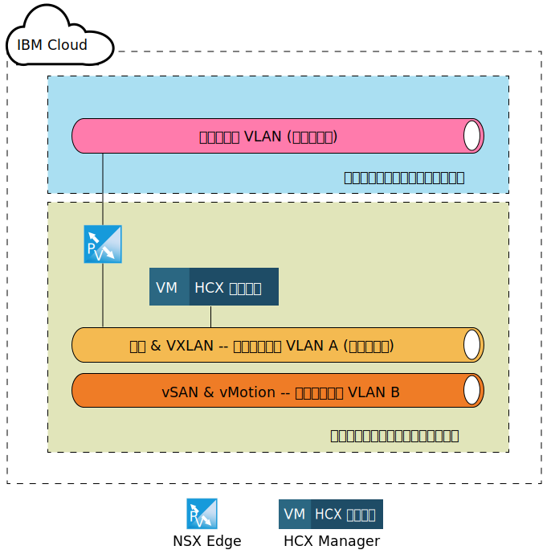
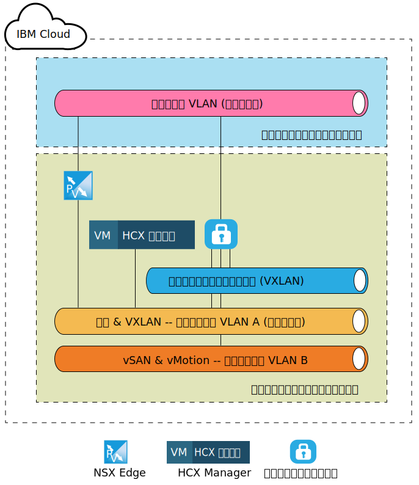
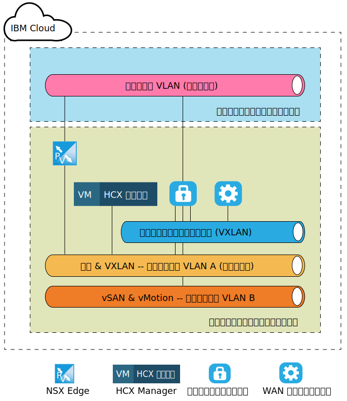
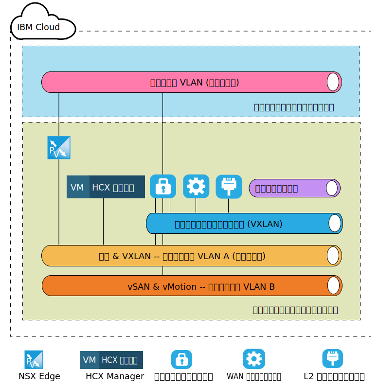

---

copyright:

  years:  2016, 2019

lastupdated: "2019-05-06"

subcollection: vmware-solutions

---
# VMware HCX on IBM Cloud のコンポーネント・レベルのターゲット・アーキテクチャー
{: #hcx-archi-target}

このセクションでは、IBM Cloud 環境にデプロイされる各 HCX コンポーネントのアーキテクチャーについて説明します。 IBM Cloud 内のスポーク (ターゲット) デプロイメント・モデルについて説明します。

## NSX Edge
{: #hcx-archi-target-nsx-edge}

IBM Cloud 内に最初に構成されるコンポーネントは、NSX Edge 仮想マシンのペアです。 すべての IBM Cloud for VMware Solutions デプロイメントで、IBM CloudDriver アウトバウンド通信用にエッジ・デバイスがインストールされ、構成されることは留意すべき重要な点です。 しかし、その ESG をハイブリッド・クラウド・サービス通信に再使用することも可能ですが、新しいペアをデプロイすることをお勧めします。

これらの NSX Edge 仮想マシンは、アクティブ/パッシブ型の X-Large NSX Edge デバイスのペアとして構成されます。 これらのデバイスは、公衆インターネット接続を使用して IBM Cloud VMware 環境に接続するために使用されます。 内部環境用に X-Large NSX Edge が選択された理由は、必ずしも高スループットを必要としない何百万もの並行セッションを処理するロード・バランサーを持つ環境に適しているためです。 構成プロセスの中で、NSX Edge は IBM Cloud パブリック VLAN と、管理インフラストラクチャー用として指定された IBM Cloud プライベート VLAN とに接続されます。

表 1. NSX Edge のデプロイメント

| コンポーネント | 構成 |
|-----------|---------------|
| CPU       | 6 vCPU        |
| RAM       | 8 GB          |
| ディスク      | スワップ 4 GB を搭載した共有ストレージ上の 4.5 GB VMDK |

NSX Edge は、内部デプロイメントまたは専用デプロイメントでアクティブ/パッシブとして構成されるので、ピア・アプライアンスと同じホストでは NSX Edge を実行しないようにする vSphere Distributed Resource Scheduler (DRS) アンチアフィニティー・ルールをユーザーが作成する必要があります。

表 2. NSX Edge のアンチアフィニティー・ルール

| フィールド     | 値         |
|-----------|---------------|
| 名前      | NSX Edge 外部ゲートウェイ |
| タイプ      | 仮想マシンの分割 |
| メンバー   | NSX Edge 1 |
|           | NSX Edge 2 |

VMware HCX on IBM Cloud サービスを注文すると、これらの NSX Edge アプライアンスが IBM Cloud 内にデプロイされるのに加えて、HCX Manager 仮想アプライアンスがデプロイされます。 このアプライアンスのデプロイ後に、NSX Edge はロード・バランシングを使用できるようになり、また、ソースからのインバウンド接続に証明書を使用するアプリケーション・プロファイルが構成されます。 さらに、HCX Manager、vCenter、および PSC アプライアンスを指すロード・バランシング・プールも構成されます。 これに加えて、プールと仮想 IP アドレス (VIP) を関連付けるルールを用いて、パブリック・インターフェース上の VIP を使用して仮想サーバーが作成されます。 NSX Edge 上の仮想サーバー構成とプール構成の例を以下の表に示します。

表 3. NSX Edge の VIP 構成 - 仮想サーバー

| フィールド     | 値         |
|-----------|---------------|
| 仮想サーバー ID (Virtual Server ID) | virtualServer-1 |
| 名前 | HCX-VIP |
| 説明 | LB-VIP |
| デフォルト・プール | pool-1 |
| IP アドレス | 254 |
| プロトコル | https |
| ポート | 443 |

表 4. NSX Edge の VIP 構成 - 仮想サーバー詳細

| フィールド     | 値         |
|-----------|---------------|
| 説明 | LB-VIP |
| 接続制限 | 0 |
| サービス挿入状況 (Service Insertion Status) | 無効 |
| アプリケーション・プロファイル (Application Profile ) | applicationProfile-1 |
| 接続レート制限 (Connection Rate Limit) | 0 |
| 加速状況 (Acceleration Status) | 無効 |
| サービス・プロファイル状況 (Service Profile Status) |  |

表 5. NSX Edge の VIP 構成 - ルール

| フィールド     | 値         |
|-----------|---------------|
| ルール ID (Rule Id) | applicationRule-1 |
| 名前 | appRule1 |
| Script (スクリプト) | acl isHibridity url_beg /hibridity     acl isWebSso url_beg /websso     acl isVCenter url_beg /vsphere-client     use_backend nspPool001 if isHybridity     use_backend vcPool001 if isVCenter     use_backend ssoPool001 if isWebSso |

表 6. NSX Edge のプール構成 - プール・サマリー

| プール ID | 名前       | アルゴリズム   | モニター ID |
|---------|------------|-------------|------------|
| pool-1  | nspPool001 | ROUND-ROBIN |            |
| pool-3  | ssoPool001 | ROUND-ROBIN |            |
| pool-2  | vcPool001  | ROUND-ROBIN |            |

表 7. NSX Edge のプール構成 - プール詳細

| フィールド           | 値     |
|-----------------|-----------|
| 説明     |           |
| 透過 (Transparent)     | 無効  |
| 名前            | HCX-CLOUD |
| 重み (Weight)          | 1         |
| モニター・ポート (Monitor Port)    | 8443      |
| 最大接続数 (Max Connections) | 0         |
| 最小接続数 (Min Connections) | 0         |

## HCX Manager
{: #hcx-archi-target-hcxm}

HCX Manager コンポーネントは、NSX Edge アプライアンスがターゲット上に構成された後、最初にデプロイされるアプライアンスです。 このアプライアンスは、クラウド環境へのメイン・インターフェースとしてソースの各コンポーネントで使用されます。HCX Manager に装備された抽象的なネットワーキング・ユーザー・インターフェースにより、NSX を直接使用することなくネットワークの追加/編集/削除およびルーティングの設計/構成を行うことができます。 vCenter と NSX が統合されるので、HCX Manager アプライアンスには管理 VLAN 上のポータブルなプライベート IP アドレスが割り当てられます。

また、HCX Manager は、特定のユーザーで vCenter と NSX にアクセスするように構成されます。 HCX Manager の IP アドレスは、NSX Edge でロード・バランシングのために使用される IP アドレスと同じであることに注意してください。

HCX Manager クラウド・コンポーネントがデプロイされて構成されると、ソースの各コンポーネントは、NSX ESG に構成されている VIP アドレスを用いて HCX Manager への接続を作成します。 この接続が作成されると、クラウド・ゲートウェイと WAN 最適化プログラムのアプライアンスが IBM Cloud 内にデプロイされます。

## クラウド・ゲートウェイ
{: #hcx-archi-target-cloud-gateway}

ソースからターゲット・クラウドへの接続が確立されると、仮想アプライアンスが 1 つデプロイされます。 このアプライアンスが、クラウド・ゲートウェイ (CGW) です。これは、ソースとして指定された vSphere 環境と IBM Cloud の間にセキュアなチャネルを維持するために使用されます。 IBM Cloud 内にデプロイされる CGW アプライアンスのサイズ仕様を「表 8. クラウド・ゲートウェイのデプロイメント」にリストします。

表 8. クラウド・ゲートウェイのデプロイメント

| コンポーネント | 構成 |
|-----------|---------------|
| CPU       | 8 vCPU        |
| RAM       | 3 GB          |
| ディスク      | 共有ストレージ上の 2.0 GB VMDK |

このクラウド・ゲートウェイは、IBM Cloud for VMware Solutions デプロイメントの管理 VLAN (プライベート・ポータブル・サブネット) にも vMotion VLAN (プライベート・ポータブル・サブネット) にも存在するようにデプロイされて構成されます。 また、公衆インターネット経由の接続用に、パブリック VLAN (パブリック・ポータブル) にもインターフェースが 1 つ構成されます。 専用接続が存在する (プライベート接続が設定されている) 場合は、パブリック・アクセスは不要です。 クラウド・ゲートウェイに最後に関連付けられる接続は、サイトのペアリング時に作成されて構成される論理スイッチです。

この論理スイッチは、ルーティング不可のプライベート・ネットワークであり、4.1.4 の WAN (未定) で説明する WAN 最適化プログラムとクラウド・ゲートウェイの間の通信チャネルとして使用されます。

以下の図は、クラウド・ゲートウェイ・アプライアンスに割り当てられる接続を大まかに示したコンポーネント図です。

## WAN 最適化プログラム
{: #hcx-archi-target-wan-opt}

2 番目にデプロイされるコンポーネントは、WAN 最適化アプライアンスです。 WAN 最適化アプライアンスはオプションですが、WAN の調整を行って遅延の影響を軽減します。 また、これにはパケット・ロスのシナリオを回避するための Forward Error Correction と、冗長トラフィック・パターンの重複排除も組み込まれています。

これらによって、帯域幅の使用量が減るので、使用可能なネットワーク容量を最大限に利用して、IBM Cloud との間のデータ転送を高速化できます。 WAN 最適化プログラムはディスクを集中的に使用するので、問題なく機能させるためには十分な量の IOPS が必要になります。 そのため、WAN 最適化プログラムは、存在している場合は vSAN ストレージ、またはエンデュランス・ストレージ (IOPS は 2,000 より上) に置かれます。 WAN 最適化アプライアンスのサイズ仕様を以下の表に示します。

表 9. WAN 最適化プログラム・アプライアンスのサイズ

| コンポーネント | 構成 |
|-----------|---------------|
| CPU       | 8 vCPU        |
| RAM       | 14 GB          |
| ディスク      | 30 GB VMDK + 共有ストレージ上の 70 GB VMDK |

クラウド・ゲートウェイとは異なり、WAN 最適化アプライアンスが接続されるのは、クラウド・ゲートウェイとの通信を可能にするための論理スイッチのみです。 このアプライアンスは、ソース環境内で WAN 最適化機能を使用する場合に必要になります。 ネットワークの配置については以下の図を参照してください。

## レイヤー 2 コンセントレーター
{: #hcx-archi-target-layer-2-conc}

3 番目のコンポーネントは、レイヤー 2 コンセントレーター (L2C) と呼ばれ、ネットワーク拡張サービスの一部です。 L2C は、オンプレミスのデータ・センター・ネットワークを IBM Cloud まで拡張できるようにする仮想マシンです。 L2C は、オンプレミスの VLAN または VXLAN、あるいはその両方を拡張します。 L2C 1 つで最大 4096 個の VLAN を拡張できます。 各 L2C は、オンプレミスのパートナーとペアになり、「1 フロー」あたり最大 1 Gbps、および VLAN (または VXLAN) 1 つあたり合計で最大 4 Gbps を提供できます。 より高いネットワーク・スループットが必要な場合は、追加の L2C アプライアンスをデプロイできます。

この設計では、L2C アプライアンスをデプロイすると、公衆インターネットや Direct Link を介したプライベート・ネットワークを経由して複数の VLAN および VLXAN を IBM Cloud まで拡張できます。 IBM Cloud 上の L2C アプライアンスのサイズ仕様を以下の表に示します。

表 10. HT L2C アプライアンスのサイズ

| コンポーネント | 構成 |
|-----------|---------------|
| CPU       | 8 vCPU        |
| RAM       | 38 GB          |
| ディスク      | 共有ストレージ上に 2 GB VMDK |

L2C アプライアンスは、管理 VLAN にもパブリック VLAN にも存在するようにデプロイされます。 パブリック・インターフェースは、ソース側の拡張ネットワーク宛てのアプリケーション・トラフィックに使用されます。 ソースの管理者が IBM Cloud までネットワークを拡張したら、拡張ネットワークなどの多数の接続が作成されて L2C アプライアンスに接続されます。 このようなネットワークと接続の例を以下の図に示します。

## 関連リンク
{: #hcx-archi-target-related}

* [ソースでのインストールおよび構成](/docs/services/vmwaresolutions/archiref/hcx-archi?topic=vmware-solutions-hcx-archi-source)
