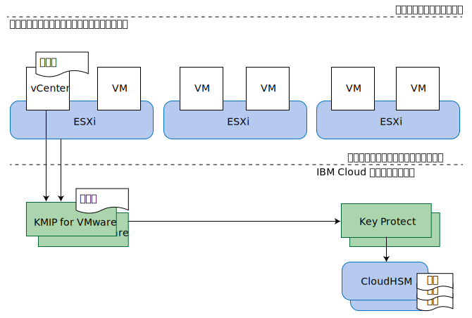

---

copyright:

  years:  2016, 2019

lastupdated: "2019-02-15"

---

{:tip: .tip}
{:note: .note}
{:important: .important}

# KMIP for VMware の設計
{: #kmip-design}

KMIP for VMware on {{site.data.keyword.cloud}} は、[IBM Key Protect](/docs/services/key-protect?topic=key-protect-getting-started-tutorial) を使用してルート鍵とデータ鍵を保存できる、VMware vSAN 暗号化および VMware vSphere 暗号化に対応した鍵管理サービスです。

## ストレージ暗号化オプション
{: #kmip-design-storage-options}

KMIP for VMware は、VMware の vSAN 暗号化および vSphere 暗号化の両方に対応しています。 どちらのソリューションもハイパーバイザー層で実施されますが、利用できる機能には若干の違いがあります。 各ソリューションの機能をご自分の要件と照らして評価してください。

### VMware vSAN 暗号化
{: #kmip-design-vsan-encrypt}

VMware vSAN 暗号化は、vSAN データ・ストアにのみ適用できます。 このソリューションでは、VMware vCenter と VMware ESXi ホストが、KMIP for VMware などの鍵管理サーバーに接続して暗号鍵を取得します。 それらの鍵を使用して、vSAN データ・ストアに使用されている個々のディスク・ドライブ (キャッシュ・ディスクと容量ディスクの両方を含む) を保護します。 vSAN 暗号化は、vSAN の圧縮と重複排除という利点を保持する形で実施されます。

vSAN 暗号化はデータ・ストアのレベルで行われるので、主な目的は、物理ディスク・ドライブが失われた場合のデータ漏えいを防ぐことです。 また、vSAN 暗号化は、あらゆる仮想マシンバックアップ・レプリケーション・テクノロジーと一緒に使用できます。例えば、vSphere Replication、vCenter 間 vMotion、VMware HCX、Zerto、Veeam、 IBM Spectrum Protect Plus などのテクノロジーがあります。

**注**:
* vSAN 暗号化では、クラスター内のホスト間で行われる vSAN レプリケーションの通信は暗号化されません。
* vSAN 暗号化は、{{site.data.keyword.cloud_notm}} エンデュランスのファイル・ストレージやブロック・ストレージなどの他のストレージ・ソリューションには適用できません。
* vSAN 暗号化には vSAN Enterprise ライセンスが必要です。
* vSAN ヘルス・チェックを実行する時に、1 つ以上の vSphere ホストから KMS クラスターに接続できないという警告が周期的に出されることがあります。こうした警告が出されるのは、vSAN ヘルス・チェックの接続が短時間でタイムアウトになる場合です。このような警告は無視してかまいません。

### vSphere 暗号化
{: #kmip-design-vsphere-encrypt}

VMware vSphere 暗号化は、vSAN ストレージ、{{site.data.keyword.cloud_notm}} エンデュランスのファイル・ストレージやブロック・ストレージを含め、すべてのタイプの VMware ストレージに適用されます。

このソリューションでは、vCenter Server と ESXi ホストが、KMIP for VMware などの鍵管理サーバーに接続して暗号鍵を取得します。 それらの鍵を使用して、個々の仮想マシン (VM) ディスクを VM ストレージ・ポリシーに従って保護します。

vSphere 暗号化は仮想マシン・ディスクのレベルで行われるので、物理ディスク・ドライブと VM ディスクのどちらが失われた場合でもデータ漏えいを防ぐことができます。 多くのバックアップ・レプリケーション・テクノロジーでは、提供されるデータが暗号化されているためにバックアップとレプリケーションが有効に機能しません。

そのため vSphere 暗号化は、vSphere Replication、cross-vCenter vMotion、VMware HCX、Zerto、IBM Spectrum Protect Plus と一緒に使用できません。 しかし、Veeam Backup and Replication は、適切に構成されていれば、vSphere 暗号化と一緒に使用できます。

### その他の考慮事項
{: #kmip-design-considerations}

vSphere クラスター内でどちらかのタイプの暗号化を有効にすると、VMware は追加の鍵を作成して ESXi コア・ダンプを暗号化します。これらのダンプには鍵管理の資格情報、暗号鍵、復号データなどの機密データが含まれている可能性があるからです。 [vSphere 仮想マシンの暗号化とコア・ダンプ](https://docs.vmware.com/en/VMware-vSphere/6.5/com.vmware.vsphere.security.doc/GUID-63728E8B-810D-418B-B1AA-6A0A2F92AABE.html)について理解しておく必要があります。

vSAN 暗号化または vSphere 暗号化に KMIP for VMware を使用する場合は、複数の鍵保護層が存在します。

鍵をローテーションする場合は、鍵をローテーションできるレベルに関する以下の情報を確認してください。
* すべての VMware 鍵はカスタマー・ルート鍵 (CRK) によって保護されます。 鍵のローテーションは、KMIP for VMware インスタンスに関連付けられている IBM Key Protect インスタンスで行えます。
* KMIP for VMware は、生成して VMware に配布した鍵を、CRK を使用して保護します。 VMware では、このような鍵は「鍵暗号化鍵」(KEK) と見なされます。
  * vSphere 暗号化を使用する場合は、PowerShell コマンド **Set-VMEncryptionKey** を使用して鍵をローテーションできます。
  * vSAN 暗号化を使用する場合は、vSAN ユーザー・インターフェースで鍵をローテーションできます。
* VMware は、それらの KEK を使用して、ディスク・ドライブや VM ディスクの暗号化に使用する実際の鍵を保護します。 これらの鍵をローテーションするには、VMware で「深い」鍵更新と呼ばれる操作を使用します。 この操作は、すべての暗号化データを暗号化し直すので、長時間かかることがあります。
  * vSphere 暗号化を使用する場合は、PowerShell コマンド **Set-VMEncryptionKey** を使用して深い鍵更新を実行できます。
  * vSAN 暗号化を使用する場合は、vSAN ユーザー・インターフェースを使用して深い鍵更新を実行できます。

## KMIP for VMware
{: #kmip-design-kmip-for-vmware}

VMware の vSAN 暗号化および vSphere 暗号化は、多数の鍵管理サーバーに対応しています。 KMIP for VMware は、IBM が管理する鍵管理サービスです。このサービスでは、IBM Key Protect を使用して鍵を完全に管理できます。 Cloud Object Storage などの他の {{site.data.keyword.cloud_notm}} サービスも Key Protect と統合すれば、{{site.data.keyword.cloud_notm}} の鍵を一元的に管理できる場所になります。

### 鍵の中の鍵
{: #kmip-design-keys}

鍵管理システムは、一般的に、*エンベロープ暗号化*として知られる手法を使用して、鍵を他の鍵でラップまたは保護します。 このような鍵のことを、*ルート鍵*または*鍵暗号化鍵* (KEK) と呼びます。 鍵を利用するときには、その鍵に対応するルート鍵を使用して、鍵を復号またはアンラップします。 ルート鍵を破棄すれば、そのルート鍵で保護されているすべての鍵を効率的に無効化できます。 それらの鍵をルート鍵の近くに保管しておく必要はありません。 ルート鍵へのアクセスの制御が重要になります。

{{site.data.keyword.cloud_notm}} Key Protect は、*カスタマー・ルート鍵* (CRK) を使用して、このようなサービスを提供するものです。 Key Protect では、鍵の取り出しが不可能な {{site.data.keyword.cloud_notm}} Cloud HSM ハードウェアの中に CRK を排他的に保管します。 保管されたそれらの CRK が、KMIP for VMware で VMware インスタンス用に生成された暗号鍵などの他の暗号鍵をラップするために使用されます。

VMware の鍵にも、この同じ概念が実装されています。 KMIP for VMware が要求に応じて VMware に鍵を渡すと、VMware がその鍵を KEK として使用して、vSAN ディスク・ドライブまたは仮想マシン・ディスクの暗号化に最終的に使用される鍵をラップまたは暗号化します。 これらの最終的な鍵のことをデータ暗号化鍵 (DEK) と呼びます。

つまり、次の暗号化チェーンになります。
* IBM Key Protect 内に永久に保管されるカスタマー・ルート鍵 (CRK)。
* お客様のインスタンスにおいて KMIP for VMware で生成され、vCenter Server および ESXi ホストに渡される鍵暗号化鍵 (KEK)。
* VMware で生成され、vSAN ディスクまたは仮想マシン・ディスクと共に保管されるデータ暗号化鍵 (DEK)。

KMIP for VMware は、ラップされた形式の KEK を IBM Key Protect 内部に保管します。 KEK は CRK によって暗号手法で保護されるので、KEK を HSM 内部に保管する必要はありませんが、KEK を IBM Key Protect に保管すれば、その存在が可視化され、個々の鍵を失効させる必要が生じた場合には削除することができます。

### 認証と許可
{: #kmip-design-authentication}

ストレージ暗号化ソリューションは、VMware クラスター、KMIP for VMware インスタンス、Key Protect インスタンスという 3 つのコンポーネントで構成されています。

VMware vCenter と ESXi が KMIP for VMware インスタンスから認証を受けるときには、鍵管理サーバー (KMS) 接続の作成時に VMware vCenter にインストールした証明書または VMware vCenter で生成した証明書が使用されます。 そのパブリック証明書を KMIP for VMware にインストールしておくことで、接続を許可された vCenter クライアントを識別できます。 各クライアントに、その KMIP for VMware インスタンス内に保管されているすべての鍵へのアクセスが許可されます。

KMIP for VMware インスタンスは、Key Protect インスタンスへのアクセス権限を付与された {{site.data.keyword.cloud_notm}} Identity and Access Management (IAM) のサービス ID を使用することで、Key Protect インスタンスへのアクセスを許可されます。 このサービス ID には、少なくとも、Key Protect インスタンスに対するプラットフォームの Viewer アクセス権限とサービスの Manager アクセス権限が必要です。 KMIP for VMware は、Key Protect インスタンス内の任意のカスタマー・ルート鍵 (CRK) を使用し、VMware のために生成したすべての KEK を Key Protect インスタンスにラップ形式で保管します。

### トポロジー
{: #kmip-design-topology}

図 1. KMIP for VMware on {{site.data.keyword.cloud_notm}} のコンポーネント

KMIP for VMware は、多数の IBM Cloud マルチゾーン領域 (MZR) で提供されています。 完全なリストについては、[KMIP for VMware の注文](/docs/services/vmwaresolutions/services?topic=vmware-solutions-kmip_standalone_ordering)を参照してください。

KMIP for VMware では、高可用性を実現するために、MZR ごとに 2 つのサービス・エンドポイントが IBM Cloud プライベート・ネットワーク上に用意されています。 これらの両方のエンドポイントを KMS クラスターとして vCenter 鍵管理サーバー (KMS) 構成に構成してください。 各 MZR 内のエンドポイントのリストと、KMIP サーバー証明書の署名については、[KMIP for VMware サービスの資料](/docs/services/vmwaresolutions/services?topic=vmware-solutions-kmip_standalone_ordering)を参照してください。

また、KMIP for VMware は、公衆インターネットではなく IBM Cloud プライベート・ネットワークを使用して IBM Cloud Key Protect に接続します。

プライベート・ネットワークを介して KMIP for VMware にアクセスするために、IBM Cloud インフラストラクチャー・アカウントの Virtual Routing and Forwarding (VRF) を有効にし、アカウントの VRF ルートに IBM Cloud サービス・エンドポイントのルートを追加しておく必要があります。 詳しくは、[アカウントのサービス・エンドポイントを有効にする方法](/docs/services/service-endpoint?topic=services/service-endpoint-getting-started#cs_cli_install_steps)を参照してください。

## 関連リンク
{: #kmip-design-related}

* [ソリューションの概要](/docs/services/vmwaresolutions/archiref/kmip?topic=vmware-solutions-kmip-overview)
* [実装と管理](/docs/services/vmwaresolutions/archiref/kmip?topic=vmware-solutions-kmip-implementation)
* [IBM Key Protect](/docs/services/key-protect?topic=key-protect-getting-started-tutorial)
