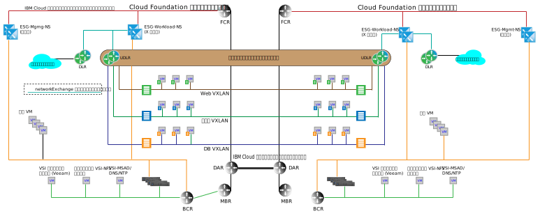

---

copyright:

  years:  2016, 2019

lastupdated: "2019-04-02"

subcollection: vmware-solutions

---

# マルチサイト・アーキテクチャー
{: #nsx-multi_site}

{{site.data.keyword.cloud}} と他のクラウド・オファリングとの重要な差別化要因の 1 つは、世界中で専用の計算機能をプロビジョンし、オンデマンド・インフラストラクチャーをプライベート {{site.data.keyword.cloud_notm}} アカウント内のネットワークに自動的に接続する機能です。 VMware vCenter Server のソフトウェアで定義されるネットワーク機能を {{site.data.keyword.cloud_notm}} と共に使用すると、数日で構築できる細分化されたグローバル・インフラストラクチャーが提供されます。 以下のセクションでは、vCenter Server のすぐに使用可能な機能を使用して実現できる内容の、マルチサイト・アーキテクチャーでの例について説明します。

## Cross-vCenter NSX 環境
{: #nsx-multi_site-cross-env}

Cross-vCenter NSX 機能を使用すると、最大 9 つの NSX マネージャーをプライマリーとセカンダリーの関係でリンクできます (1 つのプライマリーと 8 つのセカンダリー)。 　Cross-vCenter NSX が機能するために vCenter サーバーが拡張リンク・モード (ELM) 関係にある必要はありませんが、この関係には以下の利点があります。

* シングル・サインオン (SSO) 資格情報を使用して、プライマリーとセカンダリーの関係の作成が簡素化されます。
* vCenter Server の自動化構成により、一緒にリンクされるすべてのサイトの DNS 名前解決が可能になります
* NSX と通常の vCenter 機能の両方について、すべてのサイトにわたり単一画面で管理します。

## マルチサイトの例
{: #nsx-multi_site-example}

以下の例では、前のセクションで説明した基本管理トポロジーおよびワークロード・トポロジーに NSX ユニバーサル・トランスポート・ゾーンを追加します。また、この例には以下のような特性があります。

* ユニバーサル・トランスポート・ゾーンは、{{site.data.keyword.CloudDataCent_notm}} 内の 2 つの {{site.data.keyword.CloudDataCents_notm}} または POD にまたがっています。
* トランスポート・ゾーンが追加されると、複数の VXLAN が、新規 VXLAN にまたがるユニバーサル分散ルーターとともに追加されます。
* 両方のサイトで、ワークロード ESG へのアップリンクを構成する必要があります。 この構成により、ローカル・サイトの仮想マシン (VM) がローカル ESG を横断できるようになります。
* インバウンド・トラフィックの場合は、グローバル・ロード・バランサーが必要です。 この要件を満たすには、{{site.data.keyword.cloud_notm}} グローバル・ロード・バランシング・オファリングを参照してください。
* この例では、VMware NSX Enterprise エディションが必要です。

図 1. マルチサイト・トポロジー

## 関連リンク
{: #nsx-multi_site-related}

* [{{site.data.keyword.cloud_notm}} のネットワーキング・サービス](/docs/services/vmwaresolutions/archiref/nsx?topic=vmware-solutions-nsx-networking_services)
