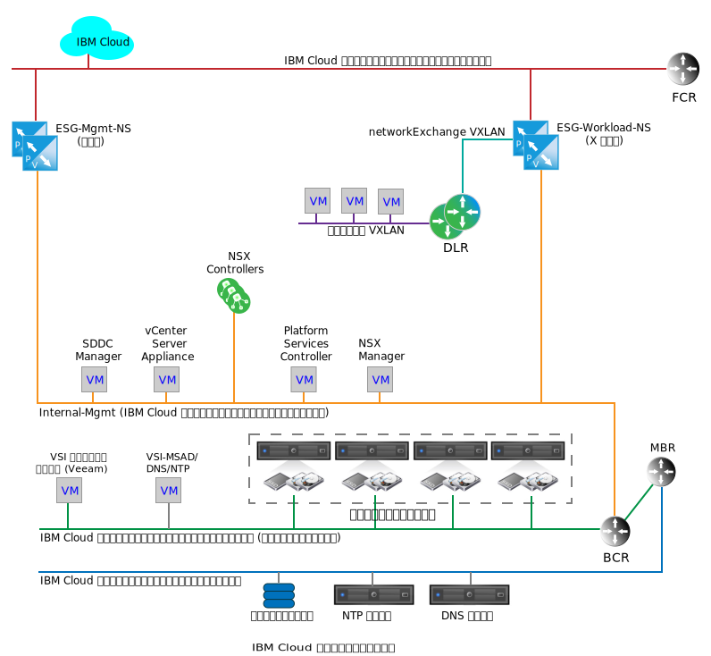
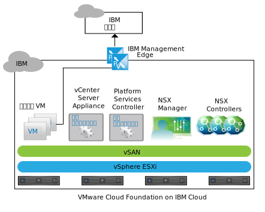
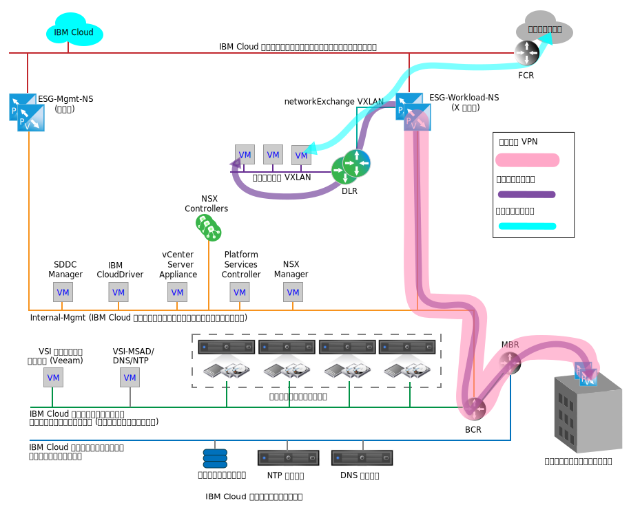

---

copyright:

  years:  2016, 2018

lastupdated: "2018-10-29"

---

{:tip: .tip}
{:note: .note}
{:important: .important}

# IBM Cloud のネットワーキング・サービス

{{site.data.keyword.cloud}} のネットワーキング・サービスは、{{site.data.keyword.cloud_notm}} と、仮想プライベート・ネットワーク (VPN) を介したパブリック・インターネットまたはカスタマー・オンプレミス・ネットワークとの間の通信用に、VMware NSX Edge Services Gateway (ESG) の 2 つのペアで構成されています。 これらの ESG は、内部 {{site.data.keyword.cloud_notm}} 管理機能、出口トラフィック、顧客関連ネットワーク・トラフィックの入口をサポートするために分離されます。

以下の図は、管理のペアとワークロード ESG のペアを表す単純化されたネットワーク図です。 また、NSX 分散論理ルーター (DLR) およびワークロード VXLAN も示しています。 これらのコンポーネントは、NSX 内でセットアップするための特定の知識を必要とせずに、お客様のワークロードの初期ランディング・ポイントとなります。 通常、DLR は、インスタンス内の個別のレイヤー 2 ネットワーク間で、VMware Cloud Foundation または VMware vCenter Server と東西トラフィックの間のトラフィックをルーティングするために使用されます。 この動作は、Cloud Foundation または vCenter Server インスタンスの南北ネットワーク・トラフィックの通過を実現する ESG とは大きく異なります。

図 1. Cloud Foundation のクラウド・ネットワーキング・サービス

管理およびお客様のワークロードの両方のトラフィックで単一の ESG が十分である可能性がありますが、管理およびお客様のトラフィックの分離は、管理 ESG が誤って構成されないようにするための設計上の決定です。

管理 ESG を誤って構成したり無効にしたりしても、Cloud Foundation または vCenter Server インスタンスは機能しますが、すべてのポータル管理機能が無効になります。
{:note}

## IBM 管理サービス NSX Edge

IBM 管理 ESG は、{{site.data.keyword.cloud_notm}} 管理ネットワーク・トラフィックのみの専用 NSX Edge クラスターです。 Cloud Foundation または vCenter Server の自動化によってデプロイおよび管理されていないコンポーネントのトラフィック・トラバーサル用ではありません。

管理 ESG は、Cloud Foundation または vCenter Server インスタンス内にあるアドオン・サービス仮想マシン (VM) と、以下の図で Cloud Foundation 用に示されている {{site.data.keyword.cloud_notm}} 内の IBM 自動化インフラストラクチャーとの間の通信パスを提供します。

図 2. Cloud Foundation での管理エッジ通信

特定のアドオン・サービス VM と対応するライセンス交付システムおよび課金システムの間の光通信によって、NSX ESG はアクティブ - パッシブ高可用性 (HA) ペアの大規模な構成でサイズ変更され、Cloud Foundation コンバージド・クラスターまたは vCenter Server クラスターの管理リソース・プールにデプロイされます。 以下の表に、IBM 管理 NSX ESG デプロイメントの要約を示します。

表 1. IBM 管理 NSX ESG の仕様

| IBM 管理 NSX Edge | vCPU | メモリー | ディスク・サイズ | ストレージの場所 |
|:----------------------- |:---- |:------ |:--------- |:---------------- |
| IBM 管理 NSX ESG 1 | 2 | 1 GB | 1 GB | vSAN データ・ストア (Cloud Foundation)。管理のための共有接続ストレージ (vCenter Server) |
| IBM 管理 NSX ESG 2 | 2 | 1 GB | 1 GB | vSAN データ・ストア (Cloud Foundation)。管理のための共有接続ストレージ (vCenter Server) |

### 管理サービス

以下のサービスに対するアウトバウンド・アクセスが必要です。

* Zerto Virtual Manager。 インストールされている場合、Zerto on {{site.data.keyword.cloud_notm}} では、ライセンス交付アクティベーションと使用レポートのためにインターネットへのアウトバウンド・アクセスが必要です。
* Veeam Backup and Replication。 インストールされている場合、Veeam on {{site.data.keyword.cloud_notm}} では、製品およびライセンス更新をダウンロードするためにインターネットへのアウトバウンド・アクセスが必要です。
* FortiGate Virtual Appliance on {{site.data.keyword.cloud_notm}} では、ライセンス交付アクティベーションとライセンス交付モニタリングのためにインターネットへのアウトバウンド・アクセスが必要です。
* F5 on {{site.data.keyword.cloud_notm}} では、ライセンス交付アクティベーションのためにインターネットへのアウトバウンド・アクセスが必要です。

### Edge インターフェース

ESG インターフェースの構成によって、ESG がアクセスできる L2 ネットワークが定義されます。 Cloud Foundation および vCenter Server のライフサイクル管理では、管理 VLAN に配置された特定の VM がパブリック VLAN への横断を許可されている必要があります。 以下のインターフェースがデプロイメント時に定義されます。

表 2. NSX ESG インターフェースの構成

| インターフェース | インターフェース・タイプ | 接続先 | 説明 |
|:--------- |:-------------- |:------------ |:----------- |
| パブリック・アップリンク | アップリンク | **SDDC-DportGroup-External** | 公衆インターネットへの接続用インターフェース |
| プライベート・アップリンク | アップリンク | **SDDC-DportGroup-Mgmt** | 内部プライベート・ネットワーク接続インターフェース |
| 内部 | 内部 | ワークロード HA VXLAN | ESG HA ペアのハートビートに使用される内部インターフェース。**SDDC-Dswitch-Private** のポート・グループ |

### サブネット

以下のサブネットが、管理 ESG に使用されます。

表 3. NSX ESX の IP 構成

| インターフェース | インターフェース・タイプ | IP v4 サブネット・タイプ | 範囲 | 説明 |
|:--------- |:-------------- |:----------------- |:----- |:----------- |
| パブリック・アップリンク | アップリンク | {{site.data.keyword.cloud_notm}} ポータブル・パブリック | /30 - 割り当て可能な IP アドレスを 1 つレンダリングします。 | パブリック・インターネット接続インターフェース |
| プライベート・アップリンク | アップリンク | {{site.data.keyword.cloud_notm}} ポータブル・プライベート (既存の管理) | /26 – 61 個の割り当て可能な IP アドレスをレンダリングします。 | 内部プライベート・ネットワーク接続インターフェース |
| 内部 | 内部 | リンク・ローカル | 169.254.0.0/16 | ESG HA ペアの通信に使用される内部インターフェース |

### ネットワーク・アドレス変換の定義

ネットワーク・アドレス変換 (NAT) は、ネットワーク・トラフィックが IP アドレス・スペース間を横断できるようにするために、管理 ESG 上で使用されます。 これは通常、インターネット・ルーティング可能 IP を節約したり、セキュリティー上の理由から内部 IP を公開 IP から隠したりするために行われます。 NAT は、伝送制御プロトコル (TCP) およびユーザー・データグラム・プロトコル (UDP) ポートのリダイレクトを可能にするためにも使用されます。 管理トラフィックは常に Cloud Foundation および vCenter Server インスタンス内から開始されるため、管理 ESG でソース NAT (SNAT) のみが定義されている必要があります。 インスタンスから出る必要のあるサービスをホストする内部 VM ごとに、個別の SNAT は作成されません。

表 4. NSX ESG の NAT 構成

| インターフェースに適用済み | ソース IP 範囲 | 変換済みソース IP |
|:-------------------- |:--------------- |:-------------------- |
| パブリック・アップリンク | Management Portable /26 の個々の IP アドレス | {{site.data.keyword.cloud_notm}} ポータブル・パブリック |

### ルーティング

管理 ESG を横断する必要がある VM 内のサービスも、お客様の {{site.data.keyword.cloud_notm}} プライベート・ネットワーク内の {{site.data.keyword.cloud_notm}} サービスにアクセスする必要がある場合があるため、この通信を実現するために以下の構成が必要となります。

インターネットへの接続の宛先として必要な宛先 IP 範囲を予測することは困難ですが、{{site.data.keyword.cloud_notm}} によってデプロイおよび管理されるサービスは、デフォルト・ゲートウェイとして管理 ESG を指します。 外部ネットワーク接続を必要とするサービスに対して {{site.data.keyword.cloud_notm}} BCR 全体のトラフィックを強制するには、静的ルートが必要です。

管理 ESG を使用して Cloud Foundation または vCenter Server インスタンスから横断するサービスには、以下の構成をお勧めします。
* デフォルト・ゲートウェイは管理 ESG です。
* 内部 {{site.data.keyword.cloud_notm}} 宛先には静的ルートが必要です。

サービスまたは VM が顧客 ESG にアクセスする必要がある場合は、個々のサービスまたは VM 内で静的ルートを維持し、さらに顧客 ESG を指す必要があります。

現在、管理 ESG 用に自動ルーティング・プロトコルは構成されていません。

### VXLAN 定義

管理 HA ペアには、内部インターフェースの接続用のネットワークが必要です。 既存の vSwitch、ポート・グループ、または VXLAN を使用します。 この設計では、管理 ESG HA ペアの HA ハートビート通信用に専用の VXLAN が作成されます。

表 5. NSX ESG の VXLAN 定義

| NSX ESG の VXLAN 定義 | トランスポート・ゾーン | タイプ |
|:------------------------- |:-------------- |:---- |
| Mgmt HA | transport-1 | global |

### ファイアウォール・ルール

デフォルトでは、管理 ESG はすべてのトラフィックを拒否するように構成されています。

**拒否:** そのトラフィックが前の (上位の) ルールまたはルール・セットによってファイアウォールを横断できない場合に、応答のないすべてのトラフィックをドロップします。 自動ルール生成が選択され、ESG ペアへの制御トラフィックが可能になります。

自動生成ルールに加えて、以下のファイアウォール・ルールが設定されます。

表 6. NSX ESG のファイアウォール構成

| サービス | ソース | 宛先 | プロトコル | アクション |
|:------- |:------ |:----------- |:-------- |:------ |
| Zerto on {{site.data.keyword.cloud_notm}} | Zerto 管理 VM | 任意 | ポート 443 | 許可 |
| Veeam on {{site.data.keyword.cloud_notm}} | Veeam Backup and Replication VM | 任意 | ポート 443 | 許可 |
| FortiGate Virtual Appliance on {{site.data.keyword.cloud_notm}} | サービス VM | 任意 | ポート 443 | 許可 |
| F5 on {{site.data.keyword.cloud_notm}} | サービス VM | 任意 | ポート 443 | 許可 |
| 任意 | 任意 | 任意 | 任意 | 拒否 |

## IBM ワークロード NSX Edge

IBM ワークロード ESG は、ワークロード・ネットワーク通信用の単純なトポロジーの一部です。 以下のセクションでは、Cloud Foundation または vCenter Server インスタンス内のネットワークにワークロードを接続する設計意図について説明します。 これは、オンプレミス・ネットワークおよび IP スペースを特定の Cloud Foundation または vCenter Center インスタンスに接続するための開始点であり、真のハイブリッド・クラウド・アーキテクチャーの基礎となります。

パブリックおよびプライベート {{site.data.keyword.cloud_notm}} ネットワークの両方に接続されたお客様のネットワークでは、インターネット接続トラフィックとの間のワークロード・アクセスが可能ですが、パブリックまたはプライベートの {{site.data.keyword.cloud_notm}} ネットワークからサイト間 VPN を作成することもできます。 これにより、オンプレミス・ネットワークへの接続に関する評価の時間が大幅に短縮されます。これは、お客様のセキュリティー要件により、専用の広域ネットワーク (WAN) を立ち上げるのに数カ月かかることがあるためです。 ただし、専用リンクが配置された後に、VPN を反転して、VPN トンネルや Cloud Foundation または vCenter Server インスタンス内のオーバーレイ・ネットワークに影響を与えずにリンクを横断できます。 その後、セキュリティーの観点から必要に応じて、ワークロード ESG のパブリック・インターフェースを除去できます。

以下の図のトポロジーは、以下の NSX コンポーネントで構成されています。
* NSX Edge アプライアンス (ESG)
* 分散論理ルーター (DLR)
* VXLAN (L3 上の L2)

図 3. ネットワーク・フロー図の例

### IBM ワークロード NSX Edge の Edge インターフェース

管理 ESG と同様に、ESG インターフェースの構成によって、ESG がアクセスできる L2 ネットワークが定義されます。 ワークロード・トポロジーの設計意図の一部は、ソフトウェア定義ネットワーキング (SDN) オーバーレイを実現して、基礎となる {{site.data.keyword.cloud_notm}} アドレス・スペースからワークロードを分離することです。 この設計は、BYOIP 設計を実現するための基礎となります。 したがって、以下のインターフェースがデプロイメント時に定義されます。

表 7. ワークロード Edge インターフェースの構成

| インターフェース | インターフェース・タイプ | 接続先 | 説明 |
|:--------- |:-------------- |:------------ |:----------- |
| パブリック・アップリンク | アップリンク | SDDC-DportGroup-External | 公衆インターネットへの接続用インターフェース |
| プライベート・アップリンク | アップリンク | SDDC-DportGroup-Mgmt | 内部プライベート・ネットワーク接続インターフェース |
| トランジット・アップリンク | アップリンク | Workload-Trasit | ワークロード ESG とワークロード DLR の間のトランジット VXLAN |
| 内部 | 内部 | ワークロード HA VXLAN | ESG HA ペアのハートビートに使用される内部インターフェース |

この設計では、ローカル・ワークロード接続 L2 ネットワーク間で可能性のある東西ルーティングを可能にするために、DLR が採用されています。 このトポロジーは単純な例であるため、ワークロード用の L2 ネットワークは 1 つだけ記述されています。 さらにセキュリティー・ゾーンを追加するには、DLR で新しいインターフェースに接続された VXLAN をさらに追加します。 以下の表は、構成する DLR インターフェースを示しています。

表 8. DLR インターフェース

| インターフェース | インターフェース・タイプ | 接続先 | 説明 |
|:--------- |:-------------- |:------------ |:----------- |
| トランジット・アップリンク | アップリンク | Workload-Trasit | ワークロード ESG とワークロード DLR の間のトランジット VXLAN |
| ワークロード・アップリンク | アップリンク | ワークロード | ワークロード接続用の VXLAN |
| 内部 | 内部 | ワークロード HA VXLAN | ESG HA ペアのハートビートに使用される内部インターフェース |

### IBM ワークロード NSX Edge のサブネット

以下のサブネットが、ワークロード ESG に使用されます。

表 9. DLR およびワークロード ESG の IP 構成

| インターフェース | インターフェース・タイプ | IP v4 サブネット・タイプ | 範囲 | 説明 |
|:--------- |:-------------- |:----------------- |:----- |:----------- |
| パブリック・アップリンク (ESG) | アップリンク | {{site.data.keyword.cloud_notm}} ポータブル・パブリック | /30 - 割り当て可能な IP アドレスを 1 つレンダリングします。 | 公衆インターネットへの接続用インターフェース (お客様はさらに多くの IP アドレスを別個に注文可能) |
| プライベート・アップリンク (ESG) | アップリンク | {{site.data.keyword.cloud_notm}} ポータブル・プライベート (既存の管理) | /26 – 61 個の割り当て可能な IP アドレスをレンダリングします。 | 内部プライベート・ネットワーク接続インターフェース |
| 内部 (ESG および DLR) | 内部 | リンク・ローカル | 169.254.0.0/16 | ESG HA ペアの通信に使用される内部インターフェース |
| トランジット・アップリンク (ESG および DLR) | アップリンク | 顧客による割り当て | 未定 | ESG から DLR へのトランジット・ネットワーク接続 |
| ワークロード (DLR) | アップリンク | 顧客による割り当て | 未定 | ワークロード・サブネット |

### IBM ワークロード NSX Edge の NAT 定義

NAT は、ネットワーク・トラフィックが IP アドレス・スペース間を横断できるようにするために、ワークロード ESG 上で使用されます。 ワークロード ESG の場合、インターネット宛先への通信を許可するだけでなく、任意の {{site.data.keyword.cloud_notm}} ソース IP 範囲と通信するためにも NAT が必要です。 この設計では、ワークロード・トラフィックはインターネットにアクセスできますが、管理ネットワークや {{site.data.keyword.cloud_notm}} ネットワークにはアクセスできません。 したがって、ワークロード ESG で SNAT のみを定義する必要があります。 ワークロードのポータブル・サブネット全体が SNAT を横断するように構成されています。

NAT を使用して、Cloud Foundation または vCenter Server の複数のインスタンス間でのワークロード通信を可能にすることはできますが、多数のワークロードを複数のインスタンスにわたって接続する必要がある場合は、これは現実的ではありません。 高度な NSX 機能を使用して、Cloud Foundation または vCeter Server インスタンス全体で過度な L2 トランジット・ネットワークを作成する例については、[マルチサイト・アーキテクチャー](multi_site.html)を参照してください。

表 10. ワークロード ESG の NAT ルール

| インターフェースに適用済み | ソース IP 範囲 | 変換済みソース IP | NAT が有効または無効 |
|:-------------------- |:--------------- |:-------------------- |:----------------------- |
| パブリック・アップリンク (ワークロード ESG) | 顧客定義 | {{site.data.keyword.cloud_notm}} ポータブル・パブリック IP | 顧客定義 (デフォルトは無効) |

### IBM ワークロード NSX Edge のルーティング

この設計では、ワークロード ESG まで DLR を横断するワークロードの唯一の要件は、インターネットにアクセスすることです。 ワークロード ESG は、ワークロード VXLAN と、DLR の内側で作成される将来のワークロード VXLAN/サブネットへのパスを認識する必要があります。 これは ESG の静的ルートによって達成できますが、このワークロード・トポロジーは、ベスト・プラクティスの設計を示すことを目的としています。 したがって、Open Shortest Path First (OSPF) は、ワークロード ESG とダウンストリーム DLR の間に構成されます。

構成について詳しくは、[OSPF プロトコルの構成](https://pubs.vmware.com/NSX-6/index.jsp?topic=%2Fcom.vmware.nsx.admin.doc%2FGUID-6E985577-3629-42FE-AC22-C4B56EFA8C9B.html)を参照してください。

表 11. 動的なルーティング

| Area | OSPF タイプ | OSPF インターフェース IP | OSPF 認証 |
|:---- |:--------- |:----------------- |:------------------- |
| 51 | スタブ | トランジット RFC1918 ネットワークの DLR および ESG ごとに IP を割り当てます。 | なし |

### IBM ワークロード NSX Edge のファイアウォール・ルール

デフォルトでは、ワークロード ESG はすべてのトラフィックを拒否するように構成されています。

**拒否:** そのトラフィックが前の (上位の) ルールまたはルール・セットによってファイアウォールを横断できない場合に、応答のないすべてのトラフィックをドロップします。 自動ルール生成が選択され、ESG ペアへの制御トラフィックが可能になります。

自動生成ルールに加えて、以下のファイアウォール・ルールが設定されます。

表 12. ワークロード ESG のファイアウォール・ルール

| サービス | ソース | 宛先 | プロトコル | アクション |
|:------- |:------ |:----------- |:-------- |:------ |
| ワークロード | ワークロード・サブネット | 任意 | 任意 | 許可 |
| 任意 | 任意 | 任意 | 任意 | 拒否 |

### IBM ワークロード NSX Edge の VXLAN 定義

ワークロード・トポロジー ESG と DLR HA のペアには、内部インターフェースの接続、2 つの間のデータ中継、そしてワークロードのための L2 セグメント (VXLAN) が必要です。

表 13. ワークロード ESG 内部インターフェース

| VXLAN 名 | Cloud Foundation または vCenter Server のトランスポート・ゾーン | タイプ |
|:---------- |:------------------------------------------------- |:---- |
| ワークロード HA | transit-1 | グローバル |
| ワークロード・トランジット | transit-1 | グローバル |
| ワークロード | transit-1 | グローバル |

### IBM ワークロード NSX Edge の ESG DLR 設定

デフォルトでは、すべての新規 NSX Edge アプライアンスでロギングが有効になっています。 デフォルトのロギング・レベルは NOTICE です。

### 関連リンク

* [NSX Edge Services Gateway の設計](nsx_design.html)
* [マルチサイト・アーキテクチャー](multi_site.html)
