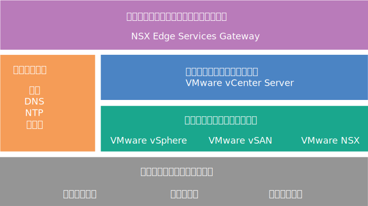

---

copyright:

  years:  2016, 2019

lastupdated: "2019-05-07"

subcollection: vmware-solutions

---

{:tip: .tip}
{:note: .note}
{:important: .important}

# NSX Edge Services Gateway の設計
{: #nsx_design}

NSX Edge Services Gateway on {{site.data.keyword.cloud}} ソリューションは、世界中の {{site.data.keyword.CloudDataCents_notm}} にデプロイされる VMware テクノロジーを提供します。 {{site.data.keyword.vmwaresolutions_short}} は、NSX Edge Services Gateway に関連する 2 つのソリューション・アーキテクチャーを提供します。

## 内部アーキテクチャー設計
{: #nsx_design-internal-archi}

内部アーキテクチャーは、必要な NSX Edge コンポーネントの、VMware vCenter Server クラスター内のリソース・プールへのデプロイメントを指定します。

VMware vSAN は、以下の図ではオプションです。
{:note}

## 専用アーキテクチャー設計
{: #nsx_design-dedicated-archi}

専用アーキテクチャーでは、NSX Edge 専用にした 2 ノードの独立した vSphere クラスターに必要な NSX Edge コンポーネントをデプロイし、物理ネットワーク・インフラストラクチャーと重要な対話を行えるようにします。 専用アーキテクチャーには、以下の特性と機能があります。

* 物理ネットワークへのオンランプおよびオフランプ接続を提供します。 例えば、NSX Edge 仮想アプライアンスでの南北 L3 ルーティングがあります。
* NSX L2 ブリッジングを介して物理ネットワーク内の VLAN に接続された物理デバイスとの通信を可能にし、分散論理ルーター (DLR) ルーティング用の制御仮想マシン (VM) をホストします。
* 一元化された論理サービスまたは物理サービスを持つことができます。 例えば、ファイアウォール、ロード・バランサー、仮想プライベート・ネットワーク (VPN) モニター・コンポーネント、Log Insight の VM などです。
* 専用 vCenter を使用して計算リソースおよびエッジ・リソースを管理する場合、NSX コントローラーを Edge クラスター内でホストできます。
* Edge クラスター・リソースには、アクティブ・スタンバイ構成を保護したり、障害時の帯域幅の可用性を維持したりするためのアンチアフィニティー要件があります。

## IBM Cloud Private の IP アドレス範囲と持ち込み IP アドレス範囲
{: #nsx_design-ip-addr-ranges}

RFC1918 プライベート IP アドレス範囲は、組織内部で使用するためのネットワーク範囲の使用のために特に予約されており、インターネットには使用しません。 {{site.data.keyword.cloud_notm}} 物理ネットワーク・インフラストラクチャーは、世界中のすべての場所で、特定の RFC1918 プライベート・アドレス・スペース 10.x.x.x/8 を使用します。 これらの IP アドレス範囲は、お客様のアカウント全体または {{site.data.keyword.cloud_notm}} のお客様のアカウント内で重複しません。 お客様のアカウント内で、{{site.data.keyword.cloud_notm}} に割り振られたプライベート IP アドレス・スペースは、Virtual Routing and Forwarding (VRF) が有効になっていれば、任意の {{site.data.keyword.CloudDataCents_notm}} の他の任意の {{site.data.keyword.cloud_notm}} プライベート IP アドレス範囲にルーティングできます。

これにより、ご使用のアカウント内に世界的に接続されたインフラストラクチャーを簡単にセットアップできますが、{{site.data.keyword.cloud_notm}} と同じプライベート・アドレス・スペースを使用する場合にルーティングを介してデータ・センターを {{site.data.keyword.cloud_notm}} に拡張すると、固定 IP アドレス・スペースによって問題が生じる可能性があります。 解決方法は、NSX を使用して vCenter Server インフラストラクチャーでオーバーレイ・トポロジーを作成し、持ち込み IP (BYOIP) アドレス・スペースを {{site.data.keyword.cloud_notm}} が割り当てられたプライベート IP アドレス・スペースと対話しないようにすることです。 NSX は、外部 IP アドレス・スペース (重複する場合もあります) 間のトンネル内に、内部 BYOIP アドレス・スペースにまたがる L2 VPN を提供できます。

## 関連リンク
{: #nsx_design-related}

* [ソリューションの概要](/docs/services/vmwaresolutions/archiref/solution?topic=vmware-solutions-solution_overview)
