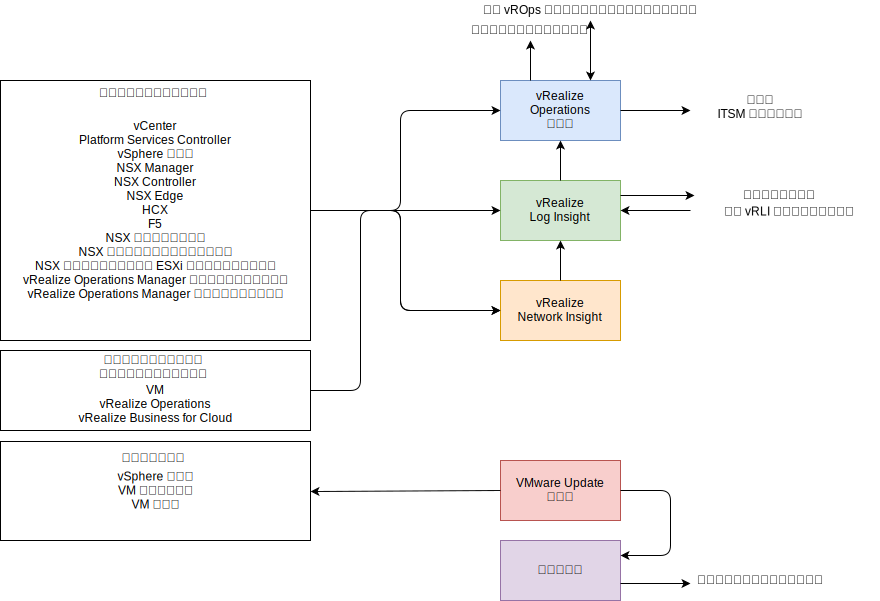

---

copyright:

  years:  2016, 2019

lastupdated: "2019-06-03"

---

# 運用管理アーキテクチャーの概要
{: #opsmgmt-arch}
運用管理層の製品のアーキテクチャーは、{{site.data.keyword.vmwaresolutions_full}} のロギング・データを使用した一元的なモニターを可能にします。 運用管理層は、物理インフラストラクチャー、仮想インフラストラクチャー、およびオプションでクライアントのコンピュート・ワークロードをリアルタイムでモニターします。

以下の情報が概要レベルで収集されます。
* 物理および仮想のコンピュート・オブジェクト、ネットワーキング・オブジェクト、ストレージ・オブジェクトなどのトポロジー・データ。
* モニター・データ。例えば、次のようなものがあります。
  * メトリック - パフォーマンスや容量などの構造化データ
  * ログ - システム・イベントなどの非構造化データ

## 運用管理フロー
{: #opsmgmt-arch-flows}

以下の図は、運用管理ツールの主要な対話と統合を示しています。

{{site.data.keyword.vmwaresolutions_short}} 運用管理は、以下のステップで構成されています。
* モニター - vRealize Operations Manager (vROps) が、分析アルゴリズムを使用して、{{site.data.keyword.vmwaresolutions_short}} アーキテクチャー内の複数のオブジェクトの運用を追跡および分析します。 これらのアルゴリズムは、vROps によるこれらのオブジェクトの動作の学習と予測に役立ちます。 システム管理者は、ビュー、レポート、およびダッシュボードを使用してこの情報にアクセスします。

  環境に問題がある場合、vROps は以下の 3 つの影響タイプのアラートを生成します。
    * 健全性アラート - 環境の健全性に影響を及ぼし、ただちに対応する必要がある問題を示します。
    * リスク・アラート - 差し迫った脅威ではないが、早急に対応する必要がある問題を示します。
    * 効率アラート - パフォーマンスを改善したり、リソースを再利用したりするための情報。

  vROps アラートは、データ分析で通常のメトリック値からの逸脱が示された場合、またはモニター対象コンポーネントの 1 つで問題が発生した場合に、モニター対象オブジェクトで発生するイベントです。 vROps アラートには、以下のいずれかのカテゴリーが割り当てられます。
    * クリティカル - ただちに対応する必要があります。
    * 即時 – できるだけ早く対応する必要があります。
    * 警告 - 時間のあるときにチェックする必要があります。

* ロギング - vRealize Log Insight (vRLI) は、{{site.data.keyword.vmwaresolutions_short}} アーキテクチャー内のすべての物理オブジェクトと仮想オブジェクトにわたる、機械学習ベースのインテリジェントなグループ化、高性能検索、およびトラブルシューティングにより、リアルタイムのログ管理とログ分析を提供します。 vRLI は、`syslog` プロトコルを使用して vSphere ホストからデータを収集します。 また、vCenter Server などの他の VMware 製品のイベント、タスク、およびアラーム・データも収集します。 vRops と統合して、通知イベントを送信し、コンテキスト起動を有効にします。 `syslog` データを送信できる {{site.data.keyword.vmwaresolutions_short}} アーキテクチャー内の他のオブジェクトは、vRLI に接続されます。 オプションで、クライアントは、syslog データを送信できる任意のシステムを、データが vRLI に転送されるように構成できます。

* ネットワーク健全性 - vRealize Network Insight は、以下をプロアクティブに実現することに焦点を当てた分析ツールです。
  * ネットワークの健全性とパフォーマンスのモニター。
  * エンドツーエンドのトラブルシューティング。
  * 360 °の可視性と分析。
  * マイクロセグメンテーション・ベースのコンプライアンス管理。

* パッチ適用およびアップグレード - vSphere Update Manager (VUM) により、VMware vSphere ホストおよび仮想マシン (VM) (OS およびアプリではない) のパッチおよびバージョン管理を一元化し、自動化できます。

## 運用管理ネットワーキング
{: #opsmgmt-arch-network}

次の図は、ネットワークの概要を示しています。

* ツールのプライベート・ポータブル・サブネットは、ツール VM の初期プロビジョニングに使用される {{site.data.keyword.cloud_notm}} IP アドレス・スペースを提供するためにプロビジョンされます。 プロビジョニングの後、ツールのスケールアウトのために IP アドレス・スペースを管理するのはクライアントの役割になります。 このサブネット上の VM は、管理サブネットおよび内部管理サブネットでホストされているコンポーネントにアクセスする必要があります。
* ツールの VXLAN サブネットは、ツール VM の初期プロビジョニングに使用される BYOIP IP アドレス・スペースを提供するために使用されますが、その後、ツールのスケールアウトのためにその IP アドレス・スペースを管理するのはクライアントの役割になります。 このサブネット上の VM は、オーバーレイ・サブネットでホストされているコンポーネントにアクセスする必要があります。 ESG は、{{site.data.keyword.cloud_notm}} アドレス・スペースと BYOIP アドレス・スペースの間の NAT を提供します。
* vROps リモート・コレクターは、vROps を利用してコンピュート VM をモニターしたい場合にクライアントがデプロイします。
* vRLI フォワーダーは、オーバーレイ・コンポーネントから vRLI クラスターにログ・メッセージを中継します。 クライアントは、必要に応じて、これらのフォワーダーを使用するようにコンピュート VM を構成することもできます。
* VMware Update Manager (VUM) は、vSphere ホスト、および VM ハードウェアおよびツールの更新を提供します。 VUM は、プロキシーを使用してインターネット・リポジトリーにアクセスします。

vROps は、環境内のオブジェクトからデータを収集します。 収集される各データは、メトリックの監視または値と呼ばれます。 vROps は vCenter アダプターを使用して vCenter からロー・メトリックを収集します。 vROps は、収集するメトリックだけでなく、容量メトリック、バッジ・メトリック、およびシステムの健全性をモニターするためのメトリックを計算します。 アラート定義は、問題領域を識別し、それらの領域で対処するためのアラートを生成する、症状と推奨事項の組み合わせです。

## モニター対象コンポーネント
{: #opsmgmt-arch-components}

### vCenter のモニター
{: #opsmgmt-arch-components-vcenter}

vCenter のモニターは、vROps および VMware SDDC Health Management Pack を使用して行われます。 vRLI が vCenter からログ・データを収集し、Content Pack for vSphere がログに特定の見解を追加してから vROPs にアラートを送信します。

VMware SDDC Health Management Pack は、SDDC Management スタックをモニターし、vCenter を含む SDDC 製品コンポーネントの構成およびコンプライアンスに関連する健全性およびアラートのバッジを提供します。

### vSphere ホストのモニター
{: #opsmgmt-arch-components-hosts}

vSphere ホストのモニターは、vCenter を介した vROps と、vRLI によるログの収集によって行われます。

### vSAN のモニター
{: #opsmgmt-arch-components-vsan}

vSAN のモニターには、vROps と vRLI が使用されます。 vCenter には、使用可能な vSAN 健全性チェックの追加セットがあります。 Management Pack for vSAN をインストールすると、vSAN のモニターに役立つ追加のダッシュボードが提供されます。

vROps は、VMware vSAN アダプターがモニターしているストレージ・エリア・ネットワーク内の SDDC 製品コンポーネントで問題が発生した場合に、アラートを生成します。 構成のコンプライアンスおよび健全性に関連するアラートは、VMware vSAN Management Pack から VMware SDDC Health Solution Management Pack を介して渡されます。 vSAN は、vSAN アダプターを使用して、vCentre アプライアンスを介して vROps vSAN Management Pack でモニターされます。 デフォルトの収集間隔は 5 分です。vSAN アダプターは、健全性チェック・サービスとパフォーマンス・サービスのメトリックも、vSphere オブジェクトから収集します。 健全性チェック・サービス間隔は vSphere インターフェースで構成され、デフォルトでは 60 分です。

vSAN アダプターがすべてのパフォーマンス・データを収集できるようにするには、vSphere で vSAN パフォーマンス・サービスを有効にする必要があります。

### NSX for vSphere のモニター
{: #opsmgmt-arch-components-nsxv}

NSX をモニターするために、以下のツールが実装されています。
* vRealize Operations Manager (vROps)
* vRealize Log Insight (vRLI)
* vRealize Network Insight (vRNI)

これにより、システム管理者は VMware NSX をモニター、管理、およびトラブルシューティングできます。 vROps Management Pack for VMware NSX は、ネットワーク・トポロジーを可視化します。 NSX ダッシュボードでは、NSX 環境、およびそのコンポーネントの健全性について概要を簡単に確認できます。 NSX オブジェクトと vSphere オブジェクトとの相関により、トラブルシューティングが容易になります。

vROps は、VMware NSX の構成、パフォーマンス、およびサポートのデータをポーリングするために管理パックを使用します。 管理パックが、vROps の代わりにポーリング要求を REST API 呼び出しに変換して、必要なデータを NSX Manager から取得します。

NSX コンポーネントは、syslog を vRLI に送信するように構成する必要があります。

* NSX Manager - [Syslog サーバーを指定](https://pubs.vmware.com/NSX-6/topic/com.vmware.nsx.admin.doc/GUID-EA70974C-07F8-469D-8A9D-0ED54F0C8F34.html#GUID-EA70974C-07F8-469D-8A9D-0ED54F0C8F34){:new_window}します。
* NSX Controller - [NSX Controllers を構成](https://kb.vmware.com/s/article/2092228){:new_window}します。
* NSX Edge - [リモート Syslog サーバーを構成](https://pubs.vmware.com/NSX-6/topic/com.vmware.nsx.admin.doc/GUID-9C25E097-E2CC-461A-9DA6-E8118D16EE62.html#GUID-9C25E097-E2CC-461A-9DA6-E8118D16EE62){:new_window}します。
* ファイアウォール - ファイアウォールが有効になっているクラスターごとにリモート syslog サーバーを構成する必要があります。 リモート syslog サーバーは、`Syslog.global.logHost` 属性で指定されます。

NSX フロー・モニターを NSX マネージャーで使用すると、どのフローが承認され、どのフローがブロックされているかを判別できます。 必要に応じて、vSphere 分散スイッチ用にポート・ミラーリングを構成できます。

### NSX-T のモニター
{: #opsmgmt-arch-components-nsxt}

NSX-T をモニターするために、以下のツールが実装されています。

* vRealize Operations Manager (vROps)
* vRealize Log Insight (vRLI)

VMware SDDC Health Management Pack は、以下のコンポーネントをモニターします。
* 論理スイッチ - 論理スイッチの管理状態をモニターします。
* コントローラー・クラスター - HA のデプロイ済みクラスター・ノード数をモニターし、クォーラムを維持します。
* コントローラー・ノード - コントローラー・クラスターおよびマネージャー・ノードとのノード接続をモニターします。
* エッジ・ノード - エッジ・ノードの実行状態と、コントローラー・クラスターおよびマネージャー・ノードとの接続をモニターします。
* NSX-T 管理サービス。
* T0 ルーター・サービス - 静的ルート、NAT、BGP、BFD、およびルート再配布サービスをモニターします。
* T1 ルーター・サービス - 静的ルート、NAT、およびルート通知サービスをモニターします。

### vRealize Operations Manager のモニター
{: #opsmgmt-arch-components-vrops}

VMware SDDC Health Management Pack には、以下のイベントのアラート定義があります。
* 現在の vRealize Operations Manager ノードのサイズが特定の負荷に対して十分でない。(Current sizing of the vRealize Operations Manager nodes are not sufficient for given load.)
* クラスター・ノード構成が vRealize Operations Manager のサイジング・ガイドラインに従っていない。(Cluster node configuration does not follow the vRealize Operations Manager sizing guideline.)
* 現在のリモート・コレクターのサイズが特定の負荷に対して十分でない。(Current sizing of the Remote Collector is not sufficient for given load.)
* リモート・コレクターの構成が vRealize Operations Manager のサイジング・ガイドラインに従っていない。(Remote Collector configuration does not follow the vRealize Operations Manager sizing guideline.)
* vRealize Operations クラスターが推奨される分析ノード数を超えている。(vRealize Operations Cluster has exceeded the recommended number of analytic nodes.)

### vRealize Log Insight のモニター
{: #opsmgmt-arch-components-vrli}

vRLI は、その健全性に関する通知をトリガーするアラートをサポートし、重要なシステム・イベントが発生した場合 (例えば、ディスク・スペースを使い切りそうなために、vRealize Log Insight で古いログ・ファイルを削除するかアーカイブを開始する必要がある場合) に、通知を生成します。

## システム要件
{: #opsmgmt-arch-requirements}

設計では、アプライアンスの以下の数量とサイズを使用します。

表 1. オペレーション・ツールのサマリーのシステム要件

||vROps|vRLI|vRNI|プロキシー|
|---|---|---|---|---|---|
|VM の数|4|4|1+1|1|
|vCPU|8|8|4 + 8|4|
|RAM GB|32|16|12 + 32|0.5|
|ディスク GB|254|1042|158 + 1000|80|

## ソフトウェアのバージョン
{: #opsmgmt-arch-versions}

表 2. 運用ツール・ソフトウェアのバージョン

|製品名|バージョン|
|---|---|
|VMware vRealize Operations Manager Advanced 以上|7.0|
|vRealize Operations Management Pack for NSX for vSphere|3.5.2|
|vRealize Operations Management Pack for Storage Devices|7.0.0|
|vRealize Operations Management Pack for Site Recovery Manager|8.1.1|
|VMware vRealize Log Insight|4.7|
|vRealize Log Insight Content Pack for NSX for vSphere|3.8|

## 関連リンク
{: #opsmgmt-arch-components-related}

* [vCenter Server on {{site.data.keyword.cloud_notm}} with Hybridity Bundle の概要](/docs/services/vmwaresolutions/archiref/vcs?topic=vmware-solutions-vcs-hybridity-intro)
