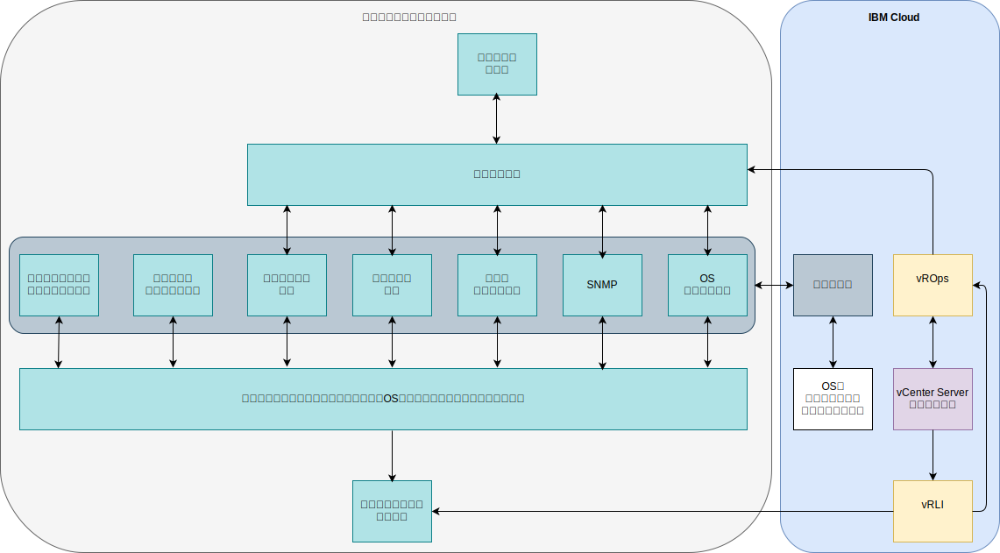

---

copyright:

  years:  2016, 2019

lastupdated: "2019-05-29"

---

# 統合
{: #opsmgmt-integration}

このトピックでは、設計の運用管理層に注目します。ただし、企業によっては、この層を自社のサービス管理層に統合することもあります。このセクションでは、この統合について説明します。 この設計では、vROps が、すべてのアラートを確認できる中央の場所になります。

統合の区分としては、以下の区分があります。
* 北向き – vROps から他のツールへの統合:
  * SMTP サーバーまたは Slack や PagerDuty などのツールへのアラートの通知。
  * ServiceNow などのサービス・デスク・ツールへのチケットの統合。
  * vROps によって検出された問題を修復するための vRealize Orchestrator ワークフローの開始。
* 南向き – サービス管理ツールまたはクラウド管理ツールからの統合:
  * vRealize Automation は、新規ワークロードが追加されるときにモニターを構成します。
  * 外部ソースからのイベント・エンリッチを使用して vROps オブジェクトを更新します。

vROps には、以下のアウトバウンド・アラート・プラグインが用意されています。
* 自動化アクション – デフォルトで有効です。
* 標準の E メール - Simple Mail Transfer Protocol (SMTP) を使用して、vRealize Operations Manager アラート通知を、関心を持っている個人に Eメールで送信します。
* SNMP トラップ – SNMP トラップ・サーバーにアラートを記録します。
* REST 通知 - vROps アラートを別の REST 対応アプリケーションに送信します。このアプリケーションに、それらのメッセージを受け入れるための REST Web サービスを作成します。
* ログ・ファイル – vRealize Operations Manager の各ノードで、vROps がアラートをファイルに記録できるようにします。 vRealize Operations Manager を複数ノード・クラスターとしてインストールした場合、各ノードが、モニター対象オブジェクトのアラートを処理し、ログに記録します。 ノードごとに、そのノードが処理したオブジェクトのアラートをログに記録します。
* Smarts SAM 通知 - EMC Smarts Server Assurance Manager にアラート通知を送信します。
* ネットワーク共有 - 共有ロケーションにレポートを送信します。SMB バージョン 2.0 をサポートしています。

通知は、外部システムに北向きに送信するための通知ルールのフィルター基準を満たしたアラート通知です。 必要なアウトバウンド・アラートのために通知ルールを構成し、そのアラートがフィルタリングされ、選択した外部システムに送信されるようにします。 これらのルールを管理するためには通知リストを使用します。

## 統合のユース・ケース
{: #opsmgmt-integration-usecase}

このユース・ケースの例は、ある企業で使用されている既存の汎用的なサービス管理層をベースにしています。 このクライアントは、Operations Management オプションを付けて vCenter Server インスタンスをプロビジョンしており、そのプラットフォームを企業のサービス管理プラットフォームに統合しようとしています。 彼らは、イベント集約システムを使用して、以下の領域特化型のモニター・ツールから生成されたアラートを統合しています。

* UNIX 、Linux、および Windows ワークロード全体で OS、ミドルウェア、およびアプリケーションをモニターするツール・セット。ただし、このツールは VMware、ネットワーキング・デバイス、ストレージなどのインフラストラクチャー・コンポーネントはモニターしません。
* SNMP トラップをネットワーク・インフラストラクチャーから受信する SNMP マネージャー。 このツールは、パフォーマンスと容量のアラートを生成できるように SNMP メトリックも収集します。
* バックアップを管理するためのバックアップ管理ツール。
* ストレージ・アレイを管理するためのストレージ管理ツール。
* ping を使用してデバイスの到達可能性をテストする可用性ツール。

この企業のサービス管理層には、以下も含まれています。

* サーバーの容量とパフォーマンスのためのツール。メトリックを収集してレポートを提供します。
* パッチ適用とコンプライアンスのためのサーバー。OS、ミドルウェア、およびアプリケーションを更新し、それらのプラットフォームのコンプライアンスを評価します。
* インシデント、問題、および変更のチケットを管理するために使用するチケット・ツール。 このツールは、企業の構成管理データベース (CMDB) でもあります。 このツールは、運用チームに E メールおよび SMS メッセージを送信できます。
* すべてのシステムからログを収集する企業ロギング・システム。セキュリティー・チームが管理しています。

この企業は vROps を入手したので、SNMP トラップ・プラグインを使用して、北向き通知によってこのツールを統合することにしました。 vROps を統合するには、このクライアントのイベント管理環境がアラートを生成してエンリッチできるように、vROps から送信されたトラップを解析する必要があります。 管理ツール・チームは VMware から VMware MIB をダウンロードしてイベント管理環境にインストールしました。

vRLI は、クライアントのポリシーに従って、すべてのイベントを企業のロギング・システムに転送するように構成されています。

クライアントは、既存の OS、ミドルウェア、およびアプリケーションのモニター・ツールを使用したいと考えているので、{{site.data.keyword.cloud}} でプロキシーを使用してメトリックとアラートを収集および転送することにしました。

## 関連リンク
{: #opsmgmt-integration-related}

* [vCenter Server on {{site.data.keyword.cloud_notm}} with Hybridity Bundle の概要](/docs/services/vmwaresolutions/archiref/vcs?topic=vmware-solutions-vcs-hybridity-intro)
* [vRealize Operations RESTful API](https://docs.vmware.com/en/vRealize-Operations-Manager/7.0/vrealize-operations-manager-70-api-guide.pdf){:new_window}
* [VMware Code API Explorer](https://code.vmware.com/apis?socv=1&numPerPage=164&sorter=pv){:new_window}
* [Postman Client Collection Tool for vRealize Operations](https://code.vmware.com/samples/4663/postman-client-collection-for-vrealize-operations-rest-apis){:new_window}
* [VMware PowerCLI blog](https://blogs.vmware.com/PowerCLI/2016/05/getting-started-with-powercli-for-vrealize-operations-vr-ops.html){:new_window}
* [Webhook Shims](https://blogs.vmware.com/management/2017/01/vrealize-webhooks-infinite-integrations.html){:new_window}
