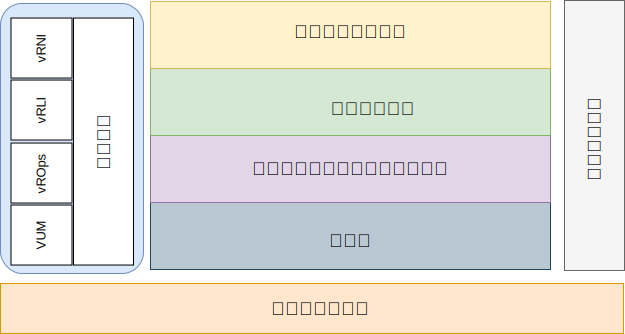

---

copyright:

  years:  2016, 2019

lastupdated: "2019-08-05"

---

# 概要
{: #opsmgmt-intro}

このリファレンス・アーキテクチャーは、{{site.data.keyword.vmwaresolutions_full}} アーキテクチャーのインスタンス化をガイドし、制限するものです。

また、以下も行います。
* さまざまな関係者が共通言語を利用できるようにします。
* 統一された方法でテクノロジーを実装して問題解決できるようにします。
* 実証済みのリファレンス・アーキテクチャーと比較してソリューションを検証できるようにします。
* 一般的な標準、仕様、およびパターンの順守を促進します。

このリファレンス・アーキテクチャーの主な目的は、クライアント用にデプロイされた {{site.data.keyword.vmwaresolutions_short}} 環境のモニターおよびアラートを提供する運用管理機能を文書化することです。 このツールは、クライアントの運用チームが使用するためのベスト・プラクティスのパラメーターとしきい値を使用して構成されています。

この設計により、クライアントは以下のタスクを実行できます。
* 必要に応じてスケールアップ/スケールダウンを行う。
* 各企業の運用ポリシーの規定に従って、独自の企業モニター・ツールをインストールする。
* ツールを企業独自の IT サービス管理 (ITSM) プラットフォームに統合する。

## 運用管理
{: #opsmgmt-intro-opsmgmt}

{{site.data.keyword.vmwaresolutions_short}} は、以下のアーキテクチャー層に基づいています。

* 物理層 - アーキテクチャーの最下位層は、{{site.data.keyword.cloud_notm}} のコンピュート・コンポーネント、ネットワーク・コンポーネント、およびストレージ・コンポーネントで構成される物理層です。
  * 管理、エッジ、およびコンピュートのワークロードを実行する{{site.data.keyword.baremetal_short}}。
  * VLAN、サブネット、フロントエンド、およびバックエンドの顧客ルーター (FCR/BCR) で構成される {{site.data.keyword.cloud_notm}} ネットワーク。
  * {{site.data.keyword.baremetal_short}}またはエンデュランス・ストレージ内の SSD から統合されたデータ・ストアである vSAN ストレージ。

* 仮想インフラストラクチャー層 - 仮想インフラストラクチャー層は、物理層コンポーネントの上で実行されます。 仮想インフラストラクチャー層は、基礎である物理インフラストラクチャーへのアクセスを制御し、リソースを制御して管理用ワークロードとコンピュート用ワークロードに割り振ります。 管理用ワークロードは、仮想インフラストラクチャー層自体の要素と、クラウド管理層、サービス管理層、事業継続性層、およびセキュリティー層の各要素で構成されます。

* 事業継続性層 – この層には、データのバックアップ、リストア、および災害復旧を可能にして事業継続性をサポートする要素が含まれます。 詳しくは、{{site.data.keyword.vmwaresolutions_short}} のバックアップとリストアのアーキテクチャー、Veeam、IBM Spectrum Protect Plus、および Zerto 災害復旧のリファレンス・アーキテクチャーを参照してください。

* セキュリティー層 - この層には、リスクを減らし、コンプライアンスを高めるための要素が含まれます。 詳しくは、Fortinet、F5、NSX、HyTrust、および Caveonix のリファレンス・アーキテクチャーを参照してください。

本書では、{{site.data.keyword.vmwaresolutions_short}} アーキテクチャーに以下のレイヤーを追加します。

* 運用管理層 - 運用管理層のアーキテクチャーには、物理層と仮想層、およびオプションでコンピュート・ワークロードをリアルタイムでサポートする管理コンポーネントが含まれます。 運用管理層は、{{site.data.keyword.vmwaresolutions_short}} トポロジー (物理、仮想、コンピュート、ネットワーキング、およびストレージの各リソース) を認識します。 運用管理層は、主にモニター機能とロギング機能で構成されます。

  情報は、以下の形式で収集されます。
    * メトリック - パフォーマンスや容量などの構造化データ
    * ログ - システム・イベントなどの非構造化データ

運用管理層は、以下のツールで構成されます。

* vRealize Operations Manager (vROps) - vROps は、システム・リソース (オブジェクト) から収集されたデータを使用してモニター対象システム・コンポーネントの問題を検出し、多くの問題について、問題を解決するための修正アクションを提案します。 困難な問題に対応できるように、vROps には分析ツールが豊富に用意されているので、隠れた問題を明らかにしたり、複雑で技術的な問題を調査したり、傾向を見つけたり、単一オブジェクトの健全性の測定までドリルダウンしたりできます。
* vRealize Log Insight (vRLI) - vRLI は、あらゆる環境のインフラストラクチャーおよびアプリケーションのインテリジェントなログ管理を可能にします。 この高度にスケーラブルなログ管理ソリューションでは、直感的で実用的なダッシュボードや高度な分析を利用できます。また、物理環境、仮想環境、およびクラウド環境をまたいで幅広いサード・パーティー製品に拡張できます。
* vRealize Network Insight (vRNI) - vRNI は、ソフトウェア定義ネットワーキングおよびセキュリティーのインテリジェントな運用を可能にします。 仮想ネットワークおよび物理ネットワーク全体が可視化され、運用画面から NSX デプロイメントを管理およびスケーリングできるようになり、マイクロセグメンテーションの計画とデプロイメントが加速されます。
* VMware Update Manager (VUM) - VUM により、VMware vSphere のパッチおよびバージョン管理を一元化し、自動化できます。vSphere ホストのアップグレードおよびパッチ適用、ホストでのサード・パーティー・ソフトウェアのインストールおよび更新、VM ハードウェア、VMware ツールおよび仮想アプライアンスのアップグレードを行えます。

完全なエンタープライズ・アーキテクチャーの場合、以下の層が必要になる場合がありますが、これらは {{site.data.keyword.vmwaresolutions_short}} アーキテクチャーの範囲外です。

* クラウド管理層 - クラウド管理層は、クラウド・アーキテクチャーの最上位層です。 この層は、ユーザー・インターフェースまたはアプリケーション・プログラミング・インターフェース (API) から、リソースの要求と下位層のオーケストレーションを行います。 vRealize Automation は、{{site.data.keyword.cloud_notm}} でのクラウド自動化を可能にします。 詳しくは、[vRealize Automation (vRA) reference architecture](https://www.ibm.com/cloud/garage/files/IBM_Cloud_for_VMware_Solutions_VRA_Architecture_v1.pdf){:new_window} を参照してください。

Chef 統合を使用してこのアーキテクチャーを拡張する方法について詳しくは、[vRA with Chef integration reference Architecture](https://www.ibm.com/cloud/garage/files/IBM_Cloud_for_VMware_Solutions_VRA_Chef_Integration_Architecture.pdf){:new_window} を参照してください。

* サービス管理層 – この層は、IT 環境のライフサイクル全体に焦点を当てたものであり、通常は、IT 運用部門や技術部門のあらゆる垣根を越えて意見を組み合わせ、企業レベルで実装されます。 この層は、従来より、IT サービス管理 (ITSM) のフレームワーク (IT インフラストラクチャー・ライブラリー (ITIL) や ISO/IEC 20000 など) 上に構築されています。これらは、IT サービスのライフサイクルのすべてのプロセスおよびステージを通して IT サービスを提供するためのベスト・プラクティスのフレームワークです。 製品レベルでは、ITSM の代表的な例は、構成管理データベースに接続され、インシデント、サービス要求、問題、変更、およびナレッジを扱える、一元化されたワークフロー管理システムです。
