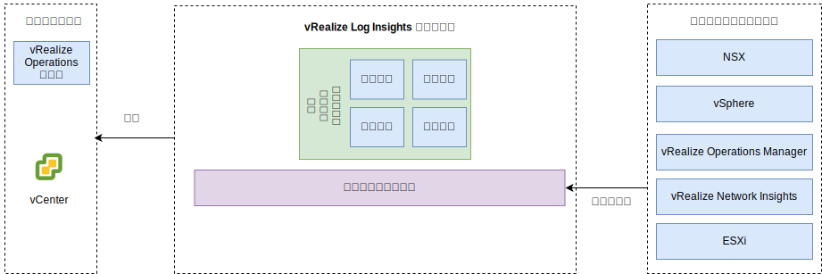

---

copyright:

  years:  2016, 2019

lastupdated: "2019-08-05"

---

# vRealize Log Insights
{: #opsmgmt-vrli}

vRealize Log Insight (vRLI) 環境は、仮想マシン (VM) 4 台と統合ロード・バランサー 1 台で構成されます。

このパターンは、以下をサポートします。
* 仮想マシン 30,000 台
* 1 日あたり 75 Gb のログの取り込み
* 1 秒あたり 5,000 件のイベント

vRealize Log Insight (vRLI) では、{{site.data.keyword.vmwaresolutions_full}} 環境内のコンポーネントをリアルタイムでロギングできます。 この設計では、インスタンスごとにノード 4 台で構成される vRLI クラスターがデプロイされます。 この構成により、可用性が継続し、ログの取り込み速度が向上します。

この設計では、各ロケーションの管理クラスターに独立した vRLI クラスターがデプロイされます。 vRLI クラスターは、{{site.data.keyword.cloud_notm}} のポータブル IP アドレスを使用してツール・サブネットにデプロイされます。 これにより、{{site.data.keyword.cloud_notm}} の RFC1918 アドレス・スペースの範囲外のアドレスを指定されたすべてのコンポーネントとの通信が容易になります。 このようなコンポーネントには、vSphere ホスト、vCenter、Platform Services Controller、NSX Manager、および NSX Controller が含まれます。 vRLI クラスターには、マスター・ノード 1 台とワーカー・ノード 2 台以上、および統合ロード・バランサーが含まれます。

* マスター・ノード - クラスターにおける必須の初期ノード。 マスター・ノードは、照会およびログの取り込みを行います。 マスター・ノードの Web UI は、その vRealize Log Insight クラスターの単一画面です。 データの照会はすべてマスターに転送され、マスターが各ワーカーに対してワークロードを分散させます。
* ワーカー・ノード - スケールアウトするためにワーカーを追加できるクラスターを形成するには、3 台以上のノードが必要です。 ワーカー・ノードはログを取り込み、ログをローカルに保管します。
* 統合ロード・バランサー - 専用のロード・バランシング構成を使用して高可用性を実現します (外部ロード・バランサーは不要です)。
* Log Insight フォワーダー - NSX オーバーレイ・コンポーネントからログを受信するためにデプロイします。 また、コンピュート VM からログを送信したいクライアントもこれを使用できます。 Log Insight フォワーダーは、vRLI クラスターにアラートを転送するためにリモートの syslog 集約機能として使用する単一の vRealize Log Insight マスター・ノードです。 VXLAN-backed のアドレスは BYOIP アドレス・スペースの範囲外にあるので、NSX ESG に NAT ルールを実装する必要があります。

以下のサイズが選択可能で、適切なサイズが選択されています。
* スモール – 1 秒あたり 2,000 件のイベント
* ミディアム – 1 秒あたり 5,000 件のイベント
* ラージ – 1 秒あたり 15,000 件のイベント

vRLI は、中央の場所から環境に関するモニター情報を提供するためにログを収集します。

vRLI は、以下の仮想インフラストラクチャーおよびクラウド管理コンポーネント (ロギング・クライアント) からログ・イベントを収集します。
* vCenter
* ESXi ホスト
* NSX Manager
* NSX Controller
* NSX Edge Services Gateway
* NSX 分散論理ルーター・インスタンス
* NSX ユニバーサル分散論理ルーター
* NSX 分散ファイアウォール ESXi カーネル・モジュール
* vRealize Operations Manager 分析クラスター・ノードおよびリモート・コレクター
* イベント転送の結果としての他のインスタンス内の vRLI インスタンス

以下のロギング・クライアントがサポートされていますが、この設計では統合されていません。
* vRealize Automation アプライアンス
* vRealize Orchestrator (vRealize Automation アプライアンスに組み込まれています)
* vRealize IaaS Web サーバー
* vRealize IaaS 管理サーバー
* vRealize IaaS DEM
* vRealize IaaS プロキシー・エージェント
* vRealize Business サーバー
* vRealize Business データ・コレクター

## システム要件
{: #opsmgmt-vrli-requirements}

環境内のログ・ソースからのすべてのログ・データを収容するには、vRLI ノードのサイズを適切に設定する必要があります。 この設計は、ミディアム・サイズのアプライアンスに基づいています。

表 1. Log Insight のマスター・ノードとレプリカ・ノードのシステム設定

| 属性                | 仕様                     |
| ------------------------ | --------------------------------- |
| vCPU                     | 8                                 |
| メモリー                   | 18 GB                             |
| ディスク (シック・プロビジョン) | 530 GB (イベント・ストレージ用に 490 GB) |

各 vRLI 仮想アプライアンスには、デフォルトの仮想ディスクが 3 つあり、さらに追加の仮想ディスクをストレージとして使用できます。
* ハード・ディスク 1 - ルート・ファイル・システム用に 20 GB
* ハード・ディスク 2 - ミディアム・サイズのデプロイメント用に 510 GB。次の 2 つのパーティションが含まれます。
  * /storage/var - システム・ログ用
  * /storage/core ストレージ - 収集したログ用 (約 475 GB のディスク・スペースが使用可能)

## ネットワーキング
{: #opsmgmt-vrli-network}

vRLI アプライアンスのデプロイメントには、ツールのプライベート・ポータブル・サブネットの IP アドレスが 3 つ必要です。 vRLI から以下へのアクセスが必要です。
* vCenter アプライアンス
* vRealize Log Insight アプライアンス
* NSX-V/T アプライアンス
* ツール拡張 VXLAN
* 顧客ネットワーク
* NTP サーバー (`time.services.softlayer.com`)
* {{site.data.keyword.vmwaresolutions_short}} Active Directory/DNS
* リモート・コレクターを使用するには、マスター・ノード、マスター・ノード・レプリカ、およびデータ・ノードへの接続を可能にするために、NSX ESG に NAT ルールを設定する必要があります。

## ポート
{: #opsmgmt-vrli-ports}

表 2. Log Insight のポート

| 説明                                                   | ポート       | プロトコル |
| ------------------------------------------------------------- | ---------- | -------- |
| フォワーダーの宛先として構成するアウトバウンドの syslog トラフィック | 514        | TCP、UDP |
| SSL 経由の Syslog データ                                          | 1514、6514 | TCP      |
| Log Insight の取り込み API                                     | 9000       | TCP      |
| Log Insight の SSL 経由の取り込み API                            | 9543       | TCP      |
| アプライアンスへの SSH アクセス                                       | 22         | TCP      |
| ユーザー・インターフェース                                                | 80、443    | TCP      |
| NTP                                                           | 123        | UDP      |
| SMTP                                                          | 25         | TCP      |
| DNS                                                           | 53         | UDP      |
| LDAP/LDAPS                                                    | 389、636   | TCP      |
| LDAP GC                                                       | 3268/3269  | TCP      |
| vCenter                                                       | 443        | TCP      |
| vRealize Operations Manager アプライアンス                         | 443        | TCP      |

## 認証
{: #opsmgmt-vrli-auth}

vRLI のユーザー管理には、Active Directory と統合する VMware Identity Manager (vIDM) が必要です。 サービス・アカウントは、vRealize Operations Manager から以下のアダプターへのアプリケーション間通信に使用され、メトリック収集とトポロジー・マッピングに必要な最小限の許可セットが備わっています。
* NSX Manager
* vCenter
* vSAN

## vRealize Log Insight のコンテンツ・パック
{: #opsmgmt-vrli-content}

コンテンツ・パックを導入すると、仮想インフラストラクチャーのきめ細かいモニタリングが追加され、ログの取得、抽出、ならびに人間が読める形式への変換が可能になります。 そのため、vRLI のログの照会とアラートを減らし、ダッシュボードで効率的にモニターすることができます。

デフォルトでは、以下がインストールされます。
* 一般
* VMware vSphere
* VMware vSAN
* VMware vROps

この設計では、以下もインストールされます。
* VMware NSX for vSphere
* vRealize Network Insight

その他のコンテンツ・パックは、[vRealize Log Insight Content Pack](https://marketplace.vmware.com/vsx/?contentType=2&listingStyle=table){:new_window} から入手できます。

## 関連リンク
{: #opsmgmt-vrli-related}

* [Sizing the vRealize Log Insight Virtual Appliance](https://docs.vmware.com/en/vRealize-Log-Insight/4.6/com.vmware.log-insight.getting-started.doc/GUID-284FC5F4-B832-47A7-912E-D407A760CAE4.html){:new_window}
* [vRealize Log Insight](https://docs.vmware.com/en/vRealize-Log-Insight/index.html){:new_window}
