---

copyright:

  years:  2016, 2019

lastupdated: "2019-05-31"

---

# vRealize Network Insight
{: #opsmgmt-vrni}

vRealize Network Insight (vRNI) 環境は、仮想マシン (VM) 2 台、プラットフォーム (UI) およびコントローラー・ノードで構成されています。

vRNI プラットフォーム・アプライアンスは、分析機能、ユーザー・インターフェース、およびデータ管理機能を備えており、NSX Edge、vCenter などのさまざまなデータ・ソースからデータを収集するコントローラー・アプライアンスに接続できます。 すべての vRNI コンポーネントは、{{site.data.keyword.cloud}} プライベート・ポータブル IP アドレスを使用します。 vRLI は vRNI の syslog サーバーとして構成されています。

## システム要件
{: #opsmgmt-vrni-requirements}

このアーキテクチャーは、ミディアムのブリック・サイズを使用して 3000 台の仮想マシンをサポートします。

表 1. Network Insight プラットフォームのシステム要件

| 属性 | 仕様 |
|---|---|
| vCPU | 8 |
| メモリー | 32 GB |
| ディスク (シン・プロビジョニング) | 1 TB |

表 2. Network Insight コレクターのシステム要件

| 属性 | 仕様 |
|---|---|
| vCPU | 4 |
| メモリー | 12 GB |
| ディスク (シン・プロビジョニング) | 200 GB |

## ネットワーキング
{: #opsmgmt-vrni-network}

vRNI アプライアンスのデプロイメントには、ツールのプライベート・ポータブル・サブネットの IP アドレスが 2 つ必要です。 vRNI には、以下にアクセスするためのネットワーク接続が必要です。
* vCenter アプライアンス
* vRealize Log Insight アプライアンス
* NSX-V/T アプライアンス
* ツール拡張 VXLAN
* 顧客ネットワーク
* NTP サーバー (`time.services.softlayer.com`)
* {{site.data.keyword.vmwaresolutions_short}} Active Directory/DNS

## ポート
{: #opsmgmt-vrni-ports}

表 3. Network Insight のポート

| 説明 |ポート | プロトコル |
|---|---|---|
| vRealize Network Insight の VM 間の通信 | 443 | HTTPS |
| インターネット・アクセスを必要とするサービス svc.ni.vmware.com support2.ni.vmware.com reg.ni.vmware.com|443|HTTPS
| Log Insight の取り込み API | 9000 | TCP |
| Log Insight の SSL 経由の取り込み API | 9543 | TCP |
| ユーザー・インターフェース | 80、443 | TCP |
| NTP |123 | UDP |
| SMTP | 25 | TCP |
| DNS| 53 | UDP |
| LDAP/LDAPS | 389、636 | TCP |
| ESXi | 2055 | TCP |
| VMware vSphere / NSX | 443 | TCP |

## 認証
{: #opsmgmt-vrni-auth}

vRNI のユーザー認証は、Active Directory サーバーで直接行われます。

## 関連リンク
{: #opsmgmt-vrni-links}

* [vCenter Server on {{site.data.keyword.cloud_notm}} with Hybridity Bundle の概要](/docs/services/vmwaresolutions/archiref/vcs?topic=vmware-solutions-vcs-hybridity-intro)
* [vRealize Network Insights](https://docs.vmware.com/en/VMware-vRealize-Network-Insight/index.html){:new_window}
