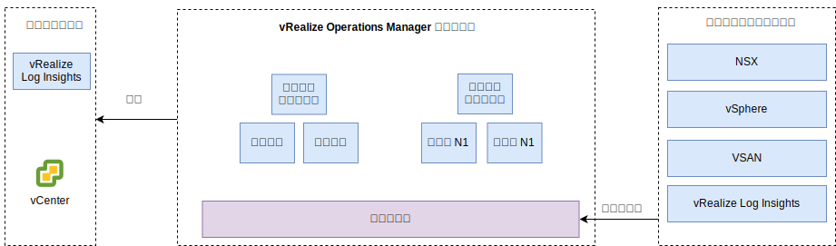

---

copyright:

  years:  2016, 2019

lastupdated: "2019-08-05"

---

# vRealize Operations Manager の設計
{: #opsmgmt-vrops}

vROps 分析クラスターには、モニター対象のコンポーネントからのデータを分析して保管するノードが含まれています。このデプロイメントでは、ノード 4 台と NSX ロード・バランサー 2 台がデプロイされます。 このサイズの構成では、30,000 台までの VM をモニター可能で 9,000,000 個までのメトリックを収集可能です。

ノード 4 台の分析クラスターは、以下のコンポーネントで構成されます。
* マスター・ノード – マスター・ノードは、vROps クラスターの初期ノードです。 大規模な環境では、このノードが他のすべてのノードを管理します。
* マスター・ノード・レプリカ – このノードは、マスター・ノードの高可用性を実現します。
* データ・ノード – このデータ・ノードによって、大規模な環境で vROps のスケールアウトが可能になります。この設計では 2 台デプロイされます。

さらに、この設計ではリモート・コレクター・ノードを使用します。このノードは、データ収集のみを行い、収集したデータをマスター・ノード/データ・ノードに転送する、プロキシー・サーバー/中継サーバーとして機能します。 環境サイズに応じて、データ・ノードおよびリモート・コレクターを追加してスケールアップすることができます。 以下の図に、VLAN/VXLAN への vROps コンポーネントの配置を示します。

* マスター・ノード、マスター・ノード・レプリカ、およびデータ・ノードが {{site.data.keyword.cloud_notm}} のポータブル IP アドレスを使用してツールのサブネットにデプロイされるので、{{site.data.keyword.cloud_notm}} の RFC1918 アドレス・スペースの範囲外のアドレスを指定されたすべてのコンポーネント (vSphere ホスト、vCenter、Platform Services Controller、NSX Manager、および NSX Controller) への通信が容易になります。 NSX ロード・バランサーが VIP と共に使用され、HA が確保されます。
* お客様のワークロードが BYOIP アドレス・スペースの IP アドレスを使用する場合、この設計では、VXLAN でホストされるリモート・コレクターを使用します。 これらのリモート・コレクターは {{site.data.keyword.vmwaresolutions_full}} 自動化の一部として構成されないため、お客様が手動で実装する必要があります。

vROps 分析クラスターには、管理ユーザー・インターフェースまたは API を使用してアクセスします。また、そのクラスターは以下のコンポーネントと統合します。
* vCenter
* vRealize Log Insight

お客様は、以下の製品に手動で統合できます (それらがデプロイされている場合)。
* vRealize Automation
* vRealize Business

vROps は、以下からデータを収集します。
* vSphere - vCenter、Platform Services Controller、vSphere ホスト
* NSX - NSX Manager、NSX Controller、および NSX Edge
* vRLI

お客様は、vRealize Automation および vRealize Business for Cloud からデータを収集するように vROps を手動で構成できます。

## システム要件
{: #opsmgmt-vrops-requirements}

分析クラスターは、スケールアウトと高可用性を実現するために、マスター・ノード 1 台、マスター・レプリカ・ノード 1 台、データ・ノード 2 台で構成されます。 スケールアップするには、データ・ノードを追加します。 最大でミディアム・サイズのノード 8 台構成の分析クラスターに拡大できます。

表 1. Operations Manager マスター/レプリカ・ノードのシステム設定

| 属性 | 仕様 |
|---|---|
| vCPU | 8 |
| メモリー | 32 GB |
| ディスク (シック・プロビジョン) | 254 GB |

表 2. Operations Manager データ・ノードのシステム設定

| 属性 | 仕様 |
|---|---|
| vCPU | 8 |
| メモリー | 32 GB |
| ディスク (シック・プロビジョン) | 254 GB |

コンピュート VM のモニタリングが必要な場合は、お客様が 2 台のリモート・コレクター・ノードを VXLAN にインストールする必要があります。 標準のリモート・コレクター仮想アプライアンスのサイズは、vCPU 2 つに RAM 4 GB であり、デフォルトのアプライアンス VMDK サイズで十分です。 リモート・コレクターは分析操作の実行もデータの保管もしないため、リモート・コレクター・ノードは、シン・プロビジョニングのディスクを使用してデプロイします。

表 3. Operations Manager ロード・バランサーの設定

| 設定 | ロード・バランサー 1 | ロード・バランサー 2|
|---|---|---|
| 名前 | vrops-ui | vrops-data |
| 間隔 | 30 | 5 |
| タイムアウト | 5 | 15 |
| 最大再試行回数 | 3 | |
| タイプ | HTTPS | TCP |
| 方法 | Get | -- |
| URL | /suite-api/api/deployment/node/status | -- |
| 受信 | オンライン | -- |
| アルゴリズム | ROUND-ROBIN | LEASTCONN |
| プール | 4 ノードの vROPs | 4 ノードの vROPs |

詳しくは、[vRealize Automation
Load Balancing (PDF)](https://docs.vmware.com/en/vRealize-Automation/7.5/vrealize-automation-load-balancing.pdf){:new_window}を参照してください。

## ネットワーキング
{: #opsmgmt-vrops-network}

vROps アプライアンスのデプロイメントには、ツールのプライベート・ポータブル・サブネットの IP アドレスが 6 つ必要です。 vROps には、以下にアクセスするためのネットワーク接続が必要です。
* vCenter アプライアンス
* vRealize Log Insight アプライアンス
* NSX-V/T アプライアンス
* ツール拡張 VXLAN
* 顧客ネットワーク
* NTP サーバー (`time.services.softlayer.com`)
* {{site.data.keyword.vmwaresolutions_short}} Active Directory/DNS
* リモート・コレクターを使用するには、マスター・ノード、マスター・ノード・レプリカ、およびデータ・ノードへの接続を可能にするために、NSX ESG に NAT ルールを設定する必要があります。

## ポート
{: #opsmgmt-vrops-ports}

表 4. Operation Manager ポート

| コンポーネント | プロトコル | ポート |
|---|---|---|
| vCenter | TCP | 443 |
| DNS | TCP/UDP | 53 |
| LDAP/LDAPS | TCP | 389/636 |
| LDAP GC | TCP | 3268/3269 |
| NTP | UDP | 123 |
| SMTP | TCP | 25 |
| SNMP | UDP | 161 |

### 認証
{: #opsmgmt-vrops-auth}

vROps のユーザー管理を行うには、Active Directory と統合する VMware Identity Manager (vIDM) が必要です。 サービス・アカウントは、vRealize Operations Manager から以下のアダプターへのアプリケーション間通信に使用され、メトリック収集とトポロジー・マッピングに必要な最小限の許可セットが備わっています。

* NSX Manager
* vCenter
* vSAN

## 管理パック
{: #opsmgmt-vrops-management}

vROps の管理パックは、vROps プラットフォームの運用管理機能を拡張し、製品固有のアラートやダッシュボードを使用できるようにします。

以下の管理パックが vROps にデフォルトでインストールされています。
* Management Pack for VMware vCenter Server
* Management Pack for vRealize Log Insight
* Management Pack for vSAN
* Management Pack for vRealize Automation
* Management Pack for vRealize Business for Cloud

以下のコンポーネントが {{site.data.keyword.vmwaresolutions_short}} によってインストールされています。
* VMware SDDC Health Management Pack
* Management Pack for NSX for vSphere
* vRealize Operations Federation Management Pack
* Management Pack for Hybrid Cloud Extension (HCX)

その他の管理パックは、お客様によってインストール可能です。 詳しくは、[Management Packs at the VMware Exchange](https://marketplace.vmware.com/vsx/?contentType=1&listingStyle=table){:new_window} を参照してください。

### Management Pack for VMware vCenter Server
{: #opsmgmt-vrops-management-vCenter}

このデフォルトの管理パックは、vROps の機能の利用範囲を vCenter にまで拡張し、オブジェクト、メトリック、およびアラートの収集を可能にします。

### Management Pack for vRealize Log Insight
{: #opsmgmt-vrops-management-vrli}

このデフォルトの管理パックは、vROps の機能の利用範囲を vRLI にまで拡張し、vRLI 環境のモニタリングや、vRLI のイベントとアラートを vROps に統合することを可能にします。

### Management Pack for vSAN
{: #opsmgmt-vrops-management-vsan}

vRealize Operations Management Pack for vSAN は、vSAN 固有のダッシュボードを使用して、vSAN オブジェクトや vSAN 対応オブジェクトのパフォーマンスを評価、管理、および最適化できるようにします。

### VMware SDDC Health Management Pack
{: #opsmgmt-vrops-management-sddc}

VMware SDDC Health Management Pack for vROps は、SDDC 管理スタックをモニターし、SDDC 管理スタックに含まれているさまざまなコンポーネントの健全性と効率を表す色分けされたメトリックを利用できるようにします。 VMware SDDC Health Management Pack のダッシュボードを使用して、vCenter Server インスタンスおよび管理ツールの以下のコンポーネントをモニターできます。
* vRealize Operations Manager
* NSX for vSphere/VMware NSX-T
* VMware vSAN
* vRealize Log Insight
* vCenter Server

さらに、お客様が以下をインストールしている場合は、これらもモニターできます。
* vRealize Automation
* vRealize Orchestrator
* vRealize Business for Cloud
* VMware Site Recovery Manager

VMware SDDC Health Management Pack では、以下のダッシュボードが使用可能です。
* SDDC Management Health Overview ダッシュボード - SDDC Management Health Overview ダッシュボードでは、SDDC コンポーネント内のアプリケーション固有の問題を表示および分析できます。
* SDDC Health Historic Trend ダッシュボード - VMware SDDC Health Management Pack は、SDDC Health Historic Trend ダッシュボードで構成されています。このダッシュボードには、SDDC スタック内の各コンポーネントの健全性の傾向が表示されます。
* SDDC vRealize Operations Manager Sizing ダッシュボード - SDDC vRealize Operations Manager Sizing ダッシュボードには、オブジェクトおよびメトリックを処理するための vRealize Operations Manager クラスター容量が表示されます。

VMware SDDC Health Management Pack のプラグインは、プラグインに含まれているオブジェクト・タイプのメトリックを収集します。 Management Pack は、以下のコンポーネントの健全性メトリックを収集します。
* vCenter Server
* Management Pack for NSX for vSphere
* vRealize Automation
* vRealize Operations Manager
* vRealize Business
* vRealize Log Insight
* VMware Site Recovery Manager
* vCenter HA
* vMware vSAN Health
* vCenter Server Appliance のサービス
* vRealize Operations Manager Sizing
* vRealize Orchestrator

### Management Pack for NSX-T
{: #opsmgmt-vrops-management-nsxt}

NSX-T Management Pack は、vROps のコア分析、相関、予測容量、および可視化機能の利用範囲を仮想ネットワークにまで拡張します。 このパックには、以下が含まれています。
* 構成保証
* 健全性
* パフォーマンス
* 容量
* NSX-T オブジェクトのトラブルシューティング

### Management Pack for NSX for vSphere
{: #opsmgmt-vrops-management-nsxv}

NSX for vSphere Management Pack を導入すると、VMware の NSX 仮想ネットワーキング・テクノロジーのデプロイメントが運用管理の範囲に追加されます。 この管理パックは、vROps のコア分析、相関、予測容量、および可視化機能の利用範囲を仮想ネットワークにまで拡張します。 範囲には、NSX 論理スイッチ、論理ルーター、エッジ・サービス、分散ファイアウォール、およびロード・バランサーについての、構成保証、健全性、パフォーマンス、容量、およびトラブルシューティングが含まれます。

NSX for vSphere Management Pack は vROps と緊密に統合されており、vSphere ホストのデータは、そのホスト上で実行されている NSX サービスと相関しています。 vRLI を介してログが統合されているため、ログ・メッセージを介してトリガーされたエラー状態および停止状態は、管理パックのオブジェクトと問題のウィンドウ内でアラートが表示されます。

### vRealize Operations Federation Management Pack
{: #opsmgmt-vrops-management-federation}

vRealize Operations Federation Management Pack では、マルチサイトの vROps デプロイメントを単一画面で確認できます。 これにより、単一の vROps のデプロイメントで、指定したオブジェクトの重要なメトリックを複数の vROps デプロイメントから受信できます。

### Management Pack for Hybrid Cloud Extension (HCX)
{: #opsmgmt-vrops-management-hcx}

vRealize Operations Management Pack for HCX は、vROps の運用管理機能の利用範囲を、HCX の備えるハイブリッド機能にまで拡張します。 この管理パックを導入すると、メトリック、変更イベント、およびリソース・トポロジー情報を HCX から収集できます。 これにより、HCX の相互接続、移行、または保護ワークロードのパフォーマンス・ボトルネックのモニター、切り分け、および解決が可能になります。

## 関連リンク
{: #opsmgmt-vrops-management-links}

* [vRealize Operations Manager 7.0 Sizing Guidelines](https://kb.vmware.com/s/article/57903){:new_window}
* [vRealize Operations Manager のドキュメント](https://docs.vmware.com/en/vRealize-Operations-Manager/index.html){:new_window}
* [Management Pack for vSAN](https://marketplace.vmware.com/resources/vsx/product_files/31742/original/Management-Pack-for-vSAN-Guide6d2a8895b022a5f626a86e8e84b031b5.pdf){:new_window}
* [vSAN クラスターの更新手順を確認する](/docs/services/vmwaresolutions/archiref/vum?topic=vmware-solutions-vum-updating-vsan)
* [Management-Pack-for-vSAN-Guide](https://marketplace.vmware.com/resources/vsx/product_files/31742/original/Management-Pack-for-vSAN-Guide6d2a8895b022a5f626a86e8e84b031b5.pdf){:new_window}
* [vSAN Health Check Information](https://kb.vmware.com/s/article/2114803){:new_window}
* [Operationalizing VMware NSX](https://www.vmware.com/content/dam/digitalmarketing/vmware/en/pdf/products/nsx/vmware-operationalizing-nsx.pdf){:new_window}
* [NSX Operations Guide](https://communities.vmware.com/servlet/JiveServlet/previewBody/30079-102-2-40474/NSX-Operations-Guide-v6.1.pdf){:new_window}
