---

copyright:

  years:  2016, 2019

lastupdated: "2019-08-05"

---

# VMware Update Manager
{: #opsmgmt-vum}

VMware Update Manager (VUM) により、VMware vSphere のパッチおよびバージョン管理を一元化し、自動化できます。これにより、{{site.data.keyword.cloud}} 環境の VMware vCenter Server で以下のタスクを実行できます。
* vSphere ESXi ホストのアップグレードとパッチ適用
* ホスト上のサード・パーティー・ソフトウェアのインストールと更新
* 仮想マシン (VM) ハードウェア、VMware ツール、および仮想アプライアンスのアップグレード

VMware Update Manager の詳細な設計については、[VMware Update Manager の概要](/docs/services/vmwaresolutions/archiref/vum?topic=vmware-solutions-vum-intro)を参照してください。

## 関連リンク
{: #opsmgmt-vum-links}

* [VMware Update Manager](https://docs.vmware.com/en/VMware-vSphere/6.5/com.vmware.vsphere.update_manager.doc/GUID-F7191592-048B-40C7-A610-CFEE6A790AB0.html){:new_window}
