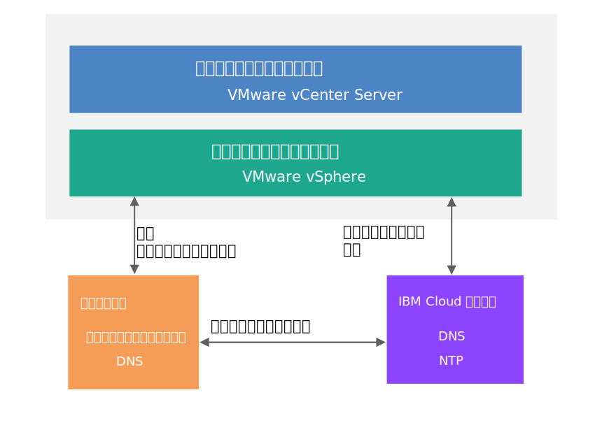

---

copyright:

  years:  2016, 2018

lastupdated: "2018-10-29"

---

{:tip: .tip}
{:note: .note}
{:important: .important}

# 共通サービス設計

共通サービスは、クラウド管理プラットフォームの他のサービスによって使用されるサービスを提供します。 ソリューションの共通サービスには、ID およびアクセスのサービス、ドメイン・ネーム・サービス、NTP サービス、SMTP サービス、および認証局サービスが含まれます。

## ID およびアクセス・サービス

この設計では、ID 管理に Microsoft Active Directory (AD) が使用されます。 この設計では、Cloud Foundation および vCenter Server のデプロイメントの自動化の一環として、1 つまたは 2 つの Active Directory 仮想マシンがデプロイされます。 vCenter は AD 認証を利用するように構成されます。

### Microsoft Active Directory

デフォルトでは単一の Active Directory VSI が {{site.data.keyword.cloud}} インフラストラクチャーにデプロイされます。 この設計では、オプションで 2 台の高可用性 Microsoft Active Directory サーバーを、専用の Windows Server VM として管理クラスターにデプロイすることもできます。

このオプションを選択する場合、Microsoft のライセンス取得とアクティベーションはお客様の責任で行っていただきます。
{:note}

Active Directory の役目は VMware インスタンスを管理するためのアクセスの認証のみであり、デプロイされたインスタンスでのワークロードのユーザーの格納ではありません。 Active Directory サーバーのフォレスト・ルート・ドメイン名は、ユーザーが指定する DNS ドメイン名と同じです。 複数のインスタンスがリンクされている場合、このドメイン名は Cloud Foundation および vCenter Server のプライマリー・インスタンスに対してのみ指定されます。 リンクされたインスタンスでは、各インスタンスに、フォレスト・ルート・レプリカ・リングに入っている Active Directory サーバーが含まれています。Active Directory サーバー上には、DNS ゾーン・ファイルも複製されています。

### vSphere SSO ドメイン

vSphere シングル・サインオン (SSO) ドメインは、単一インスタンスや複数のリンクされたインスタンスのための初期認証メカニズムとして使用されます。 SSO ドメインは、VMware インスタンスや複数のリンクされたインスタンスを Microsoft Active Directory サーバーに接続する役目も担います。 次の SSO 構成が適用されます。  
* SSO ドメイン `vsphere.local` が、常に使用されます
* 既存のインスタンスに紐付けられた VMware インスタンスの場合、PSC が既存インスタンスの SSO ドメインに結合されます
* SSO サイト名はインスタンス名と同じです

## ドメイン・ネーム・サービス (DNS)

この設計において DNS は、クラウド管理とインフラストラクチャーのコンポーネントのためにのみ使用されています。

### VMware vCenter Server

vCenter Server デプロイメントでは、デプロイ済みの Active Directory サーバーがインスタンス用の DNS サーバーとして使用されます。 デプロイ済みのコンポーネント (vCenter、PSC、NSX、および ESXi ホスト) はすべて、Active Directory サーバーをデフォルトの DNS サーバーとしてポイントするように構成されます。 DNS ゾーン構成はカスタマイズ可能です。これは、カスタマイズした構成が、デプロイ済みのコンポーネントの構成と干渉しない場合に可能です。

この設計では、次の構成によって、Active Directory サーバー上で DNS サービスが統合されます。
* ドメイン構造は、指定することができます。 ドメイン名のレベル数はいくつでもかまいません (ただし、vCenter Server コンポーネントが処理できる最大数以下)。 最下のレベルが、インスタンスのサブドメインとなります。
   * 指定した DNS ドメイン名は Active Directory のルート・フォレスト・ドメイン名として使用されます。 例えば、DNS ドメイン名が `cloud.ibm.com` の場合、Active Directory のフォレスト・ルート・ドメイン名は `cloud.ibm.com` になります。 この DNS と Active Directory のドメイン名は、リンクされているすべての vCenter Server インスタンスで同じとなります。
   * さらに、インスタンスにはサブドメイン名を指定できます。サブドメイン名はリンクされているすべての vCenter Server インスタンスで一意である必要があります。
* Active Directory DNS サーバーは、DNS ドメインとサブドメイン領域の両方で権限を持つように構成されます。
* Active Directory DNS サーバーは、他のすべてのゾーンに対して  {{site.data.keyword.cloud_notm}} DNS サーバーをポイントするように構成されます。
* 既存のターゲット・インスタンスに統合するすべてのインスタンスは、プライマリー・インスタンスと同じドメイン名を使用する必要があります。

### VMware Cloud Foundation

Cloud Foundation デプロイメントでは VMware Cloud Foundation 自動化が使用されます。VMware Cloud Foundation 自動化では SDDC Manager VM コンポーネント内にある独自の DNS サーバーが使用されます。 SDDC Manager によって管理される Cloud Foundation のコンポーネント (vCenter、PSC、NSX、ESXi ホストなど) は、
設計により、SDDC Manager VM IP アドレスをデフォルトの DNS として使用するように構成されます。

SDDC Manager が管理するコンポーネントのホスト名は SDDC Manager が生成して保持するので、ホスト名を追加または削除するために DNS ゾーン・ファイルに直接手を加えることは推奨されません。

この設計では、次の構成内で、Active Directory サーバー上の DNS サービスが SDDC Manager VM と統合されます。
* ドメイン構造は、指定することができます。 ドメイン名のレベル数はいくつでもかまいません (ただし、Cloud Foundation コンポーネントが処理できる最大数以下)。
* 最下のレベルが、SDDC Manager の権限が及ぶサブドメインとなります。
* 指定した DNS ドメイン名は Active Directory のルート・フォレスト・ドメイン名として使用されます。 例えば、DNS ドメイン名が `cloud.ibm.com` の場合、Active Directory ドメインのフォレスト・ルートは `cloud.ibm.com` になります。 この DNS ドメインと Active Directory ドメインは、リンクされているすべての Cloud Foundation インスタンスで同じです。
* さらに、インスタンスにはサブドメイン名を指定できます。サブドメイン名はリンクされているすべての Cloud Foundation インスタンスの中で一意である必要があります。  
* SDDC Manager の DNS 構成は、自身が受け持つゾーン以外のすべてのゾーンに対して Active Directory サーバーをポイントするように変更されます。
* Active Directory DNS サーバーは、SDDC Manager と Cloud Foundation のインスタンスのサブドメインより上の DNS ドメイン領域で権限を持つように構成されます。
* Active Directory DNS サーバーは、SDDC Manager の権限が及ぶゾーンのサブドメインの委任に対して SDDC Manager の IP アドレスをポイントするように構成されます。
* Active Directory DNS サーバーは、他のすべてのゾーンに対して {{site.data.keyword.cloud_notm}} DNS サーバーをポイントするように構成されます。
* 最初のインスタンスまたはターゲット・インスタンスに統合されるすべてのセカンダリー・インスタンスは、SDDC Manager サブドメインより上の同じ DNS 名の構造を使用する必要があります。

## NTP サービス

この設計では {{site.data.keyword.cloud_notm}} インフラストラクチャーの NTP サーバーが使用されます。 デプロイ済みのすべてのコンポーネントは、これらの NTP サーバーを使用するように構成されます。 設計内のすべてのコンポーネントが同じ NTP サーバーを使用するようにすることは、証明書と Active Directory 認証が正しく機能するために必要不可欠です。

図 1. NTP サービス

## 認証局サービス

デフォルトで、VMware vSphere は VMware 認証局 (VMCA) によって署名された TLS 証明書を使用します。この認証局は VMware Platform Services Controller アプライアンスにあります。これらの証明書はエンドユーザーのデバイスやブラウザーによって信頼されません。 セキュリティー上でのベスト・プラクティスは、ユーザーに表示される証明書を、サード・パーティーまたは企業の認証局 (CA) によって署名された証明書に置き換えることです。 マシン間の通信の証明書は、VMCA によって署名された証明書のままにすることもできますが、組織のためにはベスト・プラクティスに従うことをお勧めします。ベスト・プラクティスには通常、識別された企業 CA を使用することが含まれます。

この設計で Windows AD サーバーを使用して、ローカル・インスタンスによって署名される証明書を作成できます。 ただし、必要に応じて CA サービスの構成を選択することもできます。

### 関連リンク

* [物理インフラストラクチャー設計](design_physicalinfrastructure.html)
* [仮想インフラストラクチャー設計](design_virtualinfrastructure.html)
* [インフラストラクチャー管理設計](design_infrastructuremgmt.html)
