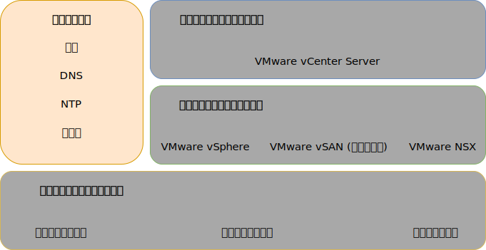
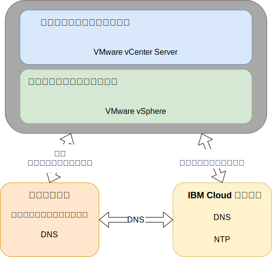

---

copyright:

  years:  2016, 2019

lastupdated: "2019-03-19"

subcollection: vmware-solutions

---

{:tip: .tip}
{:note: .note}
{:important: .important}

# 共通サービス設計
{: #design_commonservice}

共通サービスは、クラウド管理プラットフォームの他のサービスによって使用されるサービスを提供します。 ソリューションの共通サービスには、ID およびアクセスのサービス、ドメイン・ネーム・サービス、NTP サービス、SMTP サービス、および認証局サービスが含まれます。

図 1. 共通サービス 

## ID およびアクセス・サービス
{: #design_commonservice-identity-access}

この設計では、ID 管理に Microsoft Active Directory (MSAD) が使用されます。 この設計では、vCenter Server のデプロイメントの自動化の一環として、1 つまたは 2 つの Active Directory 仮想マシンがデプロイされます。 vCenter は MSAD 認証を利用するように構成されます。

### Microsoft Active Directory
{: #design_commonservice-msad}

デフォルトでは単一の Active Directory VSI が {{site.data.keyword.cloud}} インフラストラクチャーにデプロイされます。

この設計では、オプションで 2 台の高可用性 MSAD サーバーを、専用の Windows Server VM として管理クラスターにデプロイすることもできます。

2 つの高可用性 MSAD サーバーのオプションを選択する場合は、お客様の責任で Microsoft ライセンスの取得とアクティベーションを行う必要があります。
{:note}

Active Directory の役目は VMware インスタンスを管理するためのアクセスの認証のみであり、デプロイされたインスタンスでのワークロードのユーザーの格納ではありません。 Active Directory サーバーのフォレスト・ルート・ドメイン名は、ユーザーが指定する DNS ドメイン名と同じです。 複数のインスタンスがリンクされている場合、このドメイン名は vCenter Server のプライマリー・インスタンスに対してのみ指定されます。 リンクされたインスタンスでは、各インスタンスに、フォレスト・ルート・レプリカ・リングに入っている Active Directory サーバーが含まれています。 Active Directory サーバー上には、DNS ゾーン・ファイルも複製されています。

### vSphere SSO ドメイン
{: #design_commonservice-vsphere-sso}

vSphere シングル・サインオン (SSO) ドメインは、単一インスタンスや複数のリンクされたインスタンスのための初期認証メカニズムとして使用されます。 SSO ドメインは、VMware インスタンスや複数のリンクされたインスタンスを MSAD サーバーに接続する役目も担います。 次の SSO 構成が適用されます。  
* SSO ドメイン `vsphere.local` が、常に使用されます
* 既存のインスタンスに紐付けられた VMware インスタンスの場合、統合された PSC が既存インスタンスの SSO ドメインに結合されます
* SSO サイト名はインスタンス名と同じです

## ドメイン・ネーム・サービス
{: #design_commonservice-dns}

この設計では、ドメイン・ネーム・サービス (DNS) は、クラウド管理とインフラストラクチャーのコンポーネントのためにのみ使用されています。

### プライマリー vCenter Server インスタンス
{: #design_commonservice-primary-vcs}

vCenter Server デプロイメントでは、デプロイ済みの AD VSI がインスタンスの DNS サーバーとして使用されます。 デプロイ済みのコンポーネント (PSC を組み込んだ vCenter、NSX、ESXi のホスト) はすべて、AD をデフォルトの DNS としてポイントするように構成されます。 DNS ゾーン構成は、デプロイ済みのコンポーネントの構成と干渉しない限りカスタマイズが可能です。
- この設計では、次の構成によって、AD VSI 上で DNS サービスが統合されます。
- ドメイン構造は、ユーザーが指定します。 ドメイン名のレベル数は幾つでも構いませんが、すべての vCenter Server コンポーネントが処理できる最大数以下でなければなりません。最低レベルはインスタンスのサブドメインになります。
    - 指定した DNS ドメイン名は、vCenter Server にデプロイした AD ルート・フォレストのドメイン名として使用されます。 例えば、DNS ドメイン名が cloud.ibm.com の場合、AD ドメインのフォレスト・ルートは cloud.ibm.com になります。 DNS ドメインと AD ドメインは、vCenter Server のどの統合インスタンスでも同一になります。
    - vCenter Server インスタンス・サブドメインとしてもう 1 つの名前を選択します。 このサブドメイン名はリンクされているすべての vCenter Server インスタンスで一意である必要があります。
- AD DNS サーバーは、DNS ドメインとサブドメイン領域の両方で権限を持つように構成されます。
- AD DNS サーバーは、他のすべてのゾーンに対して {{site.data.keyword.cloud_notm}} DNS サーバーをポイントするように構成されます。
- 第 1 の、またはターゲットのデプロイ済みクラウド地域に統合されたセカンダリー・クラウド地域では、サブドメインより上で同じ DNS 名構造を使用する必要があります。
- vCenter Server クラスター内に冗長 DNS サーバーをデプロイすることもできます。 ライセンスのない状態で 2 つの AD/DNS サーバーが構成されます。 そうしたサーバーのために Windows オペレーティング・システムのライセンスを用意するのは、お客様の責任です。
- 1 つの AD/DNS サーバーだけで 1 つのサイトがプロビジョンされている場合は、構成済みのすべての vCenter Server コンポーネントがその 1 つの IP だけを DNS エントリーとして持っていることが必要です。

### セカンダリー vCenter Server インスタンス
{: #design_commonservice-secondary-vcs}

クロス・インスタンスの冗長性のために、既存のプライマリー vCenter Server インスタンスまたは現在のスタンドアロン vCenter Server インスタンスに最初のセカンダリー vCenter Server インスタンスを追加すると、DNS サーバー・エントリーが必要とされるどのコンポーネントにも、プライマリー・インスタンスの AD DNS サーバー IP アドレスが、最初のセカンダリー vCenter Server インスタンスとその後のすべてのセカンダリー vCenter Server インスタンスの「セカンダリー DNS」エントリーで使用されます。 例えば、ESXi、vCenter、NSX Manager などです。 これには、HCX、Zerto、Veeam などのアドオン・コンポーネントも含まれます。 その後、プライマリー・サイトのセカンダリー DNS エントリーが、最初のセカンダリー vCenter Server インスタンスの AD/DNS IP アドレスに変更されます。

## NTP サービス
{: #design_commonservice-ntp}

この設計では {{site.data.keyword.cloud_notm}} インフラストラクチャーの NTP サーバーが使用されます。 デプロイ済みのすべてのコンポーネントは、これらの NTP サーバーを使用するように構成されます。 設計内のすべてのコンポーネントが同じ NTP サーバーを使用するようにすることは、証明書と Active Directory 認証が正しく機能するために必要不可欠です。

図 2. NTP サービスと DNS サービス 

## 認証局サービス
{: #design_commonservice-cas}

デフォルトで、VMware vSphere は VMware 認証局 (VMCA) によって署名された TLS 証明書を使用します。この認証局は VMware Platform Services Controller アプライアンスにあります。これらの証明書はエンドユーザーのデバイスやブラウザーによって信頼されません。 セキュリティー上でのベスト・プラクティスは、ユーザーに表示される証明書を、サード・パーティーまたは企業の認証局 (CA) によって署名された証明書に置き換えることです。 マシン間の通信の証明書は、VMCA によって署名された証明書のままにすることもできますが、組織のためにはベスト・プラクティスに従うことをお勧めします。ベスト・プラクティスには通常、識別された企業 CA を使用することが含まれます。

この設計で Windows AD サーバーを使用して、ローカル・インスタンスによって署名される証明書を作成できます。 ただし、必要に応じて CA サービスの構成を選択することもできます。

## 関連リンク
{: #design_commonservice-related}

* [物理インフラストラクチャー設計](/docs/services/vmwaresolutions/archiref/solution?topic=vmware-solutions-design_physicalinfrastructure)
* [仮想インフラストラクチャー設計](/docs/services/vmwaresolutions/archiref/solution?topic=vmware-solutions-design_virtualinfrastructure)
* [インフラストラクチャーの管理の設計](/docs/services/vmwaresolutions/archiref/solution?topic=vmware-solutions-design_infrastructuremgmt)
