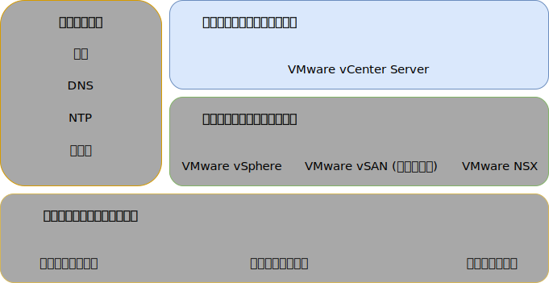

---

copyright:

  years:  2016, 2019

lastupdated: "2019-05-07"

subcollection: vmware-solutions

---

{:tip: .tip}
{:note: .note}
{:important: .important}

# インフラストラクチャーの管理の設計
{: #design_infrastructuremgmt}

インフラストラクチャーの管理とは、VMware インフラストラクチャーを管理するコンポーネントのことを指します。
* Platform Services Controller (PSC) を組み込んだ vCenter Server は、vSphere 環境を管理するための中央プラットフォームで、このソリューションの基本的なコンポーネントの 1 つです。
* このソリューションでは PSC を使用して、VMware vCenter のシングル・サインオン、ライセンス・サービス、ルックアップ・サービス、VMware 認証局など、一連のインフラストラクチャー・サービスを提供します。

この設計では、vCenter Server インスタンスに統合した PSC 機能を使用します。 PSC と vCenter Server は同じ仮想マシン (VM) に配置されます。

プライマリー・インスタンスにある PSC には、デフォルトの SSO ドメインである `vsphere.local` が割り当てられます。

## vCenter Server の設計
{: #design_infrastructuremgmt-vcenter}

PSC を組み込んだ vCenter Server は、管理 VM と関連付けられたプライベート VLAN のポータブル・サブネット上にインストールされます。 そのデフォルト・ゲートウェイは、その特定のサブネットの BCR に割り当てられた IP アドレスに設定されます。 仮想アプライアンスは、次の表の仕様を使って構成されます。

表 1. vCenter Server アプライアンスの仕様

| 属性                    | 仕様                       |
|------------------------------|-------------------------------------|
| vCenter Server               | 仮想アプライアンス                   |
| アプライアンスのインストール・サイズ  | 大 (最大 1,000 ホスト、10,000 VM) |
| Platform Services Controller | 統合                            |
| vCPU の数              | 16                                   |
| メモリー                       | 32 GB                               |
| ディスク                         | ローカル・データ・ストアに 990 GB (ラージ・ディスク・デプロイメント) |
| ディスク・タイプ                    | シン (プロビジョン済み)                    |

### vCenter Server データベース
{: #design_infrastructuremgmt-vcenter-db}

vCenter Server の構成では、アプライアンスに含まれているローカルの組み込み PostgreSQL データベースを使用します。 この組み込みのデータベースは、外部データベースおよびライセンス交付の依存関係を削除するために使用されます。

### vCenter Server クラスターの仕様
{: #design_infrastructuremgmt-vcenter-cluster}

この設計では、ソリューションでプロビジョンされた vSphere ESXi ホストをクラスター化することができます。 ただし、クラスターを作成する前に、vSphere ESXi ホストとデータ・センター内のポッドの場所を指示するデータ・センター・オブジェクトを作成します。 クラスターは、データ・センター・オブジェクトが作成された後に作成されます。 クラスターは、VMware vSphere High Availability (HA) と VMware vSphere Distributed Resource Scheduler (DRS) を有効にした状態でデプロイされます。

### vSphere Distributed Resource Scheduler
{: #design_infrastructuremgmt-vsphere-drs}

この設計では、初期クラスターで vSphere Distributed Resource Scheduling (DRS) を使用して VM を配置し、追加のクラスターで DRS を使用して VM を動的にマイグレーションして、バランスのとれたクラスターを実現します。 自動化レベルを「完全自動化」に設定して、最初の配置とマイグレーションの推奨が vSphere によって自動的に実行されるようにします。 さらに、マイグレーションのしきい値を「中度」に設定することにより、vCenter が優先度 1、2、3 の推奨を適用して、クラスターのロード・バランシングにしかるべき程度以上の改善が見られるようにする必要があります。

この設計では**分散電源管理**機能での電源管理は使用しません。
{:note}

### vSphere High Availability
{: #design_infrastructuremgmt-vsphere-ha}

この設計では、初期クラスターおよび追加クラスターで vSphere High Availability (HA) によりコンピューティングの障害が検出され、クラスター内で実行されている VM が修復されます。 この設計の vSphere HA 機能は、クラスター内で「**ホストのモニタリング (Host Monitoring)**」と「**アドミッション制御 (Admission Control)**」の両方のオプションを有効にして構成されます。 さらに、初期クラスターには、アドミッション制御ポリシーのための予備容量として 1 ノード分のリソースが予約されています。

クラスターが後に拡張または縮小されるときは、お客様にアドミッション制御ポリシーを調整する責任があります。
{:note}

デフォルトで、「**VM 再起動優先順位 (VM restart priority)**」オプションは「中 (medium)」に、「**ホスト分離応答 (Host isolation response)**」オプションは無効に設定されています。 さらに、「**VM のモニタリング (VM monitoring)**」は無効に設定され、「**データストア・ハートビート (Datastore Heartbeating)**」フィーチャーはすべてのクラスター・データ・ストアを含めるように構成されます。 この方法では、NAS データ・ストアがあるときにはそれらを使用します。

### Enhanced vMotion Compatibility
{: #design_infrastructuremgmt-evc}

CPU の機能が異なる可能性のあるクラスター・ノード間で vMotion の互換性の処理を簡略化するために、Skylake レベルで Enhanced vMotion Compatibility (EVC) モードが有効になります。その結果、{{site.data.keyword.cloud_notm}} インベントリーに新しいプロセッサーが届いた時に、クラスター・ノード間で vMotion の互換性が確保され、Skylake プロセッサー・サーバーがインベントリーにない場合でも、将来のクラスター拡張が可能になります。

## IBM CloudDriver
{: #design_infrastructuremgmt-cloud-driver}

こうしたソリューションの基礎になっているのが自動処理です。 自動処理によってデプロイメントの複雑さが解消され、デプロイメント時間が大幅に短縮され、VMware インスタンスが一貫した方法でデプロイされるようになります。

IBM CloudBuilder は、一時的な {{site.data.keyword.cloud_notm}} VM 仮想サーバー・インスタンス (VSI) です。新しい VMware インスタンスを起動して、ライフサイクル管理機能を実行する、という役割を果たします。 それは、全体的な vCenter Server インスタンス管理が必要になるとデプロイされ、そのプロセスが完了すると破棄されます。

IBM CloudDriver は、一時的な {{site.data.keyword.cloud_notm}} VM virtual サーバー・インスタンス (VSI) です。VMware インスタンスに対してホスト、クラスター、またはアドオン・サービスを追加するなどの Day 2 操作のために必要に応じてデプロイされます。

CloudBuilder および CloudDriver は、プライベート・メッセージ・キューを介して IBM 管理プレーンに接続されたプライベート・ネットワークでのみデプロイされます。 これらは IBM 開発コンポーネントで、ユーザーがアクセスすることはできません。以下の属性と機能があります。
* ユーザー・アカウントに属する vCenter Server インスタンスのデプロイメントと構成。
* vCenter Server クラスターでのホストの追加と削除。
* vCenter Server インスタンスでのクラスターの追加と削除。
* vCenter Server インスタンスでのアドオン・サービスや機能の追加と削除。

### 自動化フロー
{: #design_infrastructuremgmt-auto-flow}

{{site.data.keyword.vmwaresolutions_short}} コンソールから VMware インスタンスを注文する場合のイベントの順序を以下にまとめます。
1. {{site.data.keyword.cloud_notm}} からネットワーキングのための VLAN とサブネットの注文。
2. vSphere Hypervisor をインストールした {{site.data.keyword.cloud_notm}} {{site.data.keyword.baremetal_short}} の注文。
3. Active Directory ドメイン・コントローラーとして使用する Microsoft Windows VSI の注文。
4. Cloud Driver VSI のデプロイメント。
5. ネットワーキングとデプロイ済みハードウェアの妥当性検査。
6. 該当する場合、単一ノード vSAN の初期構成。
7. PSC を組み込んだ vCenter と NSX のデプロイメントと構成。
8. 残りの ESXi ノードのクラスター化、vSAN の拡張 (該当する場合)、および NSX コンポーネント (VTEP) の構成。
9. 環境のインストールおよび構成の妥当性検査。
10. バックアップ・サーバーやストレージなど、オプション・サービスのデプロイメント。
11. Cloud Driver VSI の削除。

## ID とパスワード
{: #design_infrastructuremgmt-ids-pwd}

vCenter Server に含まれているすべての ID とパスワードが {{site.data.keyword.cloud_notm}} 管理面で暗号化され、IC4V 管理インフラストラクチャーに保管されます。 ユーザーがそのパスワードを変更すると、vCenter Server の自動処理機能が中断することがあります。

自動処理を中断なしで進めるために、変更したパスワードを IC4V ソリューション・ポータルで指定できます。 そのソリューション・ポータルで、入力したパスワードの確認を行うこともできます。

## 関連リンク
{: #design_infrastructuremgmt-related}

* [物理インフラストラクチャー設計](/docs/services/vmwaresolutions/archiref/solution?topic=vmware-solutions-design_physicalinfrastructure)
* [仮想インフラストラクチャー設計](/docs/services/vmwaresolutions/archiref/solution?topic=vmware-solutions-design_virtualinfrastructure)
* [共通サービス設計](/docs/services/vmwaresolutions/archiref/solution?topic=vmware-solutions-design_commonservice)
