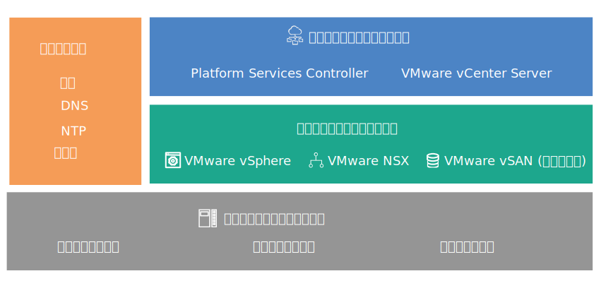

---

copyright:

  years:  2016, 2019

lastupdated: "2019-02-15"

---
# 設計の概要
{: #design_overview}

{{site.data.keyword.vmwaresolutions_full}} は、世界中の {{site.data.keyword.CloudDataCents_notm}}に VMware テクノロジー・コンポーネントをデプロイするための自動化機能を提供します。

## ソリューション・オファリング
{: #design_overview-offerings}

ソリューション・オファリングでは、自動的にデプロイされて構成されるクラスター内に以下の VMware vSphere 製品が組み込まれます。
* VMware Cloud Foundation: vSphere ESXi、Platform Services Controller (PSC)、VMware vCenter Server Appliance、SDDC Manager、VMware NSX、VMware vSAN。
* VMware vCenter Server: vSphere ESXi、Platform Services Controller (PSC)、vCenter Server Appliance、NSX、vSAN (オプション)。

この設計では、初回注文時に単一ポッドの {{site.data.keyword.CloudDataCent_notm}}にインスタンスがデプロイされます。 初期デプロイメント後、同じデータ・センター内の他のポッド、または他のデータ・センターに仮想環境を拡張できます。

またこの設計では、Cloud Foundation または vCenter Server インスタンス内の仮想キャパシティーの自動拡張と自動縮小も可能です。

## VMware on IBM Cloud のコンポーネント
{: #design_overview-comp}

図 1. VMware on {{site.data.keyword.cloud_notm}} のコンポーネント

## 関連リンク
{: #design_overview-related}

* [物理インフラストラクチャー設計](/docs/services/vmwaresolutions/archiref/solution?topic=vmware-solutions-design_physicalinfrastructure)
* [仮想インフラストラクチャー設計](/docs/services/vmwaresolutions/archiref/solution?topic=vmware-solutions-design_virtualinfrastructure)
* [共通サービス設計](/docs/services/vmwaresolutions/archiref/solution?topic=vmware-solutions-design_commonservice)
* [インフラストラクチャーの管理の設計](/docs/services/vmwaresolutions/archiref/solution?topic=vmware-solutions-design_infrastructuremgmt)
