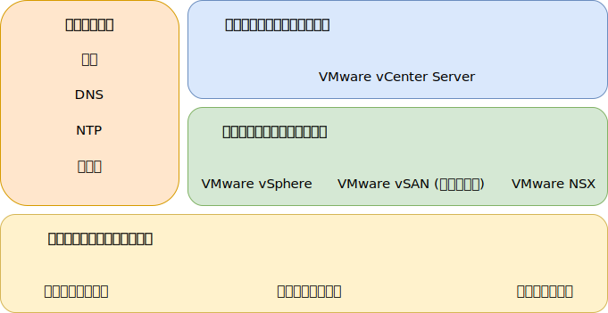

---

copyright:

  years:  2016, 2019

lastupdated: "2019-03-15"

subcollection: vmware-solutions

---
# IBM Cloud for VMware Solutions のコンポーネント
{: #design_overview}

{{site.data.keyword.vmwaresolutions_full}} は、世界中の {{site.data.keyword.CloudDataCents_notm}}に VMware テクノロジー・コンポーネントをデプロイするための自動化機能を提供します。

このソリューション・ポートフォリオのオファリングには、自動的にデプロイされて構成されるクラスター内の各種 VMware vSphere 製品が含まれています。つまり、VMware vSphere ESXi、Platform Services Controller (PSC) を組み込んだ VMware vCenter Server Appliance、VMware NSX-V または NSX-T、VMware vSAN (オプション) です。

このアーキテクチャーは単一のクラウド領域で構成されます。また、別の地域にある追加のクラウド領域、および同じデータ・センター内の別の {{site.data.keyword.cloud_notm}} ポッドに拡張する機能をサポートします。 領域は固有の vCenter Server インスタンスと定義されます。 この設計では、vCenter Server インスタンス内の仮想キャパシティーの自動拡張と自動縮小も可能です。

図 1. {{site.data.keyword.vmwaresolutions_short}} のソリューション・コンポーネント

## 関連リンク
{: #design_overview-related}

* [物理インフラストラクチャー設計](/docs/services/vmwaresolutions/archiref/solution?topic=vmware-solutions-design_physicalinfrastructure)
* [仮想インフラストラクチャー設計](/docs/services/vmwaresolutions/archiref/solution?topic=vmware-solutions-design_virtualinfrastructure)
* [共通サービス設計](/docs/services/vmwaresolutions/archiref/solution?topic=vmware-solutions-design_commonservice)
* [インフラストラクチャーの管理の設計](/docs/services/vmwaresolutions/archiref/solution?topic=vmware-solutions-design_infrastructuremgmt)
