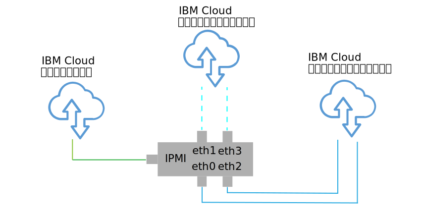
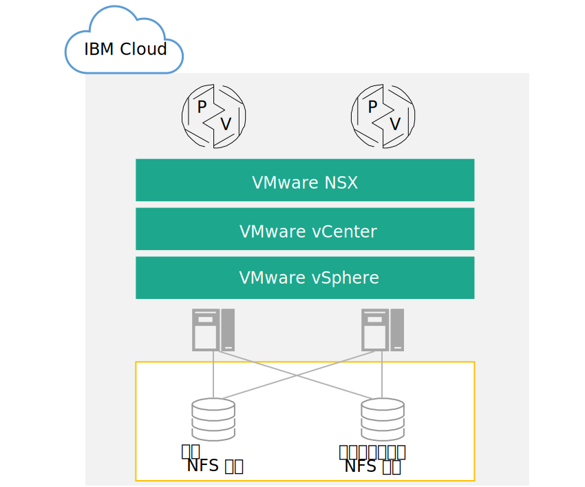

---

copyright:

  years:  2016, 2018

lastupdated: "2018-10-29"

---

{:tip: .tip}
{:note: .note}
{:important: .important}

# 物理インフラストラクチャー設計

物理インフラストラクチャーは、以下のコンポーネントで構成されています。

<dl class="dl">
  <dt class="dt dlterm">物理コンピュート</dt>
  <dd class="dd">物理コンピュートは、仮想インフラストラクチャーによって使用される物理処理と物理メモリーを提供します。 この設計では、コンピュート・コンポーネントは {{site.data.keyword.baremetal_long}}によって提供されます。これらのコンポーネントは、[VMware Hardware Compatibility Guide (HCG)](https://www.vmware.com/resources/compatibility/search.php) にリストされています。</dd>
  <dt class="dt dlterm">物理ストレージ</dt>
  <dd class="dd">物理ストレージは、仮想インフラストラクチャーによって使用されるロー・ストレージ容量を提供します。 ストレージ・コンポーネントは、{{site.data.keyword.baremetal_short}}、または NFS v3 を使用する共有 Network Attached Storage (NAS) アレイのいずれかによって提供されます。</dd>
  <dt class="dt dlterm">物理ネットワーク</dt>
  <dd class="dd">物理ネットワークは、後にネットワーク仮想化で使用される環境へのネットワーク接続を提供します。 このネットワークは {{site.data.keyword.cloud_notm}} サービス・ネットワークによって提供され、DNS や NTP などの追加のサービスが含まれています。</dd>
</dl>

物理コンポーネントについて詳しくは、[Cloud Foundation インスタンス](../../sddc/sd_bom.html)または [vCenter Server インスタンス](../../vcenter/vc_bom.html)の部品構成表を参照してください。

ストレージについて詳しくは、[共有ストレージのアーキテクチャー](https://www.ibm.com/cloud/garage/files/AttachedStorageSolutionArchitecture_v1.0.pdf)を参照してください。

## 物理ホスト設計

物理ホストとは、コンピュート・リソースを提供する環境内の{{site.data.keyword.baremetal_short}}のことです。 このソリューションで適用される{{site.data.keyword.baremetal_short}}は VMware によって認証されています。これらは、[VMware HCG](http://www.vmware.com/resources/compatibility/search.php) にリストされています。

ソリューションに用意されているサーバー構成は、vSphere ESXi をインストール、構成、管理するための最小要件を満たしているか上回っています。 さまざまな要件を満たす各種構成が使用可能です。 VMware on {{site.data.keyword.cloud_notm}} ソリューションに使用される正確な仕様の詳細リストについては、[Cloud Foundation インスタンス](../../sddc/sd_bom.html)または [vCenter Server インスタンス](../../vcenter/vc_bom.html)の部品構成表を参照してください。

{{site.data.keyword.baremetal_short}}は {{site.data.keyword.cloud_notm}} 内に存在します。
{:note}

各 Cloud Foundation インスタンスは 4 ホスト・デプロイメントから始まり、各 vCenter Server インスタンスはストレージ・ソリューションの選択に応じて 3 または 4 ホスト・デプロイメントから始まります。

物理ホストでは、vSphere ESXi ハイパーバイザーに割り振られる 2 つのローカル接続ディスクが使用されます。 さらにディスクを割り振るには、『_物理ストレージ設計_』セクションに記載されている vSAN を使用するか、[NetApp ONTAP Select のアーキテクチャー](https://www.ibm.com/cloud/garage/files/IBM_Cloud_for_VMware_Solutions_NetApp_Architecture.pdf)に記載されている NetApp ONTAP を使用します。 各物理ホストは、パブリック・ネットワーク・アクセスとプライベート・ネットワーク・アクセスのために、冗長 10 Gbps ネットワーク接続を備えています。

ベアメタル・サーバーには以下の仕様があります。
* CPU: デュアル Intel Xeon (コアと速度は可変構成)
* メモリー: 可変構成 (128 GB 以上)
* ネットワーク: 4 x 10 Gbps
* ドライブ数: 2 以上

## 物理ネットワーク設計

このセクションでは、{{site.data.keyword.cloud_notm}} によって提供される物理ネットワークと、物理ホストに関連付けられる物理ホスト接続 (VLAN、MTU) について説明します。

{{site.data.keyword.cloud_notm}} の物理ネットワークは、パブリック、プライベート、管理の 3 つの異なるネットワークに分類されます。 この 3 つのネットワークの図と仕組みについては、[The {{site.data.keyword.cloud_notm}} Network](https://www.ibm.com/cloud-computing/bluemix/our-network) を参照してください。

### パブリック・ネットワーク

{{site.data.keyword.CloudDataCents_notm}}とネットワーク Point of Presence (PoP) には、上位層のトランジット/ピアリング・ネットワーク・キャリアへの 1 Gbps または 10 Gbps 接続が複数存在します。

世界のどこからの外部ネットワーク・トラフィックであっても、最も近いネットワーク PoP に接続され、ネットワークを直接経由してそのデータ・センターに送られるので、プロバイダー間のネットワークのホップ数とハンドオフ回数が最小になります。

データ・センター内では、{{site.data.keyword.cloud_notm}} は、ピアが集約された別々のフロントエンド・カスタマー・スイッチ (FCS) のペアを介して、1 Gbps または 10 Gbps のネットワーク帯域幅を個々のサーバーに提供します。 これらの集約スイッチは、L3 ネットワーキング用の別々のフロントエンド・カスタマー・ルーター (FCR) のペアに接続されます。

この多層設計により、ネットワークを {{site.data.keyword.CloudDataCent_notm}}内のラック、列、ポッドにわたって拡張したり縮小したりできます。

### プライベート・ネットワーク

{{site.data.keyword.CloudDataCents_notm}}と PoP はすべて、プライベート・ネットワーク・バックボーンによって接続されます。 プライベート・ネットワークはパブリック・ネットワークとは別であり、世界中の {{site.data.keyword.CloudDataCents_notm}}内のサービスへの接続を可能にします。 {{site.data.keyword.CloudDataCents_notm}}間のデータの移動は、プライベート・ネットワークへの複数の 10 Gbps 接続または 40 Gbps 接続を介して行われます。

パブリック・ネットワークと同様に、プライベート・ネットワークもそのサーバー内で多層化されており、集約されたバックエンド・カスタマー・スイッチ (BCS) に他のインフラストラクチャー・コンポーネントが接続されます。 これらの集約スイッチは、L3 ネットワーキング用の別々のバックエンド・カスタマー・ルーター (BCR) のペアに接続されます。 プライベート・ネットワークは、物理ホスト接続にジャンボ・フレーム (MTU 9000) を使用する機能もサポートします。

### 管理ネットワーク

パブリック・ネットワークとプライベート・ネットワークに加えて、{{site.data.keyword.cloud_notm}} サーバーのそれぞれがアウト・オブ・バンド管理ネットワークに接続されます。 この管理ネットワークは VPN を介してアクセスでき、CPU、ファームウェア、オペレーティング・システムに関係なく、保守と管理の目的で Intelligent Platform Management Interface (IPMI) でサーバーにアクセスすることを可能にします。

### プライマリー IP ブロックとポータブル IP ブロック

{{site.data.keyword.cloud_notm}} は、{{site.data.keyword.cloud_notm}} インフラストラクチャー内で使用される 2 つのタイプの IP アドレスを割り振ります。
* プライマリー IP アドレスは、{{site.data.keyword.cloud_notm}} によってプロビジョンされるデバイス、ベア・メタル・サーバー、仮想サーバーに割り当てられます。 これらのブロックでは、どのような IP アドレスも割り当てないでください。
* 必要に応じて割り当てたり管理したりするために、ポータブル IP アドレスが用意されています。

{{site.data.keyword.slportal}}内で**「VLAN スパンニング」**を有効にするか、アカウントを**「Virtual Routing and Forwarding (VRF)」**アカウントとして構成すると、お客様のアカウントの範囲内の VLAN にプライマリー IP アドレスまたはポータブル IP アドレスをルーティングできるようになります。

### VLAN スパンニング

**「VLAN スパンニング」**は {{site.data.keyword.slportal}}・アカウント設定の 1 つであり、アカウントの範囲内のすべての VLAN のプライマリー・サブネット IP ブロックとポータブル・サブネット IP ブロックを相互ルーティング可能にするための設定です。 **「VLAN スパンニング」**設定を無効にしても IP ブロックは {{site.data.keyword.cloud_notm}} サービスにルーティングされますが、相互にはルーティングされません。

ソリューション・コンポーネントが常駐するさまざまなサブネット間のトランスペアレント接続を可能にするには、Cloud Foundation インスタンスと vCenter Server インスタンスがデプロイされている {{site.data.keyword.slportal}}・アカウントの範囲内の**「VLAN スパンニング」**を有効にする必要があります。

### Virtual Routing and Forwarding (VRF)

{{site.data.keyword.slportal}}・アカウントを VRF アカウントとして構成して VLAN スパンニングに似た機能を持たせて、サブネット IP ブロック間の自動ルーティングを可能にすることもできます。 Direct Link 接続を使用するアカウントはすべて、VRF アカウントに変換するか、VRF アカウントとして作成する必要があります。

{{site.data.keyword.vmwaresolutions_short}} コンソールは、{{site.data.keyword.slportal}}で VRF が有効になっているかどうかを検出できません。 {{site.data.keyword.slportal}}・アカウントの範囲内の**「VLAN スパンニング」**または VRF のどちらかを有効にしているかどうかの確認を促す警告が表示されます。

### 物理ホスト接続

設計に含まれる各物理ホストは、各 {{site.data.keyword.cloud_notm}} 最上位ラック (ToR) スイッチ (パブリックとプライベート) への 10 Gbps イーサネット接続の冗長ペアを 2 つ備えています。 合計 4 つの 10 Gbps 接続のためのアダプターが個々の接続 (非結合) としてセットアップされます。 これにより、ネットワーキング・インターフェース・カード (NIC) 接続が相互に独立して動作できるようになります。

図 1. 物理ホストの NIC 接続

### VLAN

{{site.data.keyword.vmwaresolutions_short}} オファリングは、デプロイメント時に 3 つの VLAN (パブリック が 1 つ、プライベートが 2 つ) が割り当てられるように設計されています。 図 2 に示すように、パブリック VLAN は eth1 と eth3 に割り当てられ、プライベート VLAN は eth0 とeth2 に割り当てられます。

この設計で作成されて割り当てられたパブリック VLAN と最初のプライベート VLAN は、{{site.data.keyword.cloud_notm}} 内でデフォルトでタグが外されます。 追加のプライベート VLAN は物理スイッチ・ポートでトランキングされ、これらのサブネットを使用している VMware ポート・グループ内でタグ付けされます。

プライベート・ネットワークは、この設計内の 2 つの VLAN から成ります。 これらの VLAN のうち最初の VLAN (ここではプライベート VLAN A として示す) に、以下の 3 つのサブネットが割り振られます。
* 最初のサブネットは、{{site.data.keyword.cloud_notm}} が物理ホストに割り当てるプライマリー・プライベート IP サブネット範囲です。
* 2 つ目のサブネットは、vCenter Server Appliance や Platform Services Controller などの管理仮想マシンに使用されます。
* 3 つ目のサブネットは、VMware NSX Manager を介して各ホストに割り当てられる VXLAN トンネル・エンドポイント (VTEP) に使用されます。

プライベート VLAN A に加えて、2 つ目の VLAN (ここではプライベート VLAN B として示す) が存在します。この VLAN は、vSAN や vMotion などの VMware の機能をサポートし、Network Attached Storage (NAS) への接続に使用されます。 したがって、VLAN は 2 つまたは 3 つのポータブル・サブネットに分割されます。

* 最初のサブネットは、vMotion トラフィック用のカーネル・ポート・グループに割り当てられます。
* 残りのサブネットは、ストレージ・トラフィックに使用されます。
   * vSAN 使用時は、vSAN トラフィックに使用されるカーネル・ポート・グループにサブネットが割り当てられます。
   * NAS 使用時は、NFS トラフィック専用のポート・グループにサブネットが割り当てられます。

vCenter Server 自動デプロイメントまたは Cloud Foundation 自動デプロイメントの一部として構成されたすべてのサブネットで、{{site.data.keyword.cloud_notm}} 管理範囲が使用されます。 これは、今すぐまたはこれから接続が必要なときに {{site.data.keyword.cloud_notm}} アカウントの範囲内のどのデータ・センターにもどのような IP アドレスでもルーティングできるようにするためです。

このすべてを表 1 に要約します。

表 1. VLAN とサブネットの要約

| VLAN | タイプ | 説明 |
|:---- |:---- |:----------- |
| パブリック| プライマリー  | パブリック・ネットワーク・アクセス用に物理ホストに割り当てられます。 初期デプロイメント時は使用されません。 |
| プライベート A | プライマリー  | {{site.data.keyword.cloud_notm}} によって割り当てられる物理ホストに割り当てられる単一サブネット。 管理インターフェースで vSphere 管理トラフィック用に使用されます。 |
| プライベート A | ポータブル | 管理コンポーネントとして機能する仮想マシンに割り当てられる単一サブネット |
| プライベート A | ポータブル | NSX VTEP に割り当てられる単一サブネット |
| プライベート B | ポータブル | 使用中の場合に vSAN 用に割り当てられる単一サブネット |
| プライベート B | ポータブル | 使用中の場合に NAS 用に割り当てられる単一サブネット |
| プライベート B | ポータブル | vMotion 用に割り当てられる単一サブネット |

この設計では、デフォルト・ルートとして {{site.data.keyword.cloud_notm}} バックエンド「プライベート・ネットワーク」カスタマー・ルーターを指すようにすべての VLAN-backed ホストおよび仮想マシンが構成されます。 vCenter Server インスタンスと Cloud Foundation インスタンスによってソフトウェア定義ネットワーキング (SDN) が使用可能になりますが、VMware インスタンス内で作成されて内部サブネットへのルーティングを含むネットワーク・オーバーレイは、{{site.data.keyword.cloud_notm}} 管理ルーターでは認識されません。 したがって、一部またはすべての管理コンポーネント上の VMware インスタンス内に静的ルートを作成しなければならない場合があります。

プライベート・ネットワーク接続は、ジャンボ・フレーム MTU サイズ 9000 を使用して、ストレージや vMotion などの大規模データ転送のパフォーマンスを向上させるように構成されます。 この値は、VMware 内で、および {{site.data.keyword.cloud_notm}} によって許可される最大の MTU です。 パブリック・ネットワーク接続には標準的なイーサネット MTU の 1500 が使用されます。 これは維持する必要があります。変更すると、インターネット上でパケットのフラグメント化が発生する可能性があります。

## 物理ストレージ設計

物理ストレージ設計は、物理ホストに搭載される物理ディスクの構成と、ファイル・レベルの共有ストレージの構成から成ります。 これには、vSphere ESXi ハイパーバイザーのオペレーティング・システム・ディスクと、仮想マシン (VM) のストレージに使用されるディスクが含まれます。VM 用ストレージは、VMware vSAN によって仮想化されるローカル・ディスク、またはファイル・レベルの共有ストレージで構成できます。

### オペレーティング・システム・ディスク

vSphere ESXi ハイパーバイザーは、永続ロケーションにインストールされるように設計されています。 結果として、vSphere ESXi ハイパーバイザーの冗長性をサポートするための 2 つの 1 TB SATA ディスクが、物理ホストの RAID-1 構成に含まれます。

### 仮想マシン・ストレージ

この設計では、VM のプライマリー・データ・ストアとして VMware vSAN ストレージを使用するかファイル・レベルの共有ストレージを使用するかのオプションが用意されています。

### vSAN ディスク

使用する場合は、オール・フラッシュ構成を使用して VMware vSAN が構成されます。 この設計では、2U および 4U シャーシ、さまざまなディスク数、さまざまなディスク・サイズなど、いくつかの構成オプションが用意されています。 すべての構成で 2 つの vSAN ディスク・グループ (キャッシュ用ソリッド・ステート・ディスク (SSD) が 1 つ、容量用 SSD が 1 つ以上) が使用されます。 vSAN 消費に割り振られるドライブはすべて、単一ディスク RAID-0 内に構成されます。

サポートされる構成について詳しくは、[Cloud Foundation インスタンス](../../sddc/sd_bom.html)または [vCenter Server インスタンス](../../vcenter/vc_bom.html)の部品構成表を参照してください。

### ホスト間のファイル・レベルの共有ストレージ

ファイル・レベルの共有ストレージの使用時は、初期 VMware クラスターを構成するホストに 2 TB NFS 共有が接続されます。 この共有は管理共有と呼ばれ、VMware vCenter Server、Platform Services Controller、VMware NSX などの管理コンポーネントに使用されます。 ストレージは NFSv3 プロトコルを使用して接続され、最大 4000 IOPS までサポートできます。

図 2. VMware デプロイメントに接続された NFS 共有

購入時または購入後、ワークロードに応じてさらにファイル共有をコンソール内で割り振ってマウントできます。 対応する {{site.data.keyword.CloudDataCent_notm}}内の使用可能な {{site.data.keyword.cloud_notm}} エンデュランス・ファイル・ストレージ容量オプションとパフォーマンス・ティアの中から選択できます。 共有はすべて、NFSv3 プロトコルを使用して接続されます。 また、NetApp ONTAP Select オファリングを適用することによって NFSv3 ファイル共有を接続することができます。

10 IOPS/GB パフォーマンス・ティアを提供する {{site.data.keyword.CloudDataCents_notm}}は、保存中のデータのプロバイダー管理暗号化 (AES-256 暗号化) も備えており、オール・フラッシュ・ストレージによってバックアップされます。 10 IOPS/GB パフォーマンス・ティアの容量は、最大 4 TB に制限されます。 このソリューションで使用される共有 NAS について詳しくは、[共有ストレージのアーキテクチャー](https://www.ibm.com/cloud/garage/files/AttachedStorageSolutionArchitecture_v1.0.pdf)を参照してください。

### 関連リンク

* [Cloud Foundation の部品構成表](../../sddc/sd_bom.html)
* [vCenter Server の部品構成表](../../vcenter/vc_bom.html)
* [共有ストレージのアーキテクチャー](https://www.ibm.com/cloud/garage/files/AttachedStorageSolutionArchitecture_v1.0.pdf)
* [NetApp ONTAP Select のアーキテクチャー](https://www.ibm.com/cloud/garage/files/IBM_Cloud_for_VMware_Solutions_NetApp_Architecture.pdf)
