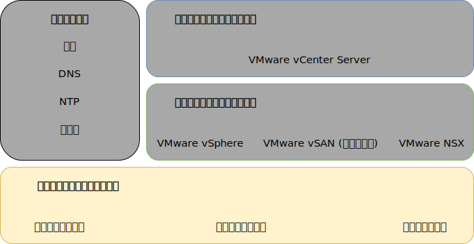
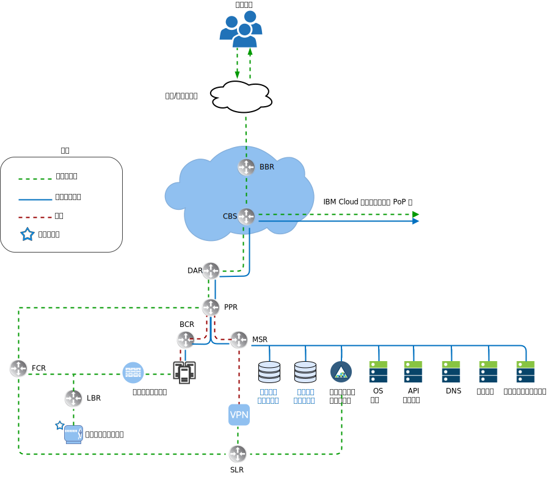
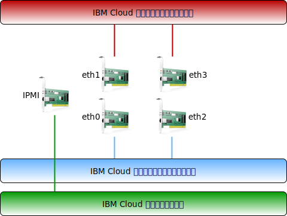
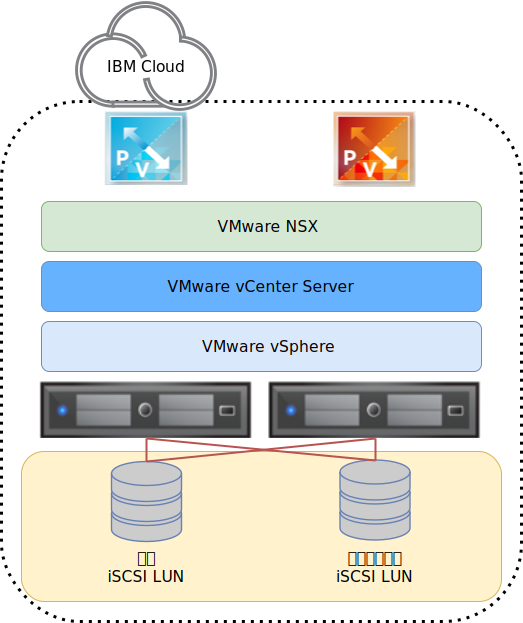

---

copyright:

  years:  2016, 2019

lastupdated: "2019-06-11"

subcollection: vmware-solutions

---

{:tip: .tip}
{:note: .note}
{:important: .important}

# 物理インフラストラクチャー設計
{: #design_physicalinfrastructure}

物理インフラストラクチャーは、以下のコンポーネントで構成されています。

<dl class="dl">
  <dt class="dt dlterm">物理コンピュート</dt>
  <dd class="dd">物理コンピュートは、仮想インフラストラクチャーによって使用される物理処理と物理メモリーを提供します。 この設計では、コンピュート・コンポーネントは {{site.data.keyword.baremetal_long}}によって提供されます。これらのコンポーネントは、[VMware Hardware Compatibility Guide (HCG)](https://www.vmware.com/resources/compatibility/search.php) にリストされています。</dd>
  <dt class="dt dlterm">物理ストレージ</dt>
  <dd class="dd">物理ストレージは、仮想インフラストラクチャーによって使用されるロー・ストレージ容量を提供します。 ストレージ・コンポーネントは、{{site.data.keyword.baremetal_short}}、または NFS v3<!-- or iSCSI --> を使用する共有 Network Attached Storage (NAS) アレイのいずれかによって提供されます。</dd>
  <dt class="dt dlterm">物理ネットワーク</dt>
  <dd class="dd">物理ネットワークは、後にネットワーク仮想化で使用される環境へのネットワーク接続を提供します。 このネットワークは {{site.data.keyword.cloud_notm}} サービス・ネットワークによって提供され、DNS や NTP などの追加のサービスが含まれています。</dd>
</dl>

物理コンポーネントについて詳しくは、[vCenter Server の部品構成表](/docs/services/vmwaresolutions/vcenter?topic=vmware-solutions-vc_bom)を参照してください。

ストレージについて詳しくは、[共有ストレージのアーキテクチャー](/docs/services/vmwaresolutions/archiref/attached-storage?topic=vmware-solutions-storage-benefits#storage-benefits)を参照してください。

## 物理コンピュート設計
{: #design_physicalinfrastructure-host-design}

ソリューションに用意されているサーバー構成は、vSphere ESXi をインストール、構成、管理するための最小要件を満たしているか上回っています。 さまざまな要件を満たす各種構成が使用可能です。 VMware on {{site.data.keyword.cloud_notm}} ソリューションに使用される正確な仕様の詳細リストについては、[vCenter Server インスタンス](/docs/services/vmwaresolutions/vcenter?topic=vmware-solutions-vc_bom)の部品構成表を参照してください。

{{site.data.keyword.baremetal_short}}は {{site.data.keyword.cloud_notm}} 内に存在します。
{:note}

各 vCenter Server インスタンスは、ストレージ・ソリューションの選択に応じて 3 ホストか 4 ホストのデプロイメントから始まります。

物理ホストでは、vSphere ESXi ハイパーバイザーに割り振られる 2 つのローカル接続ディスクが使用されます。 さらにディスクを割り振るには、『_物理ストレージ設計_』セクションに記載されている vSAN を使用するか、[NetApp ONTAP Select のアーキテクチャー](https://www.ibm.com/cloud/garage/files/IBM_Cloud_for_VMware_Solutions_NetApp_Architecture.pdf)に記載されている NetApp ONTAP を使用します。 各物理ホストは、パブリック・ネットワーク・アクセスとプライベート・ネットワーク・アクセスのために、冗長 10 Gbps ネットワーク接続を備えています。

ベアメタル・サーバーには以下の仕様があります。
* CPU: デュアルまたはクワッド Intel Xeon (コアと速度は可変構成)
* メモリー: 可変構成 (64 GB 以上)
* ネットワーク: 4 x 10 Gbps
* ドライブ数: 2 以上

## 物理ネットワーク設計
{: #design_physicalinfrastructure-net-design}

物理ネットワークは {{site.data.keyword.cloud_notm}} によって処理されます。 IBM Cloud で提供される物理ネットワークと、その物理ネットワークに関連した物理ホスト接続 (VLAN、MTU) に関する以下の説明を確認してください。

### IBM Cloud ネットワークの概要
{: #design_physicalinfrastructure-ibm-cloud-network}

{{site.data.keyword.cloud_notm}} の物理ネットワークは、パブリック、プライベートという 2 種類のネットワークに分類されます。 またプライベート・ネットワークには、物理サーバーへの管理 Intelligent Platform Management Interface (IPMI) トラフィックが含まれています。

#### パブリック・ネットワーク
{: #design_physicalinfrastructure-public-net}

{{site.data.keyword.CloudDataCents_notm}}とネットワーク Point of Presence (PoP) には、上位層のトランジット/ピアリング・ネットワーク・キャリアへの 1 Gbps または 10 Gbps 接続が複数存在します。 世界のどこからのネットワーク・トラフィックであっても、最も近いネットワーク PoP に接続され、ネットワークを直接経由してそのデータ・センターに送られるので、プロバイダー間のネットワークのホップ数とハンドオフ回数が最小になります。

データ・センター内では、{{site.data.keyword.cloud_notm}} は、ピアが集約された別々のフロントエンド・カスタマー・スイッチ (FCS) のペアを介して、1 Gbps または 10 Gbps のネットワーク帯域幅を個々のサーバーに提供します。 これらの集約スイッチは、L3 ネットワーキング用の別々のルーター (FCR) のペアに接続されます。

この多層設計により、ネットワークを {{site.data.keyword.CloudDataCent_notm}}内のラック、列、ポッドにわたって拡張したり縮小したりできます。

#### プライベート・ネットワーク
{: #design_physicalinfrastructure-private-net}

{{site.data.keyword.CloudDataCents_notm}}と PoP はすべて、プライベート・ネットワーク・バックボーンによって接続されます。 このプライベート・ネットワークはパブリック・ネットワークとは別であり、世界中の {{site.data.keyword.CloudDataCents_notm}}内のサービスへの接続を可能にします。 {{site.data.keyword.CloudDataCents_notm}}間のデータの移動は、プライベート・ネットワークへの複数の 10 Gbps 接続または 40 Gbps 接続を介して行われます。

パブリック・ネットワークと同様に、プライベート・ネットワークもそのサーバー内で多層化されており、集約されたバックエンド・カスタマー・スイッチ (BCS) に他のインフラストラクチャー・コンポーネントが接続されます。 これらの集約スイッチは、L3 ネットワーキング用の別々のバックエンド・カスタマー・ルーター (BCR) のペアに接続されます。 プライベート・ネットワークは、物理ホスト接続にジャンボ・フレーム (MTU 9000) を使用する機能もサポートします。

#### 管理ネットワーク
{: #design_physicalinfrastructure-mgmt-net}

パブリック・ネットワークとプライベート・ネットワークに加えて、各 {{site.data.keyword.cloud_notm}} サーバーが管理のためにプライベート・プライマリー・ネットワーク・サブネットに接続されます。 この接続によって、CPU、ファームウェア、オペレーティング・システムに関係なく、保守と管理の目的で Intelligent Platform Management Interface (IPMI) からサーバーにアクセスすることが可能になります。

#### プライマリー IP ブロックとポータブル IP ブロック
{: #design_physicalinfrastructure-ip-blocks}

{{site.data.keyword.cloud_notm}} は、{{site.data.keyword.cloud_notm}} インフラストラクチャー内で使用される 2 つのタイプの IP アドレスを割り振ります。
* プライマリー IP アドレスは、{{site.data.keyword.cloud_notm}} によってプロビジョンされるデバイス、ベア・メタル・サーバー、仮想サーバーに割り当てられます。 これらのブロックでは、どのような IP アドレスも割り当てないでください。
* 必要に応じて割り当てたり管理したりするために、ポータブル IP アドレスが用意されています。 vCenter Server は、その用途のために幾つかのポータブル IP 範囲をプロビジョンします。 お客様用として指定されている NSX-T または NSX-V のコンポーネントに割り当てられているポータブル範囲だけを使用してください。 例えば、**お客様エッジ**です。

アカウントを**「Virtual Routing and Forwarding (VRF)」**アカウントとして構成すると、アカウントに属する VLAN にプライマリー IP アドレスまたはポータブル IP アドレスをルーティングできるようになります。

#### Virtual Routing and Forwarding
{: #design_physicalinfrastructure-vrf}

{{site.data.keyword.slportal}}・アカウントを Virtual Routing and Forwarding (VRF) アカウントとして構成すると、サブネット IP ブロック間の自動グローバル・ルーティングが可能になります。 Direct Link 接続を使用するアカウントはすべて、VRF アカウントに変換するか、VRF アカウントとして作成する必要があります。

各種の接続オプションやネットワーク・ルーティング・オプションでは、{{site.data.keyword.cloud_notm}} アカウントが VRF モードになっていることが必須条件になるので、vCenter Server のプロビジョニングを実施する前にアカウントを VRF モードにすることをお勧めします。

#### 物理ホスト接続
{: #design_physicalinfrastructure-host-connect}

この設計に含まれる各物理ホストは、各 {{site.data.keyword.cloud_notm}} 最上位ラック (ToR) スイッチ (パブリックとプライベート) への 10 Gbps イーサネット接続の冗長ペアを 2 つ備えています。 合計 4 つの 10 Gbps 接続のためのアダプターが個々の接続 (非結合) としてセットアップされます。 これにより、ネットワーキング・インターフェース・カード (NIC) 接続が相互に独立して動作できるようになります。

vCenter Server オファリング内で使用するベアメタル・サーバー用のパブリック・ネットワークやプライベート・ネットワークへの物理ネットワーク接続を削除することはできません。 ベアメタルの内部 NIC にある物理ポートを無効にすることは可能ですが、ケーブルのプラグを抜くためのサポートはありません。

#### VLAN およびアンダーレーとオーバーレイ間のルーティング
{: #design_physicalinfrastructure-vlans}

{{site.data.keyword.vmwaresolutions_short}} オファリングは、デプロイメント時に 3 つの VLAN (パブリック が 1 つ、プライベートが 2 つ) が割り当てられるように設計されています。 前の図にあるとおり、パブリック VLAN は `eth1` と `eth3` に割り当てられ、プライベート VLAN は `eth0` と `eth2` に割り当てられます。

この設計で作成されて割り当てられたパブリック VLAN と最初のプライベート VLAN は、{{site.data.keyword.cloud_notm}} 内でデフォルトでタグが外されます。 その後、追加のプライベート VLAN が物理スイッチ・ポートでトランキングされ、これらのサブネットを使用している VMware ポート・グループ内でタグ付けされます。

プライベート・ネットワークは、この設計内の 2 つの VLAN から成ります。 これらの VLAN のうち最初の VLAN (ここではプライベート VLAN A として示す) に、以下の 3 つのサブネットが割り振られます。
* 最初のサブネットは、{{site.data.keyword.cloud_notm}} が物理ホストに割り当てるプライマリー・プライベート IP サブネット範囲です。
* 2 つ目のサブネットは、vCenter Server Appliance や Platform Services Controller などの管理仮想マシンに使用されます。
* 3 つ目のサブネットは、NSX Manager を介して各ホストに割り当てられるカプセル化オーバーレイ・ネットワーク・トンネル・エンドポイント (VTEP) に使用されます。

プライベート VLAN A に加えて、2 つ目の VLAN (ここではプライベート VLAN B として示す) が存在します。この VLAN は、vSAN、vMotion、NFS<!--, and iSCSI--> などの VMware 機能をサポートします。 したがって、この VLAN は 2 つか 3 つか 4 つのポータブル・サブネットに分割されます。
* 最初のサブネットは、vMotion トラフィック用のカーネル・ポート・グループに割り当てられます。
* 残りのサブネットは、ストレージ・トラフィックに使用されます。
   * vSAN 使用時は、vSAN トラフィックに使用されるカーネル・ポート・グループにサブネットが割り当てられます。
   * NFS 接続の NAS を使用する場合は、NFS トラフィック専用のポート・グループにサブネットが割り当てられます。
<!--* For iSCSI attachment, two port groups are created to allow multipathing active-active across both private NIC ports as only one NIC port can be active at a time per the VMware iSCSI documentation.-->

vCenter Server 自動デプロイメントの一部として構成されたすべてのサブネットで、{{site.data.keyword.cloud_notm}} 管理範囲が使用されます。 これは、今すぐまたはこれから接続が必要なときに {{site.data.keyword.cloud_notm}} アカウントの範囲内のどのデータ・センターにもどのような IP アドレスでもルーティングできるようにするためです。

以下の要約表を確認してください。

表 1. VLAN とサブネットの要約

| VLAN | タイプ | 説明 |
|:---- |:---- |:----------- |
| パブリック| プライマリー  | パブリック・ネットワーク・アクセス用に物理ホストに割り当てられます。 ホストにパブリック IP アドレスが割り当てられていますが、この IP アドレスはホスト上で構成されていないため、パブリック・ネットワーク上で直接アクセスできません。代わりに、パブリック VLAN は、NSX Edge Services Gateway (ESG) などの他のコンポーネントにパブリック・インターネット・アクセスを提供することを目的としています。 |
| プライベート A | プライマリー  | {{site.data.keyword.cloud_notm}} によって割り当てられる物理ホストに割り当てられる単一サブネット。 管理インターフェースで vSphere 管理トラフィック用に使用されます。 |
| プライベート A | ポータブル | 管理コンポーネントとして機能する仮想マシンに割り当てられる単一サブネット |
| プライベート A | ポータブル | NSX-V または NSX-T の VTEP に割り当てられる 1 つのサブネット |
| プライベート B | ポータブル | 使用中の場合に vSAN 用に割り当てられる単一サブネット |
| プライベート B | ポータブル | 使用中の場合に NAS 用に割り当てられる単一サブネット |
| プライベート B | ポータブル | vMotion 用に割り当てられる単一サブネット |
<!--| Private B | Portable | Two subnets assigned for iSCSI NAS, if in use (one per physical NIC port) |-->

この設計では、デフォルト・ルートとして {{site.data.keyword.cloud_notm}} バックエンド「プライベート・ネットワーク」カスタマー・ルーター (BCR) を指すようにすべての VLAN-backed ホストおよび仮想マシンが構成されます。 vCenter Server インスタンスによってソフトウェア定義ネットワーキング (SDN) が使用可能になりますが、VMware インスタンス内で作成されて内部サブネットへのルーティングを含むネットワーク・オーバーレイは、{{site.data.keyword.cloud_notm}} 管理ルーターでは認識されません。

オーバーレイとアンダーレーの間のルーティングが必要な場合は、vCenter Server インスタンスのデプロイ時に、デフォルトのプライベート VLAN のための IBM ファイアウォール・デバイスをデプロイしなければなりません。 このデバイスによって、静的ルートの挿入と、オーバーレイ・ネットワーキング・デバイスとの動的ルーティング・プロトコル・ピアリングが可能になり、アンダーレーとオーバーレイの間のルーティングが実現します。

プライベート・ネットワーク接続は、ジャンボ・フレーム MTU サイズ 9000 を使用して、ストレージや vMotion などの大規模データ転送のパフォーマンスを向上させるように構成されます。 この値は、VMware 内で、および {{site.data.keyword.cloud_notm}} によって許可される最大の MTU です。 パブリック・ネットワーク接続には標準的なイーサネット MTU の 1500 が使用されます。 これは維持する必要があります。変更すると、インターネット上でパケットのフラグメント化が発生する可能性があります。

## 物理ストレージ設計
{: #design_physicalinfrastructure-storage-design}

物理ストレージ設計は、物理ホストに搭載される物理ディスクの構成と、共有ネットワーク接続ストレージの構成から成ります。 これには、オペレーティング・システム (vSphere ESXi) と、仮想マシン (VM) のストレージに使用されるディスクが含まれます。 VM 用ストレージは、VMware vSAN によって仮想化されるローカル・ディスク、共有ファイル・レベル・ストレージ、または共有ブロック・レベル・ストレージで構成できます。

### オペレーティング・システム・ディスク
{: #design_physicalinfrastructure-os-disks}

vSphere ESXi ハイパーバイザーは、永続ロケーションにインストールされます。 結果として、vSphere ESXi ハイパーバイザーの冗長性をサポートするための RAID-1 構成の 2 つのディスクが物理ホストに含まれます。

### vSAN ディスク
{: #design_physicalinfrastructure-vsan-disks}

この設計では、仮想マシンのプライマリー・データ・ストアとして VMware vSAN ストレージを使用するか共有ネットワーク接続ストレージを使用するかのオプションが用意されています。 VMware vSAN の場合は、オール・フラッシュ構成で設定します。 この設計では、2U および 4U シャーシ、さまざまなディスク数、さまざまなディスク・サイズなど、いくつかの構成オプションが用意されています。 すべての構成で 2 つの vSAN ディスク・グループ (キャッシュ用ソリッド・ステート・ディスク (SSD) が 1 つ、容量用 SSD が 1 つ以上) が使用されます。 vSAN 消費に割り振られるドライブはすべて、単一ディスク RAID-0 内に構成されます。

サポートされている構成の詳細については、[vCenter Server の部品構成表](/docs/services/vmwaresolutions/vcenter?topic=vmware-solutions-vc_bom)を参照してください。

### ホスト間のファイル・レベルの共有ストレージ
{: #design_physicalinfrastructure-shared-storage}

ファイル・レベルの共有ストレージの使用時は、初期 VMware クラスターを構成するホストに 2 TB NFS 共有が接続されます。 この共有は管理共有と呼ばれ、VMware vCenter Server、Platform Services Controller、VMware NSX などの管理コンポーネントに使用されます。

このストレージは NFS v3 プロトコルを使用して接続され、IBM Cloud からの 2 IOPS/GB レベルになります。

")

購入時または購入後に、どのホストでもワークロードに応じてさらにファイル共有をコンソール内で割り振ってマウントできます。 対応する {{site.data.keyword.CloudDataCent_notm}}内の使用可能な {{site.data.keyword.cloud_notm}} エンデュランス・ファイル・ストレージ容量オプションとパフォーマンス・ティアの中から選択できます。 共有はすべて、NFS v3 プロトコルを使用して接続されます。 また、NetApp ONTAP Select オファリングを適用することによって NFS v3 ファイル共有を接続することができます。

10 IOPS/GB の可用性は IBM Cloud データ・センターに依存しています。 10 IOPS/GB パフォーマンス・ティアを提供する {{site.data.keyword.CloudDataCents_notm}}は、保存中のデータのプロバイダー管理暗号化 (AES-256 暗号化) も備えており、オール・フラッシュ・ストレージによってバックアップされます。 10 IOPS/GB パフォーマンス・ティアの容量は、最大 4 TB に制限されます。 このソリューションで使用される共有 NAS について詳しくは、[共有ストレージのアーキテクチャー](/docs/services/vmwaresolutions/archiref/attached-storage?topic=vmware-solutions-storage-benefits#storage-benefits)を参照してください。

<!--
### Shared iSCSI storage
{: #design_physicalinfrastructure-shared-iscsi}

This architecture allows you to use iSCSI storage, however iSCSI storage is not automatically provisioned by IBM Cloud for VMware Solutions. You can provision it manually.

Similar to NFS, for shared iSCSI storage, one 2-TB iSCSI LUN will be attached to the hosts that comprise the initial VMware cluster. This iSCSI LUN is used for management components such as the VMware vCenter Server, Platform Services Controller, and VMware NSX. The storage is attached through the iSCSI protocol at a 2 IOPS/GB level from IBM Cloud.

{: caption="Figure 5. iSCSI LUNs attached to VMware deployment" caption-side="bottom"}

Additional iSCSI LUNs for workloads can also be allocated and mounted across all hosts. Select from the available IBM Cloud Endurance block storage capacity options and performance tiers in the corresponding IBM Cloud Data Center. All LUNs are attached by using the iSCSI protocol. Additionally, it is possible to attach iSCSI LUNs from the NetApp ONTAP Select offering.

The availability of the 10 IOPS/GB depends on the IBM Cloud Data Center. Data centers that offer the 10 IOPS/GB performance tier also include provider–managed encryption of data at rest (AES–256 encryption), and are backed by all–flash storage. The 10 IOPS/GB performance tier is limited to a maximum capacity of 4 TB.

-->

このソリューションで使用される共有 NAS について詳しくは、[共有ストレージのアーキテクチャー](/docs/services/vmwaresolutions/archiref/attached-storage?topic=vmware-solutions-storage-benefits#storage-benefits)を参照してください。

## 関連リンク
{: #design_physicalinfrastructure-related}

* [vCenter Server の部品構成表](/docs/services/vmwaresolutions/vcenter?topic=vmware-solutions-vc_bom)
* [共有ストレージのアーキテクチャー](/docs/services/vmwaresolutions/archiref/attached-storage?topic=vmware-solutions-storage-benefits#storage-benefits)
* [NetApp ONTAP Select のアーキテクチャー](https://www.ibm.com/cloud/garage/files/IBM_Cloud_for_VMware_Solutions_NetApp_Architecture.pdf)
