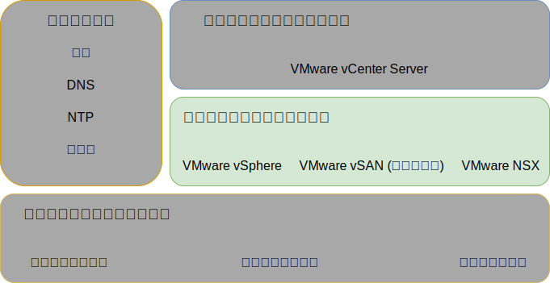
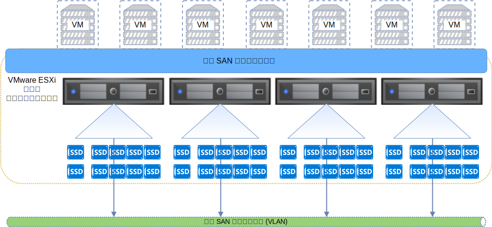
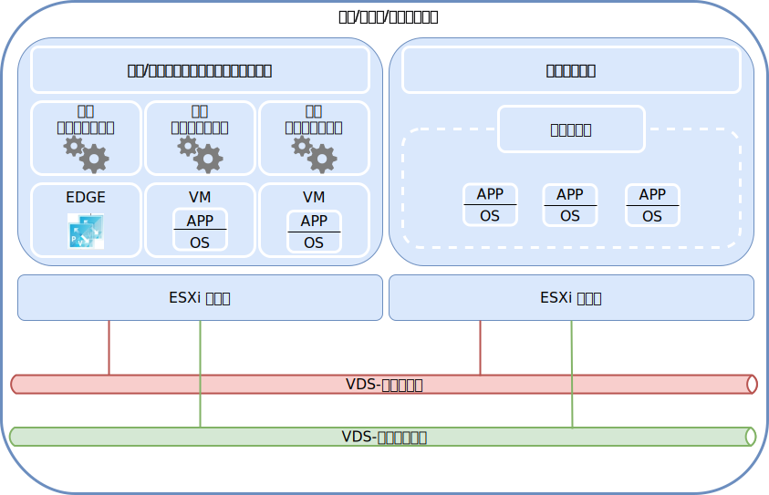

---

copyright:

  years:  2016, 2019

lastupdated: "2019-03-19"

subcollection: vmwaresolutions

---

{:tip: .tip}
{:note: .note}
{:important: .important}

# 仮想インフラストラクチャー設計
{: #design_virtualinfrastructure}

仮想インフラストラクチャー層には、物理インフラストラクチャー層で提供されるコンピュート、ストレージ、ネットワーク・リソースを仮想化する VMware ソフトウェア・コンポーネント (VMware vSphere ESXi、VMware NSX-V または NSX-T、VMware vSAN (オプション)) が含まれます。

図 1. 仮想インフラストラクチャー 

## VMware vSphere 設計
{: #design_virtualinfrastructure-vsphere-design}

vSphere ESXi 構成は、以下の側面から成ります。
* ブート構成
* 時刻同期
* ホスト・アクセス
* ユーザー・アクセス
* DNS 構成

次の表は、各側面の仕様の概要を示しています。 ESXi の構成とインストール後、ホストが VMware vCenter Server に追加され、そこから管理されます。

この設計では、Direct Console User Interface (DCUI)、ESXi Shell、Secure Shell (SSH) を介して仮想ホストにアクセスできます。

デフォルトでは、直接ログインできるユーザーは、ホストの物理マシンの _root_ ユーザーおよび _ibmvmadmin_ ユーザーのみです。 管理者は、Microsoft Active Directory (MSAD) ドメインからユーザーを追加して、ホストへのユーザー・アクセスを可能にすることができます。 vCenter Server ソリューション設計に含まれるホストはすべて、中央 NTP サーバーと同期するように構成されます。

表 1. vSphere ESXi 構成

| 属性              | 構成パラメーター |
|:---------------------- |:----------------------- |
| ESXi ブート・ロケーション     | RAID-1 に構成されたローカル・ディスクを使用 |
| 時刻同期   | {{site.data.keyword.cloud}} NTP サーバーを使用 |
| ホスト・アクセス            | DCUI、ESXi シェル、SSH (有効な場合) をサポート |
| ユーザー・アクセス            | ローカル認証と MSAD |
| ドメイン・ネームの解決 | DNS を使用 ([共通サービス設計](/docs/services/vmwaresolutions/archiref/solution?topic=vmware-solutions-design_commonservice)を参照) |
| EVC モード | Skylake (新規の vSphere 6.7 デプロイメントの場合のみ) |

vSphere クラスターには、vCenter Server インスタンスとユーザー・ワークロード用コンピュート・リソースを管理する仮想マシン (VM) が収容されます。

* vCenter Server インスタンスが vSAN を使用する場合、初期デプロイメント時の ESXi ホストの最小数は 4 です。
* vCenter Server インスタンスが共有ファイル・レベルまたはブロック・レベルのストレージを使用する場合、初期デプロイメント時の ESXi ホストの最小数は 3 です。

初期デプロイメント時または初期デプロイメント後に、最大 59 ESXi ホストまで拡大できます。

より大きなユーザー・ワークロードをサポートするには、以下の方法で環境を拡大できます。  
* 既存クラスターの追加のコンピュート・ホストをデプロイする
* 同じ vCenter Server Appliance によって管理される追加のクラスターをデプロイする
* 新しい vCenter Server インスタンスをそれ専用の vCenter Server Appliance とともにデプロイする

クラスターの詳細については、[{{site.data.keyword.cloud_notm}} running VMware clusters solution architecture](https://www.ibm.com/cloud/garage/files/IBM-Cloud-for-VMware-Solutions-Multicluster-Architecture.pdf) を参照してください。

## VMware vSAN 設計
{: #design_virtualinfrastructure-vsan-design}

この設計では、vSphere ホストの共有ストレージを提供するために、VMware vSAN ストレージが vCenter Server インスタンスで使用されます。

次の図に示すように、vSAN は、vSphere クラスター内の複数の ESXi ホストそれぞれのローカル・ストレージを集約し、集約ストレージを単一の VM データ・ストアとして管理します。 この設計では、ESXi オペレーティング・システム (OS) と vSAN データ・ストアのためのローカル・ディスク・ドライブがコンピュート・ノードに含まれます。ノードがどのクラスターに属するかに関係なく、ESXi インストールを収容するために 2 つの OS ドライブが各ノードに組み込まれます。

図 2. vSAN の概念

vSAN では、以下のコンポーネントが使用されます。
* 2 ディスク・グループ vSAN 設計。各ディスク・グループは 2 つ以上のディスクで構成されます。 グループ内の最小サイズの SSD 1 つがキャッシュ層として使用され、残りの SSD または NVMe ドライブが容量層として使用されます。
* 2 つの OS ドライブを除いて、ドライブごとにオンボード RAID コントローラーが RAID–0 アレイで構成されます。
* すべてのストレージから単一の vSAN データ・ストアが作成されます。

使用可能な vSAN の機能は、インスタンスの注文時に選択するライセンス・エディションによります。 詳しくは、[VMware vSAN エディションの比較](/docs/services/vmwaresolutions/archiref/solution?topic=vmware-solutions-solution-appendix#vmware-vsan-edition-comparison)を参照してください。

### vSAN 用仮想ネットワークのセットアップ
{: #design_virtualinfrastructure-net-setup}

この設計では、vSAN トラフィックは専用プライベート VLAN 上の ESXi ホスト間を横断します。 プライベート・ネットワーク・スイッチに接続された 2 つのネットワーク・アダプターは、vSphere 内で vSphere 分散スイッチ (vDS) として構成され、どちらのネットワーク・アダプターもアップリンクとして指定されます。 vSAN VLAN 用に構成された専用 vSAN カーネル・ポート・グループは、vDS 内に常駐します。 プライベート vDS でジャンボ・フレーム (MTU 9000) が使用可能になります。

vSAN はアップリンク上のトラフィックのロード・バランスを行いません。 結果として、一方のアダプターがアクティブの間、もう一方は高可用性 (HA) をサポートするためにスタンバイ状態になります。 vSAN のネットワーク・フェイルオーバー・ポリシーは、物理ネットワーク・ポート間の**明示的フェイルオーバー**として構成されます。

物理 NIC 接続の詳細については、[物理ホストの NIC 接続](/docs/services/vmwaresolutions/services?topic=vmware-solutions-design_physicalinfrastructure#design_physicalinfrastructure-host-connect)を参照してください。

### vSAN ポリシー設計
{: #design_virtualinfrastructure-storage-policy}

vSAN が使用可能になって構成されると、VM ストレージ特性を定義するためにストレージ・ポリシーが構成されます。 ストレージ特性では、VM ごとに異なるサービス・レベルが指定されます。

この設計のデフォルトのストレージ・ポリシーは、単一障害を許容します。 デフォルト・ポリシーにはイレージャー・コーディングが構成され、**「障害許容方式 (Failure tolerance method)」**が**「RAID-5/6 (イレージャー・コーディング) - 容量 (RAID-5/6 (Erasure Coding) - Capacity)」**に設定され、**「障害のプライマリー・レベル (Primary level of failures)」**が 1 に設定されます。RAID 5 構成では最低 4 つのホストが必要です。

あるいは RAID 6 構成を選択して、**「障害許容方式 (Failure tolerance method)」**を**「RAID-5/6 (イレージャー・コーディング) - 容量 (RAID-5/6 (Erasure Coding) - Capacity)」**に設定し、**「障害のプライマリー・レベル (Primary level of failures)」**を 2 に設定することもできます。RAID 6 構成では最低 6 つのホストが必要です。デフォルトのストレージ・ポリシーで**「複製 (Duplication)」**と**「圧縮 (compression)」**も有効になります。

vSphere コンソールから特に指定されない限り、インスタンスはデフォルト・ポリシーを使用します。 カスタム・ポリシーが構成された場合、vSAN は可能であればそのカスタム・ポリシーを保証します。 しかし、ポリシーを保証できなければ、そのポリシーを使用する VM をプロビジョンすることはできません。ただし、VM が強制的にプロビジョンできるようになっている場合を除きます。

新しい ESXi ホストの追加後、または ESXi ホストのパッチ後は、ストレージ・ポリシーを再適用する必要があります。

### vSAN の設定
{: #design_virtualinfrastructure-vsan-sett}

vSAN の設定は、{{site.data.keyword.cloud_notm}} 内に VMware ソリューションをデプロイするためのベスト・プラクティスに基づいて構成されます。 vSAN の設定には、SIOC 設定、明示的フェイルオーバー設定のポート・グループ、ディスク・キャッシュ設定が含まれます。
* SSD キャッシュ・ポリシーの設定: **「先読み (Read Ahead)」**、**「ライトスルー (Write Through)」**、**「直接 (Direct)」** (NRWTD) なし
* ネットワーク I/O 制御の設定
   * 管理 - 20 共有
   * 仮想マシン - 30 共有
   * vMotion - 50 共有
   * vSAN - 100 共有
* vSAN カーネル・ポート: **「明示的フェイルオーバー (Explicit Failover)」**

## iSCSI 接続ストレージ
{: #design_virtualinfrastructure-iscsi-storage}

NFS v3 接続ストレージの場合とは違い、iSCSI 接続ストレージでは、すべての構成済みの NIC カード・ポートとターゲット・ポートでアクティブ-アクティブのパスがサポートされます。その結果、スループットが高くなるので、NFS 接続ストレージの好ましい代替手段になります。ただし、環境が複雑になるというコストがかかります。

{{site.data.keyword.cloud_notm}} エンデュランス・ブロック・ストレージでは、LUN ごとに最大 8 つのホストの接続しかサポートされていません。ただし、この資料に将来の機能変更についても記載しておきます。Q1 までに {{site.data.keyword.cloud_notm}} エンデュランス・ストレージの変更によって vCenter Server に機能が追加されると、各 ESXi ホストが最低 2 つのイニシエーターを持つことになり、最大 64 のホストまたは iSCSI イニシエーターの接続が可能になります。

管理コンポーネント用として 1 つの 2-TB iSCSI LUN が vCenter Server に接続され、お客様のワークロード用として最低 1 つの iSCSI LUN が構成されます。このストレージは、LUN ごとに VMFS 6.x ファイル・システムとしてフォーマットされます。

### iSCSI 用仮想ネットワークのセットアップ
{: #design_virtualinfrastructure-setup-iscsi}

この設計では、iSCSI トラフィックによって、アクティブ-アクティブ構成で両方のプライベート接続 NIC カード・ポートを使用することが可能になります。vSphere では、vDS 内の 1 つのポート・グループで一度に 1 つの NIC カード・ポートしかアクティブになれないので、ストレージ VLAN 上で 2 つのポート・グループ (A と B) を作成する必要があります。

スケーラビリティーのために、個々のサブネットで固有の IP アドレスを持つ ESXi カーネル・ポートが作成されます。各カーネル・ポートはそれぞれの iSCSI ポート・グループに割り当てられます。どちらのカーネル・ポートも、ESXi 仮想 ISCSI ホスト・バス・アダプター (HBA) に割り当てられます。カーネル・ポートごとに、デフォルトの GW オーバーライド・スイッチによって、そのカーネル・ポートのローカル・サブネットのデフォルトのゲートウェイが使用されます。以下の表を参照してください。

表 2. iSCSi ポート・グループ

vDS ポート・グループ | カーネル・ポート・サブネット | VMHBA
--|:---|:--
**SDDC-Dprotgroup-iSCSI-A** |Subnet-A |  vmhba64
**SDDC-Dprotgroup-iSCSI-B** | Subnet-B | vmhba64

#### ストレージ I/O 制御 - SIOC
{: #design_virtualinfrastructure-sioc}

iSCSI LUN がプロビジョンされ、LUN ごとに 1 ファイルの VMFS ファイル・システムにフォーマットされます。デフォルトの推奨 SIOC 設定は、ピーク・スループットの 90% です。

## VMware NSX-V 設計
{: #design_virtualinfrastructure-nsx-design}

ネットワーク仮想化により、仮想レイヤー内にネットワーク・オーバーレイが存在するようになります。 ネットワーク仮想化により、オンデマンド仮想ネットワークの迅速なプロビジョニング、デプロイメント、再構成、消滅などの機能を備えたアーキテクチャーになります。 この設計では、vDS と VMware NSX for vSphere を使用して仮想ネットワーキングを実装します。

この設計では、NSX Manager は初期クラスター内にデプロイされます。 NSX Manager には、管理コンポーネント用に指定されたプライベート・ポータブル・アドレス・ブロックから VLAN-backed IP アドレスが割り当てられ、[共通サービス設計](/docs/services/vmwaresolutions/archiref/solution?topic=vmware-solutions-design_commonservice)で説明されている DNS サーバーと NTP サーバーが構成されます。

次の図は、NSX Manager の配置をアーキテクチャー内の他のコンポーネントとの関係で示しています。

図 3. NSX Manager ネットワークの概要

初期デプロイメント後、{{site.data.keyword.cloud_notm}} の自動化機能によって、初期クラスター内に 3 つの NSX コントローラーがデプロイされます。 コントローラーのそれぞれに、管理コンポーネント用に指定された**プライベート A** ポータブル・サブネットから VLAN-backed IP アドレスが割り当てられます。 さらに、この設計では、クラスター内のホストの中のコントローラーを分離するための VM-VM アンチアフィニティー・ルールが作成されます。 コントローラーの高可用性を確保するためには、初期クラスターに最低 3 つのノードが含まれなければなりません。

コントローラーに加えて、VXLAN トンネル・エンドポイント (VTEP) を介して仮想化ネットワークを使用できるように、NSX VIBS を備えたデプロイ済み vSphere ホストが {{site.data.keyword.cloud_notm}} 自動化機能によって準備されます。 VTEP 用に指定された**プライベート A** ポータブル IP アドレス範囲 ([VLAN](/docs/services/vmwaresolutions/services?topic=vmware-solutions-design_physicalinfrastructure#design_physicalinfrastructure-vlans)にリストが記されている) から VLAN-backed IP アドレスが VTEP に割り当てられます。VXLAN トラフィックはタグの外された VLAN 上に存在し、プライベート vDS に割り当てられます。

続いて、セグメント ID プールが割り当てられ、クラスター内のホストがトランスポート・ゾーンに追加されます。 {{site.data.keyword.cloud_notm}} 内で Internet Group Management Protocol (IGMP) スヌープが構成されないため、トランスポート・ゾーンで使用されるのはユニキャストのみです。 VMW のベスト・プラクティスに従えば、同じ VTEP 専用サブネットのホストごとに 2 つの vTEP カーネル・ポートを構成します。

その後、NSX Edge Services Gateway ペアがデプロイされます。 すべての場合において、プライベート・ネットワークに常駐する自動化コンポーネントからのアウトバウンド・トラフィックにゲートウェイ・ペアが 1 つ使用されます。 2 つ目のゲートウェイ (カスタマー管理エッジと呼ばれる) がデプロイされ、パブリック・ネットワークへのアップリンクとプライベート・ネットワークに割り当てられるインターフェースが構成されます。 ソリューションの一部としてデプロイされる NSX Edge Services Gateway について詳しくは、[NSX Edge Services Gateway ソリューションのアーキテクチャー](/docs/services/vmwaresolutions/services?topic=vmware-solutions-nsx_overview#nsx_overview)を参照してください。

クラウド管理者は、分散論理ルーター (DLR)、論理スイッチ、ファイアウォールなどの必要な NSX コンポーネントを構成できます。 使用可能な NSX の機能は、インスタンスの注文時に選択する NSX ライセンス・エディションによります。 詳しくは、[VMware NSX エディションの比較](/docs/services/vmwaresolutions/archiref/solution?topic=vmware-solutions-solution-appendix#vmware-nsx-edition-comparison)を参照してください。

NSX Manager は、次の表に示す仕様でインストールされます。

表 3. NSX Manager の要件

| 属性       | 仕様 |
|:--------------- |:------------- |
| NSX Manager     | 仮想アプライアンス |
| vCPU の数 | 4 |
| メモリー          | 16 GB |
| ディスク            | 管理 NFS 共有上に 60 GB |
| ディスク・タイプ       | シン・プロビジョン |
| ネットワーク         | 管理コンポーネント用に指定された**プライベート A** ポータブル |

### 分散スイッチ設計
{: #design_virtualinfrastructure-distr-switch}

この設計では、最低限の数の vDS スイッチが使用されます。 クラスター内のホストはパブリック・ネットワークとプライベート・ネットワークに接続されます。 ホストには 2 つの分散仮想スイッチが構成されます。 2 つのスイッチの使用は、パブリック・ネットワークとプライベート・ネットワークを分離する {{site.data.keyword.cloud_notm}} ネットワークの手法に従います。 次の図は、vDS 設計を示しています。

図 4. 分散スイッチ設計

前の図に示すように、一方の vDS はパブリック・ネットワーク接続 (SDDC - 分散スイッチ - パブリック) 用に構成され、もう一方の vDS はプライベート・ネットワーク接続 (SDDC - 分散スイッチ - プライベート) 用に構成されます。 コンテンションと待ち時間を軽減し、セキュリティーを高めるためには、さまざまなタイプのトラフィックを分離することが必要です。

物理ネットワークの機能をセグメント化するために VLAN が使用されます。 この設計では、3 つの VLAN が使用されます。2 つはプライベート・ネットワーク・トラフィック用、1 つはパブリック・ネットワーク・トラフィック用です。 次の表は、トラフィック分離を示しています。

表 4. VLAN とトラフィック・タイプのマッピング

| VLAN  | 指定 | トラフィック・タイプ |
|:----- |:----------- |:------------ |
| VLAN1 | パブリック      | インターネット・アクセスに使用できます |
| VLAN2 | プライベート A   | ESXi 管理、管理、VXLAN (VTEP) |
| VLAN3 | プライベート B   | vSAN、NFS、vMotion、iSCSI |

ワークロードからのトラフィックは VXLAN­backed 論理スイッチ上を移動します。

vSphere クラスターは、以下の表のように構成された 2 つの vSphere 分散スイッチを使用します。

表 5. コンバージド・クラスター分散スイッチ

| vSphere 分散 スイッチ名 | 機能 | ネットワーク I/O 制御 | ロード・バランシング モード | 物理 NIC ポート | MTU |
|:------------- |:------------- |:------------- |:------------- |:------------- |:------------- |
| SDDC - 分散スイッチ - プライベート | ESXi 管理、vSAN、vSphere vMotion、VXLAN トンネル・エンドポイント、NFS (VTEP) | 有効 | 明示的フェイルオーバー (vSAN、vMotion) 起点仮想ポート (その他すべて) に基づくルート | 2 | 9,000 (ジャンボ・フレーム) |
| SDDC - 分散スイッチ - パブリック | 外部管理トラフィック (南北) | 有効 | 起点仮想ポートに基づくルート | 2 | 1,500 (デフォルト) |

ホスト NIC の名前、数、順序付けは、{{site.data.keyword.CloudDataCent_notm}} とホスト・ハードウェアの選択によって変ることがあります。
{:note}

表 6. コンバージド・クラスター分散スイッチのポート・グループの構成設定

| パラメーター          | 設定       |
|:------------------ |:------------- |
| ロード・バランシング     | 起点仮想ポートに基づくルート \* |
| フェイルオーバー検出 | リンク状況のみ |
| スイッチに通知    | 有効 |
| フェイルバック           | いいえ |
| フェイルオーバー順序     | アクティブ・アップリンク: Uplink1、Uplink2 \* |

\* vSAN ポート・グループは、vSAN ストレージ・トラフィックのロード・バランシングをサポートしていないため、アクティブまたはスタンバイによる明示的フェイルオーバーを使用します。 iSCSI ポート・グループでは、一度に 1 つのアップリンクしかアクティブになれません (iSCSI A - Uplink1、iSCSI B - Uplink 2)。
{:note}

表 7. コンバージド・クラスター仮想スイッチのポート・グループ、VLAN、分散スイッチ **SDDC-Dswitch-Private**

ポート・グループ|チーミング|アップリンク|VLAN ID
---|---|---|--
SDDC - 分散ポート・グループ - 管理|起点仮想ポート|アクティブ: 0、1|VLAN 1
SDDC - 分散ポート・グループ - vMotion|起点仮想ポート|アクティブ: 0、1|VLAN 2
SDDC - 分散ポート・グループ - VSAN|明示的フェイルオーバー|アクティブ: 0、スタンバイ: 1|VLAN 2
SDDC - 分散ポート・グループ - NFS|起点仮想ポート|アクティブ: 0、1|VLAN 2
NSX 生成|起点仮想ポート|アクティブ: 0、1|VLAN 1
SDDC - 分散ポート・グループ - 外部|起点仮想ポート|アクティブ: 0、1|VLAN 3
SDDC-DPortGroup-iSCSI-A|起点仮想ポート|アクティブ: 0|VLAN 2
SDDC-DPortGroup-iSCSI-B|起点仮想ポート|アクティブ: 0|VLAN 2

表 8. コンバージド・クラスター VMkernel アダプター、分散スイッチ **SDDC-Dswitch-Private**

目的|接続されるポート・グループ|使用可能サービス|MTU
--|---|---|---|--
管理|SDDC - 分散ポート・グループ - 管理|管理トラフィック|1500 (デフォルト)
vMotion|SDDC - 分散ポート・グループ - vMotion|vMotion トラフィック|9000
VTEP|NSX 生成|-|9000
VSAN|SDDC - 分散ポート・グループ - VSAN|VSAN|9000
NAS|SDDC - 分散ポート・グループ - NFS|NAS|9000
iSCSI|SDDC-DPortGroup-iSCSI-A|iSCSI|9000
iSCSI|SDDC-DPortGroup-iSCSI-B|iSCSI|9000

### NSX 構成
{: #design_virtualinfrastructure-nsx-config}

この設計では、NSX コンポーネントの構成を指定しますが、ネットワーク・オーバーレイ・コンポーネント構成は適用しません。 必要に応じてネットワーク・オーバーレイを設計できます。

以下の側面が事前構成されます。
* 管理サーバーとコントローラーがインストールされ、vCenter Web UI に組み込まれます。
* ESXi ホストごとに ESXi エージェントがインストールされ、VTEP IP アドレスが構成されます。
* VTEP 構成、コントローラー構成、VXLAN 構成 (トランスポート・ゾーン)。
* 管理コンポーネント用 NSX Edge Services Gateway アプライアンス。
* お客様用 NSX Edge Services Gateway アプライアンス。
* NSX VXLAN 処理のお客様のワークロードが分散ローカル・ルーター (DLR) に接続され、DLR とお客様用 ESG の間に伝送 VXLAN が設定されます。
* VXLAN 用の RFC 1918 アドレス・スペースと、お客様用 ESG の出口ネットワークとして使用する IBM Cloud のプライベート/パブリック・ポータブル IP スペース。

以下の側面は構成されません。
* マイクロ・セグメンテーション
* 他の VMware インスタンスに対するリンク NSX 管理

図 5. カスタマー NSX トポロジーのデプロイ例

## 関連リンク
{: #design_virtualinfrastructure-related}

* [VMware クラスターを実行する {{site.data.keyword.cloud_notm}} ソリューションのアーキテクチャー](https://www.ibm.com/cloud/garage/files/IBM-Cloud-for-VMware-Solutions-Multicluster-Architecture.pdf)
* [NSX Edge Services Gateway ソリューションのアーキテクチャー](/docs/services/vmwaresolutions/services?topic=vmware-solutions-nsx_overview#nsx_overview)
