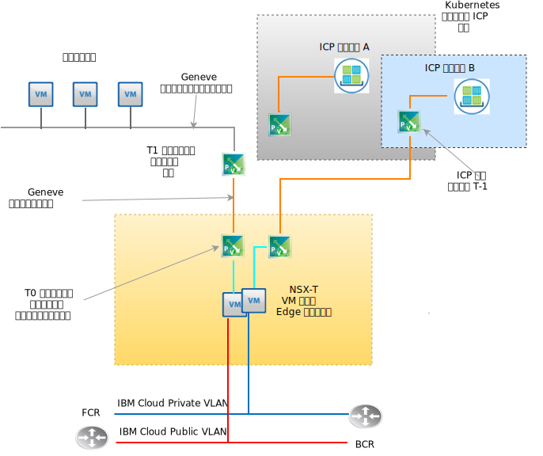

---

copyright:

  years:  2016, 2019

lastupdated: "2019-05-13"

subcollection: vmware-solutions

---

# VMware NSX-T 設計
{: #nsx-t-design}

NSX-V (vSphere 上の NSX) とは異なり、VMware NSX-T は、異種のエンドポイントや技術スタックが混在したアプリケーション・フレームワークおよびアーキテクチャー向けに設計されています。 このような環境には、vSphere の他にも異種のハイパーバイザー、KVM、コンテナー、ベアメタルが存在することがあります。 NSX は、vSphere だけでなくそれ以外の各種プラットフォーム上のソフトウェア定義のネットワークとセキュリティー・インフラストラクチャーまで範囲が広がるように設計されています。 vSphere を必要とせずに NSX-T コンポーネントをデプロイすることもできますが、この設計は主に vCenter Server vSphere 自動デプロイメントの範囲の NSX-T とその統合に焦点を当てています。

ファイアウォール・ポリシー、ファイアウォール・ポリシーへのゲスト・イントロスぺクションの組み込み、高度なネット・フロー・トラッキングなど、NSX-T には高度な機能が数多く含まれています。 これらの機能を述べることは本資料の範囲を超えています。 NSX-T については、VMware の資料を参照してください。 この設計では、初期 vCenter Server クラスターのデプロイメント時に NSX-V の代わりに NSX-T 管理インフラストラクチャーがデプロイされます。

## NSX-T と NSX-V
{: #nsx-t-design-nsx-t-nsx-v}

vSphere ネイティブ NSX (NSX-V) については、NSX-V での対応する機能と同様の機能を持つ、より良く知られている以下の NSX-T オブジェクトを参照してください。 vSphere 環境内の制限事項と相違点についても説明します。 T と V で通常使用される機能の対応表を以下に示します。

表 1. NSX-V と NSX-T の用語の対応

NSX-V または vSphere ネイティブ | NSX-T
--|:---|:--
**仮想分散スイッチ ** | ネットワーク仮想分散スイッチ (N-VDS)
**NSX トランスポート・ゾーン** | トランスポート・ゾーン (オーバーレイまたは VLAN backed)
**ポート・グループ (vDS)** | 論理スイッチ
**VXLAN (L2 カプセル化)** | GENEVE (L2 カプセル化)
**エッジ・ゲートウェイ** | T0 ゲートウェイ (v2.4 の時点で変更)
**分散論理ルーター** | T1 ゲートウェイ (v2.4 の時点で変更)
**ESXi サーバー (vTEP)** | トランスポート・ノード (ESXi、KVM、ベアメタル T0 ゲートウェイ)

この設計の NSX-T 実装のために理解する必要がある重要な NSX-T の概念の中には、NSX-V 機能に対応しないものがあります。

以下のとおりです。
- エッジ・クラスターは、NSX-T 仮想ファブリックに参加する 1 つ以上の VM または物理マシンです。 それらは、オーバーレイ・ネットワーク・トランスポート・ゾーンおよび VLAN backed トランスポート・ゾーンのエンドポイントです。 エッジ・クラスターは複数の T-0 ゲートウェイ・インスタンスをサポートできます。
- T-0 ゲートウェイは仮想ルーター・インスタンスであり、VM ではありません。 それぞれが独自のルーティング・テーブルと機能を持つ複数の T-0 ゲートウェイ・インスタンスを 1 つのエッジ・クラスター内で実行できます。 T-0 ルーター・インスタンスを作成するためには、その前にエッジ・クラスターが存在していなければならないということになります。
- 異なるプラットフォームや複数の vSphere vCenter インスタンス上のエンドポイントまでトランスポート・ゾーンの範囲を広げることができます。 vCenter 間リンク NSX は不要です。 特定のエンドポイントからトランスポート・ゾーンを除外できます。 N-VDS はトランスポート・ゾーンに直接関連付けられ、トランスポート・ゾーンの作成時に作成されます。
- アップリンク・フェイルオーバー順序は特定の論理スイッチとは無関係に作成されます。アップリンク・フェイルオーバー順序は「アップリンク・プロファイル」としてプロファイルに作成され、VLAN に基づいて特定の論理スイッチに適用されるからです。 同一 VLAN の物理アップリンクについて異なるフェイルオーバー順序やロード・バランシングの必要性がある可能性があるため、特定の VLAN のアップリンク・プロファイルに「チーミング」のエントリーを複数定義して、それぞれで異なるフェイルオーバー順序やロード・バランシングを指定することができます。 アップリンク・プロファイルを論理スイッチに割り当てると、特定のチーミング・プロファイルが選択されます。

- NSX-T 2.4 の時点で、マネージャー VM 機能とコントローラー VM 機能が結合されました。 この結果、3 つのコントローラー・マネージャー VM がデプロイされます。 同一サブネット上に存在する場合は、内部ネットワーク・ロード・バランサーが使用されます。 複数の異なるサブネットにわたって存在する場合は、外部ロード・バランサーが必要です。

## リソース要件
{: #nsx-t-design-resource-req}

この設計では、NSX-T Manager Controller VM は初期クラスター上にデプロイされます。 さらに、管理コンポーネント用に指定されたプライベート・ポータブル・アドレス・ブロックから VLAN–backed IP アドレスが各コントローラー・マネージャーに割り当てられ、DNS サーバーと NTP サーバー (セクション 0 で説明) が構成されます。NSX Manager のインストールの要約を次の表に示します。

表 2. NSX-T Manager Controller の仕様

属性 | 仕様
--|--
**NSX Manager/Controller** | 3 つの仮想アプライアンス
**vCPU 数** | 4
**メモリー** |  16 GB
**ディスク** | 60 GB
**ディスク・タイプ** | シン (プロビジョン済み)
**NetworkPrivate A** | プライベート A

次の図は、NSX Manager Controller の配置をこのアーキテクチャーに含まれる他のコンポーネントとの関係で示しています。

## デプロイメントに関する考慮事項
{: #nsx-t-design-deployment}

vSphere 上の NSX-T の場合は、N-VDS にホスト内の物理アダプターを割り当てる必要があります。 N-VDS は NSX-T Manager 内でのみ構成できるため、これは次のことを意味します。つまり、冗長性を維持する場合は、NSX-T コンポーネントと関連オーバーレイ・ネットワーク・コンポーネントの両方を収容するクラスターでは、ネイティブ・ローカル・スイッチ割り当てにも vDS 割り当てにも物理アダプターを使用できません。

このため、NSX-T のインストールとその構成時は、1 つのアダプター上の 1 つの物理 NIC ポートがローカル vSphere vSwitchまたは仮想分散スイッチ (vDS) に割り当てられたままでなければなりません。 NSX-T のデプロイメント後、ESX カーネル・ポートを N-VDS にマイグレーションし、ローカルの vSwitch と VDS をすべてオフにする必要があります。 カーネル・ポートが削除された後、残りの物理 NIC ポートを N-VDS アップリンクとして割り当てることで N-VDS の冗長性を確保できます。

初期デプロイメント後、{{site.data.keyword.cloud_notm}} の自動化機能によって、初期クラスター内に 3 つの NSX-T Manager/Controller 仮想アプライアンスがデプロイされます。 管理コンポーネント用に指定されたプライベート A ポータブル・サブネットから VLAN–backed IP アドレスがコントローラーに割り当てられます。 さらに、クラスター内のホスト間でコントローラーが分離されるように、VM-VM アンチアフィニティー・ルールが作成されます。

Manager/Controller の高可用性を確保するために、初期クラスターは 3 ノード以上の構成でデプロイする必要があります。 Manager/Controller に加えて、デプロイ済み vSphere ホストが NSX-T トランスポート・ノードとして {{site.data.keyword.cloud_notm}} 自動化機能によって準備されます。 「VLAN とサブネットの要約」から得られる NSX IP プール範囲によって指定されたプライベート A ポータブル IP アドレス範囲から、VLAN–backed IP アドレスが ESXi トランスポート・ノードに割り当てられます。 トランスポート・ノード・トラフィックはタグなし VLAN 上に存在し、プライベート NSX-T 仮想分散スイッチ (N-VDS) に割り当てられます。

デプロイ対象としてお客様が選択する NSX-T トポロジーに応じて、NSX-T Edge クラスターは VM のペアとしてデプロイされるか、ベアメタル・クラスター・ノード上にデプロイされるソフトウェアとしてデプロイされます。 クラスター・ペアが仮想クラスター・ペアであるか物理クラスター・ペアであるかにかかわらず、アップリンクは {{site.data.keyword.cloud_notm}} パブリック・ネットワークおよびプライベート・ネットワークの両方の N-VDS スイッチに構成されます。

次の表に、中規模サイズの環境の要件をまとめます。

表 3. NSX-T コンポーネントの仕様

 リソース | Manager Controller x3 | Edge クラスター x2 | ベアメタル・エッジ
-----------|:---------|:-------|:---------
**中サイズ** | 仮想アプライアンス | 仮想アプライアンス | 物理サーバー
**vCPU 数** | 4 | 4 | 8
**メモリー** | 16 GB | 8 GB | 32 GB
**ディスク** | 120 GB VSAN/管理 NFS | 120 GB VSAN/管理 NFS | 200 GB
**ディスク・タイプ** | シン (プロビジョン済み) | シン (プロビジョン済み) | 物理
**ネットワーク** | プライベート A | プライベート A | プライベート A

## トランスポート・ゾーンと N-VDS
{: #nsx-t-design-transport-zones}

トランスポート・ゾーンは、特定のネットワークの使用にどのホストとどの VM が参加できるかを決定します。 トランスポート・ゾーンはこれを、論理スイッチを「認識できる」ホストを制限する、つまりどの VM を論理スイッチに接続できるかを制限することによって行います。 1 つ以上のホスト・クラスターまでトランスポート・ゾーンの範囲を広げることができます。 この設計では、トランスポート・ゾーンが以下のように作成される必要があります。

表 4. NSX-T トランスポート・ゾーンと N-VDS

トランスポート・ゾーン名 | VLAN/VXLAN | N-VDS 名 | アップリンク・チーミング・ポリシー
--|:-------|:------|:-----
**Private-Overlay** | VXLAN | SDDC-Overlay | デフォルト
**Public-VLAN** | VLAN | SDDC-Public | デフォルト
**Private-VLAN** | VLAN | SDDC-Private | NFS、vSAN、iSCSI-A&B デフォルト

## トランスポート・ノード
{: #nsx-t-design-transport-nodes}

仮想ネットワーク・ファブリックに参加する物理サーバー・オブジェクトまたは VM を、トランスポート・ノードで定義します。 次の表を確認して設計を理解してください。

表 5. NSX-T トランスポート・ノード

トランスポート・ノード・タイプ | N-VDS | アップリンク・プロファイル | IP 割り当て | 物理 NIC
--|:--------|:--------|:---
**ESXi** | SDDC-Private | SDDC-Private-uplink | IP プール | vmnic0、vmnic2
**Edge クラスター** | SDDC-Overlay | SDDC-Overlay-uplink | IP プール | 該当なし
**物理 Edge** | SDDC-Private | SDDC-Private-uplink | IP プール | eth0、eth2

## アップリンク・プロファイル
{: #nsx-t-design-uplink-profiles}

ハイパーバイザー・ホストから NSX-T 論理スイッチまでのリンクのポリシー、または NSX Edge ノードから最上位ラック・スイッチまでのリンクのポリシーを、アップリンク・プロファイルで定義します。

表 6. NSX-T アップリンク・プロファイル

アップリンク・プロファイル名 | VLAN | 含まれるチーミング | MTU
--|:-----|:---|:---
**SDDC-Private-Uplink** | デフォルト | デフォルト、管理 | 9000
**SDDC-Public-Uplink** | デフォルト| デフォルト | 1500
**SDDC-Storage-Uplink** | ストレージ VLAN | vSAN、iSCSI-A&B、NFS | 9000

## チーミング
{: #nsx-t-design-teaming}

表 7. NSX-T NIC ポート・チーミングの仕様

チーミング名 | フェイルオーバーまたはロード・バランス | アクティブ NIC | スタンバイ NIC
--|:----|:---|:---
**デフォルト** | ロード・バランス・ソース | アップリンク 1、2 | 該当なし
**管理** | フェイルオーバー| アップリンク 1 | アップリンク 2
**TEP** | フェイルオーバー| アップリンク 1 | アップリンク 1
**vSAN** | フェイルオーバー| アップリンク 2 | アップリンク 1
**iSCSI-A** | フェイルオーバー| アップリンク 1 | 該当なし
**iSCSI-B** | フェイルオーバー| アップリンク 2 | 該当なし
**NFS** | ロード・バランス・ソース | アップリンク 1、2 | アップリンク 1
**vMotion** | フェイルオーバー| アップリンク 2 | アップリンク 1

## VNI プール
{: #nsx-t-design-vni-pools}

仮想ネットワーク ID (VNI) は、物理ネットワークに対する VLAN と似ています。 ID のプールつまり範囲から論理スイッチが作成されるときに、自動的に作成されます。 この設計では、NSX-T とともにデプロイされるデフォルトの VNI プールを使用します。

## 論理スイッチ
{: #nsx-t-design-logical-switches}

NSX-T 論理スイッチは、基礎ハードウェアから完全に分離された仮想環境内で、スイッチング機能、ブロードキャスト/不明ユニキャスト/マルチキャスト (BUM) トラフィックを再現します。

表 8. NSX-T 論理スイッチ

論理スイッチ名 | VLAN |トランスポート・ゾーン | アップリンク・チーミング・ポリシー
--|:---|:----|:---
**SDDC-LS-Mgmt** | デフォルト | Private-VLAN | 管理
**SDDC-LS-NFS** | デフォルト | Private-VLAN | NFS
**SDDC-LS-vMotion** | デフォルト | Private-VLAN | vMotion
**SDDC-LS-VSAN** | タグ付きストレージ vlan | Private-VLAN | vSAN
**SDDC-LS-iSCSI-A** | タグ付きストレージ vlan | Private-VLAN| iSCSI-A
**SDDC-LS-iSCSi-B** | タグ付きストレージ vlan | Private-VLAN| iSCSi-B
**SDDC-LS-TEP** | デフォルト | Private-VLAN| TEP
**SDDC-LS-External** | デフォルト | Public-VLAN | デフォルト

### Edge クラスター
{: #nsx-t-design-edge-cluster}

この設計の範囲では、管理ワークロードとカスタマー・ワークロードで使用するための単一の仮想エッジ・クラスターがプロビジョンされます。 仮想エッジ・クラスターは、T0 ゲートウェイの複数インスタンスを収容できます。 前述のように、それぞれが独自のルーティング・テーブルを持つ複数の T0 Edge Gateway インスタンスを単一のエッジ・クラスター上でインスタンス化できます。 NSX-T エッジ・クラスターの機能コンポーネントを示した次の図を参照してください。

#### 層 0 論理ゲートウェイ
{: #nsx-t-design-tier-0}

NSX-T 層 0 論理ルーターは、論理ネットワークと物理ネットワークの間のオン/オフ・ゲートウェイ・サービスを提供します。 この設計では、管理とアドオン製品のニーズ、お客様が選択したトポロジー (オプション) に合わせて、複数の T-0 ゲートウェイがデプロイされます。

#### 層 1 論理ゲートウェイ
{: #nsx-t-design-tier-1}

NSX-T 層 1 論理ゲートウェイには、NSX-T Data Center 論理スイッチに接続するためのダウンリンク・ポートと、NSX-T Data Center 層 0 論理ルーターに接続するためのアップリンク・ポートのみがあります。 それらは、それぞれに構成されたハイパーバイザーのカーネル・レベルで動作します。仮想マシンまたは物理マシンとして動作するわけではありません。 この設計では、お客様が選択したトポロジーのニーズに合わせて 1 つ以上の T-1 論理ゲートウェイが作成されます。

#### 層 1 から層 0 へのルート通知
{: #nsx-t-design-tier-1-tier-0}

異なる層 1 論理ゲートウェイに結び付けられた論理スイッチに接続された VM 間のレイヤー 3 接続を行うために、層 0 への層 1 ルート通知を有効にする必要があります。 層 1 論理ルーターと層 0 論理ルーターの間のルーティング・プロトコルや静的ルートを構成する必要はありません。 ルート通知を有効にすると、NSX-T によって静的ルートが自動的に作成されます。 この設計では、IC4V 自動化機能によって作成された T-1 ゲートウェイに対してルート通知が常に有効です。

### 事前構成トポロジー
{: #nsx-t-design-preconfig-topo}

T1 - T0 間ゲートウェイへのワークロード: 仮想エッジ・クラスター

IC4V によってデプロイされるトポロジー 1 は基本的に、NSX-V DLR と Edge Gateway とともにデプロイされるのと同じトポロジーです。 NSX-T では、T1 と T0 の間に動的ルーティング・プロトコル構成はありません。 ワークロード・オーバーレイ・ネットワークとトランジット・オーバーレイ・ネットワークには RFC-1891 IP アドレス・スペースが使用されます。 お客様のプライベート・ポータブル IP スペースとパブリック・ポータブル IP スペースが、お客様用に割り当てられます。 お客様が指定した {{site.data.keyword.cloud_notm}} プライベート・ポータブル IP スペースおよびパブリック・ポータブル IP スペースが、お客様用に T0 に割り当てられます。

この設計の時点で、vCenter Server インスタンスが廃止および削除されても、これらの IP 範囲を削除しないという選択肢があります。

T1 - T0 間ゲートウェイへのワークロード: 物理エッジ・クラスター

デプロイされるトポロジー 2 は、VM ベースのエッジ・クラスターを、Red Hat Server を実行するベアメタル・サーバーのペアに置き換える例外と似ています。 お客様が指定した {{site.data.keyword.cloud_notm}} プライベート・ポータブル IP スペースおよびパブリック・ポータブル IP スペースが、お客様用に T0 に割り当てられます。 この設計の時点で、vCenter Server インスタンスが廃止および削除されても、これらの IP 範囲を削除しないという選択肢があります。

ハードウェアと OS の仕様に関する部品構成表については、別個の資料またはリンクを参照してください。

ICP - T0 間ゲートウェイのあるワークロード: 仮想エッジ・クラスター

デプロイされるトポロジー 3 には、ICP デプロイメント内のデフォルトのネットワーキング・スタックである Calico の代わりに NSX-T 統合を特徴とする ICP デプロイメントが追加されたトポロジー 1 が含まれます。 お客様は、ICP 内に追加のコンテナー名前空間をプロビジョンすることで、名前空間ごとに論理スイッチ、IP サブネット、T1 ゲートウェイのインスタンスの作成を自動化できます。

vCenter Server 上で ICP がどのように機能するかを完全に理解するには、vCenter Server 上の ICP に関するアーキテクチャー資料を参照してください。 お客様が指定した {{site.data.keyword.cloud_notm}} プライベート・ポータブル IP スペースおよびパブリック・ポータブル IP スペースが、お客様用に各 T0 に割り当てられます。

この設計の時点で、vCenter Server インスタンスが廃止および削除されても、これらの IP 範囲を削除しないという選択肢があります。

## 関連リンク
{: #nsx-t-design-related}

* [vCenter Server on {{site.data.keyword.cloud_notm}} with Hybridity Bundle の概要](/docs/services/vmwaresolutions/archiref/vcs?topic=vmware-solutions-vcs-hybridity-intro)
