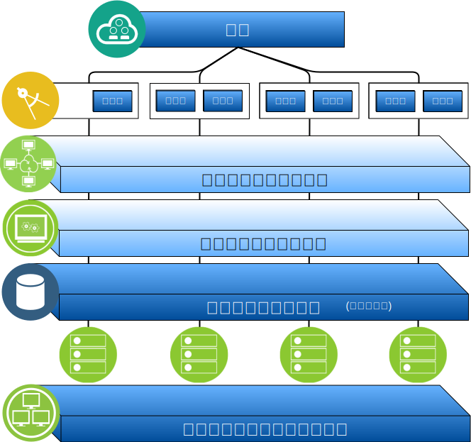

---

copyright:

  years:  2016, 2019

lastupdated: "2019-03-15"

subcollection: vmware-solutions

---

# IBM Cloud for VMware Solutions の概要
{: #solution_overview}

{{site.data.keyword.vmwaresolutions_full}} オファリングを使用して、既存の VMware 仮想化データ・センターを {{site.data.keyword.cloud_notm}} に拡張したり、クラウド・ネイティブ・アプリケーションを保管したりすることができます。

このソリューションは、クラウドへのキャパシティー拡張 (および必要になったときの縮小)、クラウドへのマイグレーション、クラウドへの災害復旧、およびクラウドへのバックアップといったユース・ケースをサポートします。 このソリューションによって、開発、テスト、トレーニング、実験、および実動のための専用クラウド環境を作成できます。

ターゲット・ワークロードに高水準の可用性とスケーラビリティーが必要となる {{site.data.keyword.vmwaresolutions_short}} vCenter Server の設計については、この資料を確認してください。

この設計は、特定のユースケースのために追加されるその他の内部コンポーネントまたはベンダー固有コンポーネントの基盤を提供する基本的なアーキテクチャーとして機能します。

図 1. VMware on {{site.data.keyword.cloud_notm}} の概要

## IBM Cloud for VMware Solutions の主なメリット
{: #solution_overview-benefits}

VMware vCenter Server on {{site.data.keyword.cloud_notm}} は、基本的なビルディング・ブロック (VMware vSphere、vCenter Server、NSX、および vSAN などの共有ストレージ・オプション) を提供します。 これらのコンポーネントは、ワークロードに最適な VMware ソフトウェア定義のデータ・センター・ソリューションを柔軟に設計するのに必要です。

高度な自動化と単一テナント・ベアメタル・インフラストラクチャーを適用することで、数時間のうちに VMware 環境全体を迅速に {{site.data.keyword.cloud_notm}} にデプロイできるようになります。 次に、ネイティブ VMware クライアント、コマンド・ライン・インターフェース (CLI)、既存のスクリプト、または他の使い慣れた vSphere API 互換ツールを使用して、IBM ホスト環境にアクセスし、管理できます。

デプロイメント後に {{site.data.keyword.vmwaresolutions_short}} コンソールを使用して、ESXi サーバーでのインスタンスの追加と削除、クラスターの追加と削除、既存インスタンスへの追加の vCenter Server インスタンスの結合、および製品とサービスの追加を行うことができます。 vCenter Server インスタンスのモニターおよび管理は、お客様の責任で行ってください。

VMware ソフトウェアおよび基礎となるハイパーバイザー・ハードウェアのバックアップ、パッチ適用、構成、およびモニターは、お客様の責任範囲です。 {{site.data.keyword.vmwaresolutions_short}} には、vCenter Server インスタンスの進行中の管理とモニターに役立つ自動ソリューションが用意されています。

さらに、クラウドの利用をすぐに開始できるように、移行、実装、オンボーディングのサービスを提供する {{site.data.keyword.cloud_notm}} プロフェッショナル・サービスおよびマネージド・サービスも使用できます。

マネージド・サービス・オファリングとは異なり、vCenter Server では、すべてのコンポーネントへの完全なフル・アクセスが可能で、マネージド・サービスよりも柔軟性が高くなっています。 ただし、IBM Cloud for VMware Solutions の自動化が機能するためには、vCenter Server のデプロイメント後に特定の制約があります。

VMware on {{site.data.keyword.cloud_notm}} オファリングには、以下のような利点があります。

* **配信の加速**。リソースの調達、設計、実装、デプロイメントに数週間から数カ月かかっていた時間を数時間に削減し、IT プロジェクトを開発者および基幹業務に迅速に配信します。
* **セキュリティーの強化**。ホステッド・プライベート・クラウドの専用ベアメタル・サーバーでセキュリティーが強化されます。保存されたデータの暗号化などがあります。 vSAN ストレージの場合、保存データの暗号化はオプションであり、vSAN か vSphere の暗号化を使用します。 共有ファイル・レベルまたはブロック・ストレージの場合は、サービス・プロバイダー管理の保存データの暗号化が、選択データ・センターではデフォルトで使用でき、vSphere 暗号化ではオプションで使用できます。 必要な暗号鍵を管理する必要があります。
* **一貫性のある管理およびガバナンスの実現**。仮想化管理への完全な管理アクセス権限を付与し、デプロイされたハイブリッド・クラウドに対して一貫性のある管理およびガバナンスを行うことで、既存の VMware ツール、スクリプト、研修への投資を保持できます。
* **世界規模での VMware 専門知識の利用**。世界 30 以上の {{site.data.keyword.CloudDataCents_notm}} にわたる IBM プロフェッショナル・サービスおよびマネージド・サービスで、世界規模の VMware 専門知識を利用できます。

## 関連リンク
{: #solution_overview-related}

* [設計の概要](/docs/services/vmwaresolutions/archiref/solution?topic=vmware-solutions-design_overview)
* [キャパシティーの拡張](/docs/services/vmwaresolutions/archiref/solution?topic=vmware-solutions-solution_scaling)
* [コンポーネントのバックアップ](/docs/services/vmwaresolutions/archiref/solution?topic=vmware-solutions-solution_backingup)
