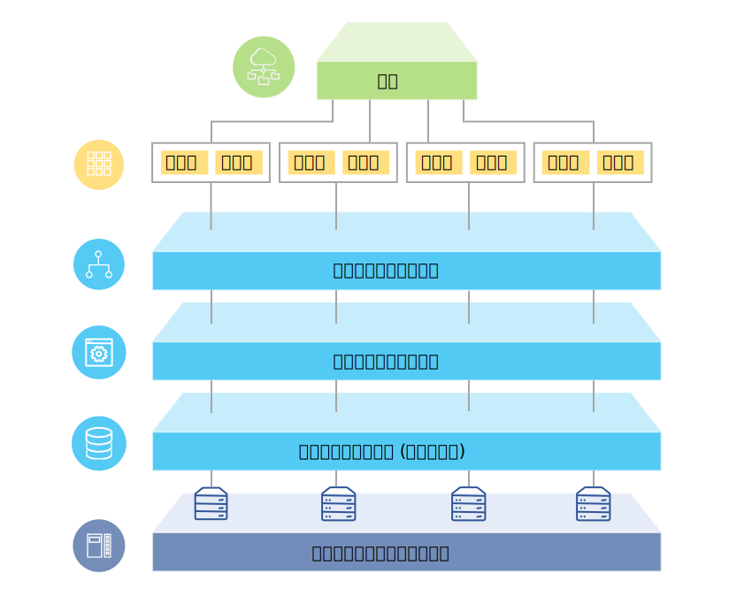

---

copyright:

  years:  2016, 2018

lastupdated: "2018-08-14"

---

# ソリューションの概要

{{site.data.keyword.vmwaresolutions_full}} オファリングを使用して、既存の VMware 仮想化データ・センターを {{site.data.keyword.cloud_notm}} に拡張したり、クラウド・ネイティブ・アプリケーションを保管したりすることができます。

このソリューションは、クラウドへのキャパシティー拡張 (および必要になったときの縮小)、クラウドへのマイグレーション、クラウドへの災害復旧、およびクラウドへのバックアップといったユース・ケースをサポートします。 このソリューションによって、開発、テスト、トレーニング、実験、および実動のための専用クラウド環境を作成できます。

VMware Cloud Foundation や VMware vCenter Server など、ターゲット・ワークロードに高水準の可用性とスケーラビリティーが必要となる {{site.data.keyword.vmwaresolutions_short}} オファリングの設計については、この資料を確認してください。

この設計は、特定のユースケースのために追加されるその他の内部コンポーネントまたはベンダー固有コンポーネントの基盤を提供する基本的なアーキテクチャーとして機能します。

## VMware on IBM Cloud の概要

図 1. VMware on {{site.data.keyword.cloud_notm}} の概要

## 主な利点

{{site.data.keyword.cloud_notm}} 上の VMware Cloud Foundation および vCenter Server は、基本的なビルディング・ブロックを提供します。これには、VMware vSphere、vCenter Server、NSX や、vSAN などの共有ストレージ・オプションが含まれます。 これらのコンポーネントは、ワークロードに最適な VMware ソフトウェア定義のデータ・センター・ソリューションを柔軟に設計するのに必要です。 

高度な自動化と単一テナント・ベアメタル・インフラストラクチャーを適用することで、数時間のうちに VMware 環境全体を迅速に {{site.data.keyword.cloud_notm}} にデプロイできるようになります。 次に、ネイティブ VMware クライアント、コマンド・ライン・インターフェース (CLI)、既存のスクリプト、または他の使い慣れた vSphere API 互換ツールを使用して、IBM ホスト環境にアクセスし、管理できます。

デプロイメント後、ESXi ホスト・ノードを追加して、一部の管理コンポーネントのバックアップやパッチを管理できます。 クラウドの利用をすぐに開始できるように移行、実装、オンボーディング・サービスなどのオファリングを提供してお客様を支援する、{{site.data.keyword.cloud_notm}} プロフェッショナル・サービスとマネージド・サービスも用意されています。

VMware on {{site.data.keyword.cloud_notm}} オファリングには、以下のような利点があります。

* **配信の加速**。リソースの調達、設計、実装、デプロイメントに数週間から数カ月かかっていた時間を数時間に削減し、IT プロジェクトを開発者および基幹業務に迅速に配信します。
* **セキュリティーの強化**。ホステッド・プライベート・クラウドの専用ベアメタル・サーバーでセキュリティーが強化されます。保存されたデータの暗号化などがあります。
* **一貫性のある管理およびガバナンスの実現**。仮想化管理への完全な管理アクセス権限を付与し、デプロイされたハイブリッド・クラウドに対して一貫性のある管理およびガバナンスを行うことで、既存の VMware ツール、スクリプト、研修への投資を保持できます。
* **世界規模での VMware 専門知識の利用**。世界 30 以上の {{site.data.keyword.CloudDataCents_notm}} にわたる IBM プロフェッショナル・サービスおよびマネージド・サービスで、世界規模の VMware 専門知識を利用できます。

### 関連リンク

* [設計の概要](design_overview.html)
* [キャパシティーの拡張](solution_scaling.html)
* [コンポーネントのバックアップ](solution_backingup.html)
