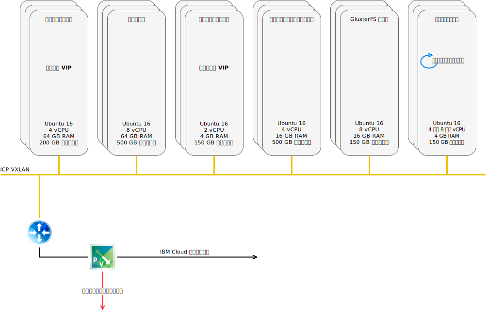

---

copyright:

  years:  2016, 2019

lastupdated: "2019-03-22"

subcollection: vmwaresolutions

---

# IBM Cloud のネットワーキングとインフラストラクチャー
{: #vcscar-arch-overview-infrastructure}

## Virtual Routing and Forwarding
{: #vcscar-arch-overview-infrastructure-vrf}

{{site.data.keyword.cloud}} アカウントは、Virtual Routing and Forwarding (VRF) アカウントとして構成することができます。 VRF アカウントを使用すると、サブネット IP ブロック間の自動グローバル・ルーティングが可能になります。Direct Link 接続を使用するアカウントはすべて、VRF アカウントに変換するか、VRF アカウントとして作成する必要があります。

## Direct Link
{: #vcscar-arch-overview-infrastructure-direct-link}

{{site.data.keyword.cloud_notm}} Direct Link Connect を利用することで、ローカルの {{site.data.keyword.CloudDataCent_notm}}を経由した {{site.data.keyword.cloud_notm}} インフラストラクチャーへのプライベート・アクセスと、ネットワーク・サービス・プロバイダーにリンクされた他のクラウドへのプライベート・アクセスが実現します。 このオプションは、単一環境にマルチクラウド接続を作成する場合に最適です。

共有帯域幅トポロジーを使用して、お客様を {{site.data.keyword.cloud_notm}} Private ネットワークに接続します。 すべての Direct Link 製品と同様に、すべての {{site.data.keyword.cloud_notm}} ロケーションへのプライベート・ネットワーク・トラフィックを使用できるようにする、グローバル・ルーティングを追加できます。

## 仮想プライベート・ネットワーク
{: #vcscar-arch-overview-infrastructure-virt-private-net}

### strongSwan VPN
{: #vcscar-arch-overview-infrastructure-strongswan}

strongSwan IPSec VPN サービスは、業界標準の Internet Protocol Security (IPSec) プロトコル・スイートに基づき、インターネット上にセキュアなエンドツーエンドの通信チャネルを確立します。

### Hybridity (HCX)
{: #vcscar-arch-overview-infrastructure-hcx}

VMware vCenter Server on {{site.data.keyword.cloud_notm}} Hybridity Bundle サービスはオンプレミス・データ・センターのネットワークを {{site.data.keyword.cloud_notm}} にシームレスに拡張するので、変換も変更も行わずに {{site.data.keyword.cloud_notm}} との間で仮想マシン (VM) をマイグレーションできるようになります。

## 物理構造
{: #vcscar-arch-overview-infrastructure-phys-structure}

{{site.data.keyword.icpfull_notm}} 実動インスタンスを VMware vCenter Server on {{site.data.keyword.cloud_notm}} クラスターにデプロイするために必要な物理インフラストラクチャーは、以下の最小仕様を必要とします。

表 1. {{site.data.keyword.icpfull_notm}} のための vCenter Server 仕様

| | NFS デプロイメント | vSAN デプロイメント |
|:---------- |:---------- |:---------- |
| サーバーの数 | 3 | 4 |
| CPU | 28 コア 2.2 GHz | 28 コア 2.2 GHz |
| メモリー | 384 GB | 384 GB |
| ストレージ | 2000 GB 2IOPS/GB 管理、2000 GB 4IOPS/GB ワークロード、4000 GB 4IOPS/GB {{site.data.keyword.icpfull_notm}} | 最小 960-GB SSD x 2 |

{{site.data.keyword.cloud_notm}} Private のハードウェア要件に加え、Cloud Automation Manager (CAM) のデータベースとログ・データを格納するために、{{site.data.keyword.icpfull_notm}} 環境に永続ボリュームを作成する必要があります。 CAM は {{site.data.keyword.icpfull_notm}} がサポートするすべての永続ボリューム・タイプをサポートしますが、CAM で推奨される 2 つのストレージ構成は NFS および GlusterFS です。

## 仮想構造
{: #vcscar-arch-overview-infrastructure-virt-structure}

図 1. vCenter Server と {{site.data.keyword.icpfull_notm}} デプロイメントの構造

vCenter Server インスタンス内で、{{site.data.keyword.icpfull_notm}} インスタンスは専用の NSX Edge Services Gateway (ESG) と Distributed Logical Router (DLR) とともにデプロイされます。
{{site.data.keyword.icpfull_notm}} インストールは、前述のコンポーネントで定義された VXLAN サブネットにロードされます。

アウトバウンド・トラフィックを許可するためのソース NAT ルール (SNAT) が ESG に構成されます。これにより、インターネット接続で {{site.data.keyword.icpfull_notm}} 前提条件をダウンロードし、GitHub および Docker に接続できるようになります。 代わりに、Web プロキシーを使用してインターネットに接続することもできます。 DNS および NTP サービスにもアクセスできるように ESG が構成されます。

{{site.data.keyword.cloud_notm}} 10.x ネットワークの {{site.data.keyword.icpfull_notm}} マスター/プロキシー仮想 IP アドレスを VXLAN 環境に変換する宛先 NAT ルール (DNAT) も ESG に構成されます。

## 関連リンク
{: #vcscar-arch-overview-infrastructure-related}

* [vCenter Server on {{site.data.keyword.cloud_notm}} with Hybridity Bundle の概要](/docs/services/vmwaresolutions/archiref/vcs?topic=vmware-solutions-vcs-hybridity-intro)
