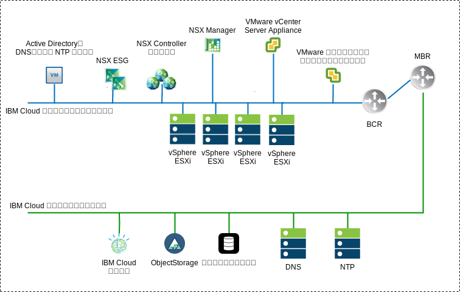
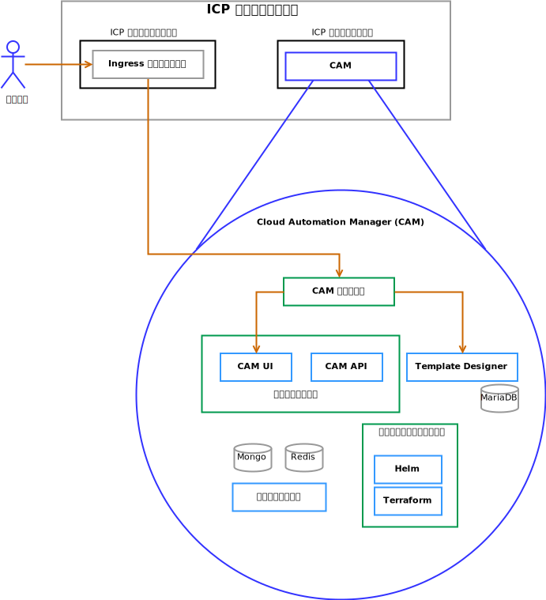

---

copyright:

  years:  2016, 2019

lastupdated: "2019-02-15"

---

# ソリューション・コンポーネント
{: #vcscar-arch-overview-solution}

## VMware vCenter Server on IBM Cloud のコンポーネント
{: #vcscar-arch-overview-solution-vcs-comp}

図 1. vCenter Server 環境の図

### Platform Service Controller
{: #vcscar-arch-overview-solution-psc}

vCenter Server デプロイメントでは、管理仮想マシン (VM) に関連付けられたプライベート VLAN 内のポータブル・サブネット上にインストールされた単一の外部プラットフォーム・サービス・コントローラーを使用します。 このデフォルト・ゲートウェイは、バックエンド・カスタマー・ルーター (BCR) に設定されます。

### vCenter Server
{: #vcscar-arch-overview-solution-vcs}

プラットフォーム・サービス・コントローラーと同様に、vCenter Server はアプライアンスとしてデプロイされます。 さらに、vCenter Server は、管理仮想マシンに関連付けられたプライベート VLAN 上のポータブル・サブネット上にインストールされます。 そのデフォルト・ゲートウェイは、その特定のサブネットの BCR に割り当てられた IP アドレスに設定されます。

### NSX Manager
{: #vcscar-arch-overview-solution-nsx-manager}

NSX Manager は初期クラスター内にデプロイされます。 さらに、管理コンポーネント用に指定されたプライベート・ポータブル・アドレス・ブロックから VLAN–backed IP アドレスが NSX Manager に割り当てられ、DNS サーバーと NTP サーバーが構成されます

### NSX Controller
{: #vcscar-arch-overview-solution-nsx-controllers}

{{site.data.keyword.cloud}} の自動化機能によって、初期クラスター内に 3 つの NSX Controller がデプロイされます。 管理コンポーネント用に指定されたプライベート・ポータブル・サブネットから VLAN–backed IP アドレスがコントローラーに割り当てられます。

### NSX Edge および分散論理ルーター
{: #vcscar-arch-overview-solution-nsx-edge}

NSX Edge Services Gateway (ESG) のペアがデプロイされます。 すべての場合において、プライベート・ネットワークに常駐する自動化コンポーネントからのアウトバウンド・トラフィックにゲートウェイ・ペアが 1 つ使用されます。 vCenter Server と {{site.data.keyword.icpfull_notm}} のための 2 つ目のゲートウェイ (ICP 管理エッジと呼ばれる) がデプロイされ、パブリック・ネットワークへのアップリンクとプライベート・ネットワークに割り当てられたインターフェースが構成されます。 管理者は、分散論理ルーター (DLR)、論理スイッチ、ファイアウォールなどの必要な NSX コンポーネントを構成できます。

ネットワーク設計について詳しくは、[vCenter Server ネットワーキングのリファレンス・アーキテクチャー](/docs/services/vmwaresolutions/archiref/vcsnsxt?topic=vmware-solutions-vcsnsxt-intro)を参照してください。

次の表は、{{site.data.keyword.icpfull_notm}} ESG および DLR の仕様を要約したものです。

表 1. {{site.data.keyword.icpfull_notm}} ESG の仕様

属性 | 仕様
--|--
Edge Service Gateway | 仮想アプライアンス
Edge サイズ    「大」 | vCPU 数	2
メモリー    | 1 GB
ディスク    | ローカル・データストアに 1000 GB

表 2. {{site.data.keyword.icpfull_notm}} DLR の仕様

属性 | 仕様
--|--|
分散論理ルーター |     仮想アプライアンス
Edge サイズ   「コンパクト」 | vCPU 数	1
メモリー    | 512 MB
ディスク    | ローカル・データストアに 1000 GB

## IBM Cloud Private コンポーネント
{: #vcscar-arch-overview-solution-icp-comp}

{{site.data.keyword.icpfull_notm}} は、オンプレミスのコンテナー化されたアプリケーションを開発および管理するためのアプリケーション・プラットフォームです。 {{site.data.keyword.icpfull_notm}} は、コンテナー・オーケストレーター Kubernetes、プライベート・イメージ・リポジトリー、管理コンソール、モニター・フレームワークを含む、コンテナーを管理するための統合環境です。

図 2. vCenter Server による仮想 {{site.data.keyword.icpfull_notm}} のデプロイメント

### ブート・ノード
{: #vcscar-arch-overview-solution-boot-node}

ブート (ブートストラップ) ノード (オプション) は、インストール、構成、ノード・スケーリング、クラスター更新の実行に使用されます。 クラスターに必要なブート・ノードは 1 つのみです。 単一ノードをマスターとブートの両方に使用します。

### マスター・ノード
{: #vcscar-arch-overview-solution-master-node}

マスター・ノードは管理サービスを提供し、クラスター内のワーカー・ノードを制御します。 マスター・ノードは、リソース割り振り、状態保守、スケジューリング、モニターを行うプロセスをホストします。

高可用性 (HA) 環境には複数のマスター・ノードが含まれているため、先行マスター・ノードで障害が発生した場合は、フェイルオーバー・ロジックによって別のノードが自動的にマスター役割にプロモートされます。 マスターとして機能できるホストは、マスター候補と呼ばれます。

### ワーカー・ノード
{: #vcscar-arch-overview-solution-worker-node}

ワーカー・ノードは、タスクを実行するためのコンテナー化された環境を提供するノードです。 要求の増加に対応してパフォーマンスと効率を向上させるために、クラスターにさらにワーカー・ノードを簡単に追加できます。 クラスターには任意の数のワーカー・ノードを含めることができますが、少なくとも 1 つのワーカー・ノードが必要です。

### プロキシー・ノード
{: #vcscar-arch-overview-solution-proxy-node}

プロキシー・ノードは、クラスター内で作成されたサービスに外部要求を送信するノードです。 高可用性 (HA) 環境には複数のプロキシー・ノードが含まれているため、先行プロキシー・ノードで障害が発生した場合は、フェイルオーバー・ロジックによって別のノードが自動的にプロキシー役割にプロモートされます。 

単一ノードをマスターとプロキシーの両方として使用できますが、マスター・ノードの負荷を軽減するために専用プロキシー・ノードを使用するのが最善です。クラスター内でロード・バランシングが必要な場合は、少なくとも 1 つのプロキシー・ノードがクラスターになければなりません。

### 管理ノード
{: #vcscar-arch-overview-solution-mgmt-node}

管理ノードは、モニター、課金、ロギングなどの管理サービスをホストするオプション・ノードです。専用の管理ノードを構成することにより、マスター・ノードが過負荷になることを防止できます。 管理ノードを有効にできるのは、{{site.data.keyword.icpfull_notm}} のインストール時のみです。

### 脆弱性アドバイザー・ノード
{: #vcscar-arch-overview-solution-va-node}

脆弱性アドバイザー (VA) ノードは、脆弱性アドバイザー・サービスの実行に使用されるオプション・ノードです。脆弱性アドバイザー・サービスはリソース集中型です。 脆弱性アドバイザー・サービスを使用する場合は、専用の VA ノードを指定してください。

以下の表に、高可用性 {{site.data.keyword.icpfull_notm}} インスタンスに必要な VM の仕様を示します。

表 3. {{site.data.keyword.icpfull_notm}} VM の仕様

ノード |     インスタンス    | IP    | CPU    | RAM (GB)    | ディスク (GB)
:-----|------------:|:----|----:|----------:|----------:|
マスター|    3    | IP (x3) VIP (x1)    | 4    | 64    | 200
管理    |3    | IP (x3)    |8    |64    |500
プロキシー    | 3    | IP (x3) VIP (x1)    |2    |4    |150
Vulnerability Advisor    |3    | IP (x3)    | 4    | 16    |500
GlusterFS    | 3    | IP (x3)    |8    |16    |150
ワーカー    | 3-6    | IP (x3)    |4-8    |4    |150

CAM が機能するためには、ワーカー・ノードの vCPU とメモリーの構成を大きくする必要があります。

表 4. {{site.data.keyword.icpfull_notm}} VM の仕様

ノード |     インスタンス    | IP    | CPU    | RAM (GB)    | ディスク (GB)
:-----|------------:|:----|----:|----------:|----------:|
ワーカー  |  3 | IP (x3)  |  4-8 |16-20   |  150

## IBM Cloud Automation Manager コンポーネント
{: #vcscar-arch-overview-solution-icam-comp}

{{site.data.keyword.cloud_notm}} Automation Manager (CAM) は、開発者と管理者がビジネス要求を満たせるようにする、{{site.data.keyword.icpfull_notm}} 上で実行されるセルフサービスのマルチクラウド管理プラットフォームです。

図 3. CAM コンポーネント・リファレンス

### CAM プロキシー
{: #vcscar-arch-overview-solution-cam-proxy}

CAM への nginx プロキシー・アクセスを提供します。

### CAM ユーザー・インターフェース
{: #vcscar-arch-overview-solution-cam-ui}

CAM ユーザー・インターフェース・コンポーネントは複数のコンテナー (すなわち、クラウド接続ユーザー・インターフェース、テンプレート・ライブラリー・ユーザー・インターフェース、およびデプロイ済みインスタンス・ユーザー・インターフェース) に分割されます。

### CAM API
{: #vcscar-arch-overview-solution-cam-api}

CAM API は複数のコンテナーに分かれています。

### Helm
{: #vcscar-arch-overview-solution-helm}

Helm チャートを Kubernetes クラスターにデプロイするために必要なバイナリー・ファイルを入れたコンテナー。

### Terraform
{: #vcscar-arch-overview-solution-terra}

Terraform リソースを複数のクラウドにデプロイするために必要なバイナリー・ファイルを入れたコンテナー。

### ログ
{: #vcscar-arch-overview-solution-logs}

コンテナー・ログのロケーション。

### Mongo データベース
{: #vcscar-arch-overview-solution-mongo-db}

CAM アプリケーションのコア・データベース。

### Redis
{: #vcscar-arch-overview-solution-redis}

Redis データベースは、セッションのキャッシュとロックを CAM 内に保管するために使用されます。

### Template Designer
{: #vcscar-arch-overview-solution-templ-designer}

Terraform テンプレートを作成するためのグラフィカル・ユーザー・インターフェース。Terraform モジュールをドラッグする機能を備えています。

### Maria データベース
{: #vcscar-arch-overview-solution-maria-db}

Template Designer アプリケーションのデータベース。

## 関連リンク
{: #vcscar-arch-overview-solution-related}

* [vCenter Server on {{site.data.keyword.cloud_notm}} with Hybridity Bundle の概要](/docs/services/vmwaresolutions/archiref/vcs?topic=vmware-solutions-vcs-hybridity-intro)
