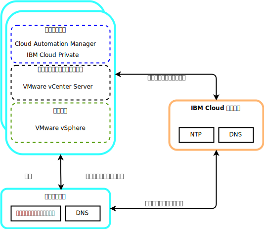

---

copyright:

  years:  2016, 2019

lastupdated: "2019-02-15"

---

# VMware および Skate Advisor Concept Car の共通サービス・コンポーネント
{: #vcscar-commonservices}

共通サービスは、クラウド管理プラットフォームの他のサービスによって使用されるサービスを提供します。 共通サービスには、ID およびアクセスのサービス、ドメイン・ネーム・サービス、NTP サービスなどがあります。

図 1. {{site.data.keyword.icpfull_notm}} の共通サービス

## ID およびアクセス・サービス
{: #vcscar-commonservices-identity}

VMware vCenter Server on {{site.data.keyword.cloud_notm}} 自動化機能の一部として、ID 管理に Microsoft Active Directory (AD) が使用されます。 単一の AD 仮想サーバー・インスタンス (VSI) がデプロイされます。 vCenter は AD 認証を使用するように構成されるため、{{site.data.keyword.icpfull_notm}} にも LDAP 認証を構成できます。

## ドメイン・ネーム・サービス
{: #vcscar-commonservices-dns}

デプロイメント環境では、デプロイ済みの AD VSI をインスタンスのドメイン・ネーム・システム (DNS) サーバーとして使用します。デプロイされたコンポーネントはすべて、AD をデフォルトの DNS としてポイントするように構成されます。デプロイ済みのコンポーネントの例には、vCenter、PSC、NSX、ESXi ホストなどがあります。

## Network Time Protocol サービス
{: #vcscar-commonservices-ntp}

vCenter Server のデプロイメントでは、{{site.data.keyword.cloud_notm}} インフラストラクチャーの Network Time Protocol (NTP) サーバーを使用します。デプロイ済みのすべてのコンポーネントは、これらの NTP サーバーを使用するように構成されます。 証明書と AD 認証が正常に機能するためには、すべてのコンポーネントで同じ NTP サーバーを使用することが必要不可欠です。

## 関連リンク
{: #vcscar-commonservices-related}

* [vCenter Server on {{site.data.keyword.cloud_notm}} with Hybridity Bundle の概要](/docs/services/vmwaresolutions/archiref/vcs?topic=vmware-solutions-vcs-hybridity-intro)
