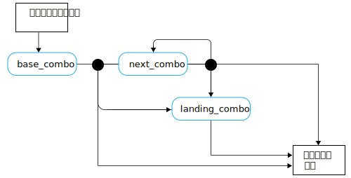

---

copyright:

  years:  2016, 2019

lastupdated: "2019-08-05"

subcollection: vmware-solutions


---

# スケートボード言語の概念
{: #vcscar-concepts}

## スケーター言語
{: #vcscar-concepts-skater}

Skate Advisor の重要な側面は、Watson 駆動のチャットボットと会話ができることです。 以下のセクションでは、Skate Advisor チャットボットのヒューマン・インタラクションを定義する会話ルールについて詳しく説明します。

スケーター言語がシステムの中核であり、次のように使用されます。
* トリックの認識: Watson Discovery が、既存のトリックを認識してソース素材に対応付けることができるように、オンライン・ソースから素材を取り込む際に使用します。
* スケートについての会話: チャットボットが、システムのユーザーと意味のある会話を行うために使用します。
* トリックの分類: トリックを表すテキストに基づいて、そのトリックを保管および分類します。 ロケーションやビデオの参照などのメタデータは、分類されたトリックに添付できます。

## 言語エレメント
{: #vcscar-concepts-lang-elem}

### コア・エレメント
{: #vcscar-concepts-core-elem}

トリックを構成する主要な言語エレメントを次に示します。

表 1. 主要な言語エレメント

エレメント・タイプ | 言語テキスト
---|---|---
方向 | fakie<br>nollie<br>switch
回転 | halfcab<br>cab<br>180<br>360<br>540
基本 | kickflip<br>heelflip<br>hardflip<br>bigspin<br>shuvit<br>impossible
着地 | manual (後輪 2 つ)<br>nosemanual (前輪 2 つ)<br>5-0 (グラインド)<br>nosegrind<br>tailslide<br>noseslide<br>crooked grind<br>smithgrind<br>boardslide<br>lipslide<br>

### エレメント修飾子
{: #vcscar-concepts-elem-modifiers}

エレメント修飾子は、言語の特定の側面のコンテキストを表す特殊な言語エレメントです。

表 2.言語修飾子

エレメント・タイプ | 言語テキスト |特記事項
---|---|---
ターン・プレフィックス | Frontside<br>backside | ターン・プレフィックスは、ターンの方向を表します。
バリアル | Inward<br>outward |

## 言語ルール
{: #vcscar-concepts-lang-rules}

この言語は、以下のルール・セットによって構成されます。 トリックは、エレメントを組み合わせた 1 つ以上のコンビネーション (「コンボ」と呼ばれます) に分けられます。 最初のコンボと後続のコンボには、特に指定がなければ基本コンボと同じ方向であると見なされるという違いがあります。

以下のルールで、言語の構成に使用されるコア・エレメントとエレメント修飾子の基準を確認してください。

### トリック・ルール・セット
{: #vcscar-concepts-trick-ruleset}

```
base_combo = 'direction \+ \[varial | turn_prefix\] \+ \[rotation\] \+ \[base_trick\]'
next_combo = ''\[varial | turn_prefix\] \+ \[rotation\] \+ \[base_trick\]'
landing_combo = ''\[varial | turn_prefix\] \+ landing'
trick = 'combo \+ \[“to” + combo\] \+ \[“to” \+ landing_combo\]'
```

### トリック・ルール・エンジン
{: #vcscar-concepts-trick-rule-engine}

次の図は、ルール・エンジンを視覚的に要約した図です。



## トリック言語のサンプル
{: #vcscar-concepts-sample-trick}

以下の例は、サンプル・トリックのリストです。

```
fakie-kickflip
fakie-kickflip to fakie-5-0 to fronside-halfcab (out)
fakie-heeflip
fakie-heeflip to fakie-maual to fakie-hardflip
fakie-inward (varial) heeflip to fakie-backside tailslide to fakie
switch-heeflip to fakie-maual to fakie-hardflip
switch-hardflip to fakie-manual
fakie-hardflp to fakie-nosegrind
nollie-hardflip-to-tailslide
nollie-inward-heelflip to frontside noseslide
kickflip-frontside to crooked grind
halfcab-heelflip to crooked grind
frontside-shuvit to nosegrind to nollie-flip (out)
kickflip to nosegrind to nollie-impossilbe (out)
nollie-kickflip to noseslide to nollieflip
nollie-kickflip to frontside-lipslide
nollie-impossible to manual
nollie-impossible to 5-0
nollie-kickflip to crooked grind
nollie-kickflip to crooked grind to nollie-halfcab-kickflip (out)
frontside-nollie-halfcab-heelflip to fakie-nosegrind
backside-nollie-halfcab-kickflip to backside-tailslide to backside-180-out
frontside-nollie-cab-kicflip halfcab to backside-smithgrind
halfcab to backside-smithgrind to backside-180-bigspin (out)
kickflip-backside-tailslide to backside-180-kickflip
kickflip-backside-tailslide to backside-backside-bigspin
360-kicflip to nosemanual to nollie-360-kickflip
360-kicflip to frontside-lipslide
harflip to backside-lipslide
kicflip to frontside-boardslidev
nollie-heelflip to frontside-boardslide
```

## 関連性
{: #vcscar-concepts-relevance}

トリック言語は、スケートに関する文書やメディアを認識して取り込めるように Watson をトレーニングするための重要な構成概念です。また、ユーザーとの会話の基礎を形成するものでもあります。
