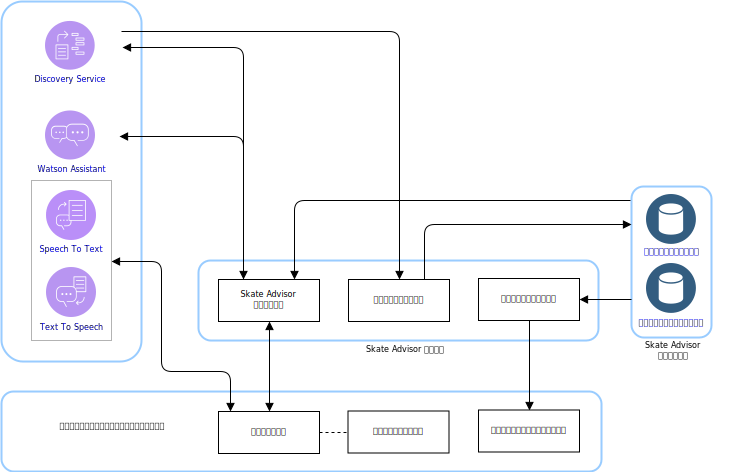

---

copyright:

  years:  2016, 2019

lastupdated: "2019-03-19"

subcollection: vmware-solutions

---

# Skate Advisor の論理設計
{: #vcscar-logical}

ここでは、このシステムの論理設計を形成するアプリケーション・エレメントについて詳しく説明します。

## システム・コンポーネント
{: #vcscar-logical-sys-comp}

図 1. Skate Advisor コンポーネント

Skate Advisor の主要な構成要素は、認識したテキストまたは音声を受け入れて、構造化された方法でシステムと対話できるチャットボットです。

## トリック
{: #vcscar-logical-tricks}

Skate Advisor の中核となるデータ・エレメントはトリックです。 トリックは、トリック言語によって一意的に定義されます。 この言語を使用して、以下のタスクを実行できます。
- トリックについてチャットボットと会話する。
- Watson Discovery を使用してトリックを検索する。
- ソース記事で Watson Discovery をトレーニングするときにトリックを識別して分類する
- ロケーションおよびメディアを表示する目的でトリックを識別する。

### トリックの定義
{: #vcscar-logical-trick-def}

トリックは、トリックを表す言語構造体によって一意的に定義されます。 完全な定義については、『トリック・ルール・エンジン』を参照してください。

### トリックのリスト
{: #vcscar-logical-list-tricks}

言語エレメントで定義された基本トリックまたは着地を照会すると、トリックのリストが返されます。

### トリック・データ
{: #vcscar-logical-trick-data}

返されたトリックには、以下の情報が含まれています。
- トリックの説明
- 1 つ以上のメディア成果物
- ロケーション情報

## 会話ストリーム
{: #vcscar-logical-conv-streams}

チャットボットには、限られた数の会話が事前定義されています。 会話は次の情報で定義されます。
- トリックの検索: 基本トリックまたは着地を表す照会パラメーターに基づいて、該当する一連のトリックを見つけます。
- ロケーションの検索: トリックに適した近くのロケーションを見つけます。
- メディアの表示: トリックが分類および検出されたオンライン・ビデオなどのメディア・アイテムを表示します。

表 1. 会話

会話 | 構造 | 結果
---|---|---
トリック検出 | トリックについて説明して |トリックのリスト
ロケーションの検出 | このトリックはどこで実行するのがよい? | 特定のトリックのロケーションのリスト
メディア表示 | トリックのビデオを見せて |メディア結果のリスト

## ユーザー・インターフェース・コンポーネント
{: #vcscar-logical-ui-comp}

### チャットボット
{: #vcscar-logical-chatbot}

チャットボットは、ユーザーと会話する Web コンポーネントです。 チャットボットはテキストも音声も受け入れることができます。 リストのような結果はテキストで表示されますが、結果を説明する音声が付く場合もあります。

チャットボットは、以下の方法でシステムと対話します。

図 2. チャットボットへの標準的な照会
 

表 2. チャットボットの対話

ステップ | 説明
---|---
1 | 有効な会話を開始します。『会話ストリーム』のセクションを参照してください。
2 | チャットボットが音声を「Speech to Text」サービスに送信します。
3 | 「Speech to Text」サービスがテキストをチャットボットに送信します。
4 | チャットボットがテキスト照会を Skate Advisor に送信します。
5 | Skate Advisor が要求を評価し、Watson Assistant に送信します。
6 | Watson Assistant が要求を分類し、実行するアクションを Skate Advisor に返します。
7 | Skate Advisor が Discovery Service にデータ・セットを要求します。
8 | Discovery Service が照会を評価し、応答を送信します。
9 |Skate Advisor が応答を形成し、テキストでチャットボットに送信します。
10 | チャットボットがテキスト応答を「Text To Speech」サービスに送信します。
11 | 結果がチャットボットからユーザーに送信されます。

### ビデオ・レンダリング
{: #vcscar-logical-video-render}

ビデオ・レンダリング・コンポーネントは、ビデオを再生したり、文書を表示したりします。 それらの成果物は、トリックが検出されたソース成果物に相当します。

ビデオ・レンダリング・コンポーネントは、ビデオを表示する、Web インターフェースの埋め込みウィジェットです。 ビデオは、システム・ユーザーからの照会の結果としてチャットボットに表示されます。 結果として表示するビデオ・リンクが選択されると、ビデオのレンダリングが開始されます。

### ロケーション・インターフェース
{: #vcscar-logical-location-interface}

Skate Advisor には、システム・ユーザーが特定のトリックのロケーションを記録するためのインターフェースが含まれています。 この Web インターフェース・コンポーネントには、以下の 2 つの主要な要素があります。
1. 特定のトリックを実行するために最適な場所として、システム・ユーザーのロケーションを受け入れます。
2. 特定のトリックに推奨される 1 つ以上のロケーションを表示します。

## Watson コンポーネント
{: #vcscar-logical-watson-comp}

このアーキテクチャーには、以下の Watson コンポーネントが含まれています。
* Knowledge Studio - Watson Studio をツールとして使用することで、システム用のスケート言語を設計し、スケート言語が実装された Web 上のドキュメントを認識することができます。 Knowledge Studio には、Watson Discovery で使用するモデルが用意されています。
* Speech to Text - 音声をテキストに変換します。 このコンポーネントは、チャットボットが実行されているデバイスから音声を受け入れて、Watson が処理できるようにテキストに変換します。
* Text to Speech - テキストから音声を合成します。 このコンポーネントは、Skate Advisor アプリケーションからテキストを受け入れて、チャットボットが実行されているデバイス用の音声に変換して再生します。
* Discovery Service - Watson Discovery Service は、要求されたパラメーターに一致するスケート関連のコンテンツを取得するためにシステムで使用されます。 例えば、「キャスパー・トリックについてのすべてのレコードをリストして」というような要求があります。 Watson Discovery は、高度な機械学習手法を使用して、取り込まれたコンテンツから最も関連性の高い節を表示します。
* Watson Assistant - Watson Assistant は、ユーザーとマシン (チャットボット) の間の対話を設計するツールです。 このツールは、分野 (スケートボードなど) に固有の言語を使用して、適切な応答を認識して生成するための一連の文法の形式についてトレーニングする必要があります。

## Skate Advisor サービス
{: #vcscar-logical-skate-advisor-services}

Skate Advisor サービスは、要求に応えるための一連の API サービスを提供するアプリケーション・コンポーネントです。 公開されるサービスは、前述の会話ストリームに直接関係します。 公開される API は、大きく次のように分類されます。
* get_tricks - Discovery Service に渡される自然言語の <照会\> に基づいて、トリックのリストを返します。
* show_tricks - 特定のトリックに関するメディアのリストを返します。
* find_trick - 特定のトリックを返します。
* accept_command - チャットボットからテキスト・コマンドを受け入れて、要求を処理します。

## Discovery Service のトレーニング
{: #vcscar-logical-disc-service-training}

Watson Discovery は、機械学習モデルを使用してトレーニングする必要があります。機械学習モデルは、対象分野の専門家が Watson Knowledge Studio を使用して繰り返し作成します。

図 3. Discovery Service のトレーニング
 

Skate Advisor のモデルは、モデルを作成するためのルール・ベースのトレーニングと辞書ベースのトレーニングを組み合わせて、エンティティー・タイプ間の関係で構成されています。 このモデルにより、Discovery Service は、トレーニング・セットとして使用した記事やビデオの説明から取り込まれたトリックを認識して分類することができます。

トレーニングの後、Discovery Service は、次のような照会に応答できます。
- ヒールフリップの基本トリックが含まれたトリックをすべて見せて。
- トリックをすべて見せて。
- コンボがいくつも含まれたトリックをすべて見せて。

## 関連リンク
{: #vcscar-logical-related}

* [vCenter Server on {{site.data.keyword.cloud}} with Hybridity Bundle の概要](/docs/services/vmwaresolutions/archiref/vcs?topic=vmware-solutions-vcs-hybridity-intro)
