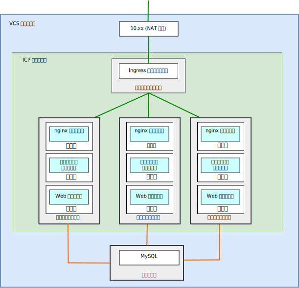
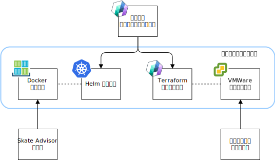
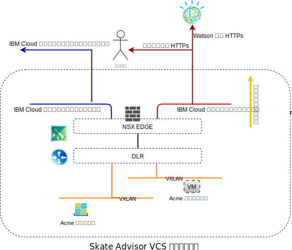
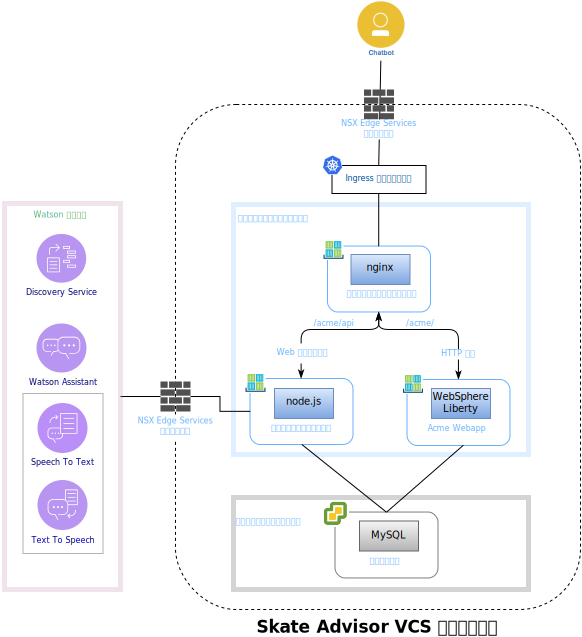

---

copyright:

  years:  2016, 2019

lastupdated: "2019-03-19"

subcollection: vmware-solutions

---

# Skate Advisor コンポーネント
{: #vcscar-physical}

{{site.data.keyword.vmwaresolutions_full}} は、世界中の {{site.data.keyword.CloudDataCents_notm}}に VMware テクノロジー・コンポーネントをデプロイするための自動化機能を備えています。 このアーキテクチャーは単一のクラウド領域に構築されていますが、以下の場所にある他のクラウド領域に拡張できます。

1. 別の地域。
2. 同じデータ・センター内の別の {{site.data.keyword.cloud_notm}} ポッド。
3. 別の地域および同じデータ・センター内別の {{site.data.keyword.cloud_notm}} ポッド。

{{site.data.keyword.icpfull_notm}} および Cloud Automation Manager (CAM) 製品をオンプレミスの仮想化プラットフォームに手動でデプロイして、オンプレミスの場所からクラウド管理を行うことができます。 また、{{site.data.keyword.icpfull_notm}} および CAM は、既存または新規の VMware vCenter Server on {{site.data.keyword.cloud_notm}} デプロイメントのサービス拡張として自動化機能によって提供され、{{site.data.keyword.cloud_notm}} からのクラウド管理を可能にします。

{{site.data.keyword.icpfull_notm}} は、オンプレミスのコンテナー化されたアプリケーションを開発および管理するためのアプリケーション・プラットフォームです。 これは、コンテナー・オーケストレーター Kubernetes、プライベート・イメージ・リポジトリー、管理コンソール、モニター・フレームワークを含む、コンテナーを管理するための統合環境です。

IBM Multi-Cluster Manager は、複数のクラウドおよびクラスターにおけるユーザー可視性、アプリケーション中心の管理 (ポリシー、デプロイメント、正常性、操作)、ポリシー・ベースのコンプライアンスを提供します。 IBM Multi-Cluster Manager を使用することで、Kubernetes クラスターを制御できます。 クラスターを安全かつ効率的に運用できるうえに、アプリケーションに必要なサービス・レベルの提供を保証できます。

{{site.data.keyword.cloud_notm}} Automation Manager は、開発者と管理者がビジネス要求を満たせるようにする {{site.data.keyword.cloud_notm}} Private 上で実行されるセルフサービスのマルチクラウド管理プラットフォームです。 Cloud Automation Manager Service Composer を使用すると、{{site.data.keyword.icpfull_notm}} カタログでハイブリッド・クラウド・サービスを公開できます。

## Skate Advisor 物理コンポーネント
{: #vcscar-physical-skate-comp}

以下の図は、アプリケーション・モダナイゼーション・インフラストラクチャーで Acme Skate Advisor アプリケーションを実装したリファレンス実装を示しています。

図 1. Skate Advisor 物理コンポーネント
 

Skate Advisor アプリケーションは、既存の Acme Web アプリケーションを、Watson と対話するマイクロサービス・ベースのコンポーネント、および Web およびマイクロサービス・コンテナーに要求を中継するための nginx コンテナーを使用して拡張したものです。

Skate Advisor アプリケーションは、必要なホスティング・インフラストラクチャーを備えたアプリケーション・モダナイゼーション・プラットフォームを利用します。

### アプリケーションのパッケージ化およびデプロイメント
{: #vcscar-physical-app-pack-depl}

アプリケーションは、以下のエレメントを含む CAM オーケストレーションとしてデプロイされます。
* サービス・オーケストレーション - CAM サービス・オーケストレーションは、サービスの一部としてデプロイする Terraform テンプレートおよび Helm チャートを表すワークフロー・リソースです。 サービスは、公開可能であり、デプロイメント全体のオーケストレーションの制御元になる成果物です。
* Helm チャート - Helm チャートは、ローカルの {{site.data.keyword.icpfull_notm}} リポジトリーにあり、コンテナーおよびその他のリソースを {{site.data.keyword.icpfull_notm}} にデプロイします。 Helm チャートは、以下を含む Kubernetes リソースを表しています。
  - コンテナー・デプロイメント
  - サービス
  - Ingress
  - ルール
  - エンドポイント

* Docker イメージ - Docker イメージには、オペレーティング・システム (ubuntu)、ミドルウェア (WebSphere Liberty、nginx)、および Skate Advisor と Skate Store のコードが含まれています。 Docker イメージは、実行中のコンテナーにデプロイされる静的オブジェクトです。
* Terraform テンプレート - Terraform テンプレートは、デプロイされるクラウド・リソースを表すファイルです。 Skate Advisor については、mysql とデータベース・スキーマと一緒にプリインストールされる ubuntu テンプレートが記述されています。
* VMWare テンプレート - VMWare テンプレートは、mysql とデータベース・スキーマがプリインストールされた Ubuntu テンプレートです。

図 2. CAM オーケストレーション
 

### ロード・バランシングおよびプロキシー処理
{: #vcscar-physical-load-balance-proxy}

ロード・バランシングとプロキシー処理は、{{site.data.keyword.icpfull_notm}} Ingress Controller コンポーネントを介して実装されます。 このコンポーネントは、コンテナーのスケーリングとフェイルオーバーをシームレスな方法で処理します。

アプリケーションのプロキシー処理は、以下の方法でロード・バランシングを行う nginx コンテナーによって実現します。

表 1. Skate Advisor のリバース・プロキシー・ルール

URL	|エンドポイント
---|---
/acme	|Acme Web コンテナー・サービス
/acme/api	|Skate Advisor サービス
/acme/api/explorer	|Skate Advisor サービス

コンテナーには、システム要求に応じてスケールインおよびスケールアウトする可能性がある予測不能な IP アドレスがあります。 この問題に対処するために、{{site.data.keyword.icpfull_notm}} サービスを使用して、システム内で IP アドレスの解決をリアルタイムで実行します。

### Acme Skate Web アプリケーション
{: #vcscar-physical-acme-skate-web-app}

Acme Skate Web アプリケーションは、Spring Framework に基づく Java Platform, Enterprise Edition (Java EE) アプリケーションです。 このアプリケーションは、WebSphere Liberty コンテナーにデプロイされます。

### Acme Skate Advisor アプリケーション
{: #vcscar-physical-acme-skate-advisor-app}

Acme Skate Advisor アプリケーションは、WebSphere Liberty コンテナーにデプロイされるマイクロサービス・ベースのアプリケーションです。 nginx Web サーバーが、マイクロサービスのフロントエンドになります。

### Acme Skate データベース
{: #vcscar-physical-acme-skate-db}

Acme Skate データベースは、vSphere 管理対象仮想マシンにデプロイされる MySQL データベースです。

### 通信の概要
{: #vcscar-physical-comm-overview}

Skate Advisor には、以下の通信が必要です。
-	Web コンテナーからシステム・ユーザーへの通信。
-	Advisor および Web コンテナーから Watson サービスへの通信。
-	実装環境のコンテナーと仮想マシンの間の通信。

アプリケーション・モダナイゼーション・プラットフォームは、この目標を達成するために以下のコンポーネントを使用して設計されています。

図 3. パブリック・ネットワーク・アクセス
 

{{site.data.keyword.cloud_notm}} には 2 つのネットワークがあります。 パブリック・ネットワークによりインターネットからサーバーへのアクセスが可能になり、プライベート・ネットワークにより {{site.data.keyword.CloudDataCents_notm}}のすべての高速バックボーンを使用したサーバー間通信が可能になります。

お客様は Virtual Routing Appliance (VRA) を使用して、VLAN をアプライアンスに関連付けることで、プライベート・ネットワーク・トラフィックとパブリック・ネットワーク・トラフィックをルーティングできます。
vCenter Server NSX Edge と {{site.data.keyword.containerlong_notm}} インフラストラクチャーには、パブリック・ネットワークへのデフォルト・ルートと、プライベート・ネットワークへの標準ルート 10.0.0.0/ 8 が構成されます。

NSX VXLAN を定義する場合は、VRA アプライアンスへの静的ルートが {{site.data.keyword.containerlong_notm}} インフラストラクチャーに必要です。 NSX Edge から、プライベート・ネットワークを介した VRA との BGP ピアリングを構成し、NSX VXLAN のルートの通知と注入を有効にします。 このピアリングにより、NSX VXLAN オーバーレイ・ネットワークは {{site.data.keyword.cloud_notm}} バックボーンと通信できるようになります (その逆も可能です)。

### ソフトウェア・コンポーネント・マッピング
{: #vcscar-physical-soft-comp-mapping}

Skate Advisor アプリケーションは、以下のソフトウェア・コンポーネントを使用します。

図 4. Skate Advisor ソフトウェア・マッピング
 

以下のソフトウェア・コンポーネントが使用されます。

* nginx	- リバース・プロキシー・サービスをアプリケーションに提供します。
マイクロサービスおよびアプリケーション要求が、正しいコンテナー・エンドポイントに配布されます。
* WebSphere Liberty - Acme アプリケーションをホストします。このアプリケーションは、Spring ベースの Java Platform, Enterprise Edition アプリケーションです。
* Node.js - マイクロサービス・フレームワークをチャットボットに提供します。 このアプリケーションは Watson のサービスを使用します。
* mysql - このアプリケーション・データベースは Oracle Mysql によって提供されます。
* JavaScript - チャットボットは、クライアントのブラウザーでホストされる JavaScript ベースのアプリケーションです。 チャットボットは、Node.js ベースのマイクロサービスを介して Watson と通信します。

## 管理の概要
{: #vcscar-physical-mgmt-ovw}

Acme Skate Advisor は {{site.data.keyword.cloud_notm}} に存在します。これはこのアーキテクチャーの重要な側面です。 {{site.data.keyword.cloud_notm}} のアーキテクチャーは以下のとおりです。

図 5. クラウド管理

この図は、vCenter Server インスタンスにデプロイされた {{site.data.keyword.icpfull_notm}} と CAM を表しています。これらは、オンプレミスの vCenter および {{site.data.keyword.containerlong_notm}} サービスに接続されています。 システム管理者および開発者は、CAM を使用して、仮想マシンをオンプレミスまたは vCenter Server インスタンスにデプロイし、コンテナーを {{site.data.keyword.icpfull_notm}} クラスターおよび {{site.data.keyword.containerlong_notm}} クラスターにデプロイできます。

この図では、CAM は、vCenter、クラウド・プロバイダー、{{site.data.keyword.icpfull_notm}} 環境、および {{site.data.keyword.containerlong_notm}} 環境へのクラウド接続を論理的に作成します。 {{site.data.keyword.icpfull_notm}} クラスターを単一の管理ビューに接続するメカニズムを提供する MCM を使用して、各データ・センター/クラウド環境に {{site.data.keyword.icpfull_notm}} クラスターがデプロイされます。

## 関連リンク
{: #vcscar-physical-related}

* [vCenter Server on {{site.data.keyword.cloud_notm}} with Hybridity Bundle の概要](/docs/services/vmwaresolutions/archiref/vcs?topic=vmware-solutions-vcs-hybridity-intro)
