---

copyright:

  years:  2016, 2019

lastupdated: "2019-06-26"

subcollection: vmware-solutions

---

# 前書き
{: #vcscar-preface}

## スケートボード言語の概要
{: #vcscar-preface-intro}

スケート・ボーダーは大きな動きと小さな動きを組み合わせてトリックを生み出すので、動作の物理的な特性をベースとする一種の文法あるいは構文のようなものが生まれました。化学の用語体系も同じような理由で発展してきました。 現在、スケーターは、地球の反対側にいる別のスケーターにトリックの名前をメールで伝えるだけで、そのトリックの複雑な動きを理解してもらうことができます。

この言語の豊かさは、スケートボード自体の複雑さがもたらしたものです。 ボードの複雑な動きを基に、数十種類の基本トリックが生み出されました。基本トリックは、いくつかの可変要素を変化させてさまざまな方法で実行できるので、膨大な数のコンビネーションを作ることができます。

各コンポーネントの「プレフィックス-語幹-サフィックス」という構造により、各要素または動きをつなげる方法を表せます。これは、ボードとライダーが実際に行う一連の動きに対応します。 物理的な向きと力のメカニズムにより、組み合わせがうまくいくものといかないものが決まります。これが、この構文が生まれた理由です。

トリックは、ボードのテールとノーズのどちらからでも実行できます。ライダーの前足または後ろ足に対応して*オーリー* または*ノーリー* と呼ばれます。 ボードのフリップ、回転、および宙返りは、3 軸、方向、回転方向 (右回りまたは左回り) を変えて組み合わせることができます。 ライダーの動きとボードの動きを組み合わせることで、方向、回転、「スタンス」、および、ボードのフリップ方向にターンを合わせるかどうかという基準で構成されるアクションに、さらにいくつもの次元を加えることができます。

この最後の 2 つの可変要素については、より詳しい説明が必要です。 まず、*スタンス* は、線上の方向とよく混同されます。 スケーターは皆、生まれつきのスタンスを持っています。スタンスとは左足と右足のどちらを前に出すかということです。*スイッチ* (スイッチ・スタンス) でトリックを行うことは、野球のスイッチヒッターと同じように鏡像であることを意味します。 方向が逆になるのは付随的な結果であり、大事な違いは利き手、もとい「利き足」かどうかです。 つまり、*スイッチ* でトリックを行うと称賛されるのは、方向が逆だからではなく、すべての運動機能がスケーターの利き側でない側、すなわち「利き足でない」足に替わっているからです。 単に逆方向にトリックを行うフェイキーは、方向にマイナス記号が付いただけで、運動機能はすべて変わらないのでほんの少し難しくなるだけです。

上級のスケーターにとって非常に重要な 2 番目の違いは、ボードがフリップおよび回転 (2 軸) する方向が自分の体に対して*インワード* または*アウトワード* のどちらであるかということです。 フリップ・トリックは、ボードのどちらかの端から、つま先またはかかとを使って回転させます。*キック・フリップ* はつま先側から時計回りに回転し、*ヒール・フリップ* はその反対です。動きの自然な流れに合わせてフリップするか、流れに逆らってフリップするかです。

つまり、インワード・フリップは非常に不自然な動きであるため、*ハード・フリップ* という別の用語で称賛されています。 つまり、*nollie-inward-kickflip* は、*nollie-hardflip* と同じです。不自然な動きであるために、より一層の正確さが求められます。

したがって、このプレフィックス-語幹-サフィックスの構造を取る各コンポーネントは、さらに 3 つのバイナリー・エレメントである回転、方向、およびスタンスに分割できます。また、トリックによっては、フリップがインワードかアウトワードかを指定する必要もあります。 スケーティングは、トリックを組み合わせられなければ、子供の遊びになってしまいます。トリックの組み合わせにより、アクションの数が雪だるま式に増えていきます。 複数の基本トリックをつないで、2 つまたは 3 つのトリックで構成された 1 つの複合トリックにすることができます。トップ・プロの場合は 5 つ、6 つものトリックを含むものになることがあります。

これまでに、一般的なアクションの数は数百に達していますが、これは始まりにすぎません。本当の複雑さは*ストリート・スケーティング* に見られます。ストリート・スケーティングにより、コンビネーションの数は数千にまで爆発的に増加しています。

90 年代初期に、スケーターは初期のフラット・グラウンド・トリックを周囲の「有機的」な環境で行うようになりました。例えば、階段、棚、手すり、土手、屋根、板、ピクニック・テーブル、プランターなどです。これにより、トリックを定義する次元が新たに開かれました。 トリックと環境を組み合わせて最高のアクションを際限なく生み出せるこの方法に、スケーターは何年も夢中になりました。これは、ランプとプールを使って Tony Hawk が例証した*バート・スケーティング* にも当てはまります。

基本トリックのほとんどは何年もかけて確立されたものですが、プロスケーター自身の本来の能力よりも、基本トリックを組み合わせて適応させる能力のほうが光り輝くことがあります。 だからこそ、やはりスケートはスポーツというよりも芸術に近いのです。 必ず、個々の表現がそのままでパフォーマンスするときよりも活きてきます。 それがまた *Tony Hawk Pro Skater* の作成アーチストの創作意欲を掻き立て、Activision ビデオ・ゲーム・フランチャイズは大成功を収め、10 年近くヒットを続け、*Electronic Arts* からもライバル製品が販売されました。

ハイレベルなプロの思考プロセスを模倣するように Watson Assistant をトレーニングすれば、スケーター、特にエリート・レベルのスケーターの創造力を高める強力なツールを提供できます。 他のボード・スポーツははるかに単純ですが、他のボード・スポーツにもスケートボードの慣習が取り入れられているという点は、スケートボードが大きな影響を持っていることを証明しています。 つまり、Watson Assistant は、新しく採用されたこのオリンピック・スポーツの創造的な表現を支援 (変換しないまでも) するだけでなく、他の芸術的な取り組みにも影響を与える可能性があります。

## 言語のコード化
{: #vcscar-preface-codification}

他の言語と同様に、スケートボード言語も長い時間をかけ、新しい言葉や使用法を取り入れたり、時には重複するものや例外的なものを放棄したりしながら発展してきました。 とは言え、この用語体系は非常に一貫性があり、永続的で具体的です。 このように用語の意味が厳密で一貫しているおかげで、映像をテキストに変換するという、一見無謀に見える問題を機械学習で解決できます。 スケーターにとっては、複雑な動きのすべてのニュアンスがその用語自体に含まれています。 実際、この言語は非常に堅固であるため、スノー・ボーダーだけでなく、サーファーにも採用されています。

このような複雑さと威力にもかかわらず、言語のコード化は単純かつ簡潔です。 すべての*基本トリック* には*方向* および*回転* のコンポーネントと*着地* コンポーネントがあります。着地コンポーネントにより、次の基本トリックとどのようにつなげてコンビネーションを作るかが決まります。これらが 4 つの*コア・エレメント* です。 さらに 2 つの*修飾子* があります。ライダーの回転方向 (右回りまたは左回り) を決める*ターン・プレフィックス* と、体に対するボードの回転方向 (インワードまたはアウトワード) を示す*バリアル*・コンポーネントです。 このコード化を使用し、簡潔なルール・セットを再帰的に適用して、任意の長さのコンビネーションを作れます。

## その他の環境的な可変要素
{: #vcscar-preface-env-var}

今日のプロ・スケーターは、トリックの練習よりもスポット探しに労力を費やしていることがよくあります。 確かに、注目されるスケーターは、新しくて想像力に富んだやり方にトリックを適合させる創造力を持っています。そのため、スケーターは世界中に行きます。 コミュニティーで集められたスポットをカタログに登録するスケート・アプリケーションがありますが、このような創造的なプロセスについてスケーター (特に、プロスケーター) を支援できるアプリケーションを作成しようというアイデアもテクノロジーもこれまでは存在しませんでした。

このリファレンス・アーキテクチャーでは、YouTube、Google
Images、オンライン・マガジン (Thrasher、Transworld)、スケーター・フォーラムおよびビデオ・ゲーム・フォーラムからオンラインで得られる膨大なスケーターの情報や、これが最も重要なのですが、世界中の最新のトリックが毎日際限なく投稿されるソーシャル・メディア (特に、Instagram) の情報を、Watson とクラウドがどのように使用するかを実演します。 また、翻訳の問題はありません。これは、世界中で同じ名前と規則がシームレスに使用される、コンピューター言語や数学に似た国際的な言語であるからです。

Watson Knowledge Studio は、スケーターの具体的な照会を基に、Discovery Service のトリックの説明、メディア成果物、ロケーション (スポット) 情報などを更新します。 チャットボットは、熟練したプロスケーターの創造的で実用的な論理的思考に基づいて、トリックに由来する限られた数の会話を行えます。 したがって、Assistant は、特定のトリックを行うための最も近いスポットまたは最良のスポット (ロケーション) を答えたり、そのトリックだけでなく、同じ語幹を含むその他のトリック (つまり、バリエーション) に適したより広範囲の場所を答えたりできます。

例えば、スケーターは、*hardflip-to-backside-5-0* のすべてのバリエーションをリストするように Watson Assistant にお願いできます。 この要求は、音声からテキストに変換されて Discovery Service に送られます。Discovery Service は、*hardflip-to-grind* バリエーションだけでなく、それらのバリエーションに対応するさまざまな場所のリストを返すので便利です。また、手すりのリストを含めて、郵便番号やサイズ別にまとめたり、校庭や企業のものであれば使用可能かどうかを示したりすることもできます。 システムは、不法侵入で捕まる危険性を評価する既存のアプリケーション・データ内にあります。 このような支援は、これらの可変要素から連鎖的に生じる結果に大きなインパクトを与え、すべてのプロ・スケーターの創造的な活動の役に立ちます。

## クラウド・プラットフォーム
{: #vcscar-preface-cloud-platform}

新しいコンビネーションを生み出すために IT システムが創造的なレイヤーとして機能するというアイデアは、スケートボーダーの心に届きます。 これは、世界のどこへ行こうと、波紋のように創造力を刺激し、革新を起こす力を持っています。 {{site.data.keyword.cloud}} なしでは実現できません。

## 関連リンク
{: #vcscar-preface-related}

* [vCenter Server on {{site.data.keyword.cloud_notm}} with Hybridity Bundle の概要](/docs/services/vmwaresolutions/archiref/vcs?topic=vmware-solutions-vcs-hybridity-intro)
