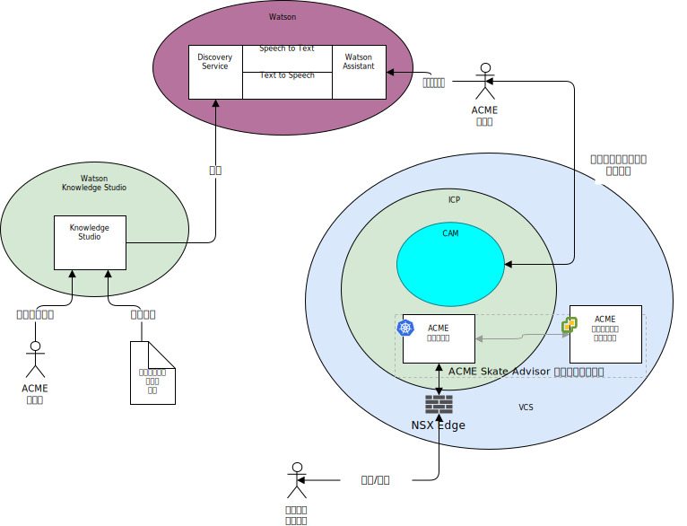

---

copyright:

  years:  2016, 2019

lastupdated: "2019-06-26"

subcollection: vmware-solutions

---

# システム・コンテキスト
{: #vcscar-syscontext}

次の図は、このリファレンス・アーキテクチャーのシステム・コンテキストを示しています。 システム・コンテキスト図は、システムの主要な要素、システムの境界、システムと対話するエンティティー、およびその相互作用を定義する図です。 この図は、システムの初期ビューを読者に提供する概要図です。

以下は、システム・コンテキストの中核となるコンポーネントです。
- vCenter Server – VMware vCenter Server on {{site.data.keyword.cloud_notm}} は、オンプレミス環境からマイグレーションされる仮想マシン (VM) のターゲットとなる {{site.data.keyword.cloud_notm}} for VMware Services インスタンスです。 これは、オンプレミス仮想化とともに、VM をある環境から別の環境に移動できるようにするハイブリッド環境です。
- {{site.data.keyword.icpfull_notm}} - {{site.data.keyword.icpfull_notm}} は、コンテナー化された
アプリケーションを開発して管理するためのアプリケーション・プラットフォームです。 {{site.data.keyword.icpfull_notm}} 環境 は、コンテナー・オーケストレーター Kubernetes、プライベート・イメージ・リポジトリー、管理コンソール、モニター・フレームワーク、グラフィカル・ユーザー・インターフェースで構成される統合環境であり、ユーザーがアプリケーションのデプロイ、管理、モニター、スケーリングを行うことができる一元的な場所を提供します。
- {{site.data.keyword.cloud_notm}} Automation Manager – CAM は、エンタープライズ対応の
Infrastructure as Code プラットフォームであり、VM ベースのワークロードと
Kubernetes ベースのワークロードをプロビジョンできる単一画面と、
ワークロード・プロビジョニング (VM、コンテナー、およびそのインフラストラクチャー前提条件) の
自動化機能を備えています。
- Watson – Watson は、IBM の人工知能およびコグニティブ・ソリューションのプラットフォームです。
- Watson Knowledge Studio - Watson Knowledge Studio には、Watson Discovery で使用するモデルが用意されています。

## アクター
{: #vcscar-syscontext-actors}

システム・コンテキスト図には、以下のアクターが表されています。
* Acme 管理者 - 管理者は、以下の進行中のタスクを含む、アプリケーションの継続的なデプロイメントと保守を担当します。
  - チャットボットのトレーニング。
  - Discovery Service のトレーニング。
* システム・ユーザー - システム・ユーザーとはシステムのユーザーのことです。 このユーザーは、ブラウザー対応デバイスのブラウザーを介してシステムと通信します。

## システム
{: #vcscar-syscontext-systems}

システム・コンテキスト図には、以下のシステムが表されています。
* Knowledge Studio - Watson Studio は、システム用のスケート言語を設計し、その言語を使用して、スケート言語を実装するドキュメントを Web サイトから認識するためのツールです。
* Speech to Text - 音声をテキストに変換します。 このコンポーネントは、チャットボットが実行されているデバイスから音声を受け入れて、Watson が処理できるようにテキストに変換します。
* Text to Speech - テキストから音声を合成します。 このコンポーネントは、Skate Advisor アプリケーションからテキストを受け入れて、チャットボットが実行されているデバイス用の音声に変換して再生します。
* Discovery Service - Watson Discovery Service は、要求されたパラメーターに一致するスケート・レコードを取得するためにシステムで使用されます。 例えば、「`キャスパー・トリックについてのすべてのレコードをリストして`」というような要求があります。
* Watson Assistant - Watson Discovery Service は、要求されたパラメーターに一致するスケート関連のコンテンツを取得するためにシステムで使用されます。 例えば、「`キャスパー・トリックについてのすべてのレコードをリストして`」というような要求があります。 Watson Discovery は、高度な機械学習手法を使用して、取り込まれたコンテンツから最も関連性の高い節を表示します。
* データベース - Acme Skate Advisor データベースは、vCenter Server によって管理される仮想マシン上にホストされます。
* アプリケーション・コンテナー - アプリケーション・モダナイゼーション・ジャーニーを経て、コンテナーとして稼働するようになったアプリケーション。 このリファレンス・アーキテクチャーの Acme Skateboards 社の事例では、コンテナー化アプリケーションの 1 つは、オンライン・プレゼンス・ワークロードの一部である Web サーバーです。 ACME コンテナーは、Acme Web アプリケーションと Acme Skate Advisor アプリケーションをホストします。
* NSX Edge - NSX Edge は、vCenter Server インスタンスとの間の North-South トラフィックを管理する仮想アプライアンスです。

## 関連リンク
{: #vcscar-syscontext-related}

* [vCenter Server on {{site.data.keyword.cloud_notm}} with Hybridity Bundle の概要](/docs/services/vmwaresolutions/archiref/vcs?topic=vmware-solutions-vcs-hybridity-intro)
