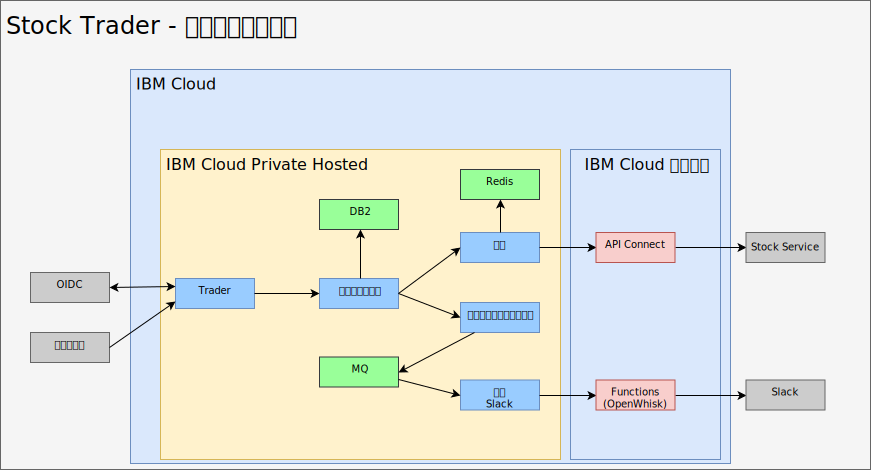
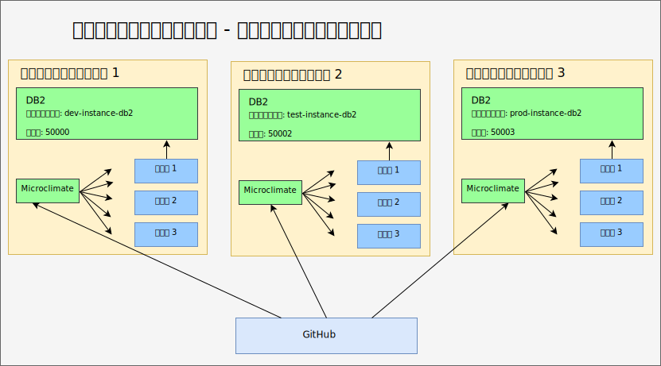
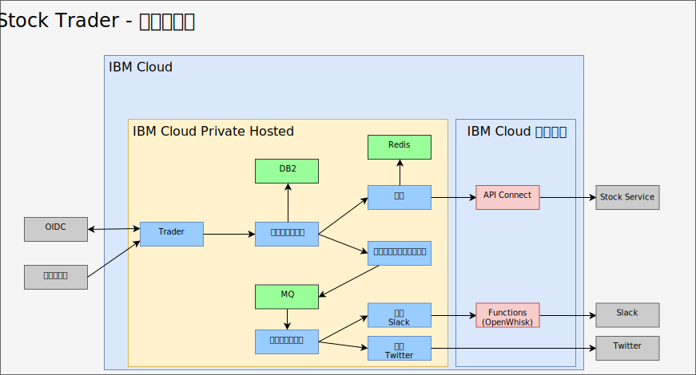

---

copyright:

  years:  2016, 2019

lastupdated: "2019-06-27"

subcollection: vmware-solutions

---

# ミドルウェアのリファクタリングおよび IBM Cloud Private への追加
{: #vcscontent-addmidware}

Stock Trader をコンテナーで実行できるようになり、Jane も現在のマイクロサービスに問題がないことを確認したので、Jane と Todd は、機能を追加してアプリケーションを拡張する作業に取り掛かります。 アクティビティーの増加とスケーラビリティーの向上を実現するために Stock Trader マイクロサービスをリファクタリングすることで、2 人は、ミドルウェアを {{site.data.keyword.cloud}} Private に追加する必要性を認識しました。 そのミドルウェアの一部は自社データ・センターに存在するので、この作業は、新たにミドルウェアを追加してプラットフォームを再構築するという作業と言えます。

このようにソリューションをリファクタリングすることで、アプリケーションと必要なサービスを 1 つの共通プラットフォームで実行できるので、管理プレーンがシンプルになります。

## コンテンツの選択
{: #vcscontent-addmidware-content-choices}

{{site.data.keyword.cloud_notm}} Private には幅広いコンテンツが用意されているので、Todd と Jane は自分たちのニーズに最適なコンテンツを決定する必要があります。 ほとんどのコンテンツは試すことができますが、一部のコンテンツはパスポート・アドバンテージから購入してダウンロードする必要があります。これについて Todd は {{site.data.keyword.cloud_notm}} Private カタログで確認しました。

* ツールチェーンおよびランタイム
  - UrbanCode Deploy
  - Microclimate
  - Jenkins (オープン・ソース)
  - IBM WebSphere Liberty (MicroProfile、Web Profile、Java Platform、Enterprise Edition Profile)
  - Open Liberty (オープン・ソース)
  - Node.js ランタイム (オープン・ソース)
  - Swift ランタイム (オープン・ソース)
  - nginx (オープン・ソース)
  - IBM WebSphere Application Server for {{site.data.keyword.cloud_notm}} Private VM Quickstarter Community Edition

* 統合
  -	IBM Integration Bus
  -	IBM Integration Bus for Developers
  -	IBM DataPower Gateway Virtual Edition
  -	IBM DataPower Gateway for Developers
  -	IBM API Connect Professional
  -	IBM API Connect Enterprise
  -	IBM App Connect Enterprise Developer Edition
  -	IBM App Connect Enterprise 11.0.0

* データ・サイエンスおよびビジネス・アナリティクス
  -	IBM Data Science Experience Local
  -	IBM Data Science Experience Developer Edition
  -	IBM Watson Explorer Deep Analytics Edition
  -	IBM PowerAI (ILAN ライセンス交付済み、サポート・オファリングを利用可能)
  - IBM PowerAI Vision

* データ・ガバナンスおよび統合
  -	IBM InfoSphere Information Server for Evaluation  Mobile
  -	IBM Mobile Foundation

* 接続性
  -	IBM Voice Gateway Developer Trial

* アプリケーション・モダナイゼーション・ツール
  -	IBM Transformation Advisor

* メッセージング
  -	IBM MQ Advanced
  -	IBM MQ Advanced for Developers
  -	Rabbit MQ (オープン・ソース)
  -	IBM Event Streams テクノロジー・プレビュー (Apache Kafka ベース)

* デジタル・ビジネス自動化
  -	IBM Operational Decision Manager
  -	IBM Operational Decision Manager for Developers
  -	IBM FileNet Content Manager 5.5
  -	IBM Content Foundation 5.5

* データ・サービス
  -	IBM DB2 Direct Advanced Edition / AESE with Data Server Manager
  -	IBM Db2 Dev-C
  -	IBM Data Server Manager (Db2 Dev-C 用)
  -	IBM Db2 Warehouse Enterprise
  - IBM Db2 Warehouse Dev-C
  -	IBM Cloudant Developer Edition
  -	MongoDB (オープン・ソース)
  -	PostgreSQL (オープン・ソース)
  -	MariaDB (オープン・ソース)
  -	Galera clustering with MariaDB (オープン・ソース)
  -	Redis (オープン・ソース)

* HPC / HPDA
  -	IBM Spectrum LSF Community Edition
  -	IBM Spectrum Symphony Community Edition
  -	IBM Spectrum Conductor テクノロジー・プレビュー

* マルチクラウド管理
  -	{{site.data.keyword.cloud_notm}} Automation Manager

* Watson
  -	IBM Watson Compare & Comply: Element Classification
  -	Compliance Assist

* 管理
  -	IBM Netcool - 統合 ({{site.data.keyword.icpfull_notm}} サービス用のプローブ – イベントのロギングおよびアラートのモニタリング)
  - {{site.data.keyword.cloud_notm}} App Management 2018.2.0
  -	IBM Netcool - 統合 ({{site.data.keyword.icpfull_notm}} イベントを管理するためのプローブ。 IBM Netcool Insights 製品とともに販売)
  - {{site.data.keyword.cloud_notm}} Event Management for IBM
Cloud Private (ディスカバリー用の ILAN ライセンス交付済み、カタログから試行)
  - IBM Operations Analytics Predictive Insights Mediation Pack ({{site.data.keyword.icpfull_notm}} モニタリング・メトリックの管理。 ディスカバリー用の ILAN ライセンス交付済み、カタログから試行)  -	IBM Operations Analytics Predictive Insights Mediation Pack (Predictive Insights 製品とともに販売)

* ネットワーキング
  -	F5 BIGIP Controller (オープン・ソース)
  -	Calico BGP-Peer (オープン・ソース)
  -	strongSwan IPSec VPN (オープン・ソース)

* ストレージ
  -	IBM PowerVC FlexVolume Driver (オープン・ソース、PowerVC 製品でサポート)
  - Heketi ライフサイクル管理を備えた GlusterFS ストレージ・クラスター (オープン・ソース)
  -	Container Storage Interface (CSI) サンプル NFS
  -	Driver (オープン・ソース)
  -	Rook Ceph Cluster (オープン・ソース)

* ツール
  -	Web Terminal (オープン・ソース)
  -	Skydive – ネットワーク・アナライザー (オープン・ソース)

Stock Trader のために、Todd は Jane のソリューション・アーキテクチャーに基づいて、[Db2](https://cloud.ibm.com/catalog/services/db2-hosted)、[MQ](https://cloud.ibm.com/catalog/services/mq)、および [Redis](https://cloud.ibm.com/catalog/services/databases-for-redis) から取り掛かることにします。

## ミドルウェアの追加
{: #vcscontent-addmidware-add-middleware}

{{site.data.keyword.cloud_notm}} Private にミドルウェアを追加するには、カタログで [helm チャート](https://github.com/IBM/charts/blob/master/stable/ibm-microclimate/README.md)を見つけ、README ファイルを読んでから、インストールに進みます。

Stock Trader のために、Todd はすべてのミドルウェアを追加することにしました。 以下の情報は、Jane に使用してもらうミドルウェアごとに Todd が実行する必要がある作業を要約したものです。

### Db2
{: #vcscontent-addmidware-db2}

既に Db2 を使用しているので、Todd は Db2 から取り掛かります。ソリューションごとにコンテナー・ベースの専用の Db2 を用意できます。

Todd が {{site.data.keyword.icpfull_notm}} を準備したので、ポッドのセキュリティー・ポリシーは既に定義済みです。 Todd は、Docker イメージのプル・シークレットの作成に集中できます。

`kubectl create secret docker-registry db2dockerregistry
--docker-username=dockeruser
--docker-password=XXXXXXXX-XXXX-XXXX-XXXX-XXXXXXXXX
--docker-email=dockeruser@email.com --namespace=default`

最後に、Todd は NFS を使用することにしたので、README ファイルの要件に基づいて NFS ボリュームを作成しました。

{{site.data.keyword.icpfull_notm}} ダッシュボードに移動し、永続ボリュームを作成します。 容量については、 README ファイルで以下の情報を探してください。

`capacity=20Gi
RWO
type=NFS
server = nfs.server.ip.address
path = /shared/db2trader1`

カタログ・ユーザー・インターフェースで、「Db2」を検索し、「ibm-db2oldp-dev」をクリックします。 README ファイルを確認し、「構成」をクリックします。

「構成」セクションには、「クイック・スタート」セクションと「すべてのパラメーター (All Parameters)」セクションがあります。 Todd は以下の追加構成を入力する必要があるので、「すべてのパラメーター (All Parameters)」を開きます。

*	リリース名 = db2trader1
*	名前空間 = default
*	ライセンスに同意する
*	データベース名 = trader
*	シークレット名 = db2dockerregistry
*	サービス名 = db2trader1-ibm-db2oltp-dev
*	サービス・タイプ = NodePort
*	ポート = 50000
*	db2 インスタンス名 = db2inst1
*	db2 インスタンス名のパスワード = xxxxxx
*	このデプロイメントのパーシスタンスを有効にする (Enable persistence for this deployment) = はい (チェック・マークを付ける)

Db2 を実行したら、Todd または Jane は、Stock Trader ソリューションで使用する表を作成する必要があります。

### MQ
{: #vcscontent-addmidware-mq}

Todd と Jane にはメッセージング・ソフトウェアが必要です。彼らは MQ を既に使用しているので、MQ を選択するのが適しています。 また、MQ はフットプリントが小さく、開発者ごとに開発用バージョンを実行できるので、実働環境用の貴重なトラフィックを節約できます。 MQ のインストールは非常に簡単です。 Todd は、Db2 の場合と同じようにストレージを作成してから、helm チャートをインストールします。

「{{site.data.keyword.icpfull_notm}} ダッシュボード」>「カタログ」で「MQ」と入力し、
「ibm-mqadvanced-server-dev」を選択します。README ファイルを確認し、「構成」をクリックします。
以下の入力値を指定するか、確認します。

`release name = mqtrader1
target namespace = stock-trader
accept license
enable persistence
data PVC size = 2Gi
Service type = NodePort
Queue manager name = stocktrader
Admin pw = mq1pw
App password = LEAVE BLANK`

最初に、Todd はユーザー・インターフェースからミドルウェアにアクセスするために NodePort を選択します。 最終的には、Todd は ClusterIP を使用して、クラスター内部のポッドだけがミドルウェアにアクセスできるようにします。

Todd は、Stock Trader を使用するように MQ を構成するために、MQ 管理ユーザー・インターフェースを開きます。これは、VM バージョンとまったく同じです。

### Redis
{: #vcscontent-addmidware-redis}

Stock Trader は {{site.data.keyword.cloud_notm}} Private Hosted で機能していますが、株価 (Stock Quote) サービスの待機時間についてまだ心配があります。ほとんどの処理に必要な前日の終値が返されるときの待機時間について本当に心配しています。 パフォーマンスを向上させるために、Redis キャッシュを追加します。

このデプロイメントでは、ibm-charts の ibm-redis-ha-dev chart を使用します。

デフォルトでは、このチャートは 6 つのポッド (マスター 1 つ、スレーブ 2 つ、センチネル 3 つ) をインストールします。 これは、ワーカー・ノードが複数のサブネットに分かれていても、多数のワーカー・ノードをまたいで複数のポッドが連携できるという Kubernetes の回復力を表す優れた例です。

構成は単純ですので、Todd はインストール先の名前空間を入力し、インストールを開始します。

## Stock Trader のリファクタリング
{: #vcscontent-addmidware-refactor-stock-trader}

Stock Trader をリファクタリングするという段階は、Jane にとって重要です。 Todd はミドルウェアを {{site.data.keyword.cloud_notm}} Private に追加する作業で忙しいので、Jane が、Kubernetes やクラウドの特性を最大限に活かせるようにソリューションをリファクタリングしました。

例えば、Jane は、Stock Trader を変換するときに、.war ファイルをそれぞれに Liberty コンテナーに追加しましたが、WebSphere Application Server Network Deployment 構成を使用してデータ・ソースを指すようにしました。 これは良いスタートになりました。Jane のアプリケーションは Kubernetes のスケジューリングおよびオーケストレーションの価値をすぐに活かせるようになりました。

Kubernetes に合うように Jane のマイクロサービスを最適化する (再コーディングして構築する) ことで、他にも多くの利点が得られます。

最適化を行うために、Jane は次の手順を実行しました。
-	コード・リポジトリーに入っているコードを更新しました (GitHub Enterprise を使用しました)
-	パイプラインを追加しました (Jenkins を使用しました)
-	Maven を使用して構築しました

次の例は、Jane の[コード・リポジトリー](https://github.com/IBMStockTrader/)、Jenkins ファイル、server.xml などを示しています。これにより、Jane は、ODM や Watson などのサービスや、GitHub の個々のリポジトリーである他のマイクロサービスにシークレットを使用してアクセスし、追加の機能を自由にコーディングできます。

### シークレットの追加
{: #vcscontent-addmidware-add-secrets}

Stock Trader マイクロ・サービスをリファクタリングしたので、次はサービスの名前、ユーザー ID、およびパスワードを抽象化する方法が必要です。抽象化により、サービスのデプロイ時に具体的な名前をハードコーディングしてアプリケーションを再構築しなくても、サービスに固有の詳細情報をアプリケーションが取得できるようになります。

Jane は、ポータブルなアプリケーションにするために、Kubernetes シークレットを使用して、明確に定義されたシークレット名とパラメーターを各シークレット内に設定し、デプロイされたマイクロサービスが固有のホスト名、ユーザー ID、パスワード、またはその他の機密の資格情報を取得できるようにします。

Stock Trader は複数のクラウドで実行する可能性がありますが、Jane はコード・ベースを統一したいと考えています。 以下の図の DB2 のシークレットは、ルーティングの詳細は異なりますが、形式は同じです。 Jane のポートフォリオのマイクロサービスは、デプロイされると、適切な Db2 インスタンスに接続するために DB2 シークレットのエンドポイント・パラメーターを探します。 Stock Trader アプリケーションは、VMware 仮想マシン、コンテナー化サービス、クラウド管理サービスのどれで実行されているのかを認識しません。

## 結果
{: #vcscontent-addmidware-result}

Jane が Stock Trader ソリューションのリファクタリングに、Todd が {{site.data.keyword.cloud_notm}} Private Hosted へのミドルウェアのインストールに献身的に取り組んだ結果、中核の Stock Trader ソリューションを構成するすべての要素がプライベート・クラウドで実行されるようになりました。 Jane はさらに Twitter 通知サービスなどのマイクロサービスを追加します。 Istio ルーティング・ルールにより、Slack の社内チャネルや Twitter の公開チャネルでロイヤルティー・レベルのメッセージングを動的に行えるようにします。

## 関連リンク
{: #vcscontent-addmidware-related}

* [vCenter Server on {{site.data.keyword.cloud_notm}} with Hybridity Bundle の概要](/docs/services/vmwaresolutions/archiref/vcs?topic=vmware-solutions-vcs-hybridity-intro)
