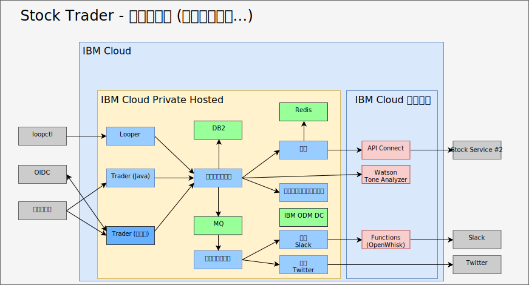

---

copyright:

  years:  2016, 2019

lastupdated: "2019-08-05"

subcollection: vmware-solutions

---

# AI、分析、およびその他のパブリック・クラウド・サービスによるエンリッチ
{: #vcscontent-aianalytics}

Stock Trader をエンリッチするという段階は、一度踏めば済むものではありません。 Todd と Jane にとっては繰り返しのプロセスです。 次の図で、Jane が ODM ディシジョン・センターを利用して Watson Tone Analyzer サービスとロイヤルティー・レベル・ルールを追加したことがわかります。 以下の項目では、Stock Trader をどのようにエンリッチしたかに焦点を当てています。

## AI Watson Tone Analyzer
{: #vcscontent-aianalytics-ai-watson}

以下の例は、アプリケーションをエンリッチする簡単な方法ですが、これは見かけによらず強力です。 Jane は [AI](https://cloud.ibm.com/catalog?category=ai) サービスや [分析](https://cloud.ibm.com/catalog?category=analytics)サービスを求めて [{{site.data.keyword.cloud}} カタログ](https://cloud.ibm.com/catalog)を閲覧し、カタログに豊富なコンテンツがあることを知りました。

Jane が [Tone Analyzer](https://cloud.ibm.com/catalog/services/tone-analyzer) を選んで標準プランを選択すると、呼び出すための資格情報が提供されました。

Jane は Stock Trader をリファクタリングし、Tone Analyzer 用の Kubernetes シークレットを作成するだけです。 このように、プランや地域を変更してもコードを再作成する必要はありません。

リファクタリングのおかげで、Jane はユーザー・エクスペリエンスを中断することなく、さまざまなユーザー・インターフェース・フレームワークを試せました。 その結果、ユーザー・フィードバックのトーンを理解するために使用できる新しいユーザー・インターフェースを用意できました。

将来的には、Jane はプライベート・クラウド・インスタンス、 {{site.data.keyword.cloud_notm}} Private で実行可能なさまざまな分析サービスに基づいて、予測による推奨株の情報を提供できるようになります。

## ロイヤルティー・レベルのビジネス・ルール
{: #vcscontent-aianalytics-loyalty-rule}

元々は、ロイヤルティーを高める可能性の高い金額を決定するロジックが Jane のコード中に存在していました。 しかし、Stock Trader のマーケティング・ディレクターから範囲の変更を求める要求が何度もあったので、Jane は、自分が関与しなくてもマーケティング・ディレクターが変更できるビジネス・ルールにするために、この決定機能をオフロードすることにしました。

Jane が Todd に相談すると、Todd は
[サービス](https://cloud.ibm.com/catalog/services/decision-optimization)を追加して決定機能を作成しました。

これで、マーケティング・ディレクターの Margaret は、コードを変更することなく、キャンペーン中にいつでもログインしてロイヤルティー・レベルの範囲を変更できるようになりました。

## 新しい Stock Service
{: #vcscontent-aianalytics-new-stock-service}

Stock Service が変わったことに気が付いたでしょうか。
パブリック・サービスの所有者や API 構造が変わると、このようなことが起こる場合があります。 幸いなことに、Jane は [API Connect](https://cloud.ibm.com/catalog/services/api-connect) を使用しました。
元々は、提供された生の API から必要なデータを受信してフォーマットを設定するのが面倒だったので、オリジナルの株式サービスからの応答をシンプルにするために API Connect を使用していました。

今では、株式サービスを変更しても、自分で作成した簡単な API へのマップ方法を変えるだけでよく、コードの再起動さえ不要になったので、Jane はたいへん喜んでいます。 Stock Trader ソリューションは、変更など何もなかったかのように、同じ API にデータを要求し続けていました。 すべての API 変更は水面下で行われます。

さらに、API Connect でのモニターと計測により、Jane は自分の簡易 API をだれが使用しているかを追跡できます。
