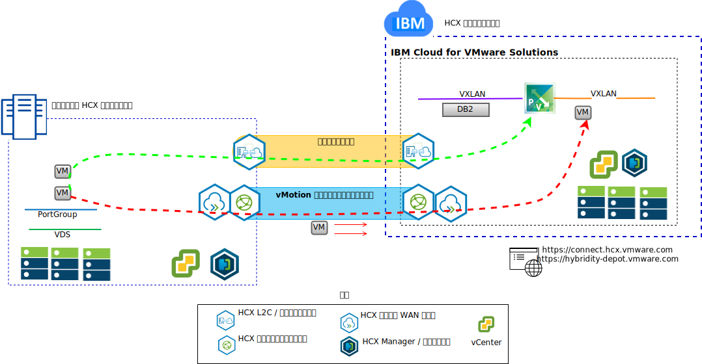

---

copyright:

  years:  2016, 2019

lastupdated: "2019-08-05"

subcollection: vmware-solutions

---

# IBM Cloud への Stock Trader VM のリフトおよびシフト
{: #vcscontent-hcx}

Todd は、モダナイゼーション・ジャーニーの第 1 段階として、オンプレミスの VMware SDDC インスタンスを VMware vCenter Server on {{site.data.keyword.cloud}} にシームレスに拡張したいと考えています。 ビジネスを継続させ、ダウン時間を最小限に抑える必要があります。

VMware vCenter Server on {{site.data.keyword.cloud_notm}} with Hybridity Bundle は、vCenter Server インスタンスとオンプレミスの VMware 仮想化データ・センターのシームレスな接続を可能にします。

{{site.data.keyword.cloud_notm}} VMware ターゲット・サイトに仮想マシンとしてデプロイされた vCenter Server with Hybridity Bundle コンポーネントにより、ピアのオンプレミスのソース・サイトにインストールされた HCX コンポーネントと接続を確立できます。

Hybridity によって、オンプレミスと {{site.data.keyword.cloud_notm}} の間に粗結合された相互接続が作成され、以下のような機能を使用できるようになります。

* 単純な相互接続 – 論理ネットワーク接続が、公衆インターネット、プライベート VPN、Direct Link などの物理接続を介して簡単に確立されます。
* レイヤー 2 拡張 – オンプレミス・ネットワーク (オンプレミスのサブネットや IP アドレッシングを含む) がクラウドに拡張されます。
* 暗号化 – 2 者間のネットワーク・トラフィックが安全に暗号化されます。
* 最適化されたネットワーク – ネットワーク・トラフィックをできる限り速く転送するために、最適な接続を選択し、接続上に大量の情報を効率的に流します。
* データ重複排除 – 50% ものネットワーク・トラフィックの削減を達成できます。
* インテリジェント・ルーティング – ワークロードが移動されるときに、ネットワーク・トラフィックが発信元のサイトにヘアピン通信で戻ることがないようにターゲット・サイトのゲートウェイを使用するようにするため、隣接性ルーティングによってネットワーク・ゲートウェイを変更できます。
* ゼロ・ダウン時間マイグレーション - vMotion を使用して、実行中のシステムをクラウドとの間で双方向に移動できます。
* スケジュールされたマイグレーション – 任意の数の仮想マシンを宛先サイトに複製してから、指定した時刻にそのサイトでアクティブ化して、元のサイトで実行されているシステムを置き換えることができます。
* セキュリティー・ポリシーのマイグレーション – NSX をオンプレミスで使用している場合は、セキュリティー・ポリシーやファイアウォール、その他のセキュリティー・アイテムがすべてワークロードと一緒に移動されます。

Todd は Stock Trader をオンプレミスの VMware 環境から VMware on {{site.data.keyword.cloud_notm}} 環境にマイグレーションし、ダウン時間をゼロまたはほぼゼロにしてアプリケーションは再構成しないという要件に応えることができました。
