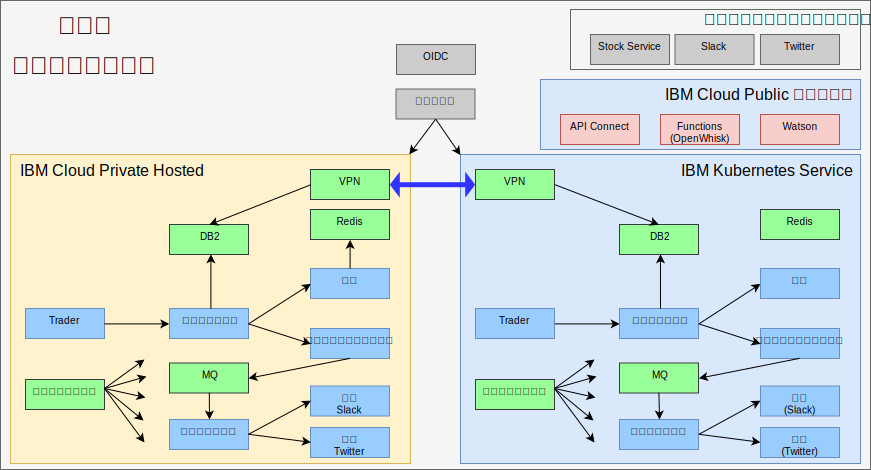

---

copyright:

  years:  2016, 2018

lastupdated: "2018-11-14"

---

# IBM Cloud Kubernetes Service による真のハイブリッド

Jane のテスト・チームが拡大するにつれて、アプリケーションの主要な部分を実行しつつも Jane の環境内のデータを使用するテスト環境を提供したいと考えています。
Jane は、自分のテスト・チームが Kubernetes クラスターの管理ではなくアプリケーションのテストに集中できるようにしたいと考えます。Jane と Todd は [{{site.data.keyword.cloud}} Kubernetes
Service](https://www.ibm.com/cloud/container-service) インスタンスを立ち上げることを決定し、Jane はコードを変更することなく、そこに Stock Trader をデプロイすることにします。

その後、Todd が strongSwan VPN を追加して各クラスターのプライベート・ネットワークを接続します。

図 1. 真のハイブリッド・アプリケーションとしての Stock Trader

## 関連リンク

* [vCenter Server on {{site.data.keyword.cloud_notm}} with Hybridity Bundle の概要](../vcs/vcs-hybridity-intro.html)
