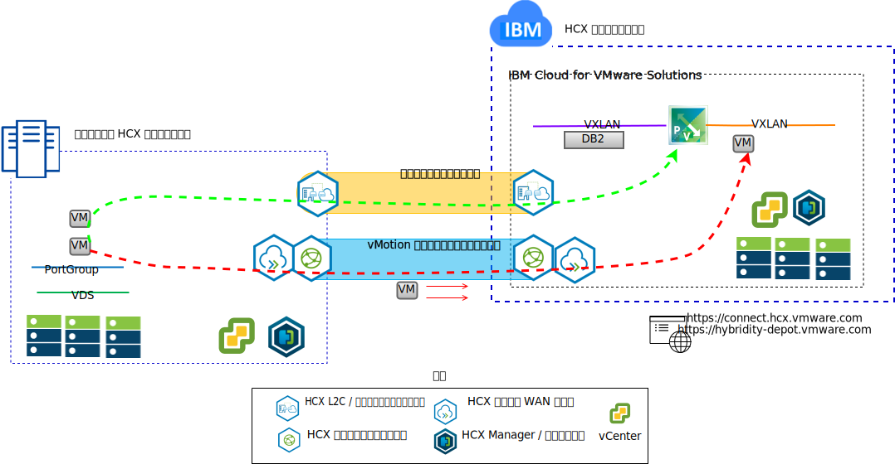

---

copyright:

  years:  2016, 2019

lastupdated: "2019-02-16"

---

# VMware Hybrid Cloud Services の概要
{: #vcshcx-intro}

VMware Hybrid Cloud Services (HCX) は、各種ネットワーク・タイプで vSphere のソフトウェア定義データ・センター (SDDC) の別々のインスタンスを相互運用するためのサービスです。 対象のネットワークには、LAN や WAN が含まれます。公共のインターネットでセキュアになっている場合も、なっていない場合も対象になります。 オンプレミスとクラウド・プロバイダーの境界をまたぐマルチインスタンス/マルチサイトの vSphere をデプロイするときに、セキュリティー、互換性、パフォーマンスの問題にぶつかったり、構成が複雑になったりすることがよくあります。HCX は、そうした問題に対応できる設計になっています。

図 1. VMware Hybrid Cloud Services

HCX はそのようなサービスなので、{{site.data.keyword.cloud}} 内に存在する完全自動の vSphere オファリングとその他のデプロイ済みの vSphere インスタンスとの間の相互協調処理に適しています。 HCX オファリングは、{{site.data.keyword.vmwaresolutions_short}} に完全に統合されています。

この資料は、HCX のデプロイメントや運用に関するガイドです。現時点で受け入れられているベスト・プラクティスやトラブルシューティングの手順も含まれています。 HCX の開発はアジャイル開発の方法で行われているので、このガイドをサポート対象バージョンやサポート対象プラットフォームに関する標準の情報ソースのようには見なさないでください。

## 関連リンク
{: #vcshcx-intro-related}

* [vCenter Server on {{site.data.keyword.cloud_notm}} with Hybridity Bundle の概要](/docs/services/vmwaresolutions/archiref/vcs?topic=vmware-solutions-vcs-hybridity-intro)   
