---

copyright:

  years:  2016, 2018

lastupdated: "2018-11-15"

---

# アプリケーション・モダナイゼーションの概要

以下の図は、Acme Skateboards 社がデプロイするアプリケーション・モダナイゼーションのリファレンス・アーキテクチャーを示しています。 この一連のドキュメントでは、このアーキテクチャーについて詳しく説明します。

図 1. アーキテクチャー概要図

このハイブリッド・アーキテクチャーにより、Acme Skateboards 社は以下の目標を実現できます。
- ダウン時間がほとんど、あるいはまったくなく、アプリケーションの再構成も必要とすることなく、VMware VM をオンプレミスから {{site.data.keyword.cloud}} にマイグレーションする。
- 比較的単純な Web インターフェースとミドルウェアをコンテナー化することに集中し、比較的複雑なデータベースは VM として残して、アプリケーションのモダナイゼーション・ジャーニーを始められるようにします。
- {{site.data.keyword.cloud_notm}} Automation Manager (CAM) を使用して Infrastructure as Code (IaC) をスクリプト化し、VM とコンテナーの両方から作成された各種サービスを構成および調整して、DevOps ツールチェーンおよび ITSM ソリューションと統合する。

このリファレンス・アーキテクチャーには以下のキー・コンポーネントがあります。
- **オンプレミス仮想化** – Acme Skateboards 社の VM を現在ホストしている VMware クラスター。 これらの VM は現在、モダナイズするアプリケーションをホストしています。このクラスターは、HCX を実行できるように [VMware HCX on {{site.data.keyword.cloud_notm}} Solution Architecture](https://www.ibm.com/cloud/garage/files/HCX_Architecture_Design.pdf) アーキテクチャーの前提条件を満たすために必要です。 HCX はオンプレミス・ネットワークを {{site.data.keyword.cloud_notm}} に拡張します。これにより、お客様は VM を、{{site.data.keyword.cloud_notm}} 上で稼働する VMware vCenter Server on {{site.data.keyword.cloud_notm}} インスタンスにマイグレーションしたり、必要に応じて元に戻したりすることができます。

- **{{site.data.keyword.vmwaresolutions_short}}** – vCenter Server インスタンスは、VMware Software Defined Data Center (SDDC) ソリューションを自動的にデプロイするために必要な、vSphere、vCenter Server、NSX-V、および vSAN や {{site.data.keyword.cloud_notm}} Endurance ストレージを始めとするストレージ・オプションなどの基本的な VMware ビルディング・ブロックを提供します。 VMware クラスターは、マイグレーションされる VM のターゲットです。さらに、ICP がホストするコンテナーの中で実行されるモダナイズ後の一部のアプリケーションのターゲットでもあります。vCenter Server の主要コンポーネントは以下のとおりです。
    - **NSX-V** - NSX-V は、Acme Skateboards 社の VM 用にネットワーク・オーバーレイを提供するネットワーク仮想化層を VCS に実装します。NSX-V は BYOIP を使用可能にして、ワークロード・ネットワークを IBM Cloud ネットワークから分離します。 NSX-V は、Acme Skateboards 社がオンプレミスから拡張するネットワークを作成するために HCX によってプログラミングされます。

    - **NSX-T** - NSX-T は、コンテナーと VM の両方にわたるネットワーク管理とセキュリティー管理用の共通のツール・セットを提供します。 NSX-T は Kubernetes Container Networking Interface (CNI) と完全に互換性があり、CNI と統合してコンテナー・ネットワーキングを提供します。 NSX-T は、モダナイズされるアプリケーションが使用するオーバーレイ・ネットワークを提供し、ICP および IKS によってネイティブで使用される Calico を置き換えます。

- **IBM Cloud Private** - ICP は、コンテナー化されたアプリケーションを開発して管理するためのアプリケーション・プラットフォームです。 ICP は、コンテナー・オーケストレーター Kubernetes、プライベート・イメージ・リポジトリー、管理コンソール、モニター・フレームワーク、グラフィカル・ユーザー・インターフェースで構成される統合環境であり、Acme Skateboards 社がアプリケーションのデプロイ、管理、モニター、スケーリングを行うことができる一元的な場所を提供します。 vCenter Server インスタンスは ICP コンポーネント、マスター・ノード、ワーカー・ノードをホストし、それらを VM として実行します。 ICP は以下のものをホストします。
    - **{{site.data.keyword.cloud_notm}} Automation Manager** – CAM は、エンタープライズ対応の Infrastructure as Code (IaC) プラットフォームであり、オンプレミスにも VCS にも、テンプレートを使用して単一画面で VM ワークロードをプロビジョンできます。また、ICP または IKS に Kubernetes ワークロードをプロビジョンすることもできます。CAM は、ICP で実行される Docker 対応アプリケーションで、役割ベースのアクセス制御 (RBAC) や許可などの機能を実行するために緊密に統合されています。
    - この環境にデプロイする Acme Skateboards 社のコンテナー化アプリケーション。

- **IBM Kubernetes Service** – IKS では、Acme Skateboards 社がモダナイズ対象アプリケーションを Docker コンテナー (Kubernetes クラスターで稼働) にデプロイできます。 マスター・モードは IBM が完全に管理しますが、ワーカー・プール内のワーカー・ノードは vCenter Server インスタンスと同じ {{site.data.keyword.cloud_notm}} アカウントにデプロイされます。 ワーカー・ノードは、ベアメタル・サーバー、パブリック・サーバー専用仮想サーバーのいずれかのインスタンスになります。 Calico は IKS に自動的にインストールされて構成されます。 Calico は、コンテナーにセキュアなネットワーク接続を提供します。また Calico は、サブネット間を流れるパケットには IP-in-IP カプセル化を使用し、コンテナーからの発信接続には NAT を使用するように IKS で構成されます。

- **Direct Link** – {{site.data.keyword.cloud_notm}} Direct Link は、Acme Skateboard 社の WAN プロバイダーを使用してデータ・センターを {{site.data.keyword.cloud_notm}} に接続し、信頼性が高く遅延時間の少ないセキュアなネットワーク接続を提供します。 この接続は以下のものを提供します。
    - エンタープライズ・ユーザーからクラウド・ホスト・アプリケーションへのアクセス。
    - オンプレミス VM とクラウド VM 間の VM 間トラフィック。
    - オンプレミス・データセンター内の従来型のシステムとクラウド VM の間のトラフィック。

## Acme Skateboards 社にとっての主な利点

 vCenter Server には、クライアントのワークロードに最適な VMware Software Defined Data Center (SDDC) ソリューションを柔軟に設計するために必要な基本的なビルディング・ブロック (VMware vSphere、vCenter Server、NSX、および vSAN などの共有ストレージ・オプション) が用意されています。

{{site.data.keyword.vmwaresolutions_short}} オファリングの利点を要約すると、次のようになります。

* リソースの調達、設計、実装、デプロイメントに数週間から数カ月かかっていた時間を数時間に短縮し、IT プロジェクトを開発者および基幹業務に迅速に配信します。
* ホステッド・プライベート・クラウドの専用ベアメタル・サーバーでセキュリティーが強化されます。IKS や KMIP を含む {{site.data.keyword.cloud_notm}} サービスへのプライベート・エンドポイントのデプロイメントを含みます。
* 仮想化管理への完全な管理アクセスを可能にして、デプロイされたハイブリッド・クラウドを一貫して管理およびガバナンスできるようにします。そのため、既存の VMware ツール、スクリプト、研修への投資を活用できます。
* 世界規模での VMware 専門知識の使用。世界 30 以上の {{site.data.keyword.CloudDataCents_notm}} にわたる IBM プロフェッショナル・サービスおよびマネージド・サービスで、世界規模の VMware 専門知識を利用できます。

ICP や IKS などのクラウド・ネイティブ・アプリケーション・プラットフォームに移行するお客様は、速度とイノベーションに注意を向けているので、セキュリティーやネットワーキングがおろそかになる傾向があります。 ネットワーキング・チームやセキュリティー・チームがロード・バランサー、ファイアウォール、スイッチ、ルーターなどのサービスを注文するのを待っていると、アプリケーションが価値を生み出すまでに時間がかかってしまいます。このリファレンス・アーキテクチャーでは、VCS、ICP、IKS を利用して Acme Skateboards 社のアプリケーション・モダナイゼーションの手順を安全に進めていく方法を示します。

## 関連リンク

* [vCenter Server on {{site.data.keyword.cloud_notm}} with Hybridity Bundle の概要](../vcs/vcs-hybridity-intro.html)
