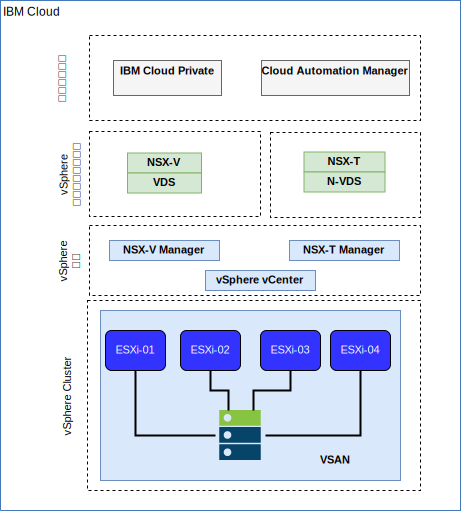

---

copyright:

  years:  2016, 2018

lastupdated: "2018-10-23"

---

# IBM Cloud のネットワーキングとインフラストラクチャー

## Virtual Routing and Forwarding (VRF)
IBM Cloud アカウントは、VRF アカウントとして構成することもできます。これにより、VLAN スパンニングと同様の機能を使用できるようになり、サブネット IP ブロック間の自動ルーティングが可能になります。Direct Link 接続を使用するアカウントはすべて、VRF アカウントに変換するか、VRF アカウントとして作成する必要があります。

## Direct Link
IBM Cloud Direct Link Connect を利用することで、ローカルの IBM Cloud データ・センターを経由した IBM Cloud インフラストラクチャーへのプライベート・アクセスと、ネットワーク・サービス・プロバイダーにリンクされた他のクラウドへのプライベート・アクセスが実現します。このオプションは、単一環境にマルチクラウド接続を作成する場合に最適です。共有帯域幅トポロジーを使用して、お客様を IBM Cloud プライベート・ネットワークに接続します。すべての Direct Link 製品と同様に、すべての IBM Cloud ロケーションへのプライベート・ネットワーク・トラフィックを使用できるようにする、グローバル・ルーティングを追加できます。

## 仮想プライベート・ネットワーク

### strongSwan VPN
strongSwan IPSec VPN サービスは、業界標準の Internet Protocol Security (IPSec) プロトコル・スイートに基づき、インターネット上にセキュアなエンドツーエンドの通信チャネルを確立します。

### Hybridity (HCX)
VCS Hybridity Bundle on IBM Cloud サービスでは、オンプレミス・データ・センターのネットワークを IBM Cloud にシームレスに拡張できるので、変換も変更も行わずに IBM Cloud との間で仮想マシン (VM) をマイグレーションできます。

## 物理構造
IBM Cloud Private (ICP) 実動インスタンスを VMware vCenter Server on IBM Cloud (VCS) クラスターにデプロイするために必要な物理インフラストラクチャーは、以下の最小仕様を必要とします。

表 1. ICP のための VCS 仕様

| NFS デプロイメント  |  vSAN デプロイメント |
:--|:----:|:----:
サーバー数  |  3 |  4
CPU | 28 コア 2.2 GHz | 28 コア 2.2 GHz
メモリー | 384 GB | 384 GB
ストレージ | 2000 GB 2IOPS/GB 管理、2000-GB 4IOPS/GB ワークロード、4000 GB 4IOPS/GB ICP | 最小 960-GB SSD x 2

IBM Cloud Private のハードウェア要件に加え、Cloud Automation Manager (CAM) のデータベースとログ・データを格納するために、ICP 環境に永続ボリュームを作成する必要があります。CAM は ICP がサポートするすべての永続ボリューム・タイプをサポートしますが、CAM で推奨される 2 つのストレージ構成は NFS および GlusterFS です。

## 仮想構造

図 1. VCS と ICP デプロイメントの物理構造

VCS インスタンス内で、ICP インスタンスは専用の NSX Edge Services Gateway (ESG) と Distributed Logical Router (DLR) とともにデプロイされます。ICP インストールは、上記のコンポーネントで定義された VXLAN サブネットにロードされます。

アウトバウンド・トラフィックを許可するためのソース NAT ルール (SNAT) が ESG に構成されて、インターネット接続で ICP 前提条件をダウンロードできるようになり、GitHub および Docker または Web プロキシーへの接続を使用してインターネット接続を行えます。DNS および NTP サービスにもアクセスできるように ESG が構成されます。

IBM Cloud 10.x ネットワークから VXLAN 環境までの ICP マスター/プロキシー仮想 IP アドレスに対する宛先 NAT ルール (DNAT) も ESG に構成されます。

### 関連リンク

* [VMware vCenter Server on IBM Cloud with Hybridity Bundle](../vcs/vcs-hybridity-intro.html)
